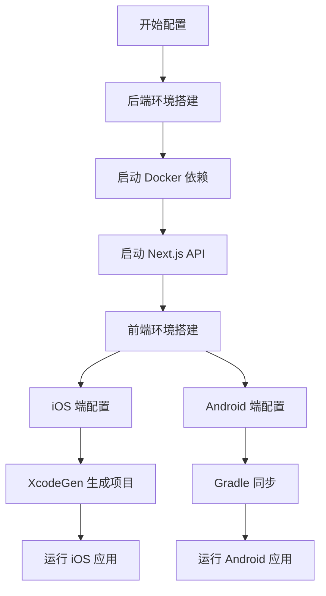
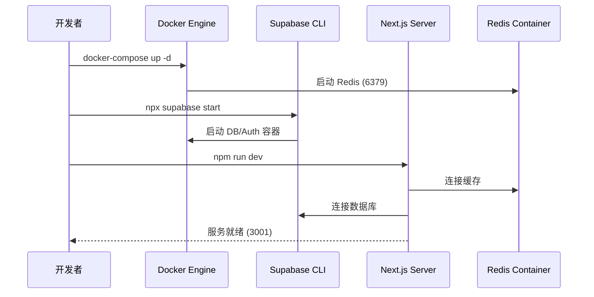
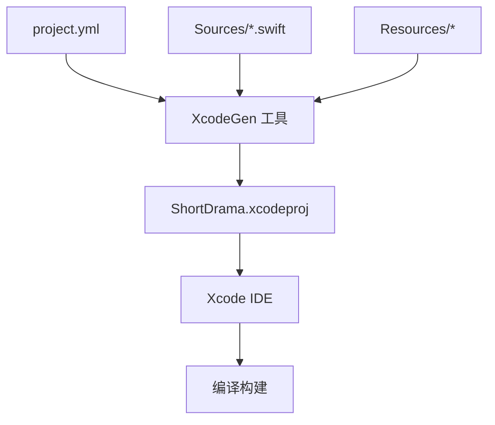
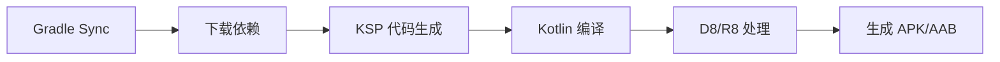
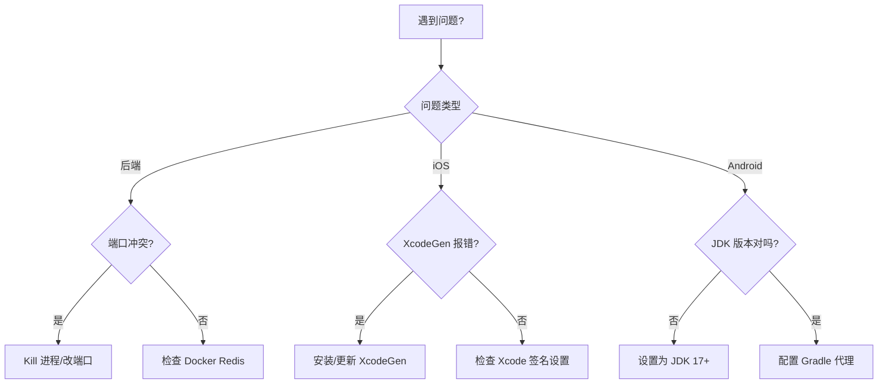

# 快速开始指南

## 目录
1. [模块概览](#模块概览)
2. [后端环境配置](#后端环境配置)
   - [运行环境要求](#运行环境要求)
   - [步骤清单](#步骤清单)
   - [数据库与中间件](#数据库与中间件)
3. [iOS 开发环境配置](#ios-开发环境配置)
   - [工具链安装](#工具链安装)
   - [项目生成与配置](#项目生成与配置)
   - [证书与签名](#证书与签名)
4. [Android 开发环境配置](#android-开发环境配置)
   - [JDK 与 Gradle 要求](#jdk-与-gradle-要求)
   - [项目同步与运行](#项目同步与运行)
5. [常见问题排查](#常见问题排查)
   - [后端启动异常](#后端启动异常)
   - [iOS 编译与签名错误](#ios-编译与签名错误)
   - [Android Gradle 同步问题](#android-gradle-同步问题)
6. [核心组件](#核心组件)
7. [文件参考](#文件参考)

## 模块概览

本章节旨在为开发者提供一套标准化的快速开始指南，确保在 30 分钟内完成全栈环境的搭建与启动。本项目是一个典型的多端协同应用，包含基于 Next.js 的后端服务、基于 SwiftUI 的 iOS 客户端以及基于 Jetpack Compose 的 Android 客户端。

### 统计数据与覆盖范围

经过对工作区的扫描，本项目涉及的核心模块及其规模如下：

| 模块 | 文件总数 | 核心子目录 | 覆盖深度 |
| :--- | :--- | :--- | :--- |
| **Backend** | 100+ | `src/app/api`, `src/services`, `supabase/` | 深入 (包含 Docker 与 Supabase 配置) |
| **iOS** | 100+ | `Sources/`, `Configs/`, `Tests/` | 深入 (包含 XcodeGen 与签名配置) |
| **Android** | 100+ | `app/src/main`, `gradle/` | 深入 (包含 Gradle 8.9 与 Hilt 配置) |

### 各端职责说明

- **后端 (Backend)**：提供 RESTful API 接口，管理 Supabase 数据库连接、Redis 缓存以及身份验证逻辑。它是所有客户端的数据源头。
- **iOS 客户端**：采用现代化的 Swift 6 和 SwiftUI 构建，通过 XcodeGen 实现项目工程的声明式管理，确保团队协作中不会出现 `.pbxproj` 冲突。
- **Android 客户端**：基于 Kotlin 2.0.21 和 Jetpack Compose，使用 Hilt 进行依赖注入，严格遵循 Clean Architecture 架构模式。

为了确保开发效率，建议按照 **后端 -> iOS/Android** 的顺序进行环境配置。

以下是整体开发流程的示意图：



该流程图展示了开发者从零开始的配置路径。首先必须确保后端服务可用，因为客户端在启动时会尝试连接 API 地址。如果后端未就绪，客户端可能会因网络异常或鉴权失败而无法正常进入主界面。

## 后端环境配置

后端服务是整个系统的核心，负责处理业务逻辑、数据持久化和缓存。本项目后端基于 Next.js 构建，运行在 Node.js 环境中。

### 运行环境要求

在开始之前，请确保您的开发机已安装以下软件：
- **Node.js**: 建议版本 v20.x 或更高 (LTS)。
- **Docker & Docker Compose**: 用于运行 Redis 和本地 Supabase 环境。
- **Git**: 用于版本管理。

### 步骤清单

1.  **安装依赖**
    进入后端目录并安装必要的 npm 包。本项目使用 `package-lock.json` 锁定版本，建议使用 `npm install` 以保证环境一致性。
    ```bash
    cd backend
    npm install
    ```

2.  **配置环境变量**
    将 `.env.example` 复制为 `.env`，并根据需要修改配置。
    ```bash
    cp .env.example .env
    ```
    > 💡 **提示**：默认情况下，`PORT` 设置为 `3001`，以避免与常见的 `3000` 端口冲突。

3.  **启动中间件**
    使用 Docker Compose 启动 Redis 服务。Redis 用于处理身份验证会话和限流逻辑。
    ```bash
    docker-compose up -d redis
    ```

4.  **启动 Supabase 本地开发环境**
    本项目使用 Supabase CLI 管理数据库。如果您是第一次运行，需要启动本地 Supabase 容器。
    ```bash
    npx supabase start
    ```
    该命令会启动 PostgreSQL、Kong、GoTrue 等服务。启动完成后，控制台会输出 `API URL` 和 `anon key`，请将其更新到 `.env` 文件中。

5.  **运行开发服务器**
    ```bash
    npm run dev
    ```
    访问 [http://localhost:3001/api/health](http://localhost:3001/api/health) 验证后端是否正常运行。

### 数据库与中间件

后端的启动过程涉及多个组件的协同工作。以下是后端启动的时序图：



开发者首先通过 Docker 启动 Redis 基础服务，随后使用 Supabase CLI 初始化本地数据库环境。最后，Next.js 服务器启动并建立与 Redis 和 Supabase 的连接。如果其中任何一个环节失败，Next.js 可能会在启动时抛出连接异常。

**后端核心配置参考**:
- [docker-compose.yml](backend/docker-compose.yml)
- [.env.example](backend/.env.example)
- [README.md](backend/README.md)

## iOS 开发环境配置

iOS 端采用了高度自动化的项目管理方式，通过 XcodeGen 避免了繁琐的工程文件手动维护。

### 工具链安装

在配置 iOS 端之前，请确保已安装以下工具：
- **Xcode**: 16.0+ (支持 Swift 6)。
- **XcodeGen**: 用于从 `project.yml` 生成 `.xcodeproj`。
  ```bash
  brew install xcodegen
  ```
- **SwiftLint**: 用于代码风格检查。
  ```bash
  brew install swiftlint
  ```

### 项目生成与配置

iOS 项目不直接提交 `.xcodeproj` 文件到仓库（虽然本项目为了方便包含了它，但建议开发者自行生成以确保配置同步）。

1.  **生成项目工程**
    ```bash
    cd ios
    xcodegen generate
    ```
    该命令会读取 `project.yml` 并根据 `Sources/` 目录下的文件结构自动生成 `ShortDrama.xcodeproj`。

2.  **配置环境地址**
    iOS 端通过 `.xcconfig` 文件管理不同环境的配置。请检查 `ios/Configs/Debug.xcconfig` 中的 `API_BASE_URL` 是否指向您的本地后端地址（例如 `http://localhost:3001`）。

### 证书与签名

由于 iOS 的安全机制，在真机运行或使用某些系统功能时需要配置签名。

1.  打开生成的 `ShortDrama.xcodeproj`。
2.  在 **Project Settings** -> **Signing & Capabilities** 中，选择您的 **Development Team**。
3.  确保 **Bundle Identifier** 与您的开发者账号匹配。

> ⚠️ **警告**：如果遇到 "Signing for 'ShortDrama' requires a development team" 错误，请务必在 Xcode 中手动选择 Team。XcodeGen 生成的工程默认可能不包含您的私有 Team ID。

以下是 iOS 项目生成的逻辑流程：



XcodeGen 作为核心工具，将声明式的配置文件 `project.yml` 与物理文件系统中的源码和资源进行整合，最终产出 Xcode 能够识别的工程文件。这种方式极大地降低了多人协作时合并冲突的概率。

**iOS 核心配置参考**:
- [project.yml](ios/project.yml)
- [CLAUDE.md](ios/CLAUDE.md)
- [Configs/Debug.xcconfig](ios/Configs/Debug.xcconfig)

## Android 开发环境配置

Android 端基于现代化的 Gradle 构建系统，采用了 Kotlin DSL 编写构建脚本。

### JDK 与 Gradle 要求

- **JDK**: 必须安装 **JDK 17** 或更高版本。这是 Android Gradle Plugin 8.7.0 的强制要求。
- **Android Studio**: 建议使用最新稳定版 (Ladybug 或更高)。
- **Gradle**: 项目内置了 Gradle Wrapper，版本为 8.9。

### 项目同步与运行

1.  **导入项目**
    打开 Android Studio，选择 **Open** 并指向 `android/` 目录。

2.  **Gradle 同步**
    Android Studio 会自动触发 Gradle Sync。它会根据 `gradle/libs.versions.toml` 下载所有依赖项。
    > 💡 **提示**：如果在国内环境下载依赖慢，建议在 `settings.gradle.kts` 中配置阿里云镜像。

3.  **环境配置**
    Android 端同样通过 `AppConfig` 接口管理环境地址。请确保 `app/src/main/java/com/djs66256/short_drama/core/config/AppConfig.kt` 中的实现指向正确的后端地址。

4.  **运行应用**
    选择一个模拟器或真机，点击 **Run** 按钮，或者在命令行执行：
    ```bash
    ./gradlew assembleDebug
    ```

Android 的构建流程如下：



Android 的构建过程从 Gradle 同步开始，随后通过 KSP (Kotlin Symbol Processing) 处理 Hilt 等框架的注解生成。最终通过 Kotlin 编译器和 Dex 工具生成可以在 Android 系统上运行的二进制文件。

**Android 核心配置参考**:
- [build.gradle.kts](android/build.gradle.kts)
- [gradle/libs.versions.toml](android/gradle/libs.versions.toml)
- [CLAUDE.md](android/CLAUDE.md)

## 常见问题排查

在环境搭建过程中，您可能会遇到以下常见问题。

### 后端启动异常

- **端口冲突 (EADDRINUSE: 3001)**
  - **原因**：另一个进程占用了 3001 端口。
  - **解决**：使用 `lsof -i :3001` 查找进程并 kill，或者在 `.env` 中修改 `PORT`。
- **Redis 连接失败**
  - **原因**：Docker 容器未启动或端口映射错误。
  - **解决**：检查 `docker ps` 确保 `app-redis` 正在运行。

### iOS 编译与签名错误

- **XcodeGen 未找到**
  - **解决**：确保已执行 `brew install xcodegen`。
- **Missing Architecture (arm64)**
  - **原因**：通常发生在 M 系列芯片的 Mac 上运行 Intel 模拟器时。
  - **解决**：在 Xcode 中设置 "Build Active Architecture Only" 为 Yes。

### Android Gradle 同步问题

- **JDK 版本不匹配**
  - **错误提示**：`Unsupported class file major version 65`。
  - **解决**：在 Android Studio 设置中将 **Gradle JDK** 修改为 Java 17 或 21。
- **依赖下载超时**
  - **解决**：检查网络连接，或在 `gradle.properties` 中增加 `org.gradle.jvmargs=-Dhttp.proxyHost=...` 等代理配置。

以下是排查逻辑的决策树：



该决策树帮助开发者快速定位问题所属的范畴，并给出了最常见的解决路径。对于大多数初次搭建环境的开发者来说，JDK 版本和端口占用是最常见的“拦路虎”。

## 核心组件

在环境配置过程中，以下文件起到了至关重要的作用，建议开发者详细阅读：

| 文件路径 | 作用说明 | 关键内容 |
| :--- | :--- | :--- |
| `backend/.env.example` | 后端环境变量模板 | 包含数据库、Redis 和鉴权配置项 |
| `backend/docker-compose.yml` | 基础设施定义 | 定义了 Redis 服务的容器化配置 |
| `ios/project.yml` | iOS 工程定义文件 | 声明了项目结构、依赖、构建设置和脚本 |
| `android/gradle/libs.versions.toml` | Android 依赖版本管理 | 统一管理所有三方库和插件的版本 |
| `ios/Configs/Debug.xcconfig` | iOS 调试环境配置 | 注入 API 地址等环境敏感信息 |

## 文件参考

本章节内容基于对以下关键文件的分析总结：

**后端配置相关**:
- [backend/README.md](backend/README.md)
- [backend/docker-compose.yml](backend/docker-compose.yml)
- [backend/.env.example](backend/.env.example)
- [backend/package.json](backend/package.json)

**iOS 配置相关**:
- [ios/CLAUDE.md](ios/CLAUDE.md)
- [ios/project.yml](ios/project.yml)
- [ios/Configs/Debug.xcconfig](ios/Configs/Debug.xcconfig)
- [ios/ShortDrama/Resources/Info.plist](ios/ShortDrama/Resources/Info.plist)

**Android 配置相关**:
- [android/CLAUDE.md](android/CLAUDE.md)
- [android/build.gradle.kts](android/build.gradle.kts)
- [android/gradle/wrapper/gradle-wrapper.properties](android/gradle/wrapper/gradle-wrapper.properties)
- [android/gradle/libs.versions.toml](android/gradle/libs.versions.toml)

**Section sources**:
- [backend/README.md](backend/README.md)
- [ios/CLAUDE.md](ios/CLAUDE.md)
- [android/CLAUDE.md](android/CLAUDE.md)
- [backend/docker-compose.yml](backend/docker-compose.yml)
- [ios/project.yml](ios/project.yml)
