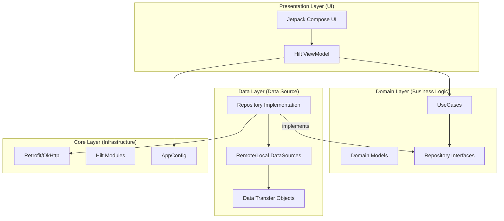
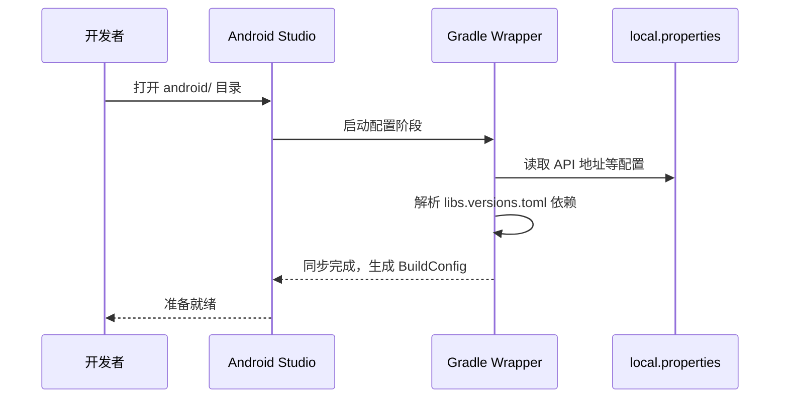
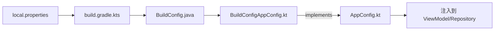
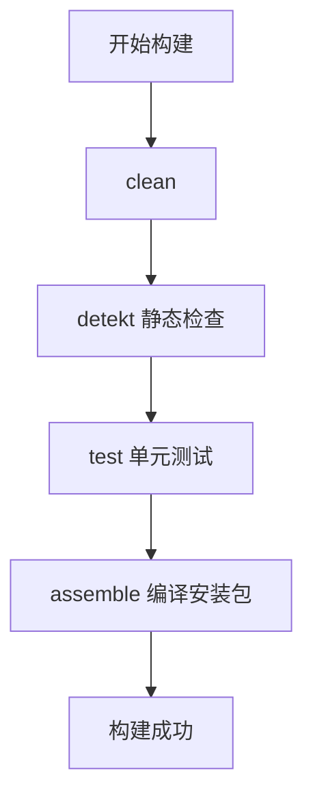
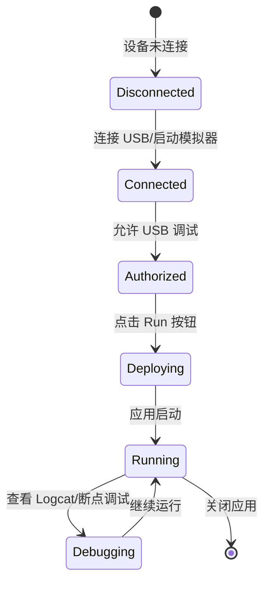

# Android 开发环境配置

## 目录
1. [模块概览](#模块概览)
2. [环境要求](#环境要求)
3. [项目导入与 Gradle 同步](#项目导入与-gradle-同步)
4. [依赖管理系统](#依赖管理系统)
5. [核心配置与 API 地址](#核心配置与-api-地址)
6. [构建变体与签名配置](#构建变体与签名配置)
7. [常用 Gradle 命令与静态检查](#常用-gradle-命令与静态检查)
8. [运行与调试](#运行与调试)
9. [文件引用](#文件引用)

## 模块概览

Android 客户端是 ShortDrama 项目的核心组成部分，采用了现代化的 Android 开发技术栈，包括 Kotlin 2.0、Jetpack Compose、Hilt 依赖注入以及 Clean Architecture 架构模式。

该模块位于 `android/` 目录下，包含约 180 个源文件。其结构设计旨在保证代码的可测试性、可维护性和模块化。

### 核心目录结构

- `app/`: 应用程序主模块，包含所有业务逻辑和 UI 实现。
  - `src/main/java/com/djs66256/short_drama/core/`: 基础设施层（网络、配置、DI、主题）。
  - `src/main/java/com/djs66256/short_drama/data/`: 数据层（Repository 实现、DataSource、DTO）。
  - `src/main/java/com/djs66256/short_drama/domain/`: 领域层（UseCase、Repository 接口、实体模型）。
  - `src/main/java/com/djs66256/short_drama/feature/`: 功能模块（首页、播放器、详情页等）。
- `gradle/`: Gradle 包装器及版本目录配置文件（`libs.versions.toml`）。
- `keystore/`: 用于存放应用签名文件的目录。
- `.detekt/`: Detekt 静态代码检查的配置规则。

### 架构设计

应用遵循 Clean Architecture 分层原则，确保业务逻辑（Domain）独立于框架和外部数据源。



该架构图展示了各层级之间的依赖关系。注意依赖方向始终向内指向 **Domain Layer**，这保证了核心业务逻辑的纯净性。`Presentation` 层通过 `ViewModel` 调用 `UseCase`，而 `UseCase` 依赖于 `Repository` 接口。具体的 `Repository` 实现则在 `Data` 层中完成，并与 `Core` 层的网络和配置组件交互。

**Section sources**:
- [android/CLAUDE.md](android/CLAUDE.md)
- [android/app/src/main/java/com/djs66256/short_drama/ShortDramaApplication.kt](android/app/src/main/java/com/djs66256/short_drama/ShortDramaApplication.kt)

## 环境要求

在开始开发之前，请确保您的开发环境满足以下要求。

### 1. JDK 版本
项目要求使用 **JDK 17** 或更高版本。
- 推荐使用 Android Studio 自带的 JDK。
- 在 Android Studio 中检查路径：`Settings -> Build, Execution, Deployment -> Build Tools -> Gradle -> Gradle JDK`。

### 2. Android Studio
建议使用 **Android Studio Ladybug (2024.2.1)** 或更高版本，以获得对 Kotlin 2.0 和 Compose Strong Skipping Mode 的最佳支持。

### 3. Android SDK
- **Compile SDK**: 36
- **Target SDK**: 36
- **Min SDK**: 26 (Android 8.0)

**Section sources**:
- [android/app/build.gradle.kts](android/app/build.gradle.kts)
- [android/gradle/libs.versions.toml](android/gradle/libs.versions.toml)

## 项目导入与 Gradle 同步

正确导入项目是成功构建的第一步。

### 导入步骤
1. 启动 Android Studio。
2. 选择 **Open**，定位并选中 `android/` 目录。
3. 等待 IDE 加载项目结构。

### 配置 local.properties
项目通过 `local.properties` 文件管理本地环境变量（如 API 地址）。在同步之前，请在 `android/` 根目录下创建或编辑 `local.properties`：

```properties
# API 基础地址 (默认为模拟器访问宿主机的 3001 端口)
api.base.url=http://10.0.2.2:3001/api/
# 商城 H5 地址
mall.base.url=http://10.0.2.2:3002
# 任务中心 H5 地址
earn.base.url=http://10.0.2.2:3000
```

### Gradle 同步流程
当您修改了 `build.gradle.kts` 或 `local.properties` 后，必须执行同步：
- 点击 IDE 右上角的 **Elephant 图标 (Sync Project with Gradle Files)**。



同步过程中，Gradle 会读取 `local.properties` 中的键值对，并通过 `build.gradle.kts` 中的 `buildConfigField` 逻辑将其注入到生成的 `BuildConfig` 类中。这使得代码可以在运行时安全地访问这些配置，而无需将其硬编码在源码中。

**Section sources**:
- [android/app/build.gradle.kts](android/app/build.gradle.kts)
- [android/gradle.properties](android/gradle.properties)

## 依赖管理系统

项目使用 **Gradle Version Catalog (`libs.versions.toml`)** 统一管理所有依赖项和插件版本。这种方式避免了在多个 Gradle 文件中重复定义版本号，提高了构建的一致性。

### libs.versions.toml 结构
该文件位于 `android/gradle/` 目录下，分为三个主要部分：

1. **[versions]**: 定义版本号常量。
2. **[libraries]**: 定义库的别名和坐标。
3. **[plugins]**: 定义 Gradle 插件的别名和版本。

### 关键技术栈版本
项目采用了目前 Android 开发最前沿的技术组合：

| 技术 | 版本 | 说明 |
| :--- | :--- | :--- |
| **Kotlin** | 2.0.21 | 启用 Compose 编译器集成 |
| **Compose BOM** | 2024.12.01 | 统一管理 Compose 组件版本 |
| **Hilt** | 2.53.1 | 依赖注入框架 |
| **Retrofit** | 2.11.0 | 网络请求库 |
| **Detekt** | 1.23.7 | 静态代码分析 |

### 使用示例
在 `app/build.gradle.kts` 中引用定义的库：

```kotlin
dependencies {
    implementation(libs.compose.ui)
    implementation(libs.hilt.android)
    ksp(libs.hilt.android.compiler)
}
```

**Section sources**:
- [android/gradle/libs.versions.toml](android/gradle/libs.versions.toml)
- [android/build.gradle.kts](android/build.gradle.kts)

## 核心配置与 API 地址

为了保证代码的可测试性，项目通过 `AppConfig` 接口抽象了所有全局配置。

### AppConfig 接口
定义在 `core.config` 包下，包含了应用运行所需的关键元数据。

```kotlin
interface AppConfig {
    val isDebug: Boolean
    val apiBaseUrl: String
    val mallBaseUrl: String
    val earnBaseUrl: String
    val appName: String
    val appVersion: String
}
```

### 生产环境实现
`BuildConfigAppConfig` 是该接口的默认实现，它直接包装了 Gradle 自动生成的 `BuildConfig` 类。

```kotlin
@Singleton
class BuildConfigAppConfig @Inject constructor() : AppConfig {
    override val isDebug: Boolean get() = BuildConfig.DEBUG
    override val apiBaseUrl: String get() = BuildConfig.API_BASE_URL
    // ... 其他字段实现
}
```

### 依赖注入
在 Hilt 模块（如 `AppModule`）中，我们将 `AppConfig` 绑定到其实现类，以便在 `ViewModel` 或 `Repository` 中轻松注入。



这种设计模式（接口隔离）意味着在编写单元测试时，我们可以轻松地提供一个 `MockAppConfig`，而不需要依赖 Android 运行环境或 `BuildConfig` 类。

**Section sources**:
- [android/app/src/main/java/com/djs66256/short_drama/core/config/AppConfig.kt](android/app/src/main/java/com/djs66256/short_drama/core/config/AppConfig.kt)
- [android/app/src/main/java/com/djs66256/short_drama/core/config/BuildConfigAppConfig.kt](android/app/src/main/java/com/djs66256/short_drama/core/config/BuildConfigAppConfig.kt)
- [android/app/build.gradle.kts](android/app/build.gradle.kts)

## 构建变体与签名配置

项目配置了标准的 `debug` 和 `release` 构建类型。

### Build Types
1. **debug**:
   - 默认启用。
   - `isMinifyEnabled = false` (不启用混淆)。
   - 包含调试符号。
2. **release**:
   - `isMinifyEnabled = true` (启用 R8 混淆和代码缩减)。
   - `isShrinkResources = true` (移除未使用的资源)。
   - 必须配置签名才能运行。

### 签名配置
发布版本需要配置 `release-keystore.properties`。

**操作步骤**：
1. 将您的 `.jks` 签名文件放入 `android/keystore/` 目录。
2. 复制 `release-keystore.properties.example` 并重命名为 `release-keystore.properties`。
3. 填入实际的 `storePassword`, `keyAlias` 等信息。

```properties
storeFile=../keystore/release.jks
storePassword=your_password
keyAlias=your_alias
keyPassword=your_key_password
```

> ⚠️ **安全警告**：切勿将包含真实密码的 `release-keystore.properties` 提交到版本控制系统。该文件已被加入 `.gitignore`。

**Section sources**:
- [android/app/build.gradle.kts](android/app/build.gradle.kts)
- [android/release-keystore.properties.example](android/release-keystore.properties.example)

## 常用 Gradle 命令与静态检查

除了使用 IDE 界面，开发者还可以通过命令行执行各种构建任务。

### 基础构建命令
在 `android/` 根目录下运行：

- **编译 Debug 包**: `./gradlew assembleDebug`
- **编译 Release 包**: `./gradlew assembleRelease`
- **清理构建缓存**: `./gradlew clean`

### 静态代码检查 (Detekt)
项目集成 `Detekt` 用于保持代码风格一致并发现潜在缺陷。
- **运行检查**: `./gradlew detekt`
- 配置位于 `android/.detekt/detekt.yml`。

### 单元测试
- **运行所有测试**: `./gradlew test`
- 测试报告生成路径：`app/build/reports/tests/testDebugUnitTest/index.html`。



这个流程图展示了标准持续集成 (CI) 环境下的推荐步骤。先清理环境，接着进行静态代码分析和单元测试，只有在这些检查全部通过后，才执行最终的打包操作，以确保产出物的质量。

**Section sources**:
- [android/CLAUDE.md](android/CLAUDE.md)
- [android/.detekt/detekt.yml](android/.detekt/detekt.yml)

## 运行与调试

完成环境配置和 Gradle 同步后，即可在设备上运行应用。

### 1. 模拟器运行
- 在 Android Studio 中打开 **Device Manager**。
- 创建一个 API Level 30+ 的虚拟设备 (推荐使用带有 Google Play 服务的镜像)。
- 点击工具栏上的 **Run (绿色三角形)**。

### 2. 真机调试
- 在手机上开启 **开发者选项** 和 **USB 调试**。
- 通过数据线连接电脑。
- 使用 `adb devices` 命令确认连接成功。

### 3. 日志查看 (Logcat)
- 使用 Android Studio 底部的 **Logcat** 窗口。
- 过滤包名 `com.djs66256.short_drama`。
- 建议关注 `NetworkModule` 和 `AuthInterceptor` 打印的日志，以便调试 API 调用。



该状态机描述了从物理连接到进入调试状态的完整生命周期。开发者需要确保设备处于 `Authorized` 状态，否则 ADB 无法将 APK 部署到设备上。进入 `Running` 状态后，可以通过 Logcat 实时监控应用行为。

**Section sources**:
- [android/app/src/main/java/com/djs66256/short_drama/MainActivity.kt](android/app/src/main/java/com/djs66256/short_drama/MainActivity.kt)
- [android/app/src/main/java/com/djs66256/short_drama/core/network/AuthInterceptor.kt](android/app/src/main/java/com/djs66256/short_drama/core/network/AuthInterceptor.kt)

## 文件引用

以下是本页面涉及的关键源文件，建议开发者深入阅读：

- **开发规范**: [android/CLAUDE.md](android/CLAUDE.md)
- **根构建脚本**: [android/build.gradle.kts](android/build.gradle.kts)
- **App 模块构建脚本**: [android/app/build.gradle.kts](android/app/build.gradle.kts)
- **版本目录**: [android/gradle/libs.versions.toml](android/gradle/libs.versions.toml)
- **应用入口**: [android/app/src/main/java/com/djs66256/short_drama/ShortDramaApplication.kt](android/app/src/main/java/com/djs66256/short_drama/ShortDramaApplication.kt)
- **配置接口**: [android/app/src/main/java/com/djs66256/short_drama/core/config/AppConfig.kt](android/app/src/main/java/com/djs66256/short_drama/core/config/AppConfig.kt)
- **网络模块**: [android/app/src/main/java/com/djs66256/short_drama/core/di/NetworkModule.kt](android/app/src/main/java/com/djs66256/short_drama/core/di/NetworkModule.kt)
- **Detekt 配置**: [android/.detekt/detekt.yml](android/.detekt/detekt.yml)
- **签名示例**: [android/release-keystore.properties.example](android/release-keystore.properties.example)
