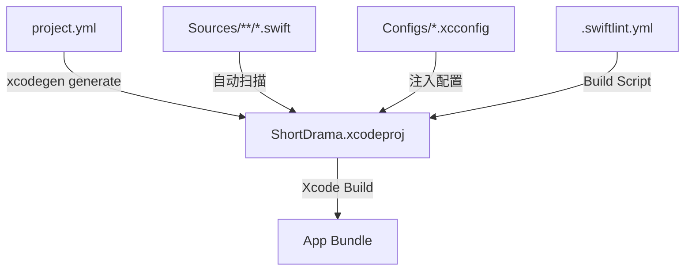
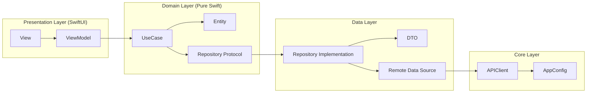
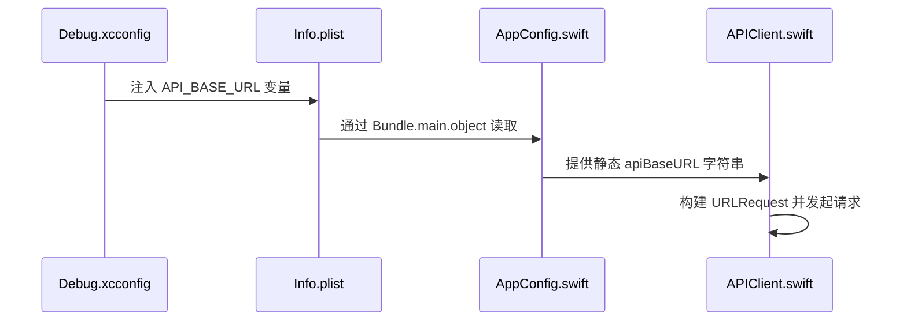

# iOS 开发环境配置

## 目录
1. [模块概览](#模块概览)
2. [引言](#引言)
3. [工具链准备](#工具链准备)
4. [工程生成与管理](#工程生成与管理)
5. [架构设计与分层](#架构设计与分层)
6. [环境配置与 API 注入](#环境配置与-api-注入)
7. [证书签名与真机调试](#证书签名与真机调试)
8. [编译、运行与测试](#编译运行与测试)
9. [常见问题排查](#常见问题排查)
10. [核心组件与文件参考](#核心组件与文件参考)

## 模块概览

ShortDrama iOS 客户端是一个基于 Swift 6 和 SwiftUI 构建的现代化移动应用。该模块位于项目的 `ios/` 目录下，采用了高度结构化的开发模式，通过 XcodeGen 进行工程配置管理，确保了团队开发中工程文件（`.xcodeproj`）的一致性。

**模块统计与覆盖范围**：
- **文件总数**：经过扫描，`ios/` 目录下包含约 220 个源文件（包括 Swift 源码、资源文件和测试用例）。
- **主要子目录**：
  - `ShortDrama/Sources/App/`：应用入口、路由管理与 Deeplink 处理。
  - `ShortDrama/Sources/Core/`：基础设施层，包含网络请求、配置管理、设计系统等。
  - `ShortDrama/Sources/Domain/`：业务领域层，包含纯 Swift 编写的实体、仓库协议和用例。
  - `ShortDrama/Sources/Data/`：数据层，负责 DTO 映射、远程数据源和仓库协议的具体实现。
  - `ShortDrama/Sources/Features/`：表现层，按功能模块划分的 SwiftUI 视图与 ViewModel。
  - `ShortDrama/Tests/`：单元测试模块，覆盖了 Data、Domain 和 ViewModel 层。
  - `Configs/`：包含不同环境（Debug/Release）的构建配置文件。

本指南将重点介绍如何从零开始搭建开发环境，生成 Xcode 工程，并成功在模拟器或真机上运行应用。

## 引言

ShortDrama iOS 客户端的设计目标是提供一个高性能、易维护的短剧播放体验。为了达成这一目标，项目在技术选型上遵循了以下核心原则：

1.  **声明式 UI**：全面使用 SwiftUI，确保界面状态与逻辑的清晰解耦。
2.  **工程自动化**：利用 XcodeGen 摆脱繁琐的 `.pbxproj` 合并冲突，实现“配置即代码”。
3.  **整洁架构 (Clean Architecture)**：严格划分 Core、Domain、Data 和 Presentation 层，提高代码的可测试性和复用性。
4.  **原生优先**：网络层直接使用 `URLSession`，不引入 Alamofire 等第三方库，减少包体积和依赖风险。

开发者在开始编写业务逻辑之前，必须确保本地工具链已正确安装，并理解 `project.yml` 与 Xcode 工程之间的映射关系。

## 工具链准备

在开始开发之前，您需要在 macOS 环境下安装必要的构建工具。ShortDrama 项目依赖于 `XcodeGen` 来生成项目文件，以及 `SwiftLint` 来保证代码质量。

### 1. 安装基础工具

确保您已安装最新版本的 Xcode（推荐 16.0 或更高版本，以支持 Swift 6）。然后通过 Homebrew 安装以下工具：

```bash
# 安装 XcodeGen 用于生成 .xcodeproj 文件
brew install xcodegen

# 安装 SwiftLint 用于代码风格检查
brew install swiftlint
```

### 2. 环境验证

安装完成后，可以通过以下命令验证工具版本：

```bash
xcodegen --version
swiftlint --version
```

下表说明了关键工具在项目中的作用：

| 工具名称 | 作用 | 配置文件 |
| :--- | :--- | :--- |
| **XcodeGen** | 根据 YAML 配置生成 Xcode 工程，避免 pbxproj 冲突 | `project.yml` |
| **SwiftLint** | 静态代码分析，强制执行 Swift 风格指南 | `.swiftlint.yml` |
| **SPM** | Swift Package Manager，用于集成系统级或内部依赖 | Xcode 自动处理 |

> 💡 **提示**：项目在 `project.yml` 中配置了 `preBuildScripts`，每次在 Xcode 中点击 Build 时，如果系统已安装 `swiftlint`，它会自动运行并显示警告或错误。

## 工程生成与管理

与传统的 iOS 开发不同，ShortDrama 项目**不直接修改** `ShortDrama.xcodeproj`。该文件夹虽然存在于仓库中，但它是通过 `project.yml` 自动生成的。

### 1. 生成工程

在 `ios/` 目录下运行以下命令：

```bash
cd ios
xcodegen generate
```

该命令会读取 `project.yml` 中的定义，扫描 `ShortDrama/Sources` 和 `ShortDrama/Resources` 目录下的文件，并重新构建 `ShortDrama.xcodeproj`。

### 2. 为什么使用 XcodeGen？

下图展示了 XcodeGen 在开发流程中的位置。它充当了配置与最终工程文件之间的桥梁：



通过这种方式，当您新增文件或修改构建设置时，只需更新 `project.yml` 或直接在文件系统中添加文件，然后重新运行 `xcodegen generate` 即可。这极大地简化了多人协作时的冲突处理。

**工程生成逻辑说明**：
- **Sources 包含**：`ShortDrama/Sources` 下的所有 `.swift` 文件会被自动加入编译目标。
- **Resources 包含**：`ShortDrama/Resources` 下的资产（Assets.xcassets）会被标记为资源包。
- **排除项**：`Info.plist` 被排除在资源构建之外，因为它是由 Xcode 统一处理的元数据文件。

**工程生成源码参考**：
- [project.yml](ios/project.yml)

## 架构设计与分层

ShortDrama 遵循 MVVM + Clean Architecture 模式。理解这一架构对于配置开发环境和编写代码至关重要。

### 1. 分层结构

项目将代码划分为四个清晰的层次，每一层都有明确的职责边界：



### 2. 各层职责详解

- **Core 层**：提供全局通用的基础设施。例如 `APIClient` 封装了 `URLSession` 的请求逻辑，`DesignTokens` 定义了应用的色值和间距。
- **Domain 层**：这是业务逻辑的核心。它不依赖于任何 UI 框架（如 SwiftUI）或数据持久化框架。`UseCase` 描述了用户可以执行的操作，如 `FetchDramasUseCase`。
- **Data 层**：负责与外部世界通信。它将网络返回的 `DTO` 映射为 Domain 层的 `Entity`。
- **Presentation 层**：这是用户看到的界面。`ViewModel` 负责持有状态，并调用 `UseCase` 来获取数据。

这种分层确保了即使更换 UI 框架（例如从 SwiftUI 换回 UIKit）或更换网络库，核心业务逻辑（Domain 层）也无需任何改动。

**架构约定参考**：
- [CLAUDE.md:L15-L25](ios/CLAUDE.md#L15-L25)

## 环境配置与 API 注入

iOS 客户端需要连接后端服务。为了灵活切换开发、测试和生产环境，项目使用了 `.xcconfig` 文件来管理配置。

### 1. 配置文件

在 `ios/Configs/` 目录下有两个关键文件：
- `Debug.xcconfig`：用于本地开发和调试。
- `Release.xcconfig`：用于打包发布。

### 2. API 基础路径配置

在 `Debug.xcconfig` 中，您可以找到 API 的基础 URL 定义：

```text
// ios/Configs/Debug.xcconfig
CODE_SIGN_STYLE = Automatic
COLON_SLASH = /
API_BASE_URL = http:$(COLON_SLASH)/localhost:3001
MALL_BASE_URL = http:$(COLON_SLASH)/localhost:3000
EARN_BASE_URL = http:$(COLON_SLASH)/localhost:3000
```

> ⚠️ **注意**：由于 `.xcconfig` 中 `/` 是特殊字符，项目使用了 `$(COLON_SLASH)` 变量来转义斜杠。

### 3. 配置注入流程

配置是如何从 `.xcconfig` 传递到 Swift 代码中的？请参考以下流程：



如果您需要修改后端接口地址（例如连接到局域网内的另一台机器），只需修改 `Debug.xcconfig` 中的 `API_BASE_URL`，然后重新运行即可。

**配置源码参考**：
- [Configs/Debug.xcconfig](ios/Configs/Debug.xcconfig)
- [ShortDrama/Sources/Core/Config/AppConfig.swift](ios/ShortDrama/Sources/Core/Config/AppConfig.swift)

## 证书签名与真机调试

默认情况下，生成的工程配置为“自动签名”。要在真机上运行应用，您需要配置自己的开发团队。

### 1. 配置步骤

1.  打开 `ShortDrama.xcodeproj`。
2.  在 Project Navigator 中选择 `ShortDrama` 项目根节点。
3.  选择 `ShortDrama` Target，点击 **Signing & Capabilities** 选项卡。
4.  在 **Team** 下拉菜单中选择您的 Apple ID 或所在团队。
5.  Xcode 会自动生成所需的 Provisioning Profile。

### 2. 常见签名问题

如果您遇到 `Signing Certificate` 相关的报错，请检查以下几点：
- 确保您的设备已连接并已在 Xcode 中注册。
- 如果是个人免费账号，请确保已在设备设置中“信任”该开发者证书。
- 检查 `project.yml` 中的 `bundleIdPrefix` 是否与您的证书权限冲突。

## 编译、运行与测试

完成上述配置后，您就可以开始编译运行了。

### 1. 选择 Scheme 与设备

在 Xcode 顶部的工具栏中：
- **Scheme**：确保选择了 `ShortDrama`。
- **Destination**：选择一个模拟器（如 iPhone 16）或已连接的真机。

按下 `Cmd + R` 开始构建运行。

### 2. 运行单元测试

ShortDrama 使用了 Swift 6 引入的 `Swift Testing` 框架。要运行测试：
1.  按下 `Cmd + U`。
2.  或者在 Xcode 的 **Test Navigator** (`Cmd + 6`) 中点击对应测试用例旁边的播放按钮。

测试模块的结构如下：
- `DataTests/`：验证网络解析和仓库逻辑。
- `DomainTests/`：验证业务用例逻辑。
- `ViewModelTests/`：验证 UI 状态转换。

### 3. 命令行操作

如果您更倾向于使用终端，可以使用以下命令：

```bash
# 构建工程
xcodebuild -project ShortDrama.xcodeproj -scheme ShortDrama build -destination 'platform=iOS Simulator,name=iPhone 16'

# 运行测试
xcodebuild -project ShortDrama.xcodeproj -scheme ShortDrama test -destination 'platform=iOS Simulator,name=iPhone 16'
```

**命令约定参考**：
- [CLAUDE.md:L35-L63](ios/CLAUDE.md#L35-L63)

## 常见问题排查

在环境搭建过程中，您可能会遇到以下问题，请参考对应的排查建议。

### 1. XcodeGen 报错：`Could not find Sources`
- **原因**：通常是因为在运行 `xcodegen generate` 时不在 `ios/` 根目录下，或者目录结构发生了变化。
- **解决**：确保在 `ios/` 目录下运行，并检查 `project.yml` 中的 `sources` 路径是否正确。

### 2. 编译报错：`Missing API_BASE_URL`
- **原因**：`Info.plist` 无法读取到 `xcconfig` 中的变量。
- **解决**：检查 Xcode Target 的 **Build Settings** -> **Info.plist Values**，确认 `API_BASE_URL` 是否已正确注入。尝试 Clean Build (`Cmd + Shift + K`)。

### 3. SPM 依赖解析失败
- **原因**：网络连接问题或 Xcode 缓存损坏。
- **解决**：点击菜单 **File -> Packages -> Reset Package Caches**。如果项目使用了内部私有库，请确保已配置 SSH Key。

### 4. 运行时崩溃：`AppConfig.apiBaseURL is nil`
- **原因**：`AppConfig.swift` 中的键名与 `Info.plist` 中的不匹配。
- **解决**：核对 `AppConfig.swift` 中读取的字符串常量是否为 `"API_BASE_URL"`。

## 核心组件与文件参考

以下是您在配置和开发过程中需要重点关注的文件：

| 文件路径 | 描述 | 核心作用 |
| :--- | :--- | :--- |
| `ios/project.yml` | XcodeGen 配置文件 | 定义 Target、依赖、Build Settings 和脚本 |
| `ios/CLAUDE.md` | 开发规范文档 | 包含构建命令、架构约束和开发约定 |
| `ios/Configs/Debug.xcconfig` | Debug 构建配置 | 存放 API 地址、Bundle ID 等环境变量 |
| `ios/ShortDrama/Sources/App/ShortDramaApp.swift` | 应用入口 | 初始化全局 Store 和路由系统 |
| `ios/ShortDrama/Sources/Core/Config/AppConfig.swift` | 配置读取器 | 将 Info.plist 中的配置暴露给 Swift 代码 |
| `ios/.swiftlint.yml` | 代码规范配置 | 定义 Lint 规则，如行宽限制、命名规范等 |

**相关源码文件**：
- [ios/project.yml](ios/project.yml)
- [ios/CLAUDE.md](ios/CLAUDE.md)
- [ios/Configs/Debug.xcconfig](ios/Configs/Debug.xcconfig)
- [ios/ShortDrama/Sources/App/ShortDramaApp.swift](ios/ShortDrama/Sources/App/ShortDramaApp.swift)
- [ios/ShortDrama/Sources/Core/Config/AppConfig.swift](ios/ShortDrama/Sources/Core/Config/AppConfig.swift)
- [ios/ShortDrama/Sources/Core/Network/APIClient.swift](ios/ShortDrama/Sources/Core/Network/APIClient.swift)
- [ios/.swiftlint.yml](ios/.swiftlint.yml)
