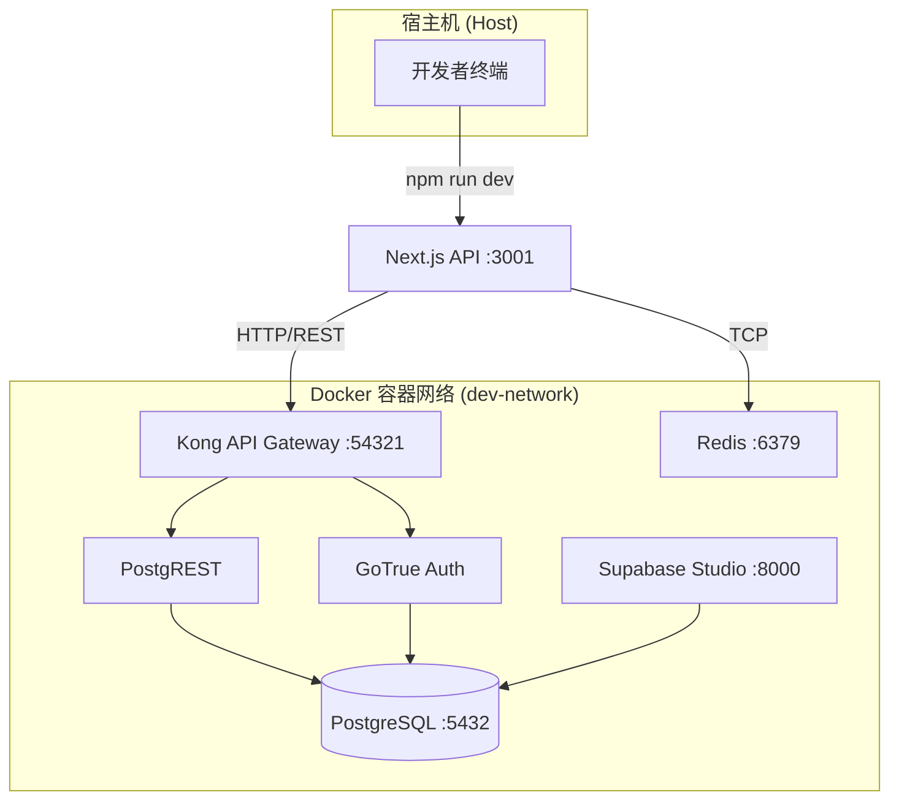
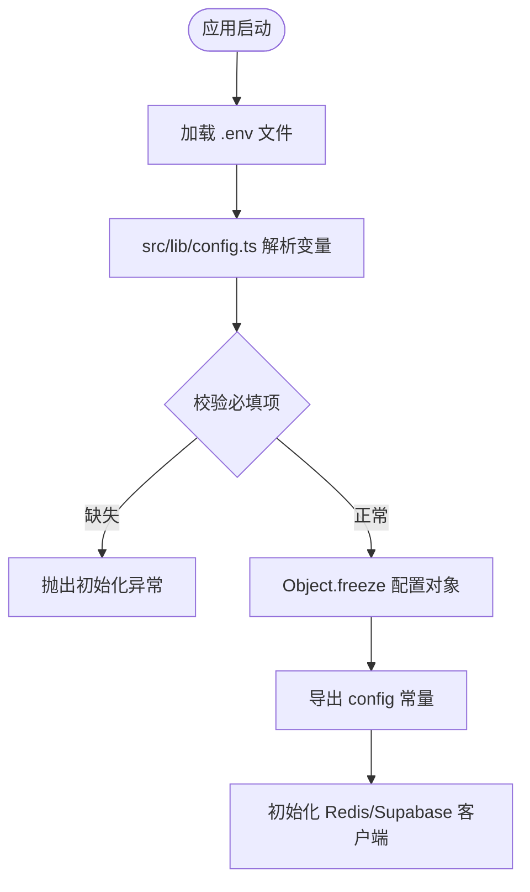
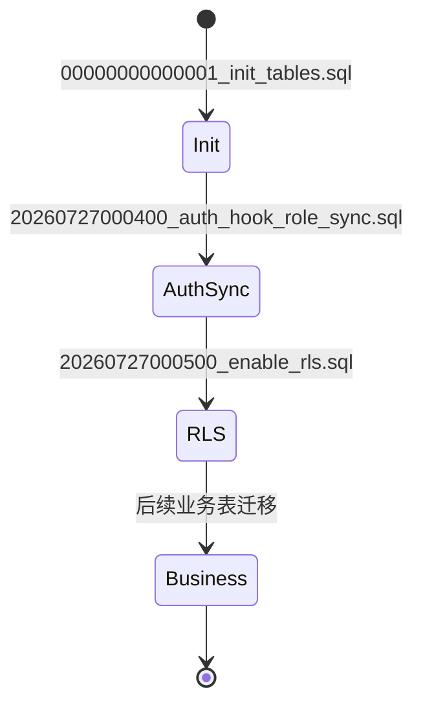
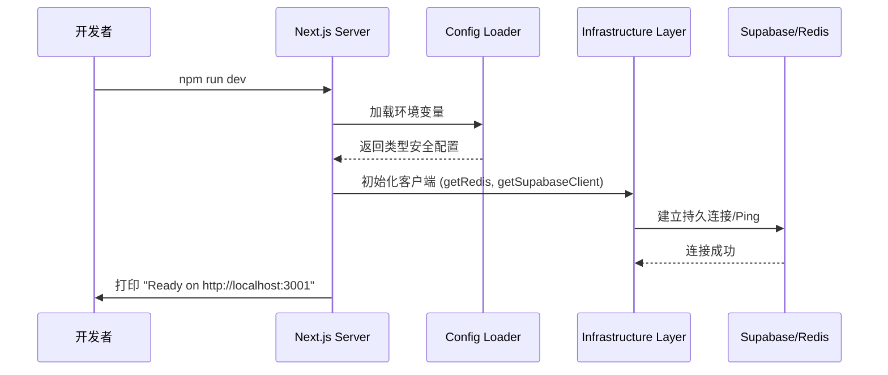

# 后端环境配置

## 目录
1. [项目概览](#项目概览)
2. [环境准备](#环境准备)
   - [依赖管理](#依赖管理)
   - [基础设施启动](#基础设施启动)
3. [核心配置详解](#核心配置详解)
   - [环境变量配置](#环境变量配置)
   - [配置加载机制](#配置加载机制)
4. [数据库初始化与迁移](#数据库初始化与迁移)
5. [服务启动与验证](#服务启动与验证)
6. [常见问题与排除](#常见问题与排除)
7. [文件参考](#文件参考)

## 项目概览

后端服务是基于 **Next.js 16 (App Router)** 构建的高性能 API 服务，集成了 **Supabase** 作为核心数据库与身份认证系统，并使用 **Redis** 处理高性能缓存与消息队列。

### 模块范围
后端代码库包含约 150 个核心文件，涵盖了从基础设施配置到复杂业务逻辑的完整生命周期。

- **文件总数**: 约 150 个源文件（不含 `.next` 和 `node_modules`）
- **核心目录结构**:
  - `src/infrastructure/`: 外部服务（Redis, Supabase）的连接与初始化逻辑。
  - `src/lib/config.ts`: 集中化的环境变量解析与类型安全配置。
  - `supabase/`: 数据库架构定义、迁移脚本及本地开发配置。
  - `tests/`: 包含用于本地开发的完整基础设施 Docker 配置。

本章节将详细指导开发者如何从零开始搭建开发环境，确保所有基础设施组件协同工作。

---

## 环境准备

在开始编写代码之前，必须确保本地开发环境已正确安装 Node.js (建议 v20+)、Docker 以及 Supabase CLI。

### 依赖管理

项目使用 `npm` 作为包管理工具。Next.js 16 引入了多项性能优化，依赖安装过程非常直接。

```bash
# 进入后端目录
cd backend

# 安装依赖
npm install
```

**关键依赖说明**:
- `@supabase/supabase-js`: 用于与数据库及身份认证服务交互。
- `ioredis`: 高性能 Redis 客户端，支持集群与哨兵模式。
- `zod`: 用于运行时配置验证和模式定义。
- `vitest`: 单元测试与集成测试框架。

### 基础设施启动

后端依赖于 Redis 和 Supabase。为了简化开发流程，我们提供了两套 Docker 方案：

1.  **轻量级方案** (`backend/docker-compose.yml`): 仅启动 Redis 容器。适用于使用远程 Supabase 实例的场景。
2.  **完整开发方案** (`backend/tests/docker-compose.yml`): 启动包括 PostgreSQL、GoTrue (Auth)、PostgREST、Realtime、Storage 以及 Kong 在内的完整 Supabase 栈。

以下是启动完整开发环境的流程：



上述架构图展示了本地开发环境的组件交互。开发者通过终端启动 Next.js 服务，该服务通过 Kong 网关与各个子服务通信。Redis 作为独立的缓存层直接被 Next.js 调用。

**启动命令**:
```bash
# 使用测试目录下的配置启动完整栈
cd backend/tests
docker compose up -d
```

**基础设施说明**:
- **PostgreSQL**: 核心数据存储。
- **Redis**: 用于存储临时会话、频率限制数据等。
- **Kong**: 统一的 API 入口，处理路由转发。
- **Mailpit**: 捕获本地发送的所有邮件，方便调试注册流程。

**Section sources**:
- [package.json](backend/package.json)
- [docker-compose.yml](backend/docker-compose.yml)
- [tests/docker-compose.yml](backend/tests/docker-compose.yml)

---

## 核心配置详解

后端采用“配置即代码”的原则，通过 `src/lib/config.ts` 将环境变量转化为强类型的对象，避免在业务逻辑中直接使用 `process.env`。

### 环境变量配置

首先，基于模板创建本地环境变量文件：

```bash
cp .env.example .env
```

下表列出了 `.env` 中的关键配置项及其作用：

| 变量名 | 默认值 | 说明 |
| :--- | :--- | :--- |
| `PORT` | `3001` | 后端 API 服务运行端口 |
| `SUPABASE_URL` | - | Supabase API 地址（本地通常为 `http://localhost:54321`） |
| `SUPABASE_ANON_KEY` | - | 公共匿名访问密钥，用于客户端请求 |
| `SUPABASE_SERVICE_ROLE_KEY`| - | 后端管理密钥，绕过 RLS 策略，**严禁泄露至前端** |
| `REDIS_URL` | `redis://localhost:6379` | Redis 连接字符串 |
| `AUTH_ALLOW_TEST_OTP_BYPASS`| `false` | 是否允许测试模式下的验证码绕过（本地开发建议开启） |

### 配置加载机制

配置加载流程确保了应用在启动时就能发现配置错误（如缺少必要的 URL）。



配置加载流程从读取 `.env` 开始，通过 `src/lib/config.ts` 进行结构化处理。如果缺少 `SUPABASE_URL` 等核心参数，系统会立即报错，防止应用进入不可预测的状态。

**代码实现参考**:
```typescript
// src/lib/config.ts
export const config = {
  app: {
    name: process.env.APP_NAME ?? 'Backend',
    env: process.env.NODE_ENV ?? 'development',
  },
  supabase: {
    url: process.env.SUPABASE_URL ?? '',
    anonKey: process.env.SUPABASE_ANON_KEY ?? '',
    serviceRoleKey: process.env.SUPABASE_SERVICE_ROLE_KEY ?? '',
  },
  redis: {
    url: process.env.REDIS_URL ?? 'redis://localhost:6379',
  },
  // ... 其他配置项
} as const;
```

**Section sources**:
- [.env.example](backend/.env.example)
- [src/lib/config.ts](backend/src/lib/config.ts)

---

## 数据库初始化与迁移

在基础设施启动后，需要对数据库进行 Schema 初始化。项目使用 Supabase 的迁移机制来管理版本。

### 迁移流程

迁移脚本存放在 `backend/supabase/migrations/` 目录下。每个文件代表一个数据库版本的变更。



迁移过程是顺序执行的。首先建立基础表结构（如 `profiles`），然后配置身份认证钩子，最后启用行级安全性（RLS）策略。这种分层方法确保了数据库在任何时候都是安全且一致的。

### 执行初始化

如果你安装了 Supabase CLI，可以运行：

```bash
# 启动本地 Supabase (如果还没启动)
npx supabase start

# 执行所有挂起的迁移
npx supabase db reset
```

如果没有安装 CLI，也可以通过 Docker 启动时的 `init.sql` 自动执行，或者手动在 Supabase Studio (`http://localhost:8000`) 的 SQL 编辑器中运行 `migrations` 文件夹下的脚本。

**关键迁移文件**:
- `00000000000001_init_tables.sql`: 创建用户资料、剧集、任务等核心表。
- `20260727000500_enable_rls.sql`: 开启 RLS 确保数据访问安全。

**Section sources**:
- [supabase/migrations/](backend/supabase/migrations/)
- [supabase/config.toml](backend/supabase/config.toml)

---

## 服务启动与验证

一切就绪后，即可启动 Next.js 开发服务器。

### 启动命令

```bash
npm run dev
```

默认情况下，后端服务将监听 `http://localhost:3001`。注意，这与前端默认的 `3000` 端口不同，以避免冲突。

### 验证步骤

为了确保环境配置成功，建议依次检查以下端点：

1.  **健康检查**: 访问 `http://localhost:3001/api/health`。
    - 预期返回: `{"status": "ok", "timestamp": "..."}`。
    - 该接口会检查数据库和 Redis 的连接状态。
2.  **Supabase Studio**: 访问 `http://localhost:8000`（如果使用完整 Docker 方案）。
    - 验证是否能看到已迁移的表结构。
3.  **Redis 验证**:
    - 使用 `docker exec -it fork-any-redis redis-cli ping` 验证 Redis 是否响应 `PONG`。

### 启动序列图



该序列图描绘了从开发者输入启动命令到服务就绪的内部逻辑。关键点在于基础设施层在服务启动的早期就会尝试与数据库和 Redis 建立连接，任何连接失败都会在控制台立即反馈。

**Section sources**:
- [src/app/api/health/route.ts](backend/src/app/api/health/route.ts)
- [src/infrastructure/redis.ts](backend/src/infrastructure/redis.ts)
- [src/infrastructure/supabase.ts](backend/src/infrastructure/supabase.ts)

---

## 常见问题与排除

在搭建过程中，可能会遇到以下常见问题：

### 1. 端口冲突 (Port 3001 is already in use)
- **原因**: 另一个 Node.js 进程或旧的服务实例未正常关闭。
- **解决**: 运行 `lsof -i :3001` 查找进程 ID，然后使用 `kill -9 <PID>` 杀掉进程；或者在 `.env` 中修改 `PORT=3002`。

### 2. Docker 容器启动失败
- **原因**: 可能是端口 `5432` (Postgres) 或 `6379` (Redis) 被本地安装的数据库占用。
- **解决**: 检查本地是否有运行中的 Postgres/Redis 服务，先停止它们，或者修改 `tests/docker-compose.yml` 中的映射端口。

### 3. Supabase 连接错误 (Invalid API Key)
- **原因**: `.env` 中的 `SUPABASE_ANON_KEY` 与本地启动的 Supabase 实例生成的 Key 不匹配。
- **解决**: 运行 `npx supabase status` 获取最新的 API Keys，并更新到 `.env` 文件中。

### 4. 数据库迁移失败
- **原因**: 数据库状态与迁移脚本冲突。
- **解决**: 使用 `npx supabase db reset` 强制重置数据库（**注意：这会清空所有数据**）。

---

## 文件参考

本章节涉及的核心文件列表如下：

- [backend/package.json](backend/package.json): 依赖定义与启动脚本。
- [backend/docker-compose.yml](backend/docker-compose.yml): 基础 Redis 配置。
- [backend/tests/docker-compose.yml](backend/tests/docker-compose.yml): 完整开发栈配置。
- [backend/.env.example](backend/.env.example): 环境变量模板。
- [backend/src/lib/config.ts](backend/src/lib/config.ts): 配置解析逻辑。
- [backend/src/infrastructure/redis.ts](backend/src/infrastructure/redis.ts): Redis 连接管理。
- [backend/src/infrastructure/supabase.ts](backend/src/infrastructure/supabase.ts): Supabase 客户端工厂。
- [backend/supabase/config.toml](backend/supabase/config.toml): Supabase 本地运行参数。
- [backend/supabase/migrations/](backend/supabase/migrations/): 数据库迁移脚本目录。
