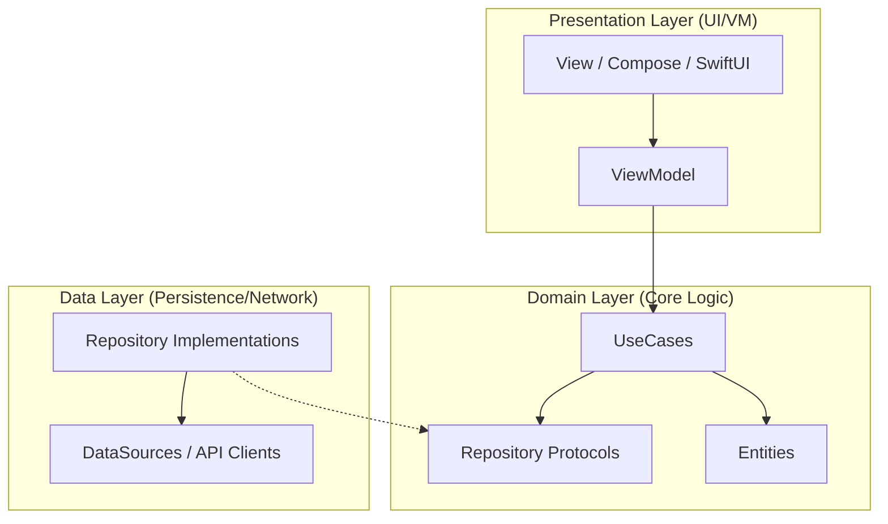
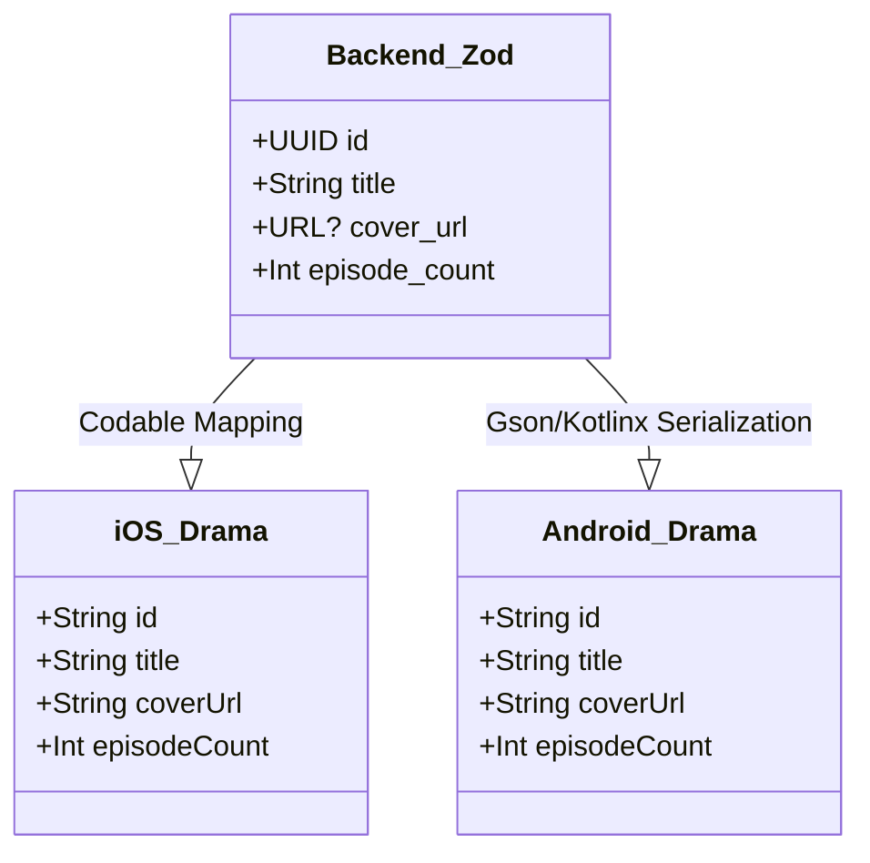
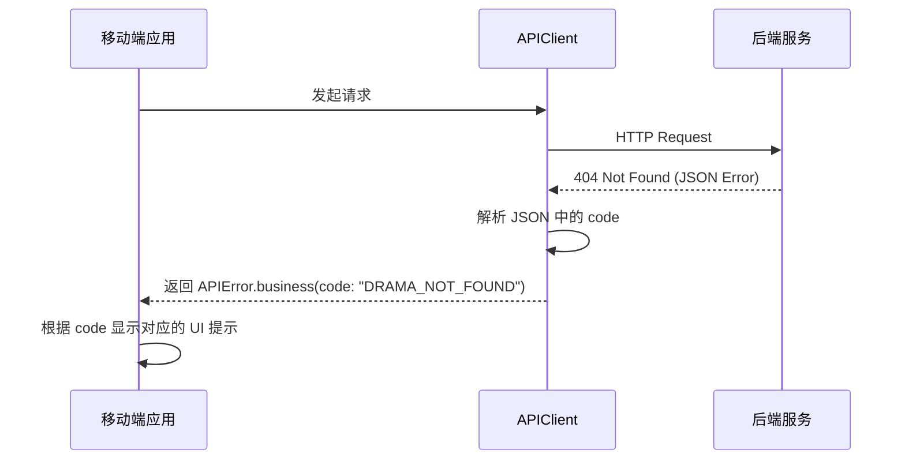
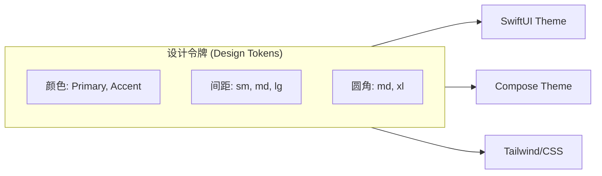

# 技术架构与设计规范

## 目录
1. [模块概览](#模块概览)
2. [核心设计思想：Clean Architecture](#核心设计思想clean-architecture)
   - [分层职责定义](#分层职责定义)
   - [跨端实现对照](#跨端实现对照)
3. [统一模型设计 (Unified Model Design)](#统一模型设计-unified-model-design)
   - [权威来源：Backend Zod Schema](#权威来源backend-zod-schema)
   - [跨端映射机制](#跨端映射机制)
4. [全局错误处理规范](#全局错误处理规范)
   - [统一响应格式](#统一响应格式)
   - [客户端异常捕获流](#客户端异常捕获流)
5. [UI/UX 设计系统 (Design System)](#uiux-设计系统-design-system)
   - [设计令牌 (Design Tokens)](#设计令牌-design-tokens)
   - [跨端主题实现](#跨端主题实现)
6. [核心组件与代码示例](#核心组件与代码示例)
7. [文件参考](#文件参考)

## 模块概览

本章节详细定义了项目的技术灵魂——**跨端一致的技术架构与设计规范**。在多端开发（Android、iOS、Backend）的复杂环境下，确保设计思想的高度统一是降低沟通成本、提高代码质量、实现快速迭代的关键。

### 探索统计
- **发现文件总数**：约 150+ 个核心源文件（涵盖 Domain、Data、Presentation 层）。
- **涉及子模块**：
  - `ios/ShortDrama/Sources/Domain/`：iOS 领域驱动设计核心。
  - `android/app/src/main/java/com/djs66256/short_drama/domain/`：Android 业务逻辑核心。
  - `backend/src/lib/`：后端共享契约（Schema/Errors）。
  - `docs/specs/`：架构设计权威文档。

### 覆盖范围
本文档将深度覆盖跨端架构的每一层实现细节，从底层的 API 契约到顶层的 UI 主题规范。重点在于解释如何通过 **Clean Architecture** 实现逻辑解耦，以及如何利用 **统一模型设计** 保证数据流的准确性。

---

## 核心设计思想：Clean Architecture

项目采用 **Clean Architecture（整洁架构）** 作为核心设计思想。其核心目标是将业务逻辑（Domain）与外部技术实现（Data、UI、Frameworks）彻底解耦。这种架构确保了业务逻辑的独立性，使其不依赖于具体的数据库、UI 框架或第三方库。

### 分层职责定义

在我们的实践中，每一端都被划分为三个核心层级：

1.  **Domain Layer (领域层)**：
    -   **Entities (实体)**：最基础的业务对象（如 `Drama`, `Episode`），不包含任何业务逻辑之外的知识。
    -   **UseCases (用例)**：封装特定的业务逻辑（如 `FetchDramasUseCase`），是系统的核心驱动力。
    -   **Repository Protocols (仓库协议)**：定义数据访问的接口，但不关心数据是从 API 还是本地数据库获取。
2.  **Data Layer (数据层)**：
    -   **Repository Implementations (仓库实现)**：实现 Domain 层定义的协议。
    -   **DataSources (数据源)**：直接与外部通信（如网络请求、数据库操作）。
    -   **DTOs (数据传输对象)**：API 返回的原始 JSON 结构。
3.  **Presentation Layer (表示层)**：
    -   **ViewModel**：负责 UI 逻辑，持有 UI 状态，并与 UseCases 交互。
    -   **View (SwiftUI / Compose)**：纯粹的声明式 UI，只负责渲染 ViewModel 提供的数据。

下图展示了 Clean Architecture 的分层依赖关系，遵循“依赖向内”原则：



该架构图清晰地展示了依赖的方向：表示层依赖于领域层，数据层也依赖于领域层（通过实现其接口）。领域层位于中心，不依赖于任何外部层级，这保证了业务逻辑的纯净性和可测试性。

### 跨端实现对照

为了保证 Android 和 iOS 的开发体验一致，我们对目录结构和命名进行了严格对齐：

| 职责 | iOS 路径 | Android 路径 | Backend 路径 |
| :--- | :--- | :--- | :--- |
| **实体/模型** | `Domain/Entities/` | `domain/model/` | `src/lib/schemas.ts` |
| **业务用例** | `Domain/UseCases/` | `domain/usecase/` | `services/` |
| **仓库定义** | `Domain/RepositoryProtocols/` | `domain/repository/` | `repositories/interfaces/` |
| **数据实现** | `Data/Repositories/` | `data/repository/` | `repositories/supabase/` |

**架构深度分析**：
这种高度的一致性意味着当一名 iOS 开发者阅读 Android 代码时，能够迅速定位到对应的业务逻辑。例如，`FetchDramasUseCase` 在两端的功能是完全对称的，它们都调用 `DramaRepository` 来获取数据。这种“镜像设计”极大降低了跨端协作的认知负荷。

**Section sources**:
- [design.md](docs/specs/2026-07-24-project-init/design.md)
- [ios/ShortDrama/Sources/Domain/](ios/ShortDrama/Sources/Domain/)
- [android/app/src/main/java/com/djs66256/short_drama/domain/](android/app/src/main/java/com/djs66256/short_drama/domain/)

---

## 统一模型设计 (Unified Model Design)

在多端系统中，数据模型的不一致是 Bug 的主要来源。我们通过 **Backend-First** 的原则，将后端定义的 Schema 作为全系统的权威来源。

### 权威来源：Backend Zod Schema

后端使用 `Zod` 定义所有 API 的输入输出 Schema。这不仅用于运行时的参数校验，还作为前端模型的“蓝图”。

```typescript
// backend/src/lib/schemas.ts
export const DramaSchema = z.object({
  id: z.string().uuid(),
  title: z.string().min(1),
  cover_url: z.string().url().nullable().default(null),
  episode_count: z.number().int().min(0),
  // ...
});
```

### 跨端映射机制

为了保证模型一致，iOS 和 Android 的 Entity 字段必须与 Backend Schema 严格对应。



上图展示了从后端的 Zod 定义到移动端实体的映射关系。虽然各端的语言特性不同（如 Swift 使用 `camelCase`，后端 API 使用 `snake_case`），但我们通过序列化配置（如 Swift 的 `Codable` 和 Kotlin 的 `@SerializedName`）实现了字段的自动转换，确保了语义的绝对对齐。

**映射策略深度解析**：
- **字段类型对齐**：所有可选字段在 Zod 中定义为 `nullable()`，在 Swift 中映射为 `Optional`，在 Kotlin 中映射为可空类型。
- **默认值处理**：Zod 中的 `default()` 值在移动端构造函数中也应有对应的默认值，以防 API 升级导致字段缺失引发崩溃。
- **命名规范**：API 统一使用 `snake_case`，移动端内部使用 `camelCase`。

**Section sources**:
- [backend/src/lib/schemas.ts](backend/src/lib/schemas.ts)
- [ios/ShortDrama/Sources/Domain/Entities/Drama.swift](ios/ShortDrama/Sources/Domain/Entities/Drama.swift)
- [android/app/src/main/java/com/djs66256/short_drama/domain/model/Drama.kt](android/app/src/main/java/com/djs66256/short_drama/domain/model/Drama.kt)

---

## 全局错误处理规范

一个健壮的系统必须能够优雅地处理各种异常。我们定义了一套跨端通用的错误码和响应结构。

### 统一响应格式

所有 API 错误响应均遵循以下结构：

```json
{
  "error": {
    "code": "DRAMA_NOT_FOUND",
    "message": "The requested drama does not exist"
  }
}
```

### 客户端异常捕获流

客户端（iOS/Android）的网络层会将 HTTP 状态码和业务错误码（`code`）封装进统一的 `APIError` 对象中。



该序列图展示了错误从后端产生到前端捕获的完整生命周期。关键点在于 `APIClient` 不仅仅透传 HTTP 错误，还会解析 JSON 负载中的业务错误码。这允许 UI 层根据具体的业务场景（而不仅仅是状态码）给出精准的反馈。

**错误处理深度分析**：
- **分层捕获**：数据层负责将原始网络异常转换为 `APIError`；领域层根据业务逻辑决定是否重试或忽略；表示层负责将错误码映射为用户可理解的文案。
- **标准错误码**：如 `VALIDATION_ERROR` (400), `UNAUTHORIZED` (401), `INTERNAL_ERROR` (500) 等，在各端枚举中保持一致。

**Section sources**:
- [backend/src/lib/errors.ts](backend/src/lib/errors.ts)
- [ios/ShortDrama/Sources/Core/Network/APIError.swift](ios/ShortDrama/Sources/Core/Network/APIError.swift)
- [android/app/src/main/java/com/djs66256/short_drama/core/network/ApiResult.kt](android/app/src/main/java/com/djs66256/short_drama/core/network/ApiResult.kt)

---

## UI/UX 设计系统 (Design System)

为了保证视觉一致性，我们将设计语言抽象为 **Design Tokens**，并在各端实现对应的 Theme。

### 设计令牌 (Design Tokens)

设计令牌是 UI 的最小原子单位，包括颜色、间距、圆角和字体大小。



通过这种方式，当设计师修改“主色调”时，我们只需要更新各端的 Token 定义，即可实现全局 UI 的自动同步。

### 跨端主题实现

- **Android (Compose)**：使用 `MaterialTheme` 配合自定义的 `Color.kt`。
- **iOS (SwiftUI)**：使用 `DesignTokens.swift` 配合 `Color` 扩展。

**主题实现深度分析**：
在短剧项目中，我们特别定义了 `HomeChrome`（沉浸式首页色调）和 `CheckInPopup`（签到弹窗色调）。例如，`HomeFeedAccent` 在 Android 中定义为 `Color(0xFFFF8C3A)`，在 iOS 中对应为 `Color(red: 0.98, green: 0.41, blue: 0.14)`。虽然表示方式不同，但色值完全一致。

**Section sources**:
- [ios/ShortDrama/Sources/Core/DesignSystem/DesignTokens.swift](ios/ShortDrama/Sources/Core/DesignSystem/DesignTokens.swift)
- [android/app/src/main/java/com/djs66256/short_drama/core/theme/Color.kt](android/app/src/main/java/com/djs66256/short_drama/core/theme/Color.kt)

---

## 核心组件与代码示例

### 1. 跨端实体定义 (Drama)

以下是 `Drama` 实体在三端的实现对比，展示了字段的高度对齐。

**Backend (TypeScript)**:
```typescript
export const DramaSchema = z.object({
  id: z.string().uuid(),
  title: z.string().min(1),
  cover_url: z.string().url().nullable().default(null),
  episode_count: z.number().int().min(0),
});
```

**iOS (Swift)**:
```swift
struct Drama: Codable, Identifiable, Equatable {
    let id: String
    let title: String
    let coverUrl: String
    let episodeCount: Int

    enum CodingKeys: String, CodingKey {
        case id, title
        case coverUrl = "cover_url"
        case episodeCount = "episode_count"
    }
}
```

**Android (Kotlin)**:
```kotlin
data class Drama(
    val id: String,
    val title: String,
    @SerializedName("cover_url") val coverUrl: String,
    @SerializedName("episode_count") val episodeCount: Int
)
```

### 2. 业务用例实现 (UseCase)

展示如何在 Domain 层封装业务逻辑。

**iOS UseCase**:
```swift
class FetchDramasUseCase {
    private let repository: DramaRepositoryProtocol

    func execute() async throws -> [Drama] {
        return try await repository.fetchDramas()
    }
}
```

**Android UseCase**:
```kotlin
class GetDramasUseCase(private val repository: DramaRepository) {
    suspend operator fun invoke(): ApiResult<List<Drama>> {
        return repository.getDramas()
    }
}
```

---

## 文件参考

本章节涉及的关键源文件如下，建议在深入研究时优先查阅：

### 架构与规范文档
- [design.md](docs/specs/2026-07-24-project-init/design.md) - 整体架构设计权威文档。
- [spec.md](docs/specs/2026-07-24-project-init/spec.md) - 原始需求与功能详述。

### 后端核心 (Shared)
- [backend/src/lib/schemas.ts](backend/src/lib/schemas.ts) - 全局数据模型定义（权威来源）。
- [backend/src/lib/errors.ts](backend/src/lib/errors.ts) - 统一错误码定义。
- [backend/src/lib/types.ts](backend/src/lib/types.ts) - 共享 TypeScript 类型。

### iOS 核心 (Domain & Core)
- [ios/ShortDrama/Sources/Domain/Entities/Drama.swift](ios/ShortDrama/Sources/Domain/Entities/Drama.swift) - iOS 领域模型实现。
- [ios/ShortDrama/Sources/Core/Network/APIError.swift](ios/ShortDrama/Sources/Core/Network/APIError.swift) - iOS 统一错误处理。
- [ios/ShortDrama/Sources/Core/DesignSystem/DesignTokens.swift](ios/ShortDrama/Sources/Core/DesignSystem/DesignTokens.swift) - iOS 设计令牌。

### Android 核心 (Domain & Core)
- [android/app/src/main/java/com/djs66256/short_drama/domain/model/Drama.kt](android/app/src/main/java/com/djs66256/short_drama/domain/model/Drama.kt) - Android 领域模型实现。
- [android/app/src/main/java/com/djs66256/short_drama/core/network/ApiResult.kt](android/app/src/main/java/com/djs66256/short_drama/core/network/ApiResult.kt) - Android 统一错误处理。
- [android/app/src/main/java/com/djs66256/short_drama/core/theme/Color.kt](android/app/src/main/java/com/djs66256/short_drama/core/theme/Color.kt) - Android 主题颜色定义。
