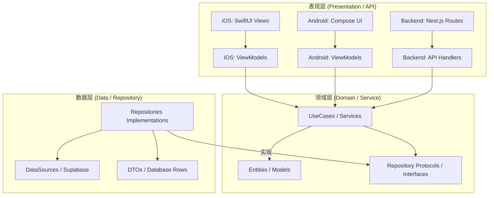
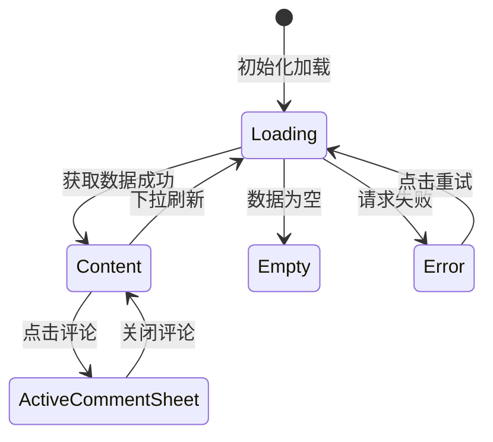
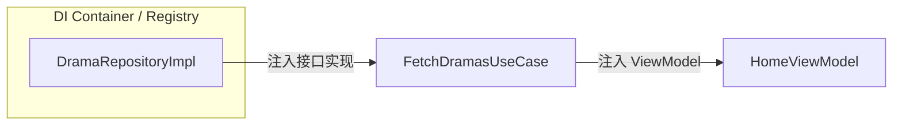
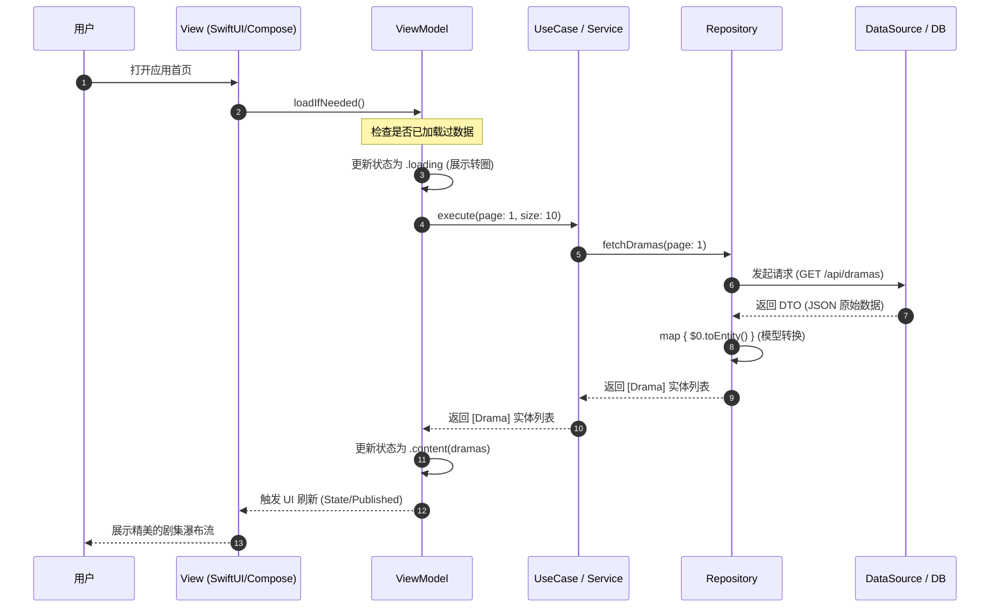

# Clean Architecture 实践

## 目录
1. [模块概览](#模块概览)
2. [引言](#引言)
3. [整体架构设计](#整体架构设计)
4. [领域层 (Domain Layer) 实践](#领域层-domain-layer-实践)
   - [实体 (Entities) 的纯粹性](#实体-entities-的纯粹性)
   - [用例 (UseCases) 的单一职责](#用例-usecases-的单一职责)
5. [数据层 (Data Layer) 实践](#数据层-data-layer-实践)
   - [Repository 模式与数据源抽象](#repository-模式与数据源抽象)
   - [DTO 与 Entity 的转换逻辑](#dto-与-entity-的转换逻辑)
6. [表现层 (Presentation Layer) 实践](#表现层-presentation-layer-实践)
   - [MVVM 模式在移动端的应用](#mvvm-模式在移动端的应用)
   - [后端 API 路由与 Service 交互](#后端-api-路由与-service-交互)
7. [依赖注入 (DI) 与解耦](#依赖注入-di-与解耦)
8. [跨端逻辑一致性分析](#跨端逻辑一致性分析)
9. [性能考量与最佳实践](#性能考量与最佳实践)
10. [核心交互时序图](#核心交互时序图)
11. [核心文件索引](#核心文件索引)

## 模块概览

ShortDrama 项目在 iOS、Android 和 Backend 三端深度实践了 Clean Architecture（整洁架构）原则。通过高度一致的分层设计，项目实现了业务逻辑与技术细节的彻底解耦，确保了跨平台逻辑的高度对齐。

- **涉及文件总数**: 约 550+ 个核心架构相关文件。
  - iOS 端: 200+ 个 Swift 文件，主要分布在 `Sources/Domain`, `Sources/Data`, `Sources/Features`。
  - Android 端: 200+ 个 Kotlin 文件，主要分布在 `domain`, `data`, `feature` 目录。
  - Backend 端: 150+ 个 TypeScript 文件，主要分布在 `services`, `repositories`, `app/api`。
- **覆盖子模块**:
  - `Domain/domain/services`: 包含核心业务逻辑（UseCases/Services）与实体定义（Entities/Models）。
  - `Data/data/repositories`: 包含数据获取实现（Repositories）、远程数据源（DataSources）与模型转换（DTOs）。
  - `Features/feature/app/api`: 包含 UI 驱动逻辑（ViewModels）、界面渲染（Views/UI）与后端接口入口（Routes）。
- **深度覆盖范围**: 本文档将深度解析剧集列表获取（Fetch Dramas）、签到逻辑（Check-in）以及剧集收藏（Booking）等核心链路在三端的具体实现，展示架构的统一性与灵活性。

## 引言

在跨平台移动应用开发中，维护逻辑一致性和代码可测试性是巨大的挑战。ShortDrama 项目通过引入 Clean Architecture，确保了无论是 iOS 端的 SwiftUI、Android 端的 Jetpack Compose，还是基于 Next.js 的后端服务，都遵循同一套“领域驱动”的设计哲学。

Clean Architecture 的核心在于**依赖规则 (Dependency Rule)**：依赖关系只能由外层向内层指向。内层（Domain）不感知外层（Data/Presentation）的存在。这种设计使得业务逻辑成为了应用中最稳定的部分，不受 UI 框架更换或数据库升级的影响。在 ShortDrama 中，这一原则被严格执行，使得三端在处理相同的业务逻辑时，代码结构呈现出惊人的相似性。

## 整体架构设计

ShortDrama 的架构分为三个主要层次，每一层都有明确的职责边界和严格的通信协议。



该架构图展示了典型的三层结构及其依赖流向。**表现层**（最外层）负责用户交互或接口协议，它依赖于领域层提供的业务接口。**领域层**（中心层）封装了纯粹的业务逻辑，它定义了数据访问的契约（Interface/Protocol），但不关心具体实现。**数据层**（实现层）负责持久化和外部通信，它实现了领域层定义的契约。

**架构设计要点**:
1. **单向依赖**: 所有的依赖都指向中心化的 Domain 层。这保证了即使 UI 或数据库发生剧变，核心业务逻辑依然保持不变。
2. **接口抽象**: Domain 层定义 Repository 协议，Data 层负责实现。通过依赖注入（DI），我们在运行时将具体的实现注入到 UseCase 中。
3. **模型隔离**: 每一层都有自己的数据模型。Data 层使用 DTO (Data Transfer Object) 处理网络序列化，Domain 层使用 Entity 处理业务逻辑，Presentation 层可能还会定义 UI Model 处理显示逻辑。这种隔离有效防止了外部变化（如 API 字段名变更）对全链路的污染。

## 领域层 (Domain Layer) 实践

领域层是 ShortDrama 的心脏，它包含 `Entities`（实体）和 `UseCases`（用例）。它是项目中最纯粹的部分，不包含任何与平台相关的框架代码。

### 实体 (Entities) 的纯粹性
实体是应用的核心数据模型。在 iOS 中，它们是简单的 `struct`；在 Android 中，是 `data class`；在后端，则是通过 `Zod` 定义的类型。实体通常包含业务校验逻辑，但不包含任何网络或数据库操作。

### 用例 (UseCases) 的单一职责
用例代表了用户可以执行的单一业务操作。在 ShortDrama 中，我们遵循“一个用例一个类”的原则，这极大地提高了代码的可读性和可维护性。

**代码示例 (iOS UseCase)**:
```swift
// ios/ShortDrama/Sources/Domain/UseCases/FetchDramasUseCase.swift
struct FetchDramasUseCase: Sendable {
    private let repository: DramaRepositoryProtocol

    init(repository: DramaRepositoryProtocol) {
        self.repository = repository
    }

    /// 执行获取剧集列表的操作
    func execute(page: Int, pageSize: Int) async throws -> [Drama] {
        // 可以在此处添加业务规则，例如：过滤已下架的剧集
        try await repository.fetchDramas(page: page, pageSize: pageSize)
    }
}
```

**代码示例 (Android UseCase)**:
```kotlin
// android/app/src/main/java/com/djs66256/short_drama/domain/usecase/GetDramasUseCase.kt
class GetDramasUseCase @Inject constructor(
    private val dramaRepository: DramaRepository,
) {
    /**
     * 执行获取剧集列表的操作
     * 使用 operator fun invoke 使得调用更加自然：getDramasUseCase(page)
     */
    suspend operator fun invoke(page: Int = 1, pageSize: Int = 10): ApiResult<List<Drama>> {
        return dramaRepository.getDramas(page, pageSize)
    }
}
```

通过对比可以看出，两端的 UseCase 逻辑几乎镜像对称。iOS 端使用了 Swift 的 `async/await` 协程，而 Android 端则结合了 Kotlin Coroutines 和 `ApiResult` 包装类。这种一致性使得跨端功能的对齐变得非常直观，开发者在阅读不同平台的代码时几乎没有障碍。

**领域层设计原则**:
- **单一职责**: 每个 UseCase 只负责一个具体的业务场景，避免成为“上帝类”。
- **无状态性**: UseCase 本身不持有业务状态，状态由 Data 层（缓存）或 Presentation 层（UI 状态）管理。
- **纯粹性**: 不允许引入 UIKit、Compose 或 Next.js 特定的库。这保证了 UseCase 可以在纯单元测试环境下快速运行。

## 数据层 (Data Layer) 实践

数据层负责屏蔽数据来源的复杂性。它实现了 Domain 层定义的 Repository 接口，并负责处理网络请求、本地缓存以及复杂的模型转换。

### Repository 模式与数据源抽象
Repository 充当了内存中实体集合与外部持久化存储之间的媒介。在 ShortDrama 中，Repository 通常组合了一个或多个 `DataSource`。例如，`DramaRepository` 可能会同时拥有 `RemoteDataSource`（用于 API 调用）和 `LocalDataSource`（用于缓存）。

### DTO 与 Entity 的转换逻辑
这是数据层最关键的职责之一。后端返回的 JSON 数据往往包含许多冗余字段，或者字段命名风格与客户端不一致。数据层通过 `map` 操作将这些 DTO 转换为干净的 Entity。

**代码示例 (iOS Repository 实现)**:
```swift
// ios/ShortDrama/Sources/Data/Repositories/DramaRepository.swift
struct DramaRepository: DramaRepositoryProtocol, Sendable {
    private let dataSource: DramaRemoteDataSource

    func fetchDramas(page: Int, pageSize: Int) async throws -> [Drama] {
        let dtos = try await dataSource.fetchDramas(page: page, pageSize: pageSize)
        // 执行 DTO -> Entity 的显式映射
        return dtos.map { $0.toEntity() } 
    }
}
```

**代码示例 (Backend Repository 实现)**:
```typescript
// backend/src/repositories/supabase/drama.supabase.repository.ts
export class DramaSupabaseRepository implements DramaRepositoryInterface {
  async findMany(params: PaginationParams): Promise<PaginatedResult<Drama>> {
    const { data, error, count } = await supabase
      .from('dramas')
      .select(DRAMA_SELECT_COLUMNS)
      .range(from, to);

    if (error) throw Errors.internal(`Failed to fetch dramas: ${error.message}`);

    // 将数据库行映射为标准的 Drama 实体
    return {
      data: (data ?? []).map(mapRowToDrama),
      pagination: { ... }
    };
  }
}
```

**数据层设计的深度考量**:
1. **错误处理**: 数据层负责将底层的网络错误（如 404, 500）或数据库错误转换为 Domain 层可理解的业务异常（如 `NotFoundError`, `InternalError`）。
2. **分页逻辑**: 统一在 Repository 中处理分页参数的计算（如 `offset = (page - 1) * pageSize`），Domain 层只需关注页码。
3. **数据一致性**: 在执行写操作（如 `bookDrama`）时，Repository 负责同步更新本地缓存和远程状态，确保 UI 看到的是最新的数据。

## 表现层 (Presentation Layer) 实践

表现层在移动端采用 MVVM 模式，在后端采用 Controller/Service 模式。它负责将领域层的数据转化为用户可见的形式。

### MVVM 模式在移动端的应用
ViewModel 持有 UI 状态（ViewState），并对用户交互做出响应。它通过调用 UseCases 来驱动业务逻辑，并根据结果更新状态。



ViewModel 的生命周期与 UI 绑定，但其逻辑完全独立于具体的视图渲染。在 Android 中，我们使用 `StateFlow` 来观察状态变化；在 iOS 中，使用 `@Published` 和 `ObservableObject`。

**代码示例 (Android ViewModel)**:
```kotlin
// android/app/src/main/java/com/djs66256/short_drama/feature/home/viewmodel/HomeViewModel.kt
@HiltViewModel
class HomeViewModel @Inject constructor(
    private val getDramasUseCase: GetDramasUseCase,
    private val getCheckInStatusUseCase: GetCheckInStatusUseCase
) : ViewModel() {
    private val _uiState = MutableStateFlow(HomeUiState())
    val uiState: StateFlow<HomeUiState> = _uiState.asStateFlow()

    fun loadDramas(isRetry: Boolean) {
        _uiState.update { it.copy(isLoading = true, isRetrying = isRetry) }
        viewModelScope.launch {
            val result = getDramasUseCase()
            _uiState.update { state ->
                when (result) {
                    is ApiResult.Success -> state.copy(items = result.data, isLoading = false)
                    is ApiResult.Error -> state.copy(errorMessage = result.message, isLoading = false)
                    else -> state.copy(isLoading = false)
                }
            }
        }
    }
}
```

### 后端 API 路由与 Service 交互
后端的表现层即为 Next.js 的 API 路由。它负责解析 HTTP 请求参数，调用 Service 层，并将结果序列化为 JSON。

**表现层核心职责**:
- **状态管理**: 将复杂的业务状态（如加载中、错误、数据列表）转换为简单的 UI 状态。
- **输入校验**: 验证用户输入（如搜索关键字长度）或请求参数（如页码范围）。
- **生命周期处理**: 管理异步任务的启动与取消，防止内存泄漏或无效的 UI 更新。

## 依赖注入 (DI) 与解耦

为了实现分层架构的灵活性，必须有一套机制来管理对象的创建和依赖关系的注入。这使得各层之间通过接口而非具体实现进行通信。

- **Android (Hilt)**: 深度集成 Google 官方的 Hilt 框架。通过 `@Inject` 标记构造函数，Hilt 会自动处理 Repository 到 UseCase，再到 ViewModel 的依赖注入。这极大简化了样板代码。
- **iOS (Manual DI)**: 项目目前主要采用构造器注入（Constructor Injection）的方式。在 `AppRoot` 或各模块的 `RouteBuilder` 中手动组装对象链路。虽然代码量稍多，但依赖关系极其透明，非常有利于调试和测试。
- **Backend (Registry)**: 使用单一的 `repository-registry.ts` 来管理 Repository 实例的获取。这种模式类似于“服务定位器”，允许我们在不同环境（如单元测试 vs 生产环境）下切换不同的实现类。

**依赖关系示例**:


通过 DI，我们可以轻松地在单元测试中使用 Mock 对象替换真实的 Repository，从而在不依赖网络的情况下测试 UseCase 和 ViewModel 的逻辑。这种高可测试性是 Clean Architecture 带来的核心红利之一。

## 跨端逻辑一致性分析

ShortDrama 最显著的特点是**三端同构的业务逻辑**。以下是获取剧集列表这一功能在三端的代码结构对比，展示了跨端模式的高度对齐：

| 维度 | iOS (Swift) | Android (Kotlin) | Backend (TS) |
| :--- | :--- | :--- | :--- |
| **表现层入口** | `HomeViewModel` | `HomeViewModel` | `api/dramas/route.ts` |
| **业务逻辑层** | `FetchDramasUseCase` | `GetDramasUseCase` | `DramaService` |
| **数据抽象接口** | `DramaRepositoryProtocol` | `DramaRepository` | `DramaRepositoryInterface` |
| **数据访问实现** | `DramaRepository` | `DramaRepositoryImpl` | `DramaSupabaseRepository` |
| **底层数据源** | `DramaRemoteDataSource` | `DramaRemoteDataSource` | `Supabase Client` |
| **模型转换方法** | `toEntity()` | `toDomain()` | `mapRowToDrama()` |

这种高度的一致性带来了显著的工程优势：
1. **知识迁移**: 开发者熟悉了一端的架构后，可以快速上手另外两端的开发。例如，Android 开发者可以很容易地在 iOS 代码库中找到对应的业务逻辑位置。
2. **逻辑对齐**: 当产品需求变更时（例如增加剧集分类过滤），业务规则的变更可以同步在三端进行设计，极大地减少了因理解偏差导致的跨端 Bug。
3. **测试复用**: 虽然测试代码不能跨端运行，但三端的测试用例（Test Cases）逻辑可以高度重合，确保了边界处理（如空列表、网络超时）的一致性。

## 性能考量与最佳实践

在实践 Clean Architecture 时，我们也针对性能和开发效率进行了优化：

1. **按需映射**: 尽管模型隔离很重要，但我们也避免了过度的映射。对于简单的结构，我们尽量保持 DTO 和 Entity 的相似性，以减少样板代码。
2. **分页与流式数据**: 在移动端，ViewModel 会维护分页状态，通过 UseCase 分批获取数据。后端 Repository 利用 Supabase 的 `.range()` 方法实现高效的数据库分页。
3. **DI 性能**: 在 Android 中，我们利用 Hilt 的 `@Singleton` 作用域确保 Repository 实例被复用，避免重复创建昂贵的网络客户端。在 iOS 中，我们通过懒加载（Lazy Initialization）优化启动速度。

## 核心交互时序图

以下展示了一个典型的“用户打开首页获取剧集列表”的完整请求生命周期。这个流程清晰地展示了数据如何在各层之间流转。



该序列图描绘了数据如何从最外层的用户操作流转到最内层的业务处理，再通过数据层获取结果并逐层返回。每一个环节都通过接口进行隔离，确保了各层可以独立演进。例如，如果后端将 API 迁移到 GraphQL，我们只需要修改 `DataSource` 和 `Repository` 的实现，而 `UseCase` 和 `ViewModel` 完全不需要改动。

## 核心文件索引

以下是实现 Clean Architecture 的关键文件路径，按层次划分，方便开发者快速定位：

### 领域层 (Domain Layer)
- [FetchDramasUseCase.swift](ios/ShortDrama/Sources/Domain/UseCases/FetchDramasUseCase.swift) - iOS 业务逻辑入口
- [GetDramasUseCase.kt](android/app/src/main/java/com/djs66256/short_drama/domain/usecase/GetDramasUseCase.kt) - Android 业务逻辑入口
- [drama.service.ts](backend/src/services/drama/drama.service.ts) - 后端业务逻辑封装
- [Drama.swift](ios/ShortDrama/Sources/Domain/Entities/Drama.swift) - iOS 核心实体定义
- [Drama.kt](android/app/src/main/java/com/djs66256/short_drama/domain/model/Drama.kt) - Android 核心实体定义

### 数据层 (Data Layer)
- [DramaRepository.swift](ios/ShortDrama/Sources/Data/Repositories/DramaRepository.swift) - iOS 数据层实现
- [DramaRepositoryImpl.kt](android/app/src/main/java/com/djs66256/short_drama/data/repository/DramaRepositoryImpl.kt) - Android 数据层实现
- [drama.supabase.repository.ts](backend/src/repositories/supabase/drama.supabase.repository.ts) - 后端数据访问实现
- [DramaDTO.swift](ios/ShortDrama/Sources/Data/DTOs/DramaDTO.swift) - iOS 数据传输对象与转换逻辑
- [DramaDto.kt](android/app/src/main/java/com/djs66256/short_drama/data/dto/DramaDto.kt) - Android 数据传输对象与转换逻辑

### 表现层 (Presentation Layer)
- [HomeViewModel.swift](ios/ShortDrama/Sources/Features/Home/ViewModels/HomeViewModel.swift) - iOS 首页状态管理与 UI 驱动
- [HomeViewModel.kt](android/app/src/main/java/com/djs66256/short_drama/feature/home/viewmodel/HomeViewModel.kt) - Android 首页状态管理与 UI 驱动
- [route.ts](backend/src/app/api/dramas/route.ts) - 后端 API 路由入口

**Section sources**:
- [FetchDramasUseCase.swift](ios/ShortDrama/Sources/Domain/UseCases/FetchDramasUseCase.swift)
- [GetDramasUseCase.kt](android/app/src/main/java/com/djs66256/short_drama/domain/usecase/GetDramasUseCase.kt)
- [drama.service.ts](backend/src/services/drama/drama.service.ts)
- [DramaRepository.swift](ios/ShortDrama/Sources/Data/Repositories/DramaRepository.swift)
- [DramaRepositoryImpl.kt](android/app/src/main/java/com/djs66256/short_drama/data/repository/DramaRepositoryImpl.kt)
- [drama.supabase.repository.ts](backend/src/repositories/supabase/drama.supabase.repository.ts)
- [HomeViewModel.swift](ios/ShortDrama/Sources/Features/Home/ViewModels/HomeViewModel.swift)
- [HomeViewModel.kt](android/app/src/main/java/com/djs66256/short_drama/feature/home/viewmodel/HomeViewModel.kt)
