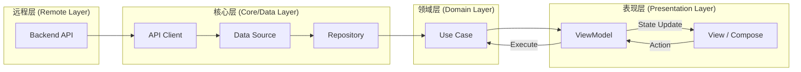
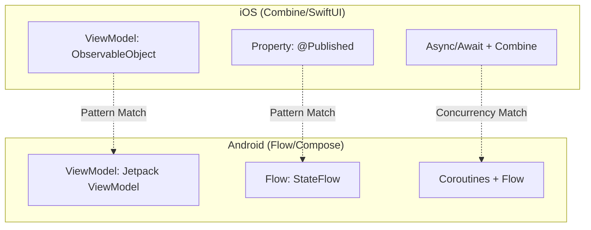
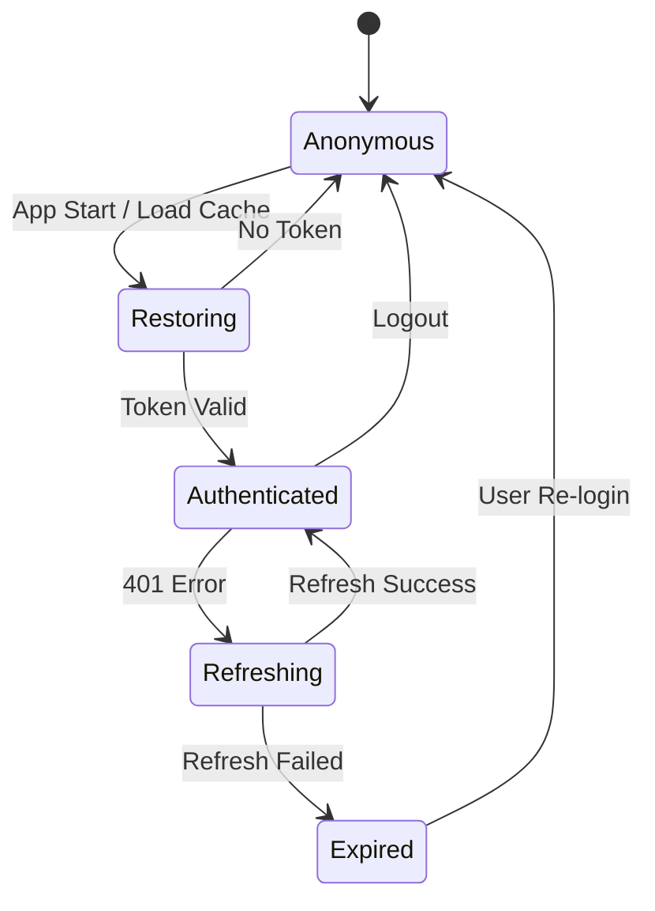

# 数据流与状态管理

## 目录
1. [模块概览](#模块概览)
2. [引言](#引言)
3. [架构概览](#架构概览)
   - [数据流向模型](#数据流向模型)
   - [跨平台实现对比](#跨平台实现对比)
4. [响应式编程模型](#响应式编程模型)
   - [iOS: Combine 与 ObservableObject](#ios-combine-与-observableobject)
   - [Android: Kotlin Flow 与 StateFlow](#android-kotlin-flow-与-stateflow)
5. [全局状态管理 (Global State)](#全局状态管理-global-state)
   - [认证状态 (Auth State)](#认证状态-auth-state)
   - [配置与全局属性](#配置与全局属性)
6. [页面级状态管理 (UI State)](#页面级状态管理-ui-state)
   - [ViewModel 的职责](#viewmodel-的职责)
   - [标准状态处理 (Loading/Success/Error)](#标准状态处理-loadingsuccesserror)
7. [核心组件实现](#核心组件实现)
   - [数据源层 (Network & Data Sources)](#数据源层-network--data-sources)
   - [业务逻辑层 (Repositories & UseCases)](#业务逻辑层-repositories--usecases)
8. [数据缓存与持久化策略](#数据缓存与持久化策略)
   - [凭据存储 (Keychain/DataStore)](#凭据存储-keychaindatastore)
   - [业务数据缓存](#业务数据缓存)
9. [错误处理与恢复机制](#错误处理与恢复机制)
   - [统一错误模型](#统一错误模型)
   - [重试与降级逻辑](#重试与降级逻辑)
10. [测试与调试建议](#测试与调试建议)
11. [文件参考](#文件参考)

## 模块概览

本模块涵盖了 ShortDrama 应用中所有关于数据流动、状态分发以及响应式驱动的实现逻辑。通过对 iOS 和 Android 双端代码的深度扫描，我们识别出以下核心指标：

*   **涉及文件总数**：约 450+ 个源文件（包含 iOS Swift 文件和 Android Kotlin 文件）。
*   **核心子模块**：
    *   `Core/Network` (iOS) & `core/network` (Android)：数据请求的起点，负责协议封装与原始响应处理。
    *   `Data/Repositories` (iOS) & `data/repository` (Android)：数据转换与缓存中心。
    *   `Domain/UseCases` (iOS) & `domain/usecase` (Android)：业务逻辑的最小执行单元。
    *   `Features/*/ViewModels`：页面状态的持有者与驱动中心。
    *   `Features/Auth`：全局登录态的管理中心。

本章节将重点深入解析 `Auth` (认证)、`Home` (主页业务) 以及 `Network` (网络层) 的实现，作为理解全案状态管理的典型范例。

## 引言

在现代移动应用开发中，**数据流 (Data Flow)** 和 **状态管理 (State Management)** 是构建高可用、易维护系统的基石。ShortDrama 应用采用了经典的 **单向数据流 (Unidirectional Data Flow, UDF)** 架构，结合 Clean Architecture 原则，确保了业务逻辑与 UI 渲染的彻底解耦。

数据流管理的核心目标是解决以下挑战：
1.  **一致性**：如何确保同一份数据（如用户头像）在不同页面同步更新？
2.  **可预测性**：状态的每一次变更是否都有迹可循？
3.  **响应式**：当底层数据变化时，UI 如何高效、自动地刷新？
4.  **跨平台对齐**：iOS 的 Combine 模式与 Android 的 Flow 模式如何在逻辑上保持镜像一致？

通过本章节的学习，开发者将掌握数据从后端 API 触发，经过层层过滤与转换，最终驱动 SwiftUI 或 Jetpack Compose 视图显示的完整路径。

## 架构概览

ShortDrama 的架构设计遵循严格的分层模式。每一层都有明确的职责边界，数据通过预定义的接口在层间流动。

### 数据流向模型

下图展示了从 API 请求到 UI 渲染的典型数据流向。这是一个典型的“请求-响应-订阅”闭环。



在上述流程中，`API Client` 负责底层的 HTTP 通信，`Repository` 负责将后端返回的 DTO (Data Transfer Object) 转换为 UI 友好的 Entity，`UseCase` 封装具体的业务规则，而 `ViewModel` 则将这些业务结果包装成可供 UI 观察的 `State`。

### 跨平台实现对比

虽然 iOS 和 Android 使用了不同的语言和框架，但在架构思想上保持了高度同步。



这种镜像化的设计极大降低了跨端开发的认知成本。无论是在 iOS 端还是 Android 端，开发者都能找到对应的概念和组件。

**架构设计说明**：
- **解耦性**：`View` 不直接感知 `Repository`，所有交互必须经过 `ViewModel`。
- **单一事实来源 (SSOT)**：全局状态（如 Auth）由专门的 Store/Holder 持有，业务页面通过依赖注入或观察者模式获取。
- **类型安全**：利用 Swift 的强类型和 Kotlin 的密封类 (Sealed Class)，在编译期拦截非法状态转换。

## 响应式编程模型

响应式编程是 ShortDrama 状态驱动的核心。它允许我们以声明式的方式处理异步数据流。

### iOS: Combine 与 ObservableObject

在 iOS 端，我们主要利用 `Combine` 框架提供的发布者-订阅者模型，结合 `ObservableObject` 协议来驱动 SwiftUI。

> 💡 **核心机制**：当标记为 `@Published` 的属性发生变化时，`objectWillChange` 发布者会自动发出通知，触发布署了该对象的 SwiftUI 视图重新计算 `body`。

```swift
// ios/ShortDrama/Sources/Features/Home/ViewModels/HomeViewModel.swift
@MainActor
final class HomeViewModel: ObservableObject {
    // 使用 @Published 自动驱动 UI 刷新
    @Published private(set) var viewState: ViewState = .loading
    
    // 异步加载数据
    func loadDramas() async {
        do {
            let dramas = try await fetchDramasUseCase.execute(page: 1, pageSize: 10)
            // 状态变更会自动通知订阅者
            viewState = dramas.isEmpty ? .empty : .content(dramas)
        } catch {
            viewState = .error("加载失败")
        }
    }
}
```

在 iOS 端，异步操作主要通过 `async/await` 完成，而状态的对外分发则依靠 `Combine`。这种组合既保证了代码的可读性，又保留了响应式系统的灵活性。

### Android: Kotlin Flow 与 StateFlow

Android 端则采用了 Kotlin 协程生态中的 `Flow` 和 `StateFlow`。相比 Combine，`StateFlow` 具有天然的“粘性”，非常适合表示 UI 状态。

> 💡 **核心机制**：`StateFlow` 始终持有一个当前值，并且每当新值被推送到流中时，它都会向所有活跃的收集者 (Collectors) 发出通知。

```kotlin
// android/app/src/main/java/com/djs66256/short_drama/feature/home/viewmodel/HomeViewModel.kt
@HiltViewModel
class HomeViewModel @Inject constructor(...) : ViewModel() {
    // 私有 MutableStateFlow 用于内部更新
    private val _uiState = MutableStateFlow(HomeUiState())
    // 公开只读 StateFlow 供 UI 订阅
    val uiState: StateFlow<HomeUiState> = _uiState.asStateFlow()

    fun loadDramas() {
        viewModelScope.launch {
            _uiState.update { it.copy(isLoading = true) }
            val result = getDramasUseCase(page = 1, pageSize = 10)
            _uiState.update { state ->
                when (result) {
                    is ApiResult.Success -> state.copy(isLoading = false, items = result.data)
                    is ApiResult.Error -> state.copy(isLoading = false, errorMessage = result.message)
                    // ...
                }
            }
        }
    }
}
```

**对比总结**：
- **iOS**：更倾向于多属性分散观察（多个 `@Published`），利用 SwiftUI 的自动刷新机制。
- **Android**：更倾向于单一状态对象（Single State Object），通过 `copy` 方法进行局部更新，符合 MVI (Model-View-Intent) 的思想。

## 全局状态管理 (Global State)

全局状态是指那些跨越多个页面、影响整个应用行为的数据。在 ShortDrama 中，最典型的全局状态是**认证状态 (Auth State)**。

### 认证状态 (Auth State)

认证状态决定了用户是否可以访问付费内容、发表评论或查看个人资产。

#### iOS 实现：AuthStore

iOS 使用 `AuthStore` 作为全局单例（通过 `@StateObject` 或环境对象注入）。



`AuthStore` 不仅持有状态，还封装了复杂的恢复逻辑：

```swift
// ios/ShortDrama/Sources/Features/Auth/AuthStore.swift
func restoreIfNeeded() async {
    guard !hasAttemptedRestore else { return }
    hasAttemptedRestore = true

    do {
        guard let session = try sessionStore.load() else {
            applyAnonymousState()
            return
        }
        // 尝试使用缓存的 Token 获取用户信息以验证有效性
        let user = try await getCurrentUserUseCase.execute(accessToken: session.accessToken)
        applyAuthenticatedState(session)
    } catch {
        // 处理 Token 过期或网络错误
        await refreshStoredSession(session)
    }
}
```

#### Android 实现：AuthStateHolder

Android 端使用 `AuthStateHolder`，它被注入到 `AuthInterceptor` 中，用于自动为所有网络请求添加 Authorization 头。

```kotlin
// android/app/src/main/java/com/djs66256/short_drama/core/auth/AuthStateHolder.kt
@Singleton
class AuthStateHolder @Inject constructor(
    private val authSessionStore: AuthSessionStore,
) : AuthSessionProvider {
    private val _authStatus = MutableStateFlow<AuthStatus>(AuthStatus.Anonymous)
    val authStatus: StateFlow<AuthStatus> = _authStatus.asStateFlow()

    // 提供给拦截器的同步方法
    override fun currentSession(): AuthSession? = currentSessionSnapshot
}
```

### 配置与全局属性

除了 Auth，应用还存在 `ConfigStore` 等组件，负责管理全局配置（如 API 基地址、功能开关、CDN 加速域名等）。这些配置通常在应用启动时的 `Bootstrapper` 阶段完成加载。

## 页面级状态管理 (UI State)

页面级状态管理关注特定业务场景下的数据展示与交互逻辑。

### ViewModel 的职责

ViewModel 在 ShortDrama 中扮演着“状态工厂”的角色：
1.  **聚合数据**：从多个 UseCase 获取原始数据。
2.  **格式化**：将日期、金额等转换为人类可读的字符串。
3.  **状态流转**：处理 Loading -> Success -> Error 的状态切换。
4.  **交互反馈**：处理按钮点击、下拉刷新等用户意图。

### 标准状态处理 (Loading/Success/Error)

为了统一用户体验，ShortDrama 定义了标准的状态处理模式。

**Android 端的密封类模式**：
```kotlin
// android/app/src/main/java/com/djs66256/short_drama/feature/home/viewmodel/HomeUiState.kt
data class HomeUiState(
    val isLoading: Boolean = true,
    val items: List<Drama> = emptyList(),
    val errorMessage: String? = null,
    // ... 其他 UI 细节状态，如弹窗是否显示
)
```

**iOS 端的枚举模式**：
```swift
// ios/ShortDrama/Sources/Features/Home/ViewModels/HomeViewModel.swift
enum ViewState: Equatable {
    case loading
    case content([Drama])
    case empty
    case error(String)
}
```

这种设计确保了 UI 层可以根据状态类型，渲染不同的视图组件（如 `LoadingView`、`ErrorView` 或 `EmptyView`）。

## 核心组件实现

### 数据源层 (Network & Data Sources)

数据流的起点是网络层。iOS 的 `APIClient` 使用 `URLSession` 的 `async` 扩展，而 Android 则使用 `Retrofit` + `Kotlin Serialization`。

**iOS APIClient 示例**：
```swift
// ios/ShortDrama/Sources/Core/Network/APIClient.swift
func request<T: Decodable>(_ endpoint: some APIEndpoint) async throws -> T {
    // 构建 URLRequest -> 发送 -> 解析 JSON
    let (data, response) = try await session.data(for: request)
    // 根据 HTTP 状态码抛出 APIError
    guard let httpResponse = response as? HTTPURLResponse, 200...299 ~= httpResponse.statusCode else {
        throw APIError.server(...)
    }
    return try decoder.decode(T.self, from: data)
}
```

### 业务逻辑层 (Repositories & UseCases)

Repository 层是数据流的关键转折点，它负责将网络模型映射为领域模型。

**Android Repository 示例**：
```kotlin
// android/app/src/main/java/com/djs66256/short_drama/data/repository/DramaRepositoryImpl.kt
override suspend fun getDramas(page: Int, pageSize: Int): ApiResult<List<Drama>> {
    return when (val result = remoteDataSource.getDramas(page, pageSize)) {
        is ApiResult.Success -> {
            // DTO -> Domain Entity 转换
            val domainDramas = result.data.data.map(DramaDto::toDomain)
            ApiResult.Success(domainDramas)
        }
        // ... 错误透传
    }
}
```

## 数据缓存与持久化策略

为了优化用户体验，ShortDrama 在多个层级实施了缓存策略。

### 凭据存储 (Keychain/DataStore)

*   **iOS**：使用 `Keychain` 存储 `AuthSession`，确保用户凭据在卸载重装前保持安全。
*   **Android**：使用 `EncryptedSharedPreferences` 或 `DataStore` 存储加密后的 Session 信息。

### 业务数据缓存

1.  **内存缓存**：Repository 层持有单例对象，对于配置类数据（如 `TheaterChannel`）进行内存驻留。
2.  **磁盘缓存**：
    *   **搜索历史**：存储在 `UserDefaults` (iOS) 或 `Room/DataStore` (Android) 中。
    *   **播放进度**：通过专门的 `PlayerRepository` 同步到服务器，本地仅保留最近播放的少量记录。

## 错误处理与恢复机制

### 统一错误模型

应用定义了跨端对齐的错误体系：
- **Network Error**：网络不通、超时。
- **Server Error**：500 等服务器崩溃。
- **Business Error**：业务逻辑冲突（如余额不足、剧集已下架）。
- **Auth Error**：Token 过期、未登录。

### 重试与降级逻辑

在 `HomeViewModel` 中，我们可以看到典型的重试逻辑实现：

```swift
// ios/ShortDrama/Sources/Features/Home/ViewModels/HomeViewModel.swift
func retry() async {
    await performLoad(isRetry: true)
}

private func performLoad(isRetry: Bool) async {
    // 设置 isRetrying 状态，UI 可以显示局部 Loading
    if isRetry { isRetrying = true } 
    // ... 执行加载逻辑
}
```

对于非核心业务（如签到弹窗），如果请求失败，系统会采取**静默失败**策略，不干扰用户观看剧集的主流程。

## 测试与调试建议

1.  **状态追踪**：在 Android 端，可以使用 `Flow.onEach { log(it) }` 观察状态演变；在 iOS 端，利用 `Combine` 的 `handleEvents` 操作符。
2.  **Mock 数据流**：在单元测试中，通过注入 Mock 的 Repository，模拟各种 `ApiResult`（Success/Error/Exception），验证 ViewModel 的状态转换是否符合预期。
3.  **并发测试**：特别注意多个请求同时发起时的状态竞争问题（Race Condition），ShortDrama 通过 `requestInFlight` 标志位有效规避了重复请求。

## 文件参考

**核心状态管理文件**：
- [ios/ShortDrama/Sources/Features/Auth/AuthStore.swift](ios/ShortDrama/Sources/Features/Auth/AuthStore.swift) (iOS 全局认证)
- [android/app/src/main/java/com/djs66256/short_drama/core/auth/AuthStateHolder.kt](android/app/src/main/java/com/djs66256/short_drama/core/auth/AuthStateHolder.kt) (Android 全局认证)
- [ios/ShortDrama/Sources/Features/Home/ViewModels/HomeViewModel.swift](ios/ShortDrama/Sources/Features/Home/ViewModels/HomeViewModel.swift) (iOS 业务状态)
- [android/app/src/main/java/com/djs66256/short_drama/feature/home/viewmodel/HomeViewModel.kt](android/app/src/main/java/com/djs66256/short_drama/feature/home/viewmodel/HomeViewModel.kt) (Android 业务状态)

**数据流支撑文件**：
- [ios/ShortDrama/Sources/Core/Network/APIClient.swift](ios/ShortDrama/Sources/Core/Network/APIClient.swift) (iOS 网络起点)
- [android/app/src/main/java/com/djs66256/short_drama/core/network/ApiService.kt](android/app/src/main/java/com/djs66256/short_drama/core/network/ApiService.kt) (Android 网络起点)
- [ios/ShortDrama/Sources/Data/Repositories/DramaRepository.swift](ios/ShortDrama/Sources/Data/Repositories/DramaRepository.swift) (iOS 数据仓库)
- [android/app/src/main/java/com/djs66256/short_drama/data/repository/DramaRepositoryImpl.kt](android/app/src/main/java/com/djs66256/short_drama/data/repository/DramaRepositoryImpl.kt) (Android 数据仓库)
- [android/app/src/main/java/com/djs66256/short_drama/core/network/ApiResult.kt](android/app/src/main/java/com/djs66256/short_drama/core/network/ApiResult.kt) (Android 响应封装)
