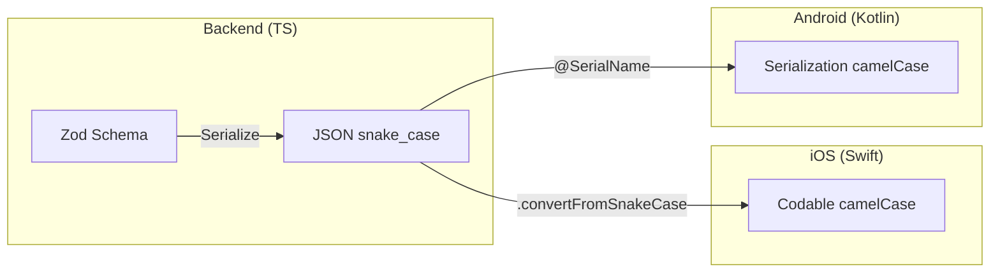
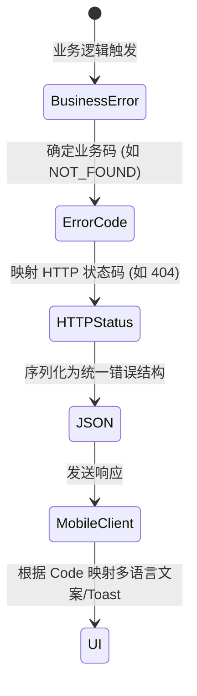
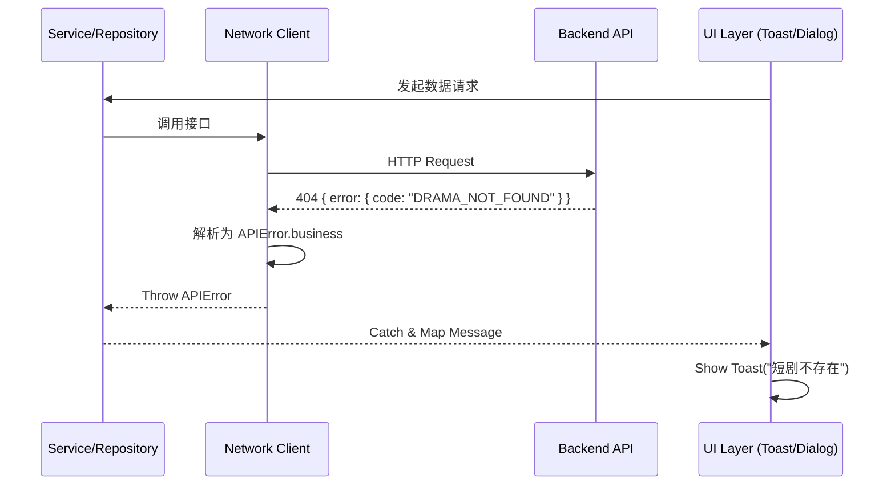
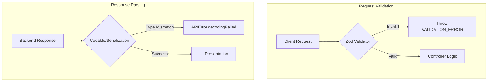

# 统一模型与错误处理规范

## 目录
1. [模块概览](#模块概览)
2. [引言](#引言)
3. [统一 DTO 设计规范](#统一-dto-设计规范)
   - [后端：Zod 模式定义](#后端zod-模式定义)
   - [iOS：Codable 与自动转换](#ioscodable-与自动转换)
   - [Android：Kotlin Serialization 与显式映射](#androidkotlin-serialization-与显式映射)
4. [全局错误码体系](#全局错误码体系)
   - [业务错误码定义](#业务错误码定义)
   - [HTTP 状态码映射](#http-状态码映射)
   - [错误响应结构](#错误响应结构)
5. [异常捕获与传递链路](#异常捕获与传递链路)
   - [后端异常抛出](#后端异常抛出)
   - [移动端拦截与解析](#移动端拦截与解析)
   - [UI 层反馈机制](#ui-层反馈机制)
6. [数据校验机制](#数据校验机制)
   - [后端输入校验](#后端输入校验)
   - [移动端类型安全](#移动端类型安全)
7. [核心组件](#核心组件)
8. [文件引用](#文件引用)

## 模块概览

在 ShortDrama 项目中，数据契约（Data Contract）与异常处理机制是连接后端服务与移动端应用（iOS/Android）的核心桥梁。本模块通过统一的模型定义和标准化的错误处理流程，确保了跨平台开发的一致性，降低了前后端联调的成本。

**统计信息**：
- **涉及文件总数**：约 50+ 个
- **后端核心文件**：`lib/types.ts`, `lib/errors.ts`, `lib/schemas.ts`
- **iOS 核心文件**：`Sources/Data/DTOs/`, `Sources/Core/Network/APIError.swift`
- **Android 核心文件**：`data/dto/`, `data/dto/ErrorDto.kt`

**覆盖范围**：
本规范涵盖了从后端数据库模型到 API 响应，再到移动端 DTO（Data Transfer Object）转换及最终 UI 错误展示的全链路。

## 引言

在复杂的分布式系统或跨平台移动应用开发中，最常见的痛点之一就是**数据结构不一致**和**错误处理混乱**。如果后端修改了一个字段名，而移动端没有同步更新，就会导致解析失败；如果后端返回的错误码在移动端没有对应的处理逻辑，用户可能会看到冰冷的“未知错误”。

ShortDrama 通过以下手段解决这些问题：
1. **强类型契约**：使用 TypeScript (Zod) 和 Swift/Kotlin 的类型系统强制约束数据结构。
2. **命名空间同步**：虽然各平台有不同的命名习惯，但通过自动化工具或框架特性（如 `convertFromSnakeCase`）实现无缝映射。
3. **分层错误模型**：将底层网络错误、HTTP 协议错误与业务逻辑错误进行解耦。

## 统一 DTO 设计规范

ShortDrama 采用 JSON 作为数据交换格式。为了兼顾各平台的开发习惯，我们规定：**JSON 字段统一使用 `snake_case`（蛇形命名法），而在移动端代码中统一使用 `camelCase`（驼峰命名法）**。

### 后端：Zod 模式定义
后端使用 `zod` 库定义 API 的输入输出 Schema。这不仅用于运行时校验，还作为类型生成的源头。

```typescript
// backend/src/lib/schemas.ts
export const DramaSchema = z.object({
  id: z.string().uuid(),
  title: z.string().min(1),
  cover_url: z.string().url().nullable().default(null), // snake_case
  episode_count: z.number().int().min(0),
  created_at: z.string(),
});
```

### iOS：Codable 与自动转换
iOS 端利用 Swift 的 `Codable` 协议进行解析。在 `APIClient` 中配置了 `keyDecodingStrategy = .convertFromSnakeCase`，因此 `DramaDTO` 可以直接定义为 `camelCase`。

```swift
// ios/ShortDrama/Sources/Data/DTOs/DramaDTO.swift
struct DramaDTO: Codable {
    let id: String
    let title: String
    let coverUrl: String? // 自动对应 cover_url
    let episodeCount: Int // 自动对应 episode_count
}
```

### Android：Kotlin Serialization 与显式映射
Android 端使用 `kotlinx.serialization`。由于 Kotlin 的策略相对严格，我们使用 `@SerialName` 注解进行显式映射。

```kotlin
// android/app/src/main/java/com/djs66256/short_drama/data/dto/DramaDto.kt
@Serializable
data class DramaDto(
    val id: String,
    val title: String,
    @SerialName("cover_url")
    val coverUrl: String? = null,
    @SerialName("episode_count")
    val episodeCount: Int
)
```

下图展示了数据在三端之间的流动和映射关系：



该流程通过后端定义 `snake_case` 的契约，利用各平台的转换机制，使得开发者在编写业务逻辑时始终能使用符合本语言习惯的 `camelCase` 变量名。

**Section sources**:
- [backend/src/lib/schemas.ts](backend/src/lib/schemas.ts)
- [ios/ShortDrama/Sources/Data/DTOs/DramaDTO.swift](ios/ShortDrama/Sources/Data/DTOs/DramaDTO.swift)
- [android/app/src/main/java/com/djs66256/short_drama/data/dto/DramaDto.kt](android/app/src/main/java/com/djs66256/short_drama/data/dto/DramaDto.kt)
- [ios/ShortDrama/Sources/Core/Network/APIClient.swift](ios/ShortDrama/Sources/Core/Network/APIClient.swift)

## 全局错误码体系

为了提供精准的用户反馈，ShortDrama 建立了一套完整的业务错误码体系。

### 业务错误码定义
错误码在后端 `lib/errors.ts` 中通过 `ErrorCode` 枚举集中管理。

| 错误码 (ErrorCode) | HTTP 状态码 | 含义 |
| :--- | :--- | :--- |
| `UNAUTHORIZED` | 401 | 未登录或 Token 失效 |
| `FORBIDDEN` | 403 | 无权限访问该资源 |
| `VALIDATION_ERROR` | 400 | 输入参数校验失败 |
| `DRAMA_NOT_FOUND` | 404 | 指定的短剧不存在 |
| `AUTH_CODE_EXPIRED`| 410 | 验证码已过期 |
| `INTERNAL_ERROR` | 500 | 服务器内部错误 |

### 错误响应结构
当发生业务错误时，后端返回统一的错误 JSON：

```json
{
  "error": {
    "code": "DRAMA_NOT_FOUND",
    "message": "指定的短剧 (uuid) 不存在"
  }
}
```

这种嵌套结构使得移动端可以轻松区分业务错误和其他系统级错误。

下面的状态图展示了错误码在系统中的映射逻辑：



错误码的设计遵循“业务语义优先”原则。例如，虽然 `DRAMA_NOT_FOUND` 和 `COMMENT_NOT_FOUND` 最终都映射到 HTTP 404，但在移动端可以根据不同的业务码弹出更有针对性的提示，甚至触发不同的重试逻辑。

**Section sources**:
- [backend/src/lib/errors.ts](backend/src/lib/errors.ts)
- [ios/ShortDrama/Sources/Core/Network/APIError.swift](ios/ShortDrama/Sources/Core/Network/APIError.swift)
- [android/app/src/main/java/com/djs66256/short_drama/data/dto/ErrorDto.kt](android/app/src/main/java/com/djs66256/short_drama/data/dto/ErrorDto.kt)

## 异常捕获与传递链路

异常处理不仅仅是打印日志，更是一条从服务端到用户界面的完整传递链路。

### 后端异常抛出
后端使用自定义的 `AppError` 类来封装错误。通过 `Errors` 工厂对象，可以快速创建带有语义的错误实例。

```typescript
// backend/src/lib/errors.ts
export class AppError extends Error {
  constructor(public readonly code: ErrorCode, message: string, public readonly details?: unknown) {
    super(message);
    this.statusCode = ErrorStatusCode[code];
  }
}

// 使用示例
if (!drama) throw Errors.dramaNotFound(id);
```

### 移动端拦截与解析
在 iOS 端，`APIClient` 负责拦截 HTTP 状态码并尝试解析业务错误 JSON。如果解析成功，则抛出 `APIError.business`；否则抛出通用的 `APIError.server` 或 `APIError.network`。

```swift
// ios/ShortDrama/Sources/Core/Network/APIClient.swift
switch httpResponse.statusCode {
case 200...299:
    return try decoder.decode(T.self, from: data)
default:
    if let errorResponse = try? decoder.decode(ErrorResponse.self, from: data) {
        throw APIError.business(
            statusCode: httpResponse.statusCode,
            businessCode: errorResponse.code ?? "",
            message: errorResponse.message
        )
    }
    throw APIError.server(code: httpResponse.statusCode, message: "请求失败")
}
```

### UI 层反馈机制
在 UI 层（如 SwiftUI View 或 Android Fragment），通过捕获 `APIError` 并访问其 `errorDescription` 或 `businessCode` 来决定展示内容。



整个链路保证了错误信息的“不丢失”和“可追溯”。后端提供的 `message` 通常包含具体的调试信息（如 ID），而移动端可以根据 `code` 决定是直接展示后端消息，还是展示预定义的本地化文案。

**Section sources**:
- [backend/src/lib/errors.ts](backend/src/lib/errors.ts)
- [ios/ShortDrama/Sources/Core/Network/APIClient.swift](ios/ShortDrama/Sources/Core/Network/APIClient.swift)
- [ios/ShortDrama/Sources/Core/Network/APIError.swift](ios/ShortDrama/Sources/Core/Network/APIError.swift)

## 数据校验机制

数据校验是保证系统健壮性的第一道防线。我们采取“后端严格校验，前端类型安全”的策略。

### 后端输入校验
后端利用 Zod 强大的校验能力，在请求进入 Controller 之前就拦截非法数据。

```typescript
// backend/src/lib/schemas.ts
export const SearchDramaQuerySchema = z.object({
  q: z.string().trim().min(1).max(50), // 搜索关键词不能为空且不能超过50字符
  page: z.coerce.number().int().min(1).default(1),
  pageSize: z.coerce.number().int().min(1).max(100).default(10),
});
```

如果校验失败，后端会抛出 `VALIDATION_ERROR` (400)，并将 Zod 产生的详细错误信息放入 `details` 字段中返回。

### 移动端类型安全
移动端不直接进行复杂的逻辑校验（除非涉及 UI 交互），而是通过 DTO 层的强类型定义来保证数据合法性。例如，如果后端返回的 `rating` 应该是 `Double` 但实际返回了字符串，解析层会直接抛出 `decodingFailed` 错误，防止非法数据进入业务逻辑。



这种分层校验机制确保了：
1. **安全性**：恶意或错误的请求在边缘层就被拦截。
2. **健壮性**：移动端不会因为不可预见的 JSON 结构变化而产生 NullPointerException 或崩溃。

**Section sources**:
- [backend/src/lib/schemas.ts](backend/src/lib/schemas.ts)
- [ios/ShortDrama/Sources/Core/Network/APIClient.swift](ios/ShortDrama/Sources/Core/Network/APIClient.swift)

## 核心组件

以下是实现统一模型与错误处理规范的关键组件：

| 组件名称 | 平台 | 职责 |
| :--- | :--- | :--- |
| `ErrorCode` | 后端 | 集中定义项目中所有的业务错误标识符。 |
| `AppError` | 后端 | 基础异常类，支持携带状态码、业务码和详细上下文。 |
| `Zod Schemas` | 后端 | 定义数据契约的单一事实来源（Single Source of Truth）。 |
| `APIClient` | iOS | 封装网络请求，处理 `convertFromSnakeCase` 转换和错误拦截。 |
| `APIError` | iOS | 统一的错误枚举，区分网络、解析和业务错误。 |
| `DramaDto` | Android | 采用 `kotlinx.serialization` 实现的跨平台数据模型。 |

## 文件引用

本规范涉及的核心代码文件如下：

- [backend/src/lib/types.ts](backend/src/lib/types.ts): 后端通用类型定义。
- [backend/src/lib/errors.ts](backend/src/lib/errors.ts): 错误码定义与异常处理工具。
- [backend/src/lib/schemas.ts](backend/src/lib/schemas.ts): Zod 数据契约定义总纲。
- [ios/ShortDrama/Sources/Data/DTOs/DramaDTO.swift](ios/ShortDrama/Sources/Data/DTOs/DramaDTO.swift): iOS 短剧数据传输对象。
- [android/app/src/main/java/com/djs66256/short_drama/data/dto/DramaDto.kt](android/app/src/main/java/com/djs66256/short_drama/data/dto/DramaDto.kt): Android 短剧数据传输对象。
- [ios/ShortDrama/Sources/Core/Network/APIClient.swift](ios/ShortDrama/Sources/Core/Network/APIClient.swift): iOS 网络客户端与解码逻辑。
- [ios/ShortDrama/Sources/Core/Network/APIError.swift](ios/ShortDrama/Sources/Core/Network/APIError.swift): iOS 统一错误模型。
- [android/app/src/main/java/com/djs66256/short_drama/data/dto/ErrorDto.kt](android/app/src/main/java/com/djs66256/short_drama/data/dto/ErrorDto.kt): Android 错误响应模型。
