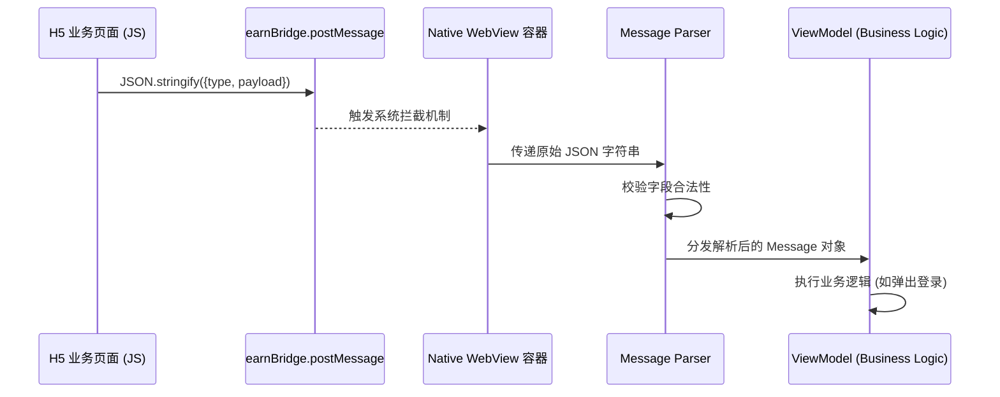
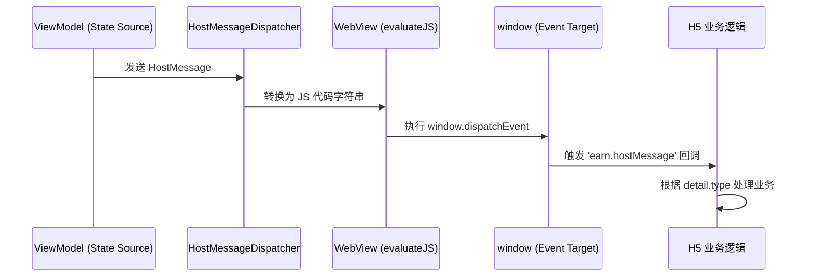
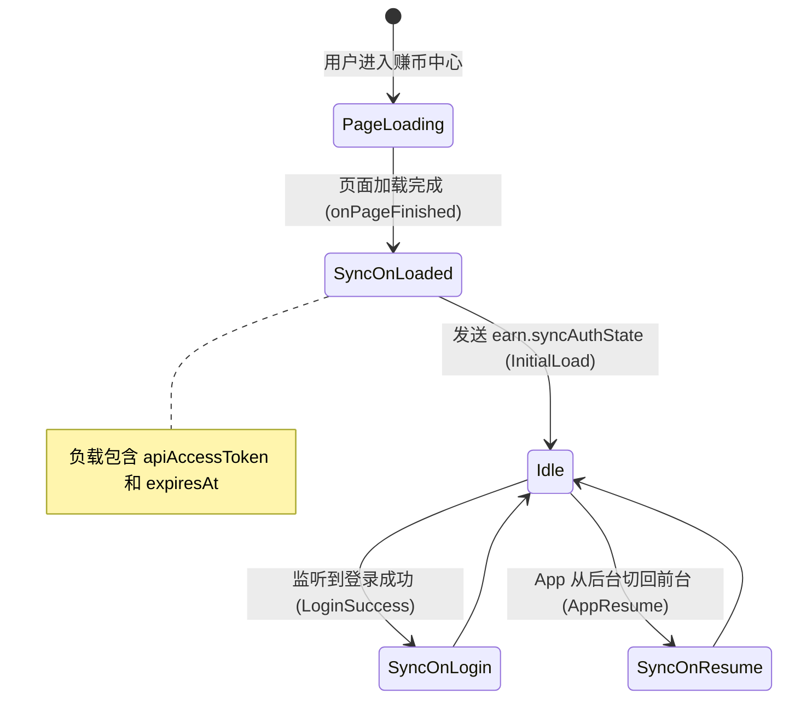
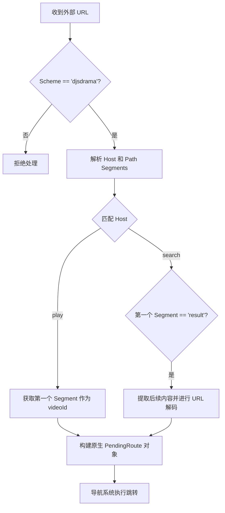
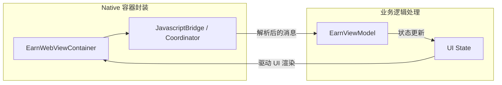

# 跨端通信与 JSBridge 协议

## 目录
1. [模块概览](#模块概览)
2. [JSBridge 通信协议深度解析](#jsbridge-通信协议深度解析)
   - [消息格式规范与设计哲学](#消息格式规范与设计哲学)
   - [H5 调用 Native (Bridge Request) 的底层实现](#h5-调用-native-bridge-request-的底层实现)
   - [Native 通知 H5 (Host Event) 的分发机制](#native-通知-h5-host-event-的分发机制)
3. [核心业务交互流程](#核心业务交互流程)
   - [身份认证同步 (Auth Sync) 生命周期](#身份认证同步-auth-sync-生命周期)
   - [任务播放器 (Task Player) 链路闭环](#任务播放器-task-player-链路闭环)
   - [页面上下文恢复 (Context Restoration)](#页面上下文恢复-context-restoration)
4. [Deeplink 路由协议全解](#deeplink-路由协议全解)
   - [Schema 规范与 Host 分发](#schema-规范与-host-分发)
   - [复杂路径解析与参数提取](#复杂路径解析与参数提取)
   - [跨平台路由映射的一致性保证](#跨平台路由映射的一致性保证)
5. [跨端通信架构设计与组件协作](#跨端通信架构设计与组件协作)
   - [MVVM 架构下的消息流转](#mvvm-架构下的消息流转)
   - [容器化封装与注入策略](#容器化封装与注入策略)
6. [高级特性与性能优化](#高级特性与性能优化)
   - [消息序列化与反序列化优化](#消息序列化与反序列化优化)
   - [WebView 预加载与缓存策略](#webview-预加载与缓存策略)
7. [安全性与稳定性保障](#安全性与稳定性保障)
   - [域名白名单与接口鉴权](#域名白名单与接口鉴权)
   - [异常拦截与降级处理](#异常拦截与降级处理)
8. [集成指南与示例代码](#集成指南与示例代码)
   - [H5 端 SDK 封装建议](#h5-端-sdk-封装建议)
   - [Native 端扩展新指令流程](#native-端扩展新指令流程)
9. [核心组件索引](#核心组件索引)
10. [文件引用与源代码映射](#文件引用与源代码映射)

## 模块概览

跨端通信模块是 ShortDrama 架构中的核心枢纽，负责连接原生应用（iOS/Android）与 H5 业务模块（如赚币中心、积分商城）。该模块的设计目标是提供一套**标准化、高可靠、低延迟**的双向通信机制，确保 Web 环境能够无缝调用原生的播放控制、身份认证、支付及路由能力。

### 统计信息
- **涉及文件总数**: 约 23 个核心文件，涵盖了从底层模型定义到高层 UI 容器的完整链路。
- **iOS 核心模块**: `Features/Earn` 目录下包含 8 个核心文件，主要涉及 Swift 实现的桥接逻辑和 SwiftUI 容器。
- **Android 核心模块**: `feature/earn` 目录下包含 13 个核心文件，采用 Kotlin 协程和 Jetpack Compose 构建。
- **全局路由**: 包含 iOS 的 `DeeplinkHandler.swift` 和 Android 的 `DeeplinkRouteParser.kt`，负责处理 `djsdrama://` 协议。

### 覆盖范围
本章节将深入探讨以下子模块及其交互细节：
- **通信模型 (Models)**: 详述 `EarnBridgeMessage` 和 `EarnHostMessage` 的结构化定义，这是通信的语言。
- **容器实现 (UI/Views)**: 分析 `EarnWebView` (iOS) 和 `EarnWebViewContainer` (Android) 如何实现 JS 接口注入与消息拦截。
- **逻辑控制 (ViewModels)**: 剖析 `EarnContainerViewModel` 及其 Android 对应类如何处理业务状态机，实现登录态同步和任务回调。
- **路由分发 (Navigation/Deeplink)**: 解释统一的 URL Schema 如何在不同平台间保持解析逻辑的一致性。

通过本章节的学习，开发者不仅能掌握现有的通信指令，还能理解其背后的设计哲学，从而在业务扩展时能够优雅地增加新的跨端能力。

## JSBridge 通信协议深度解析

JSBridge 是 H5 页面与 Native 应用交互的“翻译官”。ShortDrama 并没有采用复杂的第三方框架，而是基于系统原生的 Web 容器特性，构建了一套轻量级且类型安全的通信协议。

### 消息格式规范与设计哲学

所有的跨端消息都遵循统一的 JSON 结构，这在设计上参考了 JSON-RPC 的理念，但进行了简化以适应移动端的高频交互。

- **type**: 字符串类型，采用 `namespace.action` 的命名规范。例如 `earn.requestLogin` 表示赚币模块的登录请求。这种命名空间的设计有效避免了不同业务模块间的指令冲突。
- **payload**: 强类型对象，包含该指令所需的具体业务参数。在 Native 端，这些参数会被解析为对应的 `Context` 或 `Result` 模型。

这种结构化设计的核心优势在于**可扩展性**。当需要支持新的业务功能时，只需在 `type` 枚举中增加新项，并定义相应的 `payload` 结构即可，无需修改底层的通信管道。

### H5 调用 Native (Bridge Request) 的底层实现

当 H5 页面需要调用原生能力（如请求登录）时，它会通过 Native 注入的全局对象 `earnBridge` 发送消息。



在 **iOS** 端，我们利用 `WKUserContentController` 注入名为 `earnBridge` 的 Script Message Handler。每当 JS 调用 `window.webkit.messageHandlers.earnBridge.postMessage` 时，Native 的 `userContentController(_:didReceive:)` 方法就会被触发。

在 **Android** 端，我们使用 `@JavascriptInterface` 注解。通过 `addJavascriptInterface` 将一个 Java 对象注入到 JS 环境中。为了保持跨平台一致性，Android 端也封装了一个 `postMessage` 方法，接收 JSON 字符串并进行解析。

**代码对比 (iOS vs Android 解析逻辑)**:
```swift
// iOS: EarnBridgeMessage.swift
init?(body: Any) {
    guard let dictionary = body as? [String: Any],
          let type = dictionary["type"] as? String,
          let payload = dictionary["payload"] as? [String: Any] else { return nil }
    // 根据 type 映射到 Swift Enum
}
```
```kotlin
// Android: EarnWebViewContainer.kt
private fun String?.toEarnBridgeMessage(): EarnBridgeMessage {
    val root = JSONObject(this)
    val type = root.optString("type")
    // 根据 type 映射到 Kotlin Sealed Interface
}
```

### Native 通知 H5 (Host Event) 的分发机制

Native 向 H5 发送通知（如同步登录态）时，采用的是“事件订阅”模型。Native 在 WebView 中执行一段 JS 代码，触发一个自定义事件，H5 页面通过监听该事件来获取数据。



这种方案相比于直接调用 JS 全局函数，具有更好的**解耦性**。H5 页面可以在任何时候开始监听事件，而不需要担心全局函数是否已定义。同时，`CustomEvent` 的 `detail` 属性可以携带复杂的 JSON 对象，方便数据传递。

**Section sources**:
- [EarnBridgeMessage.swift](ios/ShortDrama/Sources/Features/Earn/Models/EarnBridgeMessage.swift)
- [EarnBridgeMessage.kt](android/app/src/main/java/com/djs66256/short_drama/feature/earn/model/EarnBridgeMessage.kt)
- [EarnWebView.swift](ios/ShortDrama/Sources/Features/Earn/Views/Components/EarnWebView.swift)
- [EarnWebViewContainer.kt](android/app/src/main/java/com/djs66256/short_drama/feature/earn/ui/EarnWebViewContainer.kt)

## 核心业务交互流程

跨端通信的复杂性往往体现在业务流程的闭环管理上。ShortDrama 针对赚币业务的特殊性，设计了几套核心交互流程。

### 身份认证同步 (Auth Sync) 生命周期

登录态的一致性是赚币业务的基石。如果 H5 端的 Token 与 Native 不一致，会导致用户完成任务后无法正常领取奖励。



Native 端会在以下三个关键节点主动发起同步：
1. **页面首次加载成功**: 确保 H5 初始化时即拥有最新的身份令牌。
2. **原生登录流程结束**: 当 H5 唤起原生登录并成功返回后，立即更新 H5 的登录态，实现无缝切换。
3. **App 唤醒**: 考虑到 Token 可能在后台过期，或者用户在其他设备修改了密码，App 回到前台时会自动触发一次同步。

### 任务播放器 (Task Player) 链路闭环

赚币中心的核心功能是“看视频赚金币”。这涉及到 H5 唤起原生播放器，并在播放完成后通知 H5 更新 UI。

1. **发起请求**: H5 调用 `earn.openTaskPlayer`，携带任务 ID (`taskId`) 和目标视频 ID (`videoId`)。
2. **状态挂起**: Native 侧 `ViewModel` 记录当前的 `pendingTaskContext`，并导航至原生播放器。
3. **任务执行**: 用户在原生播放器中完成观看。
4. **结果反馈**: 播放器关闭后，Native 根据播放结果（是否达标、观看时长等）构建 `EarnTaskPlayerResult`。
5. **消息回传**: Native 发送 `earn.completeTask` 事件给 H5。H5 接收后，刷新任务列表状态，显示“领取成功”或相关动效。

### 页面上下文恢复 (Context Restoration)

当用户从 H5 跳转到原生页面（如登录、播放器）再返回时，WebView 可能会因为系统内存压力被销毁或重载。为了提供平滑的体验，Native 实现了 `earn.restoreContext` 机制。

该消息会告知 H5 返回的原因（`login-return` 或 `task-return`）以及是否需要恢复滚动位置（`preserveScroll`）。H5 接收到此指令后，可以执行特定的恢复逻辑，如重新请求局部数据或定位到之前的滚动坐标。

**Diagram sources**:
- [EarnContainerViewModel.swift:L101-L124](ios/ShortDrama/Sources/Features/Earn/ViewModels/EarnContainerViewModel.swift#L101-L124)
- [EarnViewModel.kt:L163-L192](android/app/src/main/java/com/djs66256/short_drama/feature/earn/viewmodel/EarnViewModel.kt#L163-L192)

## Deeplink 路由协议全解

Deeplink 是一种通过 URL 直接唤起应用内特定页面的技术。ShortDrama 采用了统一的 Schema 方案，确保了外部投放（如广告、短信）与内部跳转逻辑的一致性。

### Schema 规范与 Host 分发

ShortDrama 的标准 Schema 为 `djsdrama://`。URL 的 `host` 部分决定了跳转的顶层模块，而 `path` 部分则携带具体的资源 ID 或参数。

| 模块 (Host) | URL 示例 | 业务含义 |
| :--- | :--- | :--- |
| `open` | `djsdrama://open` | 唤起应用并进入首页 |
| `play` | `djsdrama://play/12345` | 直接进入 ID 为 12345 的视频播放页 |
| `drama` | `djsdrama://drama/678` | 进入短剧《...》的详情介绍页 |
| `search` | `djsdrama://search/result/悬疑` | 执行“悬疑”关键词搜索并展示结果 |
| `ranking` | `djsdrama://ranking` | 进入全站排行榜页面 |

### 复杂路径解析与参数提取

为了保证解析的鲁棒性，Native 端的解析器实现了严格的过滤与解码逻辑。



在解析过程中，特别注意了以下几点：
- **百分号编码**: 搜索关键词等参数经过了 URL 编码，解析器会使用 `URLDecoder` (Android) 或 `removingPercentEncoding` (iOS) 进行还原。
- **容错处理**: 如果 Path 为空或格式错误，解析器会降级跳转到对应模块的首页，而不是直接报错。

### 跨平台路由映射的一致性保证

虽然 iOS 使用 `AppRoute` 枚举，Android 使用 `PendingRoute` 密封类，但两者的解析逻辑在 `DeeplinkHandler.swift` 和 `DeeplinkRouteParser.kt` 中保持了高度同步。这种“双端对齐”的策略极大地方便了运营团队，他们只需生成一条链接即可同时覆盖 iOS 和 Android 用户。

**Section sources**:
- [DeeplinkHandler.swift](ios/ShortDrama/Sources/App/DeeplinkHandler.swift)
- [DeeplinkRouteParser.kt](android/app/src/main/java/com/djs66256/short_drama/navigation/DeeplinkRouteParser.kt)

## 跨端通信架构设计与组件协作

ShortDrama 的跨端架构遵循了**关注点分离**的原则，将通信细节封装在底层，而将业务逻辑暴露在 `ViewModel` 中。

### MVVM 架构下的消息流转

在 Native 端，WebView 容器并不直接处理业务逻辑。它只负责将收到的 Bridge 消息透传给 `ViewModel`。

1. **View 层 (WebView)**: 负责 JS 注入、消息拦截、JS 代码执行。它通过回调接口将原始消息传递出去。
2. **ViewModel 层**: 负责解析消息含义，维护业务状态（如 `pendingLoginContext`），并根据需要触发 `Effect`（如弹出登录弹窗）。
3. **Repository/Service 层**: 提供底层数据支持，如 `AuthSessionProvider` 提供当前的登录 Token。

这种架构确保了即使更换了 WebView 组件（如从 `WKWebView` 切换到其他第三方容器），业务逻辑代码也无需改动。

### 容器化封装与注入策略

为了提高代码复用性，我们将 WebView 封装为 `EarnWebView` (iOS) 和 `EarnWebViewContainer` (Android) 组件。

- **iOS 注入**: 在 `makeUIView` 时通过 `WKWebViewConfiguration` 注入脚本。使用 `Coordinator` 作为桥接中转站，处理 `WKScriptMessageHandler` 回调。
- **Android 注入**: 在 `AndroidView` 的 `factory` 中调用 `addJavascriptInterface`。为了防止内存泄漏，在 `onRelease` 时显式调用 `removeJavascriptInterface`。



## 安全性与稳定性保障

跨端通信是应用安全的最前线。如果不加限制，恶意网页可能会通过 Bridge 调用敏感的原生能力。

### 域名白名单与接口鉴权

Native 容器在加载 URL 之前会进行域名校验。只有来自官方域名（如 `*.djsdrama.com`）的页面才会被注入 `earnBridge` 接口。此外，敏感操作（如支付、获取用户信息）在 Native 端还会进行二次校验，确保当前用户的登录态合法。

### 异常拦截与降级处理

- **解析异常**: 如果 H5 发送的 JSON 格式错误，Native 解析器会捕获异常并记录日志，而不会导致应用崩溃。
- **加载失败**: 当 WebView 加载失败（如网络断开）时，容器会显示原生的错误页面（`EarnContainerStateView`），并提供“点击重试”功能，避免用户卡在空白页。
- **版本兼容**: Native 端在处理指令时，会检查指令版本。如果 H5 调用了旧版 Native 不支持的新指令，Native 会返回一个 `unsupported` 的错误提示，引导用户升级 App。

## 集成指南与示例代码

### H5 端 SDK 封装建议

为了降低业务开发者的使用门槛，建议在 H5 端封装一个轻量级的 SDK。

```javascript
const ShortDramaBridge = {
    // 调用原生方法
    post: (type, payload = {}) => {
        const message = JSON.stringify({ type, payload });
        if (window.webkit && window.webkit.messageHandlers && window.webkit.messageHandlers.earnBridge) {
            window.webkit.messageHandlers.earnBridge.postMessage(message);
        } else if (window.earnBridge && window.earnBridge.postMessage) {
            window.earnBridge.postMessage(message);
        }
    },
    
    // 监听原生事件
    on: (type, callback) => {
        window.addEventListener('earn.hostMessage', (event) => {
            if (event.detail.type === type) {
                callback(event.detail.payload);
            }
        });
    }
};

// 使用示例
ShortDramaBridge.on('earn.syncAuthState', (data) => {
    console.log('收到 Token:', data.apiAccessToken);
});
```

### Native 端扩展新指令流程

如果需要增加一个新的指令（例如 `earn.showToast`）：
1. **定义模型**: 在 `EarnBridgeMessage.swift/kt` 的枚举中增加 `showToast` 分支。
2. **解析逻辑**: 在 `init(body:)` 或解析函数中增加对新 `type` 的解析。
3. **ViewModel 处理**: 在 `handleBridgeMessage` 中增加对应的业务逻辑处理。
4. **UI 响应**: 如果涉及 UI 展示，通过 `Effect` 或 `Published` 属性通知 View 层。

## 核心组件索引

| 组件名称 | 平台 | 路径 | 职责 |
| :--- | :--- | :--- | :--- |
| `EarnBridgeMessage` | iOS | `ios/ShortDrama/Sources/Features/Earn/Models/EarnBridgeMessage.swift` | H5 -> Native 消息模型 |
| `EarnHostMessage` | iOS | `ios/ShortDrama/Sources/Features/Earn/Models/EarnHostMessage.swift` | Native -> H5 消息模型 |
| `EarnWebView` | iOS | `ios/ShortDrama/Sources/Features/Earn/Views/Components/EarnWebView.swift` | WKWebView 容器封装 |
| `EarnBridgeMessage` | Android | `android/.../feature/earn/model/EarnBridgeMessage.kt` | Android 侧消息模型 |
| `EarnWebViewContainer` | Android | `android/.../feature/earn/ui/EarnWebViewContainer.kt` | Compose WebView 容器 |
| `DeeplinkHandler` | iOS | `ios/ShortDrama/Sources/App/DeeplinkHandler.swift` | iOS 路由解析中心 |
| `DeeplinkRouteParser` | Android | `android/.../navigation/DeeplinkRouteParser.kt` | Android 路由解析中心 |

## 文件引用与源代码映射

**跨端协议定义**:
- [EarnBridgeMessage.swift](ios/ShortDrama/Sources/Features/Earn/Models/EarnBridgeMessage.swift)
- [EarnHostMessage.swift](ios/ShortDrama/Sources/Features/Earn/Models/EarnHostMessage.swift)
- [EarnBridgeMessage.kt](android/app/src/main/java/com/djs66256/short_drama/feature/earn/model/EarnBridgeMessage.kt)
- [EarnHostMessage.kt](android/app/src/main/java/com/djs66256/short_drama/feature/earn/model/EarnHostMessage.kt)

**容器与桥接实现**:
- [EarnWebView.swift](ios/ShortDrama/Sources/Features/Earn/Views/Components/EarnWebView.swift)
- [EarnWebViewContainer.kt](android/app/src/main/java/com/djs66256/short_drama/feature/earn/ui/EarnWebViewContainer.kt)

**业务逻辑控制**:
- [EarnContainerViewModel.swift](ios/ShortDrama/Sources/Features/Earn/ViewModels/EarnContainerViewModel.swift)
- [EarnViewModel.kt](android/app/src/main/java/com/djs66256/short_drama/feature/earn/viewmodel/EarnViewModel.kt)

**全局路由系统**:
- [DeeplinkHandler.swift](ios/ShortDrama/Sources/App/DeeplinkHandler.swift)
- [DeeplinkRouteParser.kt](android/app/src/main/java/com/djs66256/short_drama/navigation/DeeplinkRouteParser.kt)
