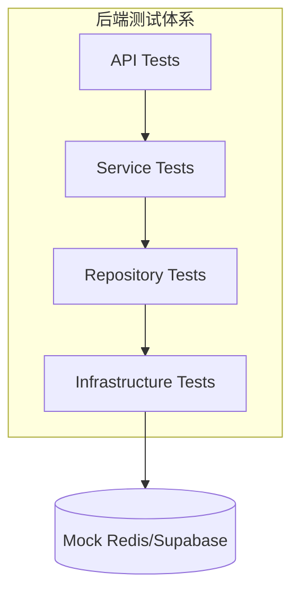
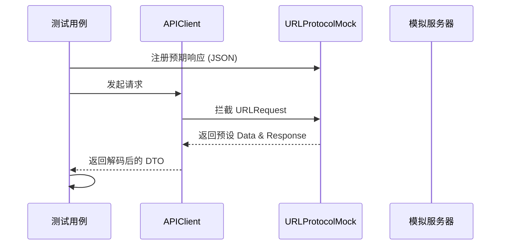
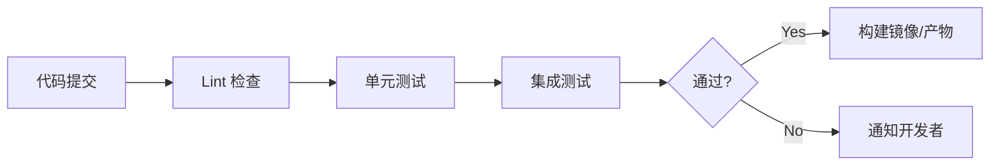
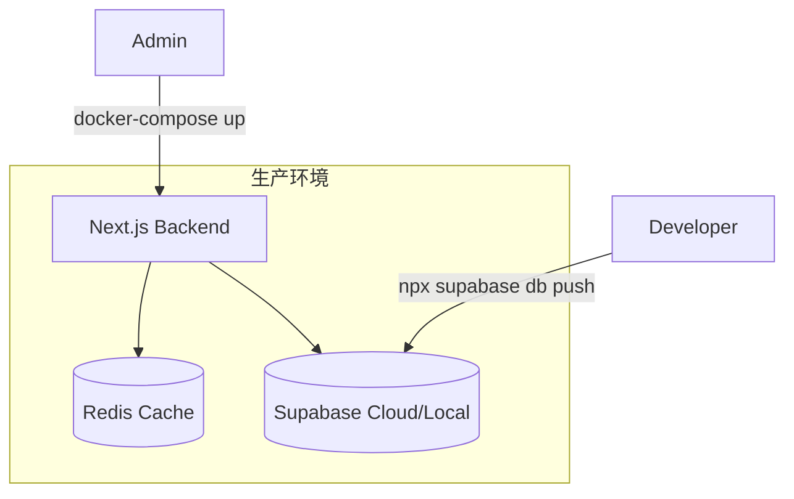
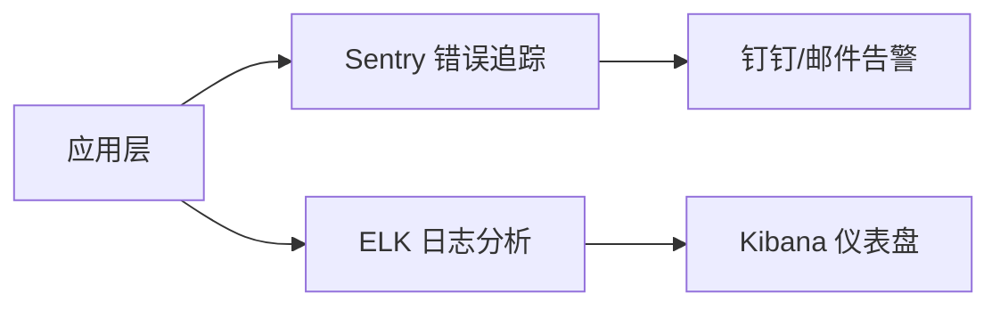

# 测试、部署与运维指南

## 目录
1. [模块概览](#模块概览)
2. [测试策略与实施](#测试策略与实施)
   - [后端：Vitest 单元与集成测试](#后端vitest-单元与集成测试)
   - [iOS：Swift Testing 框架实践](#iosswift-testing-框架实践)
   - [Android：JUnit 与反射验证](#androidjunit-与反射验证)
3. [持续集成 (CI) 流水线](#持续集成-ci-流水线)
4. [部署方案与数据库运维](#部署方案与数据库运维)
   - [Docker 容器化部署](#docker-容器化部署)
   - [Supabase 数据库迁移](#supabase-数据库迁移)
5. [监控与日志系统](#监控与日志系统)
6. [核心组件分析](#核心组件分析)
7. [文件参考](#文件参考)

## 模块概览

本模块涵盖了项目的质量保障（QA）、持续集成（CI）、自动化部署（CD）以及生产环境的运维（Ops）规范。通过多层级的测试体系和标准化的部署流程，确保代码从开发环境到生产环境的平滑过渡。

### 范围与规模
- **后端测试**：约 50 个测试文件，主要位于 `backend/src/**/__tests__/`，采用 Vitest 框架。
- **iOS 测试**：约 50 个测试文件，位于 `ios/ShortDrama/Tests/`，采用最新的 Swift Testing 框架。
- **Android 测试**：约 65 个测试文件，位于 `android/app/src/test/`，采用 JUnit 5 进行业务逻辑验证。
- **部署配置**：包含 `backend/docker-compose.yml` 及 `backend/supabase/migrations/` 下的 10+ 个数据库迁移脚本。

### 核心子模块
- **API 验证层**：各端均有针对 API 契约的自动化验证，确保前后端协议一致性。
- **数据库运维层**：通过 Supabase CLI 管理结构化数据的演进。
- **基础设施层**：基于 Docker 的容器化配置，提供一致的运行环境。

## 测试策略与实施

项目的测试体系遵循“测试金字塔”原则，侧重于高效率的单元测试和关键路径的集成测试。

### 后端：Vitest 单元与集成测试

后端采用 Vitest 作为核心测试引擎，主要针对 API 路由、业务服务（Services）和基础设施适配器（Infrastructure）进行验证。



**测试架构说明**：
后端测试通过 `vitest.config.ts` 进行全局配置，支持别名解析和 Node.js 环境模拟。测试用例广泛覆盖了从身份验证（Auth）、剧集管理（Dramas）到用户资产（Earn/Mall）的完整业务流。每个 API 路由均配有对应的 `.test.ts` 文件，模拟 Next.js 的 `NextRequest` 和 `NextResponse` 进行闭环验证。

**关键代码示例**：
以下是 `backend/src/app/api/__tests__/dramas.test.ts` 中的一个典型集成测试，展示了如何验证 API 返回的契约格式。

```typescript
// backend/src/app/api/__tests__/dramas.test.ts
import { NextRequest } from 'next/server';
import { GET } from '../route';

describe('Dramas API', () => {
  it('should return a list of dramas with pagination', async () => {
    const req = new NextRequest('http://localhost/api/dramas?page=1&pageSize=10');
    const res = await GET(req);
    const body = await res.json();

    expect(res.status).toBe(200);
    expect(body.data).toBeInstanceOf(Array);
    expect(body.pagination).toBeDefined();
    expect(body.pagination.page).toBe(1);
  });
});
```

### iOS：Swift Testing 框架实践

iOS 客户端弃用了传统的 XCTest，全面拥抱 Swift Testing 框架。通过 `URLProtocolMock` 拦截网络请求，实现对 `APIClient` 和 `Repository` 层的无网络依赖测试。



**流程说明**：
在 iOS 测试中，`APIClientTests.swift` 利用 `URLProtocol` 机制在传输层进行拦截。测试用例首先在 `URLProtocolMock` 中注入预期的 JSON 字符串，然后调用真实的 `APIClient` 方法。这种方式既测试了业务逻辑，也验证了 Swift `Codable` 模型的转换正确性。

### Android：JUnit 与反射验证

Android 端除了常规的 ViewModel 和 Repository 测试外，还引入了基于反射的 API 契约验证，确保 Retrofit 定义的接口与后端规范完全对齐。

```kotlin
// android/app/src/test/java/com/djs66256/short_drama/core/network/ApiServiceTest.kt
@Test
fun `T-06 getDramas uses canonical page and pageSize query names`() {
    val method = ApiService::class.java.declaredMethods.single { it.name == "getDramas" }
    val pageQuery = method.parameterAnnotations[0].filterIsInstance<Query>().single()
    val pageSizeQuery = method.parameterAnnotations[1].filterIsInstance<Query>().single()

    assertEquals("page", pageQuery.value)
    assertEquals("pageSize", pageSizeQuery.value)
}
```

**逻辑分析**：
这种测试方法非常独特，它不运行网络请求，而是通过检查代码注解（Annotations）来预防开发过程中的拼写错误或参数名变更。这在大型团队协作中能有效避免因前后端参数名不一致导致的线上故障。

## 持续集成 (CI) 流水线

虽然项目根目录目前未直接包含 `.github/workflows` 文件夹，但根据项目规划，CI 流水线应包含以下关键阶段：



**流水线详情**：
1.  **代码规范检查 (Lint)**：运行 `npm run lint` (后端) 和 `./gradlew detekt` (Android)，确保代码风格统一。
2.  **自动化测试**：并行运行各端的测试套件。后端执行 `vitest run`，Android 执行 `./gradlew test`，iOS 执行 `xcodebuild test`。
3.  **构建验证**：尝试进行生产环境构建，确保没有因类型错误或资源缺失导致的编译失败。

## 部署方案与数据库运维

项目采用容器化部署方案，并结合 Supabase 的迁移工具进行数据库版本管理。

### Docker 容器化部署

后端服务及中间件（如 Redis）通过 Docker 进行编排。`backend/docker-compose.yml` 定义了基础架构的拓扑结构。



**部署架构说明**：
- **Next.js 服务**：作为核心 API 提供方，打包为 Docker 镜像后部署在云端。
- **Redis**：用于缓存高频访问的剧集数据和用户 Session，提升响应速度。
- **Supabase**：作为主数据库，提供 PostgreSQL 存储、身份验证及文件存储服务。

### Supabase 数据库迁移

数据库的变更通过 `backend/supabase/migrations/` 下的 SQL 脚本进行严格控制。这种“迁移驱动”的开发模式确保了所有开发者的本地数据库结构与生产环境完全同步。

**常用命令清单**：
- `npx supabase start`：启动本地开发环境。
- `npx supabase migration new <name>`：创建新的迁移脚本。
- `npx supabase db reset`：重置本地数据库并重新执行所有迁移。
- `npx supabase db push`：将本地变更推送到远程生产环境。

## 监控与日志系统

为了保障线上稳定性，项目集成了多维度的监控方案。

**监控架构图**：


**详细说明**：
- **Sentry 集成**：通过在 `error-handler.ts` 中捕获未处理异常并上报 Sentry，实现对线上崩溃的实时感知。
- **ELK (Elasticsearch, Logstash, Kibana)**：后端 `logger.ts` 输出的标准 JSON 日志将被 Logstash 收集并存入 Elasticsearch，通过 Kibana 进行流量分析和故障排查。
- **健康检查**：API 路由中设有 `/api/health` 接口，配合 Docker 的 `healthcheck` 机制，实现容器的自动重启和负载均衡剔除。

## 核心组件分析

### 1. 后端测试配置
`backend/vitest.config.ts` 定义了测试运行时的环境，确保 `@/` 路径别名能正确映射到 `src` 目录。

### 2. 数据库初始脚本
`backend/supabase/migrations/00000000000001_init_tables.sql` 是整个系统的基石，定义了用户、剧集、剧集、评论等核心表结构及其 RLS（行级安全）策略。

### 3. iOS 网络 Mock 工具
`ios/ShortDrama/Tests/Helpers/URLProtocolMock.swift` 提供了一个轻量级的网络拦截器，使得 UI 测试和 ViewModel 测试可以在不联网的情况下稳定运行。

## 文件参考

本章节涉及的关键文件如下：

**后端相关**：
- [vitest.config.ts](backend/vitest.config.ts) - 后端测试全局配置
- [package.json](backend/package.json) - 测试脚本与依赖定义
- [docker-compose.yml](backend/docker-compose.yml) - 容器化编排文件
- [supabase/migrations/](backend/supabase/migrations/) - 数据库迁移脚本目录
- [src/middleware/error-handler.ts](backend/src/middleware/error-handler.ts) - 异常处理与监控埋点处

**iOS 相关**：
- [ShortDrama/Tests/DataTests/APIClientTests.swift](ios/ShortDrama/Tests/DataTests/APIClientTests.swift) - API 契约验证示例
- [ShortDrama/Tests/Helpers/URLProtocolMock.swift](ios/ShortDrama/Tests/Helpers/URLProtocolMock.swift) - 网络 Mock 工具

**Android 相关**：
- [app/src/test/java/com/djs66256/short_drama/core/network/ApiServiceTest.kt](android/app/src/test/java/com/djs66256/short_drama/core/network/ApiServiceTest.kt) - 反射驱动的 API 验证
- [.detekt/detekt.yml](android/.detekt/detekt.yml) - Android 静态代码检查配置
