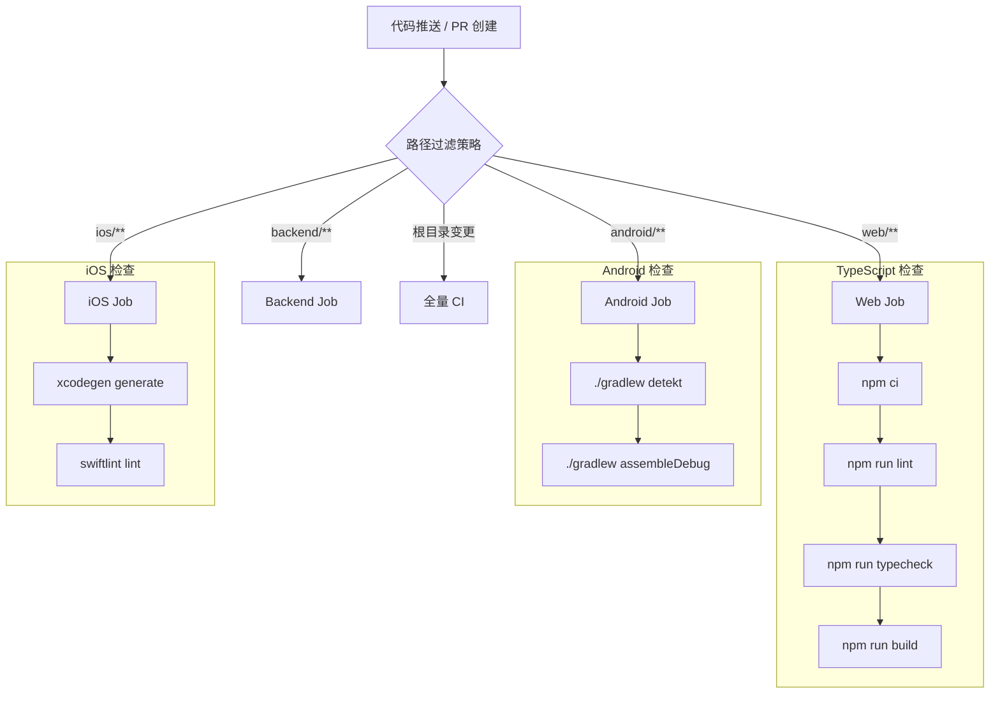
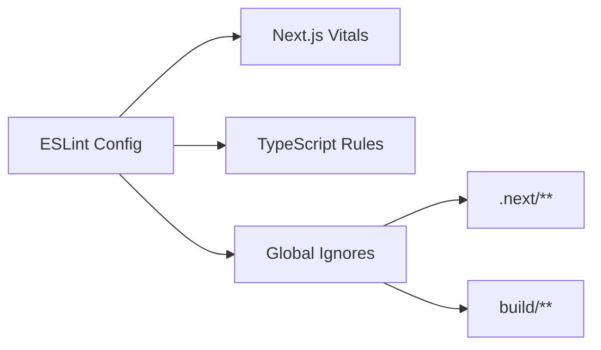
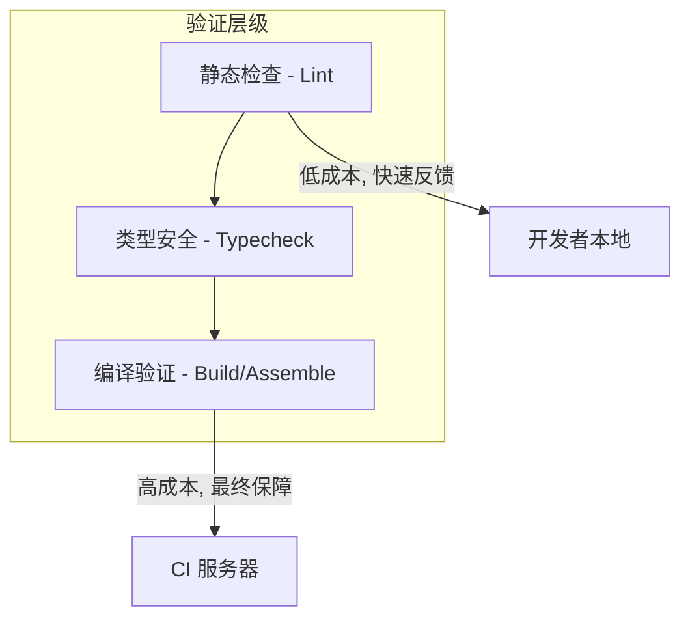

# CI/CD 自动化流水线

## 目录
1. [模块概览](#模块概览)
2. [持续集成架构](#持续集成架构)
3. [路径过滤与 Job 矩阵](#路径过滤与-job-矩阵)
4. [静态代码分析配置](#静态代码分析配置)
   - [Web 与后端 (ESLint)](#web-与后端-eslint)
   - [Android (Detekt)](#android-detekt)
   - [iOS (SwiftLint)](#ios-swiftlint)
5. [构建与验证流程](#构建与验证流程)
6. [本地自检与错误处理](#本地自检与错误处理)
7. [核心组件代码](#核心组件代码)
8. [文件引用](#文件引用)

## 模块概览

本项目采用基于 GitHub Actions 的持续集成 (CI) 流水线，旨在为多端开发（Web、后端、Android、iOS）提供自动化的代码质量保障。通过在每次 Pull Request (PR) 提交时触发自动化检查，确保代码符合规范、类型安全且能够成功编译，从而维护 `master` 分支的稳定性。

本模块涵盖了以下关键领域：
- **自动化工作流定义**：基于路径过滤的按需触发策略，优化 CI 执行效率。
- **多端静态分析**：集成 ESLint (Web/Backend)、Detekt (Android) 和 SwiftLint (iOS)。
- **构建验证**：确保各端代码在合并前均能通过基础编译。

**覆盖范围统计**：
- **核心配置文件**：约 5 个主要配置文件，分布在根目录及各端子目录中。
- **涉及子模块**：`web` (前端)、`backend` (后端)、`android` (Android 客户端)、`ios` (iOS 客户端)。
- **重点覆盖**：流水线触发逻辑、各端 Lint 工具集成、构建验证脚本。

## 持续集成架构

项目的 CI 架构设计遵循“快速反馈”和“资源优化”原则。由于项目包含多个端，全量运行所有 CI 任务会导致资源浪费和反馈延迟。因此，架构核心在于 GitHub Actions 的路径过滤机制。

下图展示了 CI 流水线的触发与执行流程：



在上述流程中，当开发者提交代码或创建针对 `master` 分支的 PR 时，GitHub Actions 会根据修改的文件路径决定启动哪些 Job。例如，仅修改了 `android/` 下的代码将只触发 Android Job，而修改根目录的全局配置则会触发所有 Job。这种设计显著缩短了开发者的等待时间，并降低了 GitHub Actions 的运行成本。

**架构设计来源**：
- [.claude/skills/init-project/references/cicd-setup.md](.claude/skills/init-project/references/cicd-setup.md)

## 路径过滤与 Job 矩阵

路径过滤是本项目 CI 流水线的核心优化手段。通过在 `ci.yml` 中定义 `on.pull_request.paths` 或在 Job 级别使用 `if` 条件，实现了精准的任务调度。

下表详细说明了不同路径变更触发的 Job 矩阵：

| 变更路径 | 触发 Job | 关键步骤 | 备注 |
| :--- | :--- | :--- | :--- |
| `web/**` | **Web** | `lint`, `typecheck`, `build` | 使用 Node.js 环境 |
| `backend/**` | **Backend** | `lint`, `typecheck`, `build` | 与 Web 共享部分 Lint 规范 |
| `android/**` | **Android** | `detekt`, `assembleDebug` | 使用 JDK 17 环境 |
| `ios/**` | **iOS** | `xcodegen`, `swiftlint` | **continue-on-error: true** |
| `docs/**`, `*.md` | 无 | 跳过所有 CI | 仅文档变更不触发构建 |
| 根目录文件 | **All** | 执行所有平台的验证任务 | 确保全局配置变更不破坏各端 |

对于 iOS Job，由于 GitHub Actions 的标准 Ubuntu Runner 不提供 macOS 环境（使用 macOS Runner 成本较高且速度较慢），目前的策略是在 Ubuntu 环境下进行静态检查（如果工具链支持）或标记为 `continue-on-error: true`。这确保了 iOS 端的检查不会因为环境限制而阻塞其他端的合并流程。

## 静态代码分析配置

静态分析是保障代码质量的第一道防线。本项目在各端均集成了成熟的 Lint 工具。

### Web 与后端 (ESLint)
Web 和后端模块均使用 ESLint 进行代码规范检查。配置采用了 Next.js 推荐的 `core-web-vitals` 和 TypeScript 规范。



后端配置示例（`backend/eslint.config.mjs`）：
- 继承了 `eslint-config-next/core-web-vitals`。
- 禁用了对构建产物（如 `.next/`, `out/`）的检查。
- 确保了 TypeScript 类型安全与 React 最佳实践的统一。

### Android (Detekt)
Android 端使用 Detekt 进行 Kotlin 代码的静态分析。Detekt 不仅检查代码风格，还能发现潜在的逻辑缺陷和复杂度问题。

关键配置项（`android/.detekt/detekt.yml`）：
- `warningsAsErrors: true`：将所有警告视为错误，强制修复。
- `MaxLineLength: 120`：限制单行长度。
- `FunctionNaming`：针对 Compose 函数（`@Composable`）进行了特殊处理，允许大写开头。

### iOS (SwiftLint)
iOS 端集成 SwiftLint，通过 `.swiftlint.yml` 定义了严格的 Swift 编码规范。

配置亮点：
- **长度限制**：类型体长度（300-500行）、函数体长度（50-100行）均有明确告警与错误阈值。
- **规则启用**：启用了 `unused_import`、`force_unwrapping` 等进阶规则，严禁在业务代码中使用强制解包。
- **路径排除**：自动忽略 `ShortDrama.xcodeproj` 和构建缓存目录。

**配置参考**：
- [backend/eslint.config.mjs](backend/eslint.config.mjs)
- [android/.detekt/detekt.yml](android/.detekt/detekt.yml)
- [ios/.swiftlint.yml](ios/.swiftlint.yml)

## 构建与验证流程

除了静态分析，CI 流水线还执行构建验证，以确保代码不仅“好看”，而且“能跑”。

1. **依赖安装**：使用 `npm ci` 而非 `npm install`。`npm ci` 会严格根据 `package-lock.json` 安装依赖，确保 CI 环境与开发环境的依赖树完全一致，避免“在我机器上能跑”的问题。
2. **类型检查**：对于 TypeScript 项目，运行 `npm run typecheck`（通常是 `tsc --noEmit`）。这是发现跨文件类型不匹配、接口变更破坏性影响的最有效手段。
3. **编译构建**：
   - **Web/Backend**：执行 `next build`，验证页面路由、服务端组件等是否能正常生成。
   - **Android**：执行 `./gradlew assembleDebug`，验证 Gradle 配置、资源引用和代码编译是否正确。
   - **iOS**：目前主要通过 `xcodegen` 验证工程文件生成逻辑。

下图展示了构建验证的层级关系：



## 本地自检与错误处理

为了提高 PR 的通过率，建议开发者在提交代码前进行本地自检。

**本地运行命令**：
- **Web/Backend**: `npm run lint` 和 `npm run build`。
- **Android**: `./gradlew detekt`。
- **iOS**: 在 Xcode 中集成 SwiftLint 插件，或在终端运行 `swiftlint`。

**Lint 错误处理流程建议**：
1. **自动修复**：优先尝试工具自带的修复功能，如 `eslint --fix`。
2. **规则讨论**：如果某条规则在特定场景下不合理（如 Detekt 的 `MagicNumber`），应在团队内讨论后修改配置文件，而非使用 `suppress` 注解。
3. **持续改进**：定期更新 Lint 规则库，引入更现代的编码实践。

> 💡 **提示**：如果 CI 因为 Lint 错误失败，GitHub Actions 会在 PR 页面直接标注错误的行号和原因。点击详情可查看完整的控制台输出。

## 核心组件代码

以下是 CI/CD 配置的关键代码片段，供参考与维护。

### 1. GitHub Actions 模板 (参考)
```yaml
# 摘自 .claude/skills/init-project/references/cicd-setup.md
name: CI
on:
  pull_request:
    branches: [master]
    paths:
      - 'web/**'
      - 'backend/**'
      - 'android/**'
      - 'ios/**'

jobs:
  web:
    if: contains(github.event.pull_request.labels.*.name, 'web') || github.event.pull_request.paths_filter.web
    runs-on: ubuntu-latest
    steps:
      - uses: actions/checkout@v4
      - run: npm ci
      - run: npm run lint
      - run: npm run build
```

### 2. Android Detekt 集成
```kotlin
// android/app/build.gradle.kts
detekt {
    config.setFrom(file("$rootDir/.detekt/detekt.yml"))
    buildUponDefaultConfig = false
}
```

### 3. 后端 ESLint 配置
```javascript
// backend/eslint.config.mjs
const eslintConfig = defineConfig([
  ...nextVitals,
  ...nextTs,
  globalIgnores([
    ".next/**",
    "out/**",
    "build/**",
  ]),
]);
```

## 文件引用

本章节涉及的核心配置文件如下：

- **设计文档**：[.claude/skills/init-project/references/cicd-setup.md](.claude/skills/init-project/references/cicd-setup.md)
- **后端 Lint**：[backend/eslint.config.mjs](backend/eslint.config.mjs)
- **iOS Lint**：[ios/.swiftlint.yml](ios/.swiftlint.yml)
- **Android Lint**：[android/.detekt/detekt.yml](android/.detekt/detekt.yml)
- **Android 构建**：[android/app/build.gradle.kts](android/app/build.gradle.kts)
- **前端配置**：[web/package.json](web/package.json)
- **后端配置**：[backend/package.json](backend/package.json)
