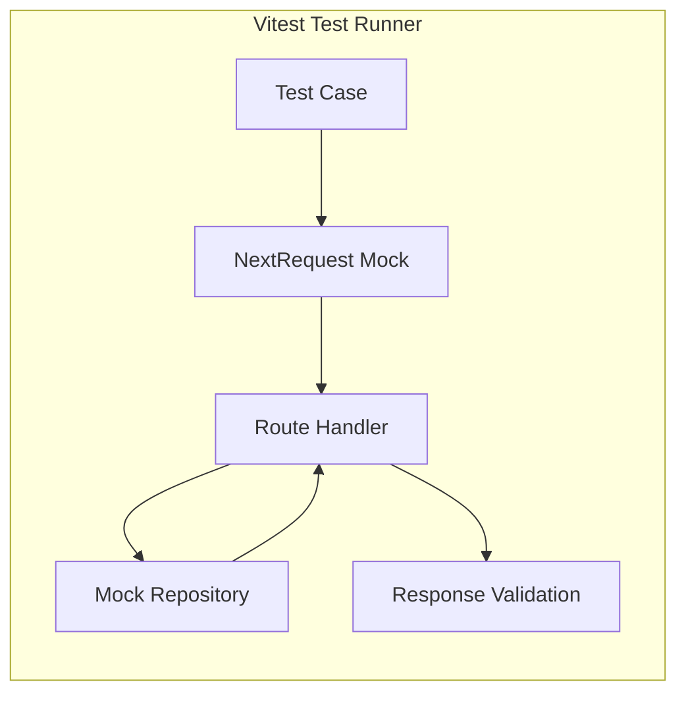
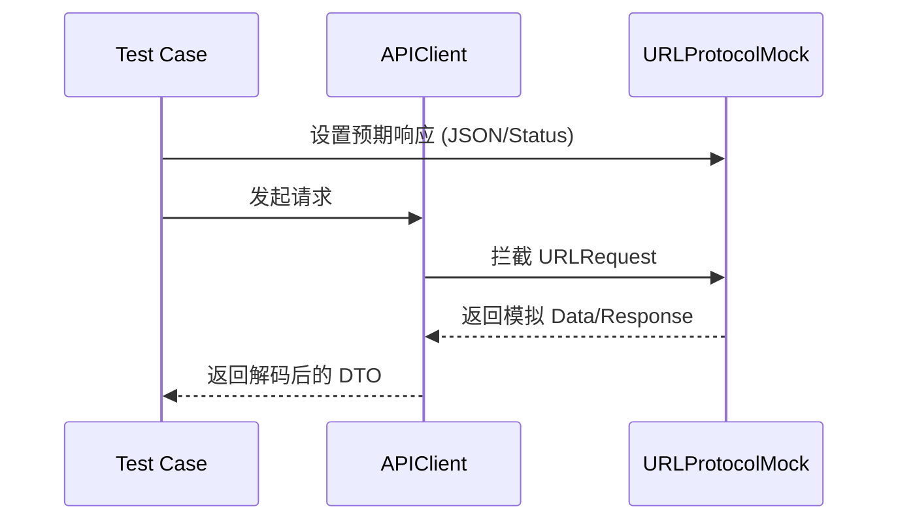
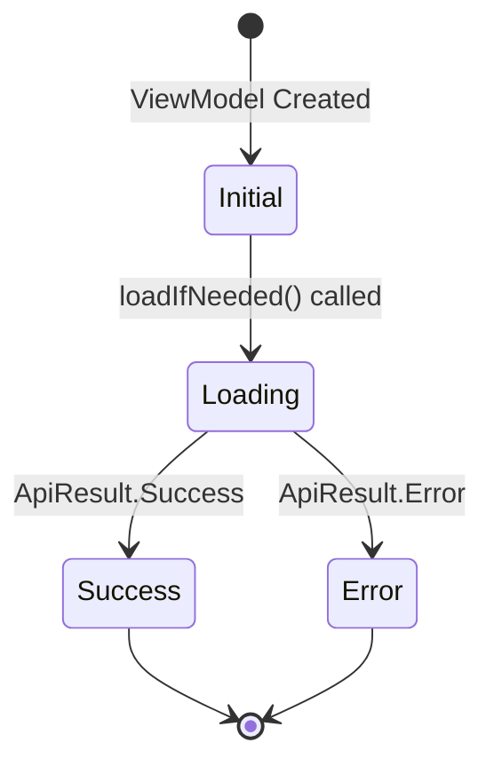

# 单元测试与集成测试

## 目录
1. [模块概览](#模块概览)
2. [后端测试框架与实践 (Vitest)](#后端测试框架与实践-vitest)
   - [API 路由集成测试](#api-路由集成测试)
   - [Mock Repository 模式](#mock-repository-模式)
3. [iOS 测试框架与实践 (Swift Testing)](#ios-测试框架与实践-swift-testing)
   - [网络层拦截与 URLProtocolMock](#网络层拦截与-urlprotocolmock)
   - [DTO 映射与端到端校验](#dto-映射与端到端校验)
4. [Android 测试框架与实践 (JUnit/MockK)](#android-测试框架与实践-junitmockk)
   - [ApiService 合约校验](#apiservice-合约校验)
   - [ViewModel 与协程测试](#viewmodel-与协程测试)
5. [各端 Mock 机制对比](#各端-mock-机制对比)
6. [测试运行命令清单](#测试运行命令清单)
7. [测试覆盖率与质量标准](#测试覆盖率与质量标准)
8. [文件参考](#文件参考)

## 模块概览

ShortDrama 项目采用了多端协同的测试策略，旨在确保后端 API 的稳定性以及移动端（iOS/Android）业务逻辑的正确性。测试体系涵盖了从底层的工具函数到高层的 UI 逻辑状态。

**测试规模统计：**
- **后端 (Backend)**: 约 50 个测试文件，基于 Vitest 框架。主要分布在 `src/app/api/__tests__`（API 集成测试）和 `src/repositories/__tests__`（Mock 仓库测试）。
- **iOS**: 约 50 个测试文件，基于 Swift Testing 和 XCTest 框架。涵盖了 Data 层（DTO 映射、API 客户端）、Domain 层（存储、业务实体）和 ViewModel 层。
- **Android**: 约 60 个测试文件，基于 JUnit 4、MockK 和 Coroutines Test。涵盖了 Core 网络层、Data 仓库层以及 Feature 层的 ViewModel 和 UI 状态。

**覆盖范围：**
- **核心逻辑**：所有 API 路由、Repository 逻辑、ViewModel 状态转换。
- **合约校验**：通过自动化测试确保 iOS/Android 发出的请求路径、参数与后端定义的 API 规范完全一致。
- **Mock 机制**：后端使用内存 Mock 仓库，前端使用 `URLProtocol` 拦截或 MockK 模拟依赖。

---

## 后端测试实践 (Vitest)

后端测试主要关注 API 的行为一致性和 Repository 层的逻辑实现。通过 Vitest 框架，我们能够快速运行异步测试并方便地进行依赖注入。

### API 路由集成测试
API 测试通过直接调用 Next.js 的路由处理器（GET/POST 函数）来验证业务逻辑。这种方式不依赖真实的 HTTP 服务器，运行速度极快。



在测试中，我们使用 `await import` 动态加载路由处理器，并模拟 `NextRequest` 对象：

```typescript
// backend/src/app/api/__tests__/dramas.test.ts
import { describe, it, expect } from 'vitest';
import { NextRequest } from 'next/server';

const { GET } = await import('../dramas/route');

describe('GET /api/dramas', () => {
  it('应该返回标准的分页响应', async () => {
    const request = new NextRequest('https://localhost:3001/api/dramas');
    const response = await GET(request);
    const body = await response.json();

    expect(response.status).toBe(200);
    expect(body).toHaveProperty('data');
    expect(body.pagination.page).toBe(1);
    expect(body.data).toHaveLength(10); // 默认分页大小
  });
});
```

### Mock Repository 模式
为了在测试中摆脱对 Supabase 或 Redis 的依赖，我们实现了一套 Mock Repository。它在内存中模拟数据库操作，并支持复杂的查询逻辑（如分页、搜索、排序）。

```typescript
// backend/src/repositories/__tests__/drama.mock.repository.test.ts
describe('DramaMockRepository', () => {
  let repo: DramaMockRepository;

  beforeEach(() => {
    repo = new DramaMockRepository();
  });

  it('应该支持创建并根据 ID 查找短剧', async () => {
    const created = await repo.create({ title: '测试短剧', ... });
    const found = await repo.findById(created.id);
    expect(found?.title).toBe('测试短剧');
  });
});
```

**Section sources**:
- [backend/vitest.config.ts](backend/vitest.config.ts)
- [backend/src/app/api/__tests__/dramas.test.ts](backend/src/app/api/__tests__/dramas.test.ts)
- [backend/src/repositories/__tests__/drama.mock.repository.test.ts](backend/src/repositories/__tests__/drama.mock.repository.test.ts)

---

## iOS 测试实践 (Swift Testing)

iOS 端采用了苹果最新的 **Swift Testing** 框架（配合部分 XCTest），重点在于网络协议的严谨性校验和 ViewModel 的状态驱动。

### 网络层拦截与 URLProtocolMock
iOS 使用 `URLProtocolMock` 拦截所有网络请求。这允许我们在不启动真实服务器的情况下，模拟各种 HTTP 状态码、JSON 响应以及网络超时等边界情况。



`URLProtocolMock` 的核心实现如下：

```swift
// ios/ShortDrama/Tests/Helpers/URLProtocolMock.swift
final class URLProtocolMock: URLProtocol {
    typealias RequestHandler = (URLRequest) throws -> (HTTPURLResponse, Data)
    static var handler: RequestHandler?

    override func startLoading() {
        guard let handler = URLProtocolMock.handler else { return }
        do {
            let (response, data) = try handler(request)
            client?.urlProtocol(self, didReceive: response, cacheStoragePolicy: .notAllowed)
            client?.urlProtocol(self, didLoad: data)
            client?.urlProtocolDidFinishLoading(self)
        } catch {
            client?.urlProtocol(self, didFailWithError: error)
        }
    }
}
```

### DTO 映射与端到端校验
为了确保移动端与后端 API 合约一致，我们编写了大量的 `APIClientTests`。这些测试会验证请求的 `path`、`queryItems` 以及 `Header` 是否符合规范。

```swift
// ios/ShortDrama/Tests/DataTests/APIClientTests.swift
@Test("短剧列表接口应使用标准路径和分页参数")
func testDramaEndpointUsesCanonicalContract() {
    let endpoint = DramaEndpoints.getDramas(page: 1, pageSize: 10)

    #expect(endpoint.path == "/api/dramas")
    #expect(endpoint.queryItems?.contains(URLQueryItem(name: "page", value: "1")) == true)
    #expect(endpoint.queryItems?.contains(URLQueryItem(name: "pageSize", value: "10")) == true)
}
```

**Section sources**:
- [ios/ShortDrama/Tests/DataTests/APIClientTests.swift](ios/ShortDrama/Tests/DataTests/APIClientTests.swift)
- [ios/ShortDrama/Tests/Helpers/URLProtocolMock.swift](ios/ShortDrama/Tests/Helpers/URLProtocolMock.swift)

---

## Android 测试实践 (JUnit/MockK)

Android 端的测试重点在于使用 **MockK** 进行依赖模拟，以及利用 **Coroutines Test** 库处理异步 ViewModel 逻辑。

### ApiService 合约校验
Android 端通过反射机制校验 Retrofit 接口定义的注解，确保请求路径和参数名称正确。这是一种低成本但高收益的合约测试方法。

```kotlin
// android/app/src/test/java/com/djs66256/short_drama/core/network/ApiServiceTest.kt
@Test
fun `getDramas 接口应使用标准的分页查询参数名`() {
    val method = ApiService::class.java.declaredMethods.single { it.name == "getDramas" }
    val pageQuery = method.parameterAnnotations[0].filterIsInstance<Query>().single()
    val pageSizeQuery = method.parameterAnnotations[1].filterIsInstance<Query>().single()

    assertEquals("page", pageQuery.value)
    assertEquals("pageSize", pageSizeQuery.value)
}
```

### ViewModel 与协程测试
ViewModel 测试通过 `StandardTestDispatcher` 控制协程的执行时机，验证 UI 状态（StateFlow）在数据加载前后的变化。



```kotlin
// android/app/src/test/java/com/djs66256/short_drama/feature/home/viewmodel/HomeViewModelTest.kt
@Test
fun `loadIfNeeded 在签到符合条件时应显示弹窗`() = runTest {
    coEvery { getDramasUseCase(any(), any()) } returns ApiResult.Success(listOf(sampleDrama()))
    coEvery { getCheckInStatusUseCase() } returns ApiResult.Success(sampleCheckInStatus())

    viewModel.loadIfNeeded()
    advanceUntilIdle() // 等待协程执行完毕

    val state = viewModel.uiState.value
    assertTrue(state.checkInPopup.isVisible)
    assertEquals(1, state.items.size)
}
```

**Section sources**:
- [android/app/src/test/java/com/djs66256/short_drama/core/network/ApiServiceTest.kt](android/app/src/test/java/com/djs66256/short_drama/core/network/ApiServiceTest.kt)
- [android/app/src/test/java/com/djs66256/short_drama/feature/home/viewmodel/HomeViewModelTest.kt](android/app/src/test/java/com/djs66256/short_drama/feature/home/viewmodel/HomeViewModelTest.kt)

---

## 各端 Mock 机制对比

| 特性 | 后端 (Node.js) | iOS (Swift) | Android (Kotlin) |
| :--- | :--- | :--- | :--- |
| **主要框架** | Vitest | Swift Testing / XCTest | JUnit 4 / MockK |
| **网络 Mock** | 无（直接调用路由函数） | `URLProtocol` 拦截 | MockK 模拟 Repository |
| **依赖注入** | 手动构造/构造函数注入 | 构造函数注入 | 构造函数注入 |
| **异步处理** | `async/await` | `async/await` | `Coroutines` (runTest) |
| **数据模拟** | 内存 Mock Repository | JSON Fixtures | MockK `coEvery` |

---

## 测试运行命令清单

开发者可以使用以下命令在本地运行各端的测试套件：

### 后端 (Backend)
```bash
# 进入后端目录
cd backend
# 运行所有测试
npm run test
# 运行特定文件的测试
npx vitest src/app/api/__tests__/dramas.test.ts
# 查看覆盖率
npm run test:coverage
```

### iOS
- **Xcode**: 快捷键 `Cmd + U` 运行所有测试。
- **CLI**:
```bash
xcodebuild test -scheme ShortDrama -destination 'platform=iOS Simulator,name=iPhone 15'
```

### Android
```bash
# 运行所有单元测试
./gradlew test
# 运行特定模块的测试
./gradlew :app:testDebugUnitTest --tests "com.djs66256.short_drama.feature.home.*"
```

---

## 测试覆盖率与质量标准

为了保障代码质量，项目建议遵循以下测试标准：

1.  **覆盖率要求**：
    -   **核心业务 (Services/UseCases)**: 覆盖率应 > 90%。
    -   **API 接口 (Routes/Controllers)**: 覆盖率应 > 80%。
    -   **工具类 (Utils)**: 覆盖率应达 100%。
2.  **编写原则**：
    -   **独立性**：每个测试用例应独立运行，不依赖其他测试的结果或顺序。
    -   **确定性**：测试结果应在任何环境下保持一致（避免依赖系统时间、随机数等）。
    -   **可读性**：测试名称应清晰描述“在什么条件下，执行什么操作，预期什么结果”。
3.  **CI/CD 集成**：
    -   所有 Pull Request 必须通过全量测试流水线。
    -   测试失败将阻塞代码合并。

---

## 文件参考

本页面内容基于对以下关键测试文件的分析编写：

- `backend/vitest.config.ts`: 后端测试全局配置文件。
- `backend/src/app/api/__tests__/dramas.test.ts`: 后端短剧 API 集成测试示例。
- `backend/src/repositories/__tests__/drama.mock.repository.test.ts`: 后端内存仓库模拟实现。
- `ios/ShortDrama/Tests/DataTests/APIClientTests.swift`: iOS 网络客户端合约校验。
- `ios/ShortDrama/Tests/Helpers/URLProtocolMock.swift`: iOS 网络请求拦截器工具。
- `android/app/src/test/java/com/djs66256/short_drama/core/network/ApiServiceTest.kt`: Android 网络接口合约校验。
- `android/app/src/test/java/com/djs66256/short_drama/feature/home/viewmodel/HomeViewModelTest.kt`: Android ViewModel 业务逻辑测试。
