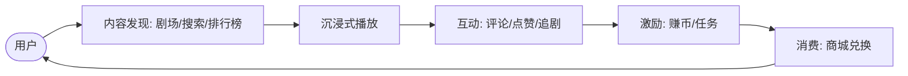
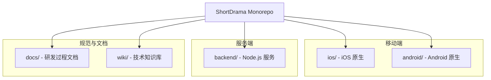
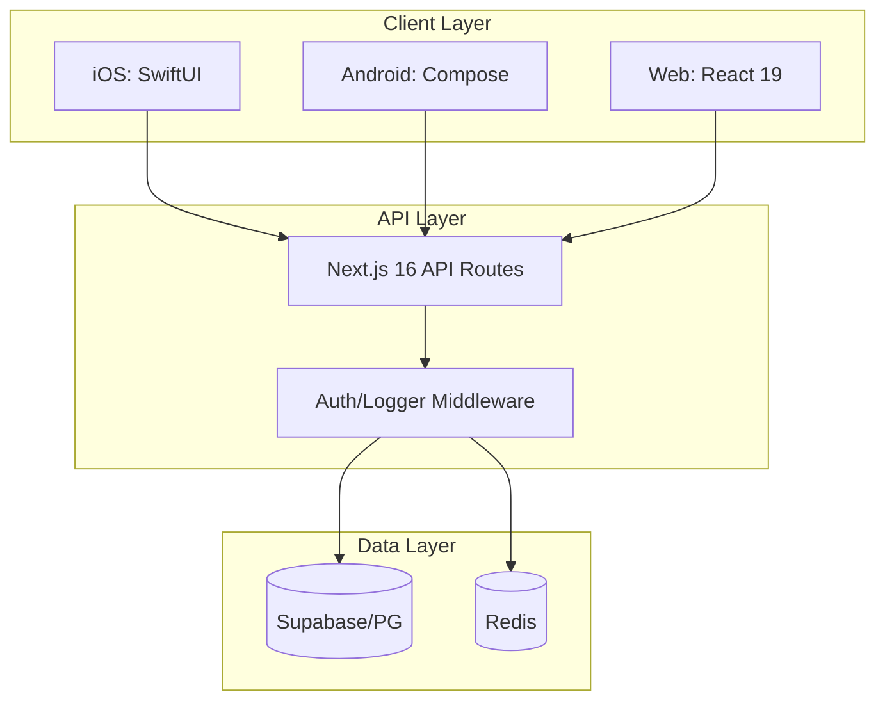
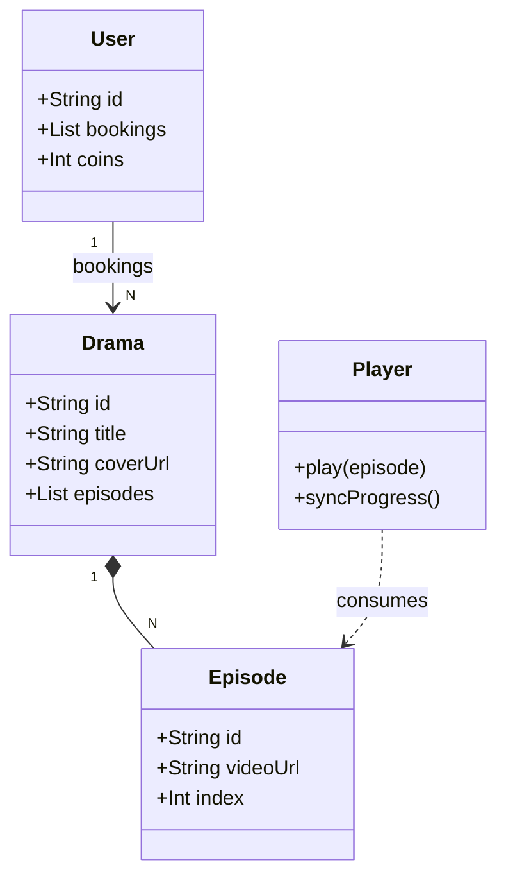
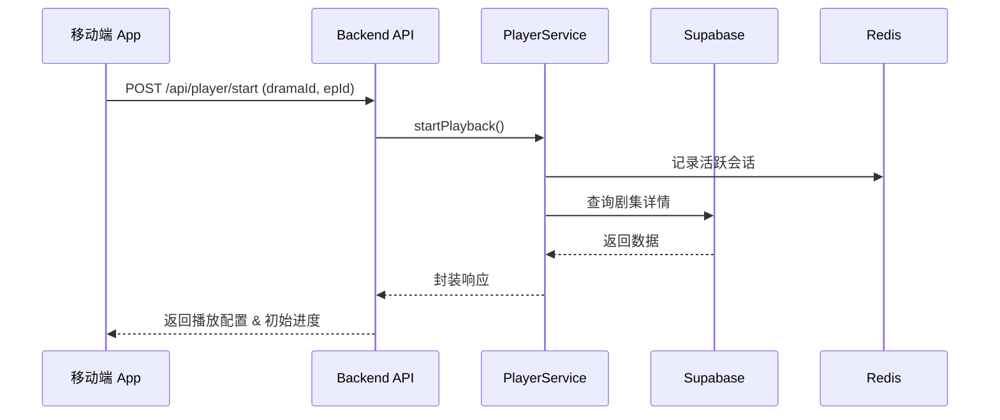
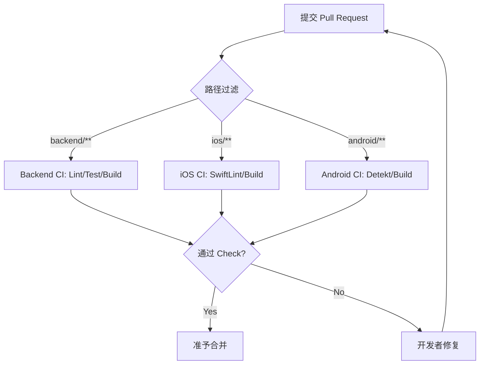

# 项目总览与愿景

## 目录
1. [模块概览](#模块概览)
2. [引言：业务愿景与核心价值](#引言业务愿景与核心价值)
3. [Monorepo 仓库结构](#monorepo-仓库结构)
4. [技术栈选型](#技术栈选型)
5. [核心功能模块](#核心功能模块)
6. [系统架构总览](#系统架构总览)
7. [开发与协作流程](#开发与协作流程)
8. [关键文件参考](#关键文件参考)

## 模块概览

ShortDrama 项目是一个典型的多端 Monorepo 工程，旨在构建一个高性能、沉浸式的短剧内容平台。项目涵盖了从后端服务到 iOS、Android 移动端以及 Web 前端的全栈开发范围。

**项目规模统计：**
- **总文件数**：约 800+ 源文件（包含测试文件）
- **后端 (backend)**：150+ TypeScript 文件，采用 Next.js 16 架构
- **iOS 移动端 (ios)**：200+ Swift 文件，采用 SwiftUI + Clean Architecture
- **Android 移动端 (android)**：200+ Kotlin 文件，采用 Jetpack Compose + MVVM
- **文档与配置 (docs/wiki)**：涵盖了产品需求 (PRD)、技术规格 (Specs) 和架构决策

**核心子模块：**
- `backend/`：提供 RESTful API、数据库访问、缓存管理及管理后台逻辑。
- `ios/`：原生 iOS 应用，专注于极致的播放体验和系统集成。
- `android/`：原生 Android 应用，采用最新的 Compose 技术栈。
- `docs/`：项目全生命周期的文档记录，包括竞品研究、产品规划和技术方案。

本章节将重点介绍项目的宏观架构、技术选型及各端职责，为新加入的开发者提供全景式的技术导航。

## 引言：业务愿景与核心价值

ShortDrama 的核心定位是**新一代竖屏短剧内容平台**。在短视频碎片化消费的时代，短剧以其高反转、快节奏的特点成为了用户的新宠。ShortDrama 不仅仅是一个播放器，它构建了一个完整的短剧消费生态。

### 核心业务目标
1. **沉浸式播放体验**：通过原生技术（SwiftUI/Compose）打造丝滑的竖屏切换和预加载机制，让用户“停不下来”。
2. **多维度的剧场发现**：提供排行榜、频道分类、热搜等功能，帮助用户在海量内容中快速找到心仪的剧集。
3. **闭环的用户价值体系**：通过“赚币”任务系统和“商城”模块，提升用户粘性和商业化转化能力。

### 关键术语
- **Drama (短剧)**：由多集组成的竖屏视频内容实体。
- **Episode (剧集)**：短剧的单集内容，通常时长在 1-2 分钟。
- **Theater (剧场)**：内容的聚合展示页，包含推荐流和分类频道。
- **Earn Center (赚钱中心)**：用户通过签到、看剧等任务获取虚拟奖励的模块。

下图展示了 ShortDrama 的核心业务逻辑流转：

**图表说明**：用户从发现内容开始，进入核心播放流程。通过深度的互动行为触发奖励机制，最终在商城完成价值闭环。这种设计旨在最大化用户生命周期价值（LTV）。

**Section sources**:
- [PRODUCT.md](PRODUCT.md)
- [docs/specs/2026-07-24-project-init/spec.md](docs/specs/2026-07-24-project-init/spec.md)

## Monorepo 仓库结构

ShortDrama 采用 Monorepo（单仓）管理模式，这在多端协同开发中具有显著优势。通过将后端、移动端、Web 端和文档放在同一个仓库中，我们能够确保 API 契约的一致性，简化跨端功能的同步开发，并共享一套 CI/CD 基础设施。

### 目录职责划分

| 目录 | 职责描述 | 关键技术标识 |
| :--- | :--- | :--- |
| `backend/` | 后端 API 服务、管理后台接口、数据库迁移及种子数据。 | Next.js 16, Supabase, Redis |
| `ios/` | 原生 iOS 客户端代码。 | Swift 6, SwiftUI, XcodeGen |
| `android/` | 原生 Android 客户端代码。 | Kotlin 2.0, Compose, Hilt |
| `docs/` | 产品研发全过程文档，包括 PRD、技术 Spec、竞品分析。 | Markdown |
| `wiki/` | 长期维护的技术知识库和架构说明。 | Markdown |
| `.github/` | 自动化工作流配置（CI/CD）。 | GitHub Actions |

### 仓库组织结构图

**图表说明**：Monorepo 结构清晰地划分为服务端、移动端和规范文档三大板块。这种组织方式支持各端独立构建和部署，同时在根目录通过 `CLAUDE.md` 等文件维持全局统一的开发规范。

**Section sources**:
- [PRODUCT.md](PRODUCT.md)
- [docs/specs/2026-07-24-project-init/spec.md](docs/specs/2026-07-24-project-init/spec.md)

## 技术栈选型

ShortDrama 的技术选型遵循“前沿、稳定、高性能”的原则，确保在满足业务快速迭代的同时，提供极致的用户体验。

### 后端与基础设施 (Backend & Infra)
- **框架**：Next.js 16 (App Router)。利用其强大的 API Routes 能力处理业务逻辑。
- **数据库**：Supabase (PostgreSQL)。提供可靠的持久化存储和实时能力。
- **缓存**：Redis (ioredis)。用于热点数据缓存和播放进度同步。
- **校验**：Zod。作为全栈类型安全的核心，定义数据契约。

### 移动端 (Mobile Platforms)
- **iOS**：Swift 6 + SwiftUI。采用声明式 UI 提升开发效率，利用 Swift 并发特性处理音视频流。
- **Android**：Kotlin 2.0 + Jetpack Compose。完全原生开发，利用 Hilt 进行依赖注入，确保架构的可测试性。
- **混合能力**：商城与赚钱中心采用 H5 容器接入，实现业务的灵活更新。

### 技术栈分层视图

**图表说明**：系统采用典型的三层架构。客户端通过统一的 API 层与后端交互，中间件负责安全和日志，数据层则由关系型数据库和高速缓存共同支撑。

**Section sources**:
- [backend/package.json](backend/package.json)
- [android/build.gradle.kts](android/build.gradle.kts)
- [ios/ShortDrama/Sources/App/ShortDramaApp.swift](ios/ShortDrama/Sources/App/ShortDramaApp.swift)

## 核心功能模块

ShortDrama 的功能设计围绕“发现-播放-激励”三个核心环节展开。

### 1. 播放器模块 (Player)
这是应用的核心，支持竖屏全屏播放、上下滑动切换剧集、倍速播放及弹幕互动。后端通过 `/api/player/progress` 接口实时同步用户的观看进度。

### 2. 剧场与发现 (Theater & Discovery)
包含首页信息流、排行榜（Ranking）、频道分类及搜索功能。通过 `DramaRepository` 提供高效的数据查询。

### 3. 任务与激励系统 (Earn Center)
用户通过每日签到（Check-in）、观看任务获取金币。该模块在移动端通过 H5 容器承载，后端逻辑集中在 `services/earn/`。

### 4. 用户中心与资产 (User & Assets)
管理用户资料、追剧记录（Bookings）及虚拟资产。支持 Deep Link 唤起，如 `djsdrama://drama/[id]`。

**图表说明**：类图展示了核心实体间的关系。一个短剧包含多个剧集，用户可以订阅（追剧）多个短剧，而播放器则负责消费剧集内容并与用户状态同步。

**Section sources**:
- [docs/specs/2026-07-24-project-init/spec.md](docs/specs/2026-07-24-project-init/spec.md)
- [backend/src/lib/schemas.ts](backend/src/lib/schemas.ts)

## 系统架构总览

ShortDrama 的架构设计强调**跨端一致性**和**分层解耦**。

### 架构原则
1. **单一数据源 (SSOT)**：后端 Zod Schema 是唯一的契约来源，各端手动或自动对齐。
2. **依赖倒置 (DIP)**：各端均定义 Repository 接口，业务逻辑（Service/UseCase）不直接依赖具体实现（Supabase/Mock）。
3. **模块化**：按业务域（Feature）拆分，如 `features/home/`、`features/player/`，确保模块间低耦合。

### 典型请求生命周期
当用户点击“开始播放”时，请求的流转路径如下：

**图表说明**：请求从移动端发起，经过后端的路由解析进入业务服务层。服务层并行操作 Redis（保证实时性）和数据库（保证持久性），最后将整合后的数据返回客户端。

**Section sources**:
- [docs/specs/2026-07-24-project-init/spec.md](docs/specs/2026-07-24-project-init/spec.md)
- [backend/src/services/player/player.service.ts](backend/src/services/player/player.service.ts)

## 开发与协作流程

为了保证多端 Monorepo 的开发效率，项目建立了一套自动化的协作流程。

### 1. 本地开发环境
- 使用 `docker-compose` 一键启动本地 PostgreSQL 和 Redis。
- 后端使用 `npm run dev` 启动（默认端口 3001）。
- iOS 使用 `xcodegen` 生成工程文件，Android 使用 Hilt 进行依赖注入。

### 2. CI/CD 流水线
项目使用 GitHub Actions 进行自动化校验。每当有 PR 提交时，流水线会根据变更路径触发不同的 Job：
- **Web/Backend**：执行 `lint` -> `typecheck` -> `test` -> `build`。
- **Android**：执行 `detekt` -> `assembleDebug`。
- **iOS**：执行 `xcodegen` -> `swiftlint`。

**图表说明**：自动化流水线通过路径过滤机制，确保只有受影响的端才会触发昂贵的构建任务，从而极大提升了 CI 的反馈速度。

**Section sources**:
- [docs/specs/2026-07-24-project-init/spec.md](docs/specs/2026-07-24-project-init/spec.md)
- [backend/package.json](backend/package.json)

## 关键文件参考

以下是理解项目全局结构最关键的入口文件和配置文件：

### 根目录与配置
- [PRODUCT.md](PRODUCT.md)：产品定义与技术标识（AppID, Scheme）。
- [CLAUDE.md](CLAUDE.md)：全局开发规范与协作约定。
- [docs/specs/2026-07-24-project-init/spec.md](docs/specs/2026-07-24-project-init/spec.md)：项目初始化技术规格书（核心架构来源）。

### 后端 (Backend)
- [backend/package.json](backend/package.json)：后端依赖与脚本。
- [backend/src/lib/schemas.ts](backend/src/lib/schemas.ts)：全栈数据模型定义。
- [backend/src/app/api/health/route.ts](backend/src/app/api/health/route.ts)：健康检查入口。

### iOS
- [ios/ShortDrama/Sources/App/ShortDramaApp.swift](ios/ShortDrama/Sources/App/ShortDramaApp.swift)：应用主入口。
- [ios/ShortDrama/Sources/App/AppRoute.swift](ios/ShortDrama/Sources/App/AppRoute.swift)：路由定义。

### Android
- [android/build.gradle.kts](android/build.gradle.kts)：Android 构建配置。
- [android/app/src/main/java/com/djs66256/short_drama/MainActivity.kt](android/app/src/main/java/com/djs66256/short_drama/MainActivity.kt)：应用主 Activity 与路由分发。

---
💡 **提示**：作为新加入的开发者，建议首先阅读 `PRODUCT.md` 了解产品背景，然后通过 `backend/README.md` 启动本地基础设施，最后进入你所负责的端目录开始开发。
