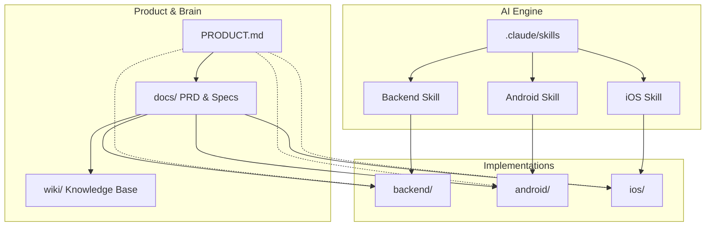
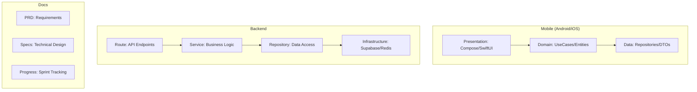
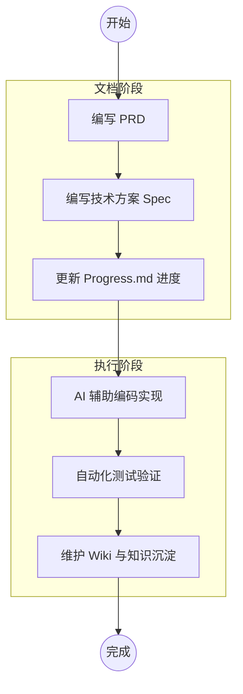
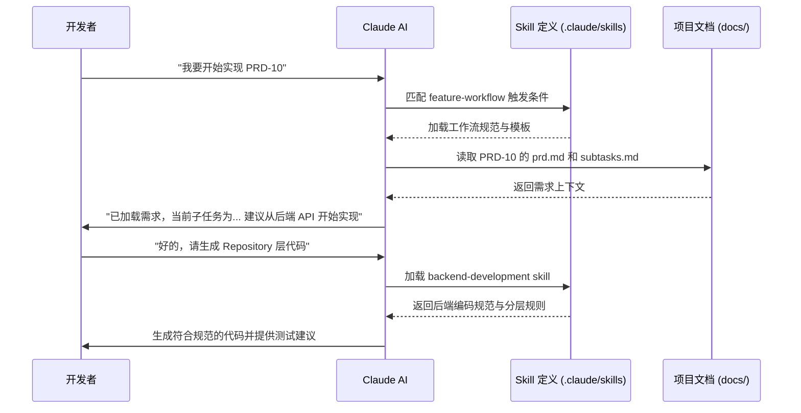

# Monorepo 目录结构说明

## 目录
1. [模块概览](#模块概览)
2. [Monorepo 哲学与设计初衷](#monorepo-哲学与设计初衷)
3. [核心目录职责划分](#核心目录职责划分)
   - [移动端子工程：android/ 与 ios/](#移动端子工程-android-与-ios)
   - [全栈后端服务：backend/](#全栈后端服务-backend)
   - [项目大脑：docs/ 与 wiki/](#项目大脑-docs-与-wiki)
   - [AI 工作流核心：.claude/](#ai-工作流核心-claude)
4. [文档驱动开发流程](#文档驱动开发流程)
5. [AI 辅助协作模式](#ai-辅助协作模式)
6. [跨端协作约定与规范](#跨端协作约定与规范)
7. [关键文件参考](#关键文件参考)

## 模块概览

ShortDrama 项目采用 Monorepo（单仓库）架构，旨在将产品定义、多端研发、文档协作与 AI 辅助能力高度集成在一个统一的代码库中。这种结构打破了传统项目中“文档在 Wiki、代码在 Git、需求在 Jira”的碎片化状态，实现了真正的“单一事实来源”（Single Source of Truth）。

根据对仓库的初步探索，该模块涉及的规模如下：
- **文件总数**：超过 200 个核心源文件（涵盖 Kotlin, Swift, TypeScript, Markdown 等）。
- **子模块识别**：
    - `android/`：基于 Jetpack Compose 的原生 Android 工程。
    - `ios/`：基于 SwiftUI 的原生 iOS 工程。
    - `backend/`：基于 Next.js + Supabase 的全栈后端服务。
    - `docs/`：包含 PRD、技术方案、竞品分析的文档体系。
    - `.claude/`：AI 技能定义与自动化指令集。
- **覆盖深度**：本章节将深度覆盖 Monorepo 的组织逻辑、各端职责边界以及 AI 驱动的协作模式，帮助开发者在复杂的目录中快速定位并遵循统一的开发规范。

## Monorepo 哲学与设计初衷

ShortDrama 的 Monorepo 设计并非仅仅为了代码存放的便利，其背后蕴含着深层的“工程化协同”哲学。在快速迭代的移动互联网产品开发中，跨端的一致性（Consistency）和协作的透明度（Transparency）是最大的挑战。

通过将所有端的代码和文档放在一起，我们实现了以下核心目标：
1. **原子化变更**：一个新功能（如“评论系统”）的 PRD、后端 API 实现、Android 实现和 iOS 实现可以在同一个提交中完成，确保了功能交付的完整性。
2. **知识零距离**：研发人员在编写代码时，可以随时查看 `docs/` 下的 PRD 和 `PRODUCT.md` 中的产品定义，无需切换工具，减少了上下文切换的损耗。
3. **AI 深度赋能**：通过 `.claude/skills`，AI 能够同时感知文档和多端代码的上下文，从而提供跨端的重构建议和一致性检查。

下图展示了 ShortDrama Monorepo 的逻辑架构及其核心依赖关系：

在上述架构中，`PRODUCT.md` 处于最顶层，定义了产品的元信息（如名称、ID、Scheme）。`docs/` 目录作为项目的“大脑”，承载了所有的业务逻辑定义。AI Engine 通过加载不同的 Skill，为下层的具体实现提供规范指引。这种结构确保了无论在哪一端进行开发，其逻辑源头都是统一的。

**Section sources**:
- [CLAUDE.md](CLAUDE.md)
- [PRODUCT.md](PRODUCT.md)

## 核心目录职责划分

为了确保多端协作的高效性，ShortDrama 对每个目录的职责边界进行了严格定义。开发者必须遵循“就近原则”：根目录规则是全局的，而子目录下的 `CLAUDE.md` 拥有更高的优先级。

### 移动端子工程：android/ 与 ios/

移动端目录遵循各自平台的原生工程规范，但共享统一的架构思想——**Clean Architecture**。

- **`android/`**：采用 Kotlin 2.0 + Jetpack Compose + Hilt。目录结构清晰地划分为 `data/`（数据层）、`domain/`（领域层）和 `feature/`（表现层）。它强调纯 Kotlin 的 Domain 层，确保业务逻辑不依赖 Android 框架，从而提高可测试性。
- **`ios/`**：采用 Swift 6 + SwiftUI + XcodeGen。通过 `project.yml` 管理项目配置，避免了 `.xcodeproj` 文件的合并冲突。架构上同样坚持四层分层，并使用最新的 Swift Testing 宏进行测试。

### 全栈后端服务：backend/

后端服务不仅仅是 API 的提供者，更是业务规则的执行中心。
- **技术栈**：Next.js (App Router) + Supabase + Redis。
- **职责**：负责所有的业务逻辑校验、数据库持久化（Postgres）、缓存管理以及与第三方服务的集成。
- **分层**：严格遵循 `Route -> Service -> Repository -> Infrastructure` 的四层架构，确保了代码的可维护性和水平扩展能力。

### 项目大脑：docs/ 与 wiki/

这是 ShortDrama 最具特色的一部分，体现了“文档即代码”的理念。
- **`docs/`**：存放具有时效性的文档。`product_manager/` 下的 `progress.md` 实时记录了项目的 Sprint 进度，`prd/` 目录下则按功能模块存放了详细的需求说明。
- **`wiki/`**：存放沉淀下来的知识。包括技术决策记录（ADR）、架构演进图以及 AI 自动生成的模块说明。

### AI 工作流核心：.claude/

该目录是 AI 辅助开发的“操纵室”。
- **`skills/`**：定义了 AI 在不同场景下的行为准则。例如，当开发者进入 `backend/` 目录时，AI 会自动加载 `backend-development` skill，从而获得关于 Next.js 和 Supabase 的特定知识。
- **`commands/`**：存放了常用的自动化指令，如 `fast-forward`（快速推进任务）等。

下图展示了各子目录内部的典型分层职责：

通过这种分层，我们确保了各端在架构模式上的一致性，使得跨端开发人员能够快速理解不同端的代码结构。

**Section sources**:
- [android/CLAUDE.md](android/CLAUDE.md)
- [ios/CLAUDE.md](ios/CLAUDE.md)
- [backend/CLAUDE.md](backend/CLAUDE.md)
- [docs/product_manager/progress.md](docs/product_manager/progress.md)

## 文档驱动开发流程

ShortDrama 严格执行“文档驱动开发”（Document-Driven Development, DDDv）。任何代码的编写都必须以文档为前提，且文档的更新必须先于或同步于代码的提交。

典型的功能开发生命周期如下：
1. **需求定义**：在 `docs/product_manager/prd/` 下创建新的 PRD 文件夹，定义功能范围。
2. **技术评审**：在 `docs/specs/` 下创建技术方案，明确 API 契约和各端的实现思路。
3. **任务拆解**：在 `docs/product_manager/progress.md` 中更新 Sprint 计划，并将任务同步到 `subtasks.md`。
4. **编码实现**：AI 加载对应的 Skill，参考 PRD 和 Spec 进行代码生成或修改。
5. **知识沉淀**：功能完成后，更新 `wiki/` 或相关子目录的 `CLAUDE.md`。

这种流程确保了项目的每一个改动都是有据可查的，同时也为 AI 提供了高质量的上下文，使得 AI 生成的代码更加符合业务预期。

**Section sources**:
- [docs/product_manager/progress.md](docs/product_manager/progress.md)
- [.claude/skills/product-manager/SKILL.md](.claude/skills/product-manager/SKILL.md)

## AI 辅助协作模式

在 ShortDrama 项目中，AI 不仅仅是一个代码补全工具，而是一个深度参与项目管理的“数字成员”。通过 `.claude/skills`，我们为 AI 构建了一套完整的知识图谱。

AI 协作的核心机制是 **Skill 自动加载**。每个 Skill 都定义了其触发场景（Trigger Scenarios）和强制规则。例如，`feature-workflow` skill 负责引导开发者完成从需求到代码的完整闭环，它会强制要求开发者在开始工作前检查 `docs/` 下的相关文档。

这种模式的优势在于，AI 能够主动维护项目的规范性（Compliance）。如果开发者试图跳过测试或违反分层原则，AI 会根据已加载的 Skill 进行提醒甚至拒绝执行。

**Section sources**:
- [.claude/skills/feature-workflow/SKILL.md](.claude/skills/feature-workflow/SKILL.md)
- [.claude/skills/backend-development/SKILL.md](.claude/skills/backend-development/SKILL.md)

## 跨端协作约定与规范

为了在 Monorepo 中保持秩序，ShortDrama 制定了一系列跨端协作的硬性约定：

1. **单一事实来源 (SSOT)**：
    - 产品名称、AppID、Scheme 等信息只能存在于 `PRODUCT.md` 中。
    - 代码中禁止硬编码这些信息，必须通过各端的 `AppConfig` 或元数据接口读取。
2. **API 契约优先**：
    - 后端与移动端的对接必须基于 RESTful 风格。
    - 在编码前，必须先在 `docs/specs/` 中确定 JSON Schema，并使用 Zod（后端）或 DTO（移动端）进行严格校验。
3. **Git 提交原子性**：
    - 每次 commit 应尽可能包含一个逻辑单元的改动。
    - 严禁在一次提交中混杂无关的重构和功能开发。
4. **环境配置隔离**：
    - 禁止在代码库中提交敏感的 `token` 或 `secrets`。
    - 使用 `.env.example` 提供环境模板，实际配置通过环境变量或本地 `.env` 文件注入。

> 💡 **提示**：当你在 Android 端工作时，如果发现需要修改后端接口，你应该首先在 `docs/specs/` 中发起一个方案修订，而不是直接修改 `backend/` 下的代码。这确保了协作的同步性。

**Section sources**:
- [CLAUDE.md](CLAUDE.md)
- [PRODUCT.md](PRODUCT.md)
- [backend/CLAUDE.md](backend/CLAUDE.md)

## 关键文件参考

为了方便开发者快速上手，以下是 ShortDrama Monorepo 中的关键入口文件列表：

| 文件路径 | 职责说明 |
| :--- | :--- |
| `CLAUDE.md` | **全局宪法**：定义了整个仓库的组织原则、目录职责和通用开发约束。 |
| `PRODUCT.md` | **产品元数据**：定义了产品名称、ID、竞品及核心技术标识。 |
| `docs/product_manager/progress.md` | **项目仪表盘**：实时展示所有功能的开发状态、工时统计和 Sprint 计划。 |
| `backend/CLAUDE.md` | **后端规范**：定义了 Next.js 四层架构、Supabase 开发约定及测试要求。 |
| `android/CLAUDE.md` | **Android 规范**：定义了 Compose 开发范式、Hilt 注入规则及 Clean Architecture。 |
| `ios/CLAUDE.md` | **iOS 规范**：定义了 SwiftUI 声明式 UI 准则、XcodeGen 配置及 Swift Testing 规范。 |
| `.claude/settings.json` | **AI 配置**：定义了 AI 的工作模式、自动加载的 Skill 以及项目级偏好。 |

**Section sources**:
- [CLAUDE.md](CLAUDE.md)
- [PRODUCT.md](PRODUCT.md)
- [docs/product_manager/progress.md](docs/product_manager/progress.md)
- [.claude/settings.json](.claude/settings.json)
