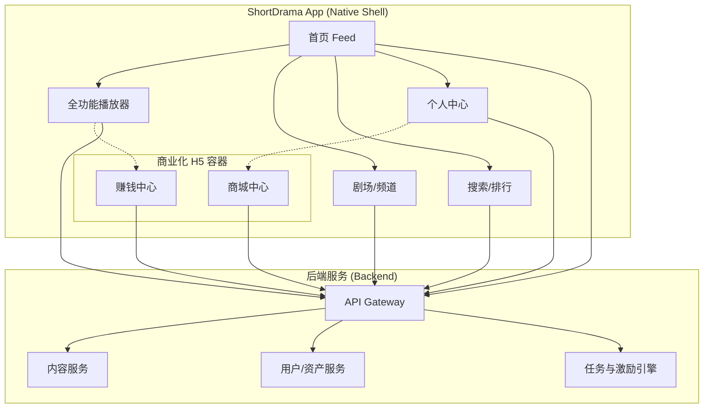
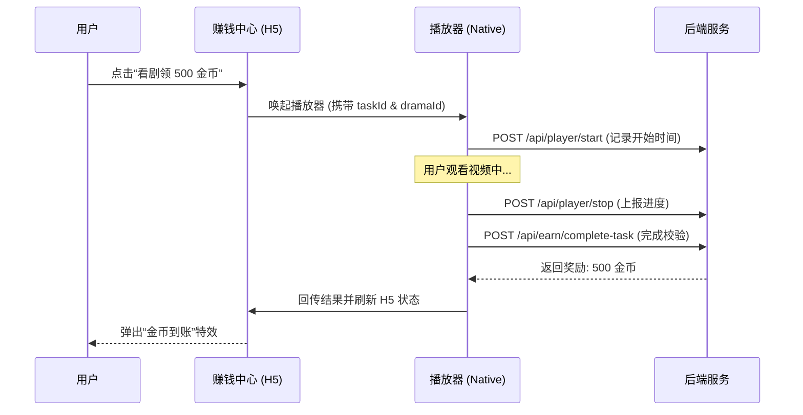
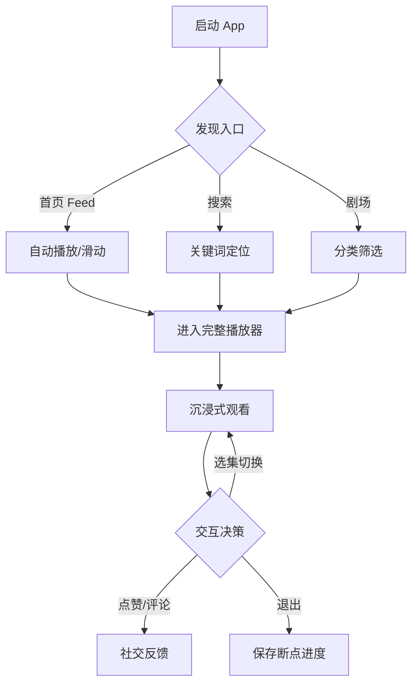

# 业务愿景与核心功能深度解析

## 目录
1. [模块概览](#模块概览)
2. [产品愿景与核心定位](#产品愿景与核心定位)
   - [市场背景与机遇](#市场背景与机遇)
   - [产品核心定位](#产品核心定位)
3. [核心业务价值与驱动因素](#核心业务价值与驱动因素)
4. [功能模块深度解析](#功能模块深度解析)
   - [沉浸式竖屏播放系统（Native）](#沉浸式竖屏播放系统native)
   - [多维内容发现与剧场体系（Native）](#多维内容发现与剧场体系native)
   - [商业化与激励中心（Hybrid H5）](#商业化与激励中心hybrid-h5)
   - [用户成长与资产管理（Native）](#用户成长与资产管理native)
5. [核心业务流程与交互模型](#核心业务流程与交互模型)
   - [内容消费闭环链路](#内容消费闭环链路)
   - [任务激励与价值兑换闭环](#任务激励与价值兑换闭环)
6. [技术架构策略与选型逻辑](#技术架构策略与选型逻辑)
   - [混合开发架构（Native + H5）](#混合开发架构native--h5)
   - [全栈类型安全与 Monorepo 管理](#全栈类型安全与-monorepo-管理)
7. [产品演进路线图（Roadmap）](#产品演进路线图roadmap)
8. [文件参考与开发入口](#文件参考与开发入口)

## 模块概览

ShortDrama 是一个定位于高品质竖屏短剧的内容生态平台。本项目不仅是一个简单的视频播放器，而是一个集成了内容分发、社交互动、任务激励和电商变现的综合性移动应用。

在工程实现上，ShortDrama 采用了现代化的 **Monorepo** 架构，将 Android、iOS、Web 以及 Backend 统一在一个代码仓库中。这种结构确保了业务逻辑在多端之间的高度一致性，特别是在处理复杂的激励体系和内容元数据时。

**模块规模与覆盖范围**：
- **代码规模**：包含 450+ 个核心源文件，覆盖了从底层数据库 Schema 到上层 UI 组件的全链路实现。
- **子模块定义**：
  - `android/`: 采用 Kotlin 2.0 + Jetpack Compose，专注于高性能的视频渲染和流畅的 UI 交互。
  - `ios/`: 采用 Swift 6 + SwiftUI，利用原生框架提供极致的系统集成体验。
  - `backend/`: 基于 Next.js 16 的 API Routes，负责业务逻辑处理、任务引擎和数据持久化。
  - `docs/ & wiki/`: 沉淀了从竞品调研到技术决策（ADR）的完整知识体系。

本章节将深入探讨 ShortDrama 的业务逻辑，揭示“我们为什么构建这些功能”以及“这些功能如何共同支撑产品的商业目标”。

## 产品愿景与核心定位

### 市场背景与机遇
随着移动互联网进入碎片化时代，竖屏短剧以其“高反转、强节奏、低门槛”的特点迅速占领了用户的碎片时间。ShortDrama 的诞生正是为了捕捉这一趋势，通过 fork 行业领先者（如红果短剧）的成功经验，并结合自身的技术优势进行二次创新。

### 产品核心定位
ShortDrama 的定位可以概括为：**“沉浸式内容消费 + 强激励用户留存”**。
- **沉浸式**：通过 Native 端的深度优化，消除视频切换的卡顿感，让用户进入“心流”状态。
- **强激励**：将用户的观看时长转化为可度量的价值（金币），通过物质奖励对冲内容消费的疲劳感。

下图展示了 ShortDrama 的产品生态结构，清晰地界定了 Native 与 H5 的职责边界：



**图表说明**：
ShortDrama 采用“混合架构”策略。对于高频交互、对性能要求极高的内容消费模块（首页、播放器、剧场），我们坚持使用 Native 实现；而对于业务逻辑变动频繁、运营活动密集的商业化模块（商城、赚钱中心），则采用 H5 容器。这种设计在保证用户体验的同时，极大提升了业务的灵活性。

**Section sources**:
- [PRODUCT.md](PRODUCT.md)
- [docs/product_manager/prd/2026-07-24-project-init/prd.md](docs/product_manager/prd/2026-07-24-project-init/prd.md)

## 核心业务价值与驱动因素

ShortDrama 的商业成功依赖于以下三个核心驱动因素：

1.  **内容分发效率**：通过首页 Feed 流的自动播放和个性化推荐（规划中），减少用户的决策成本。
2.  **用户粘性（Retention）**：通过“看剧赚金币”的任务体系，将用户从单纯的“看客”转化为“任务参与者”，显著提升次留和周留。
3.  **商业变现闭环**：通过商城引导用户进行二次消费，或通过激励视频广告（远期）实现流量变现。

> 💡 **核心逻辑**：用户的观看时间是平台的资产。我们通过金币回馈用户的时间投入，再通过商城和广告将这些时间转化为平台的收入。

## 功能模块深度解析

### 沉浸式竖屏播放系统（Native）
播放器是 ShortDrama 最核心的交互组件。它不仅是一个视频播放窗口，更是一个复杂的业务承载器。

- **手势交互**：支持上下滑动无缝切换剧集，左右滑动进入剧集详情或评论区。
- **播放控制**：集成倍速调整（0.5x - 2.0x）、选集面板、断点续播功能。
- **互动层**：在视频上方覆盖轻量化的互动 UI，支持点赞、收藏、分享，且不中断视频播放。

**代码示例（Android 播放器路由集成）**：
```kotlin
// android/app/src/main/java/com/djs66256/short_drama/navigation/NavGraph.kt
composable(
    route = AppDestination.Route.PLAY,
    arguments = listOf(navArgument(AppDestination.Arg.VIDEO_ID) { type = NavType.StringType })
) {
    // 渲染 Native 播放器屏幕
    PlayerScreen()
}
```

### 多维内容发现与剧场体系（Native）
为了防止用户产生“内容荒”，我们构建了多层级的内容发现体系：

- **剧场频道**：按性别（男频/女频）、题材（都市、玄幻、重生）进行精细化分类。
- **排行体系**：提供热榜、新剧榜、预约榜，利用从众心理引导用户消费。
- **搜索发现**：集成热搜词云、搜索历史，支持关键词精准匹配。

### 商业化与激励中心（Hybrid H5）
这是产品的“造血”模块，通过 H5 容器接入以实现快速迭代。

- **商城中心**：展示商品 Feed 流，支持金币抵扣和活动促销。
- **赚钱中心**：核心是任务引擎，包括新手任务（新人 7 天保底）、日常任务（看剧 5 分钟领 100 金币）。

**业务逻辑图：任务激励闭环流程**



**图表说明**：
该流程展示了 Native 与 H5 的深度协同。任务的触发在 H5，但行为的执行和校验在 Native 及后端。通过 `POST /api/earn/complete-task` 接口，我们确保了任务完成的真实性和安全性。

### 用户成长与资产管理（Native）
作为用户的“个人空间”，该模块负责管理所有非内容消费类的私有数据。

- **资产看板**：直观展示金币余额、剧币、优惠券。
- **观看足迹**：记录用户的观看历史，支持跨端同步。
- **订阅与预约**：管理用户感兴趣的未完结剧集，通过系统消息提醒更新。

**Section sources**:
- [docs/product_manager/prd/2026-07-25-full-player/prd.md](docs/product_manager/prd/2026-07-25-full-player/prd.md)
- [docs/product_manager/prd/2026-07-25-earn-center/prd.md](docs/product_manager/prd/2026-07-25-earn-center/prd.md)
- [backend/src/lib/schemas.ts](backend/src/lib/schemas.ts)

## 核心业务流程与交互模型

### 内容消费闭环链路
用户从“发现内容”到“深度消费”的典型路径如下：



**图表说明**：
ShortDrama 的交互设计遵循“最短路径原则”。首页 Feed 流让用户在 0 秒内进入消费状态，而搜索和剧场则作为精准流量的补充，最终汇聚到全功能的 Native 播放器中。

### 任务激励与价值兑换闭环
这是驱动用户持续回访的核心逻辑：

1.  **触达**：用户通过底部导航进入“赚钱”频道。
2.  **激活**：用户被“签到领金币”或“看剧领现金”任务吸引。
3.  **执行**：用户在播放器中完成指定的观看时长。
4.  **转化**：金币累积到一定数额后，用户进入“商城”兑换实物或虚拟权益。

## 技术架构策略与选型逻辑

### 混合开发架构（Native + H5）
我们选择 Native + H5 的混合模式是基于以下考量：
- **性能**：视频播放和列表滚动必须是 Native 的，以保证 60fps 的流畅度。
- **动态性**：商城和任务中心的 UI 布局经常变化，H5 可以实现“免发版更新”。

### 全栈类型安全与 Monorepo 管理
通过在 `backend/src/lib/schemas.ts` 中定义统一的 Zod Schema，我们实现了从数据库到 API 再到多端 UI 的**全栈类型约束**。

**代码示例（统一数据模型定义）**：
```typescript
// backend/src/lib/schemas.ts
export const DramaSchema = z.object({
  id: z.string().uuid(),
  title: z.string().min(1),
  cover_url: z.string().url().nullable(),
  episode_count: z.number().int().min(0),
  tags: z.array(z.string()).default([]),
});
```

这种模式极大地降低了前后端联调时的沟通成本，任何数据结构的变更都能在编译期被各端感知。

## 产品演进路线图（Roadmap）

ShortDrama 的开发路线分为四个关键里程碑：

| 阶段 | 周期 | 核心重点 | 目标 |
| :--- | :--- | :--- | :--- |
| **Phase 1** | Sprint 1-3 | **核心消费** | 实现 Feed 流、播放器和搜索发现，建立最基础的看剧链路。 |
| **Phase 2** | Sprint 4 | **互动与增长** | 引入用户体系、评论系统和签到功能，开始沉淀用户数据。 |
| **Phase 3** | Sprint 5 | **商业化闭环** | 上线剧场频道、商城和赚钱中心，验证商业模式。 |
| **Phase 4** | UI Wave | **体验收口** | 全面进行 UI 对齐，优化加载速度，提升各端视觉一致性。 |

**Section sources**:
- [docs/product_manager/roadmap.md](docs/product_manager/roadmap.md)

## 文件参考与开发入口

为了深入理解业务实现，建议开发者参考以下核心文件：

- **业务定义与愿景**：
  - `PRODUCT.md`: 产品基本信息与技术标识。
  - `docs/product_research/mobile/index.md`: 竞品调研深度报告。
- **核心功能 PRD**：
  - `docs/product_manager/prd/2026-07-25-full-player/prd.md`: 播放器交互细节。
  - `docs/product_manager/prd/2026-07-25-earn-center/prd.md`: 任务引擎逻辑。
  - `docs/product_manager/prd/2026-07-25-mall/prd.md`: 商城承载策略。
- **技术实现入口**：
  - `ios/ShortDrama/Sources/App/AppShellView.swift`: iOS 端应用骨架。
  - `android/app/src/main/java/com/djs66256/short_drama/navigation/NavGraph.kt`: Android 端导航中枢。
  - `backend/src/repositories/mock/earn.mock.repository.ts`: 任务奖励逻辑的后端实现。
