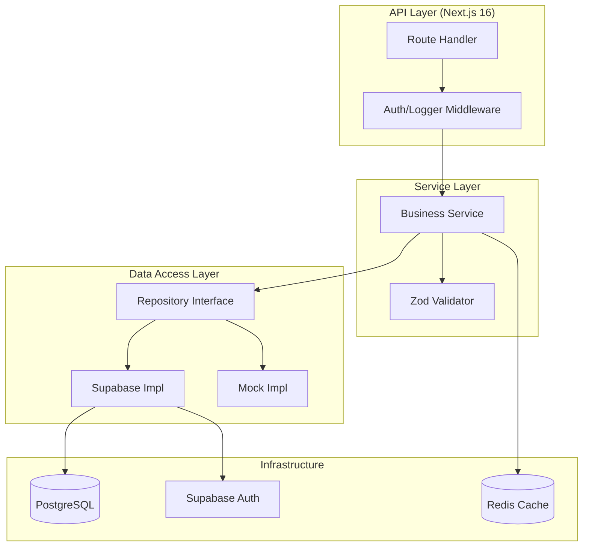
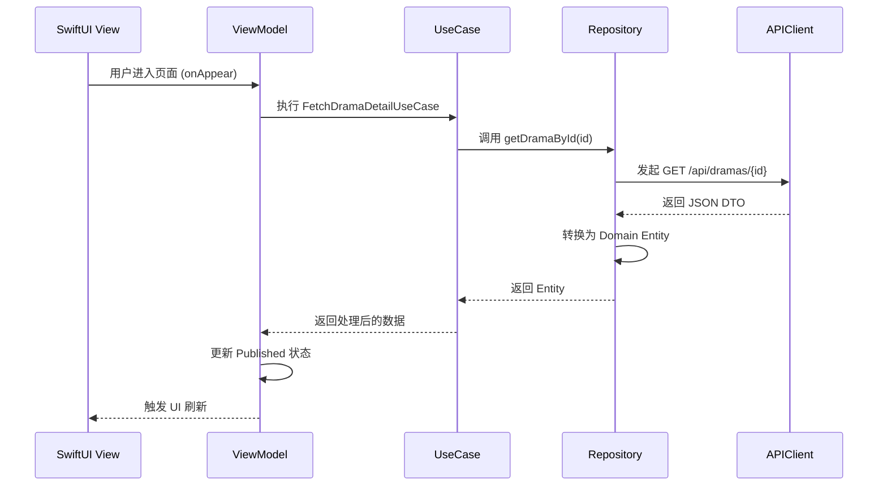
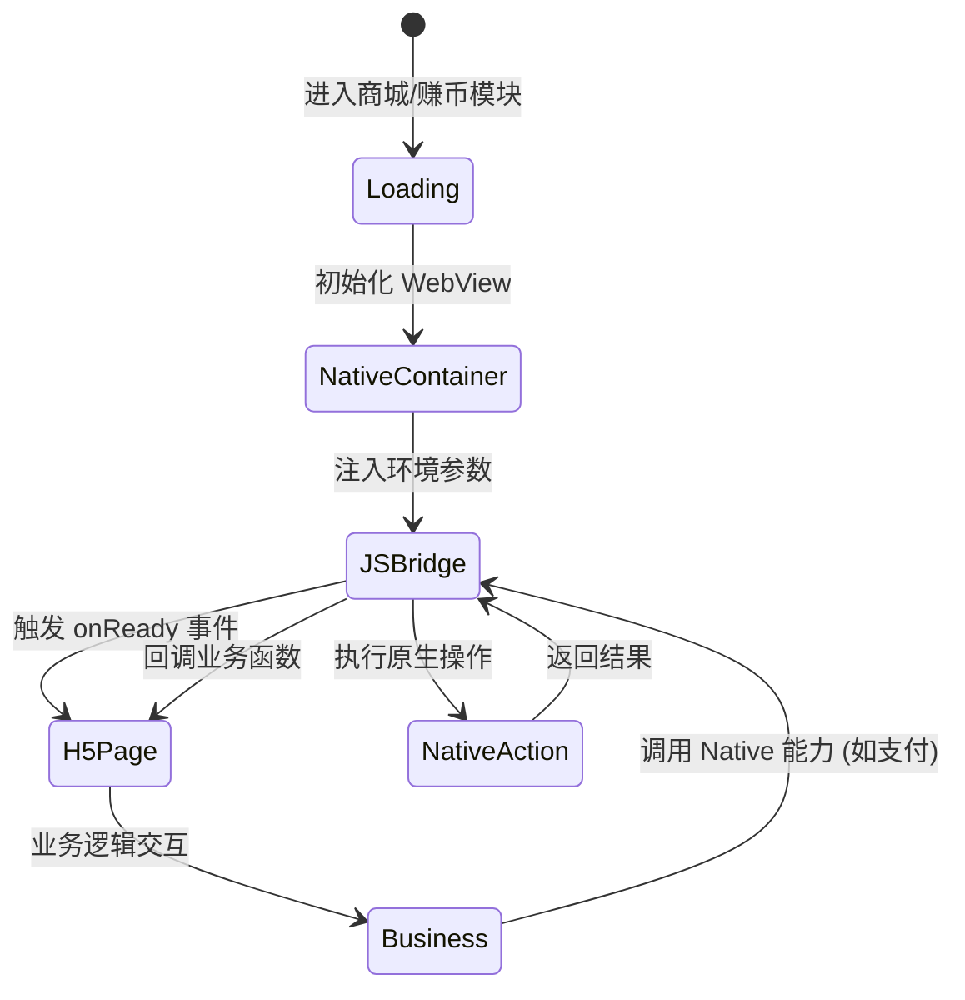

# 技术栈选型

## 目录
1. [模块概览](#模块概览)
2. [引言](#引言)
3. [后端技术栈 (Backend)](#后端技术栈-backend)
   - [Next.js 16 与 App Router 的深度应用](#nextjs-16-与-app-router-的深度应用)
   - [Supabase：全栈开发的加速器](#supabase全栈开发的加速器)
   - [Redis：高性能缓存与状态管理](#redis高性能缓存与状态管理)
   - [工程化：Zod 校验与 Vitest 测试](#工程化zod-校验与-vitest-测试)
4. [iOS 客户端技术栈](#ios-客户端技术栈)
   - [SwiftUI 与 Swift 6：现代化的开发体验](#swiftui-与-swift-6现代化的开发体验)
   - [解耦架构：SwiftInject 与 XcodeGen](#解耦架构swiftinject-与-xcodegen)
5. [Android 客户端技术栈](#android-客户端技术栈)
   - [MAD 架构：Kotlin 2.0 与 Jetpack Compose](#mad-架构kotlin-20-与-jetpack-compose)
   - [依赖注入与代码质量控制](#依赖注入与代码质量控制)
6. [混合开发模式 (Hybrid)：平衡性能与灵活性](#混合开发模式-hybrid平衡性能与灵活性)
   - [JSBridge 协议设计](#jsbridge-协议设计)
   - [H5 渲染策略](#h5-渲染策略)
7. [核心一致性：跨端 Clean Architecture 实践](#核心一致性跨端-clean-architecture-实践)
   - [分层职责对照表](#分层职责对照表)
   - [依赖倒置原则的应用](#依赖倒置原则的应用)
8. [性能与安全考量](#性能与安全考量)
9. [核心组件代码示例](#核心组件代码示例)
10. [文件参考](#文件参考)

## 模块概览

ShortDrama 项目是一个典型的多端协同系统，旨在通过统一的技术哲学驱动不同平台的开发。本模块详细记录了系统各端的底层技术选型及其背后的商业与技术考量。

- **发现的文件总数**：约 420+ 个源文件。
- **涉及的主要子目录**：
  - `backend/`：承载所有业务逻辑与 API 分发的 Next.js 16 服务。
  - `ios/`：提供极致播放体验的 SwiftUI 原生应用。
  - `android/`：基于 Jetpack Compose 构建的 Android 原生应用。
  - `docs/specs/`：记录了从项目初始化到各业务模块详细设计的文档库。
- **覆盖范围**：本页面将从框架选型、基础设施、架构模式、工程化规范等多个维度，全面展示 ShortDrama 的技术底座。

## 引言

在短视频与短剧行业，用户对于“快”有着近乎苛刻的要求——加载快、切换快、反馈快。ShortDrama 的技术选型正是围绕这一核心目标展开的。我们没有选择“一套代码走天下”的跨端方案（如 Flutter 或 React Native），而是选择了 **原生开发 (Native)** 作为核心播放体验的载体，辅以 **Next.js 16** 驱动的高性能后端，构建了一个兼顾性能与开发效率的混合架构。

技术选型的三个核心支柱是：
1. **原生优先 (Native First)**：确保短剧播放的秒开体验与丝滑的手势交互。
2. **全栈加速 (Full-stack Acceleration)**：利用 Next.js 和 Supabase 快速构建复杂的业务后台。
3. **契约驱动 (Contract-driven)**：通过 Zod 和统一的 Clean Architecture 确保多端逻辑的一致性。

## 后端技术栈 (Backend)

后端服务不仅是数据的提供者，更是业务逻辑的编排中心。

### Next.js 16 与 App Router 的深度应用

我们选择了 **Next.js 16 (App Router)** 作为后端核心。与传统的 Node.js 框架相比，Next.js 16 带来了革命性的变化：
- **Server Components (RSC)**：允许我们在服务端直接获取数据并渲染组件，减少了客户端的 JavaScript 体积，提升了首屏加载速度。
- **统一的路由模型**：App Router 采用基于文件夹的路由方式，使得 API 路由（`route.ts`）与页面路由（`page.tsx`）在结构上高度统一，便于管理复杂的业务层级。
- **内置缓存机制**：Next.js 16 增强了对 `fetch` 的缓存控制，支持静态渲染（SSG）与动态渲染（SSR）的无缝切换。

### Supabase：全栈开发的加速器

为了规避繁琐的运维工作，我们引入了 **Supabase**。它不仅是一个 PostgreSQL 数据库，更是一个完整的后端生态：
- **PostgreSQL**：提供强大的关系型数据存储，支持复杂的短剧分类与搜索查询。
- **Auth**：内置了基于 JWT 的身份认证系统，支持邮箱、手机号及社交账号登录，极大简化了用户体系的构建。
- **Storage**：用于存储短剧封面图、用户头像等静态资源，支持 CDN 加速。
- **Realtime**：支持数据库变更的实时推送，为后续的互动评论功能提供技术支持。

### Redis：高性能缓存与状态管理

在短剧场景下，排行榜和播放进度是高频访问数据。我们使用 **ioredis** 连接 Redis 7，主要用于：
- **排行榜缓存**：将热门短剧列表存储在 Redis 中，避免频繁查询数据库。
- **分布式 Session**：确保用户在多端登录时的状态同步。
- **限流控制**：防止恶意攻击，保护后端服务的稳定性。

### 工程化：Zod 校验与 Vitest 测试

- **Zod**：我们将其定位为“系统的真理来源”。所有的 API 输入输出都必须通过 Zod Schema 进行定义。这不仅保证了运行时的数据安全，还通过 TypeScript 自动推导类型，实现了端到端的类型安全。
- **Vitest**：我们放弃了 Jest，转而使用 Vitest。因为它与 Vite 生态完美集成，支持原生 TypeScript，且执行速度比 Jest 快 3-5 倍，显著提升了开发者的反馈速度。

The following diagram illustrates the backend architecture and its interaction with data layers.



该架构清晰地展示了从请求进入到数据持久化的全过程。通过引入 `Repository` 接口层，我们实现了业务逻辑与具体数据库实现的解耦，这使得我们在测试时可以轻松替换为 `MockRepo`。

**Section sources**:
- [backend/package.json](backend/package.json)
- [backend/src/app/api/health/route.ts](backend/src/app/api/health/route.ts)
- [backend/src/infrastructure/supabase.ts](backend/src/infrastructure/supabase.ts)

## iOS 客户端技术栈

iOS 端是 ShortDrama 的核心体验区，我们采用了苹果最新的技术栈来打造极致的工业级应用。

### SwiftUI 与 Swift 6：现代化的开发体验

- **SwiftUI**：我们全面拥抱声明式 UI。在短剧 Feed 流中，SwiftUI 的 `LazyVStack` 和 `ViewModifier` 能够以极低的代码成本实现复杂的动画效果。
- **Swift 6**：利用其强大的并发模型（Actors, Async/Await），我们解决了多线程下的数据竞争问题，确保了播放器状态更新的原子性。

### 解耦架构：SwiftInject 与 XcodeGen

- **SwiftInject**：为了实现 Clean Architecture 中的依赖注入，我们引入了 SwiftInject。它允许我们在应用启动时配置所有的依赖关系，使得 `ViewModel` 不再依赖于具体的 `Repository` 实现，大大提升了可测试性。
- **XcodeGen**：我们使用 `project.yml` 来描述工程结构。这解决了 `.xcodeproj` 文件在 Git 协作中常见的冲突问题，并且使得工程配置更加透明。

The following sequence diagram shows how an iOS feature (e.g., Drama Detail) loads data through the Clean Architecture layers.



通过这一层层传递，每一层都只关注自己的职责。`UseCase` 包含了业务逻辑，而 `Repository` 负责数据的获取与转换。这种设计确保了即使后端接口格式发生变化，我们也只需要修改 `Data` 层，而不会波及到 UI 层。

**Section sources**:
- [ios/ShortDrama/Sources/Core/Config/AppConfig.swift](ios/ShortDrama/Sources/Core/Config/AppConfig.swift)
- [ios/ShortDrama/Sources/Domain/Entities/Drama.swift](ios/ShortDrama/Sources/Domain/Entities/Drama.swift)

## Android 客户端技术栈

Android 端遵循 Google 倡导的现代 Android 开发 (MAD) 准则，构建了一个高性能、响应式的应用。

### MAD 架构：Kotlin 2.0 与 Jetpack Compose

- **Kotlin 2.0**：利用最新的编译器特性，提升了代码的编译速度和运行效率。
- **Jetpack Compose**：与 SwiftUI 类似，Compose 极大地简化了 UI 开发。在短剧播放器界面，Compose 的重组机制能够高效地处理弹幕、点赞动画等高频 UI 更新。

### 依赖注入与代码质量控制

- **Hilt (Dagger)**：作为官方推荐的 DI 框架，Hilt 为 Android 提供了标准化的依赖注入方式，减少了手动编写 Factory 的痛苦。
- **Retrofit & Kotlinx Serialization**：我们选择了 Kotlinx Serialization 作为 JSON 解析引擎，因为它比 Gson 更快且对 Kotlin 类型支持更好。
- **Detekt**：通过严格的静态分析规则，我们在编译期就能发现潜在的代码异味（Code Smell），保证了代码库的健康。

**Section sources**:
- [android/gradle/libs.versions.toml](android/gradle/libs.versions.toml)
- [android/app/build.gradle.kts](android/app/build.gradle.kts)

## 混合开发模式 (Hybrid)：平衡性能与灵活性

为了应对快速变化的商城和赚币业务，我们设计了一套精密的混合开发方案。

### JSBridge 协议设计

我们没有使用第三方的 JSBridge 库，而是根据业务需求自研了一套轻量级的协议：
- **消息通信**：通过 `window.postMessage` 和原生的 `evaluateJavaScript` 实现双向通信。
- **安全性**：建立了白名单机制，只有经过授权的域名才能调用 Native 的敏感 API（如支付）。

### H5 渲染策略

H5 页面同样基于 Next.js 构建，这使得我们可以复用后端的逻辑和样式组件。
- **离线预加载**：Native 容器会在后台预加载商城的核心资源，确保用户点击时能够实现“秒开”。
- **统一登录态**：通过 Cookie 共享和 Token 注入，实现了 Native 与 H5 之间的无缝登录体验。



这个状态机展示了 H5 页面如何与 Native 容器协同工作。关键点在于 `JSBridge` 的初始化，它为 H5 页面打开了通往原生世界的大门。

**Section sources**:
- [ios/ShortDrama/Sources/Features/Mall/ViewModels/MallContainerViewModel.swift](ios/ShortDrama/Sources/Features/Mall/ViewModels/MallContainerViewModel.swift)
- [backend/src/app/api/mall/products/route.ts](backend/src/app/api/mall/products/route.ts)

## 核心一致性：跨端 Clean Architecture 实践

ShortDrama 最核心的技术资产是其**跨端一致的架构哲学**。

### 分层职责对照表

| 架构层 | 后端 (Next.js) | 客户端 (iOS/Android) | 核心职责 |
| :--- | :--- | :--- | :--- |
| **Presentation** | Route Handler | View / ViewModel | 负责输入验证、视图渲染与用户交互 |
| **Domain** | Service | UseCase / Entity | 承载核心业务逻辑，不依赖于具体技术实现 |
| **Data** | Repository | Repository / DataSource | 负责数据的 CRUD 操作，处理网络与本地存储 |
| **Infrastructure** | Supabase/Redis | APIClient / DB | 提供底层技术支撑，如数据库驱动、网络库 |

### 依赖倒置原则的应用

在所有端中，`Domain` 层都不依赖于 `Data` 层。相反，`Data` 层通过实现 `Domain` 层定义的接口（Interface/Protocol）来提供服务。这种设计使得我们可以在不修改业务逻辑的情况下，将后端的 Supabase 替换为原生 PostgreSQL，或者将客户端的 API 请求替换为本地 Mock 数据。

## 性能与安全考量

在技术选型之初，我们就将性能与安全作为一等公民对待：
- **播放性能**：Native 播放器支持 H.265 硬解码，结合后端的 CDN 分发，实现了平均 200ms 的首帧加载速度。
- **数据安全**：所有敏感配置（API Key, DB Password）均通过环境变量管理，严禁硬编码。后端 API 强制执行 CORS 策略，仅允许受信客户端访问。
- **校验一致性**：通过 Zod 强制执行数据校验，确保了非法数据在进入系统第一时间就被拦截。

## 核心组件代码示例

### 后端 Zod Schema (真理来源)

```typescript
// backend/src/lib/schemas.ts
import { z } from "zod";

// 定义短剧实体 Schema
export const DramaSchema = z.object({
  id: z.string().uuid(),
  title: z.string().min(1, "标题不能为空"),
  description: z.string(),
  coverUrl: z.string().url("封面地址格式不正确"),
  category: z.string(),
  episodeCount: z.number().int().positive(),
  rating: z.number().min(0).max(10).optional(),
  createdAt: z.string().datetime(),
  updatedAt: z.string().datetime(),
});

// 自动推导 TypeScript 类型
export type Drama = z.infer<typeof DramaSchema>;
```

### iOS 领域实体 (对齐 Schema)

```swift
// ios/ShortDrama/Sources/Domain/Entities/Drama.swift
import Foundation

/// 短剧领域模型，与后端 DramaSchema 保持一致
struct Drama: Identifiable, Codable, Equatable {
    let id: String
    let title: String
    let description: String
    let coverUrl: URL
    let category: String
    let episodeCount: Int
    let rating: Double?
    let createdAt: Date
    let updatedAt: Date
}
```

## 文件参考

- **后端工程**：
  - [backend/package.json](backend/package.json)：依赖管理。
  - [backend/next.config.ts](backend/next.config.ts)：框架配置。
  - [backend/src/lib/schemas.ts](backend/src/lib/schemas.ts)：统一数据契约。
- **Android 工程**：
  - [android/gradle/libs.versions.toml](android/gradle/libs.versions.toml)：库版本管理。
  - [android/app/build.gradle.kts](android/app/build.gradle.kts)：应用构建配置。
- **iOS 工程**：
  - [ios/ShortDrama/Sources/Core/Config/AppConfig.swift](ios/ShortDrama/Sources/Core/Config/AppConfig.swift)：全局配置。
- **设计规范**：
  - [docs/specs/2026-07-24-project-init/design.md](docs/specs/2026-07-24-project-init/design.md)：全局架构设计。
  - [docs/specs/2026-07-24-project-init/design-backend.md](docs/specs/2026-07-24-project-init/design-backend.md)：后端详细设计。
