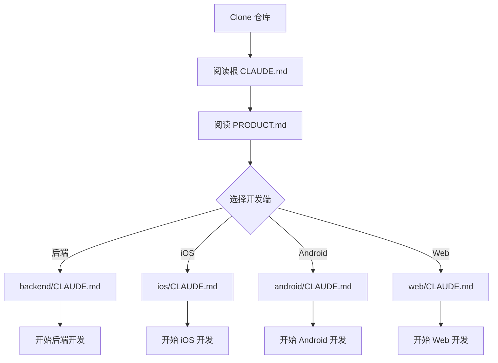
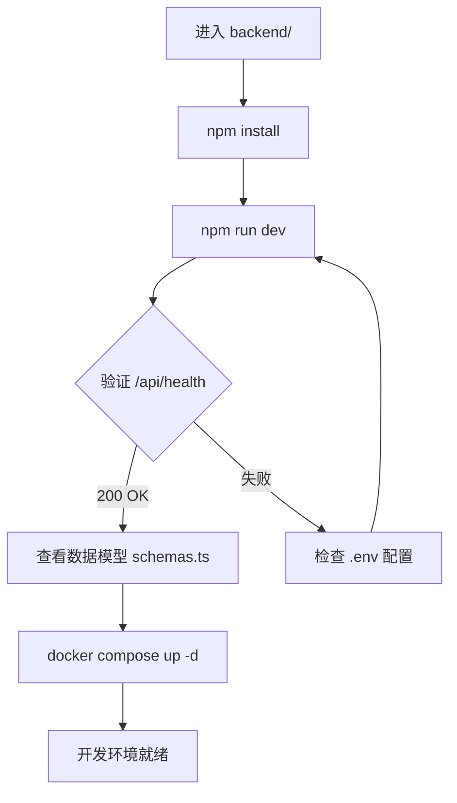
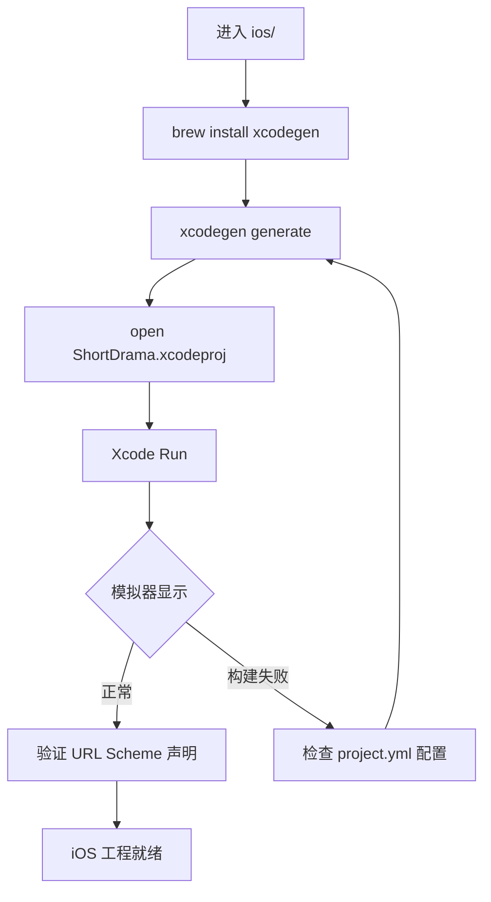
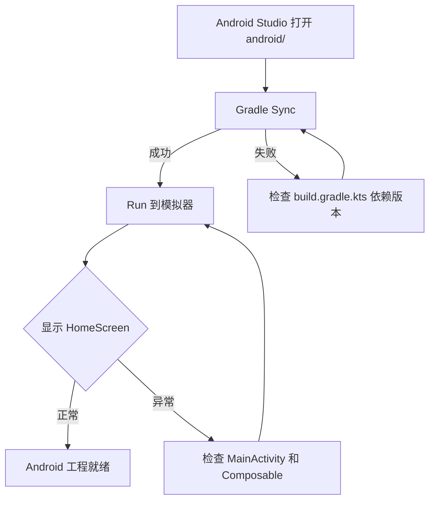
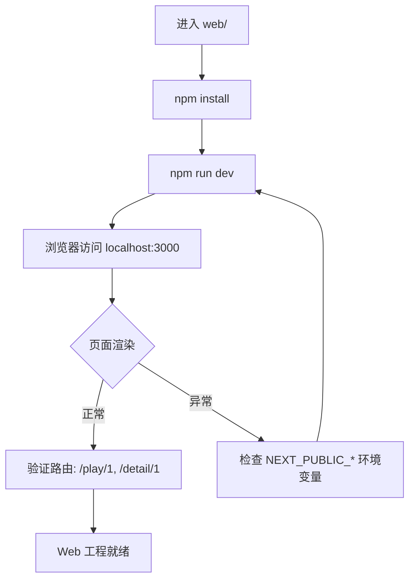
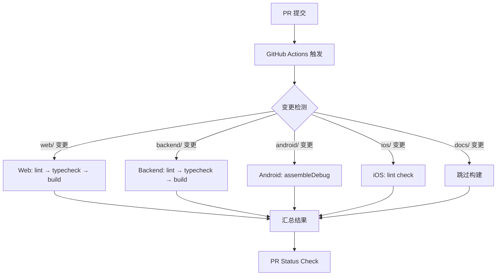
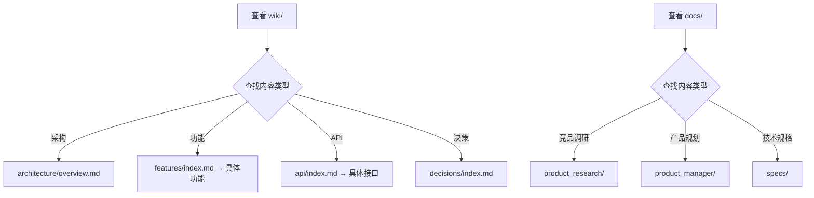

# PRD：项目初始化与架构设计

> 创建日期：2026-07-24
> 状态：草稿
> 作者：AI Agent + daniel

---

## 1. 需求背景

### 1.1 问题描述

- **现状**：项目仓库为空，尚未建立任何工程目录、技术栈选型或开发基础设施。
- **痛点**：团队需要 fork 竞品（红果短剧）的核心体验来构建 ShortDrama 产品，但在开始业务功能开发之前，必须先完成项目基础架构搭建。否则各端开发将缺少统一的工程规范、技术约束和协作基础，导致后期维护成本急剧上升。
- **竞品参考**：红果短剧是一款成熟的竖屏短剧内容平台，提供首页信息流、剧集详情、播放器、搜索、剧场频道、赚金币中心等完整功能矩阵。我们 fork 其核心体验，但不直接 clone 其技术实现。

### 1.2 目标用户

| 用户角色 | 特征描述 | 核心需求 |
|---------|---------|---------|
| 后端开发工程师 | TypeScript/Node.js 技术栈，开发 API 服务 | 清晰的后端项目结构、API 规范、数据库 schema、开发环境 |
| iOS 开发工程师 | Swift/SwiftUI 技术栈，开发 iOS 客户端 | Xcode 工程配置、代码风格规范、网络层基础能力 |
| Android 开发工程师 | Kotlin/Compose 技术栈，开发 Android 客户端 | Gradle 工程配置、代码风格规范、网络层基础能力 |
| Web 前端开发工程师 | React/Next.js 技术栈，开发 Web 前端 | Next.js 工程配置、组件规范、路由设计 |
| 全栈/DevOps | 关注 CI/CD、部署、开发环境一致性 | Docker Compose 本地环境、CI 流水线、部署方案 |

### 1.3 预期目标

- **业务目标**：建立可支持多端并行开发的 monorepo 工程骨架，包含 android/、ios/、web/、backend/ 四个子工程，以及 wiki/、docs/ 两个文档协作目录。项目初始化完成后，团队可直接进入业务功能的开发（首页信息流、播放器、详情页等），无需再讨论基础架构。

### 1.4 范围定义

| 范围内 | 范围外（明确不做） | 原因 |
|--------|------------------|------|
| 各端工程初始化（Android/iOS/Web/Backend） | 业务功能代码（首页 Feed、播放器等） | 业务功能由后续 PRD 驱动 |
| 技术栈选型与版本锁定 | 性能优化、安全加固 | 属于后续迭代 |
| 统一 API 规范与基础路由骨架 | 完整的用户认证体系 | 属于后续 PRD |
| 数据模型基础定义（Drama/Episode/User） | 推荐算法、AI 相关能力 | 属于远期规划 |
| CI/CD 流水线骨架 | 生产环境部署配置 | 先聚焦开发环境 |
| Docker Compose 本地开发环境 | 数据迁移/备份方案 | 属于运维阶段 |
| 各端 CLUADE.md 协作规范 | — | — |
| PRODUCT.md 产品信息定义 | — | — |
| Wiki 知识库骨架 | — | — |
| 文档目录结构初始化（docs/） | — | — |

---

## 2. 涉及平台

| 平台 | 是否涉及 | 变更概要 |
|------|---------|---------|
| Backend | ✅ 涉及 | 新建 Next.js 16 + TypeScript 后端工程，含 API 骨架、数据模型、Docker Compose |
| Web | ✅ 涉及 | 新建 Next.js 16 + React 19 前端工程，含路由骨架、组件规范 |
| iOS | ✅ 涉及 | 新建 Swift 6 + SwiftUI + XcodeGen 工程 |
| Android | ✅ 涉及 | 新建 Kotlin 2.0 + Jetpack Compose + Gradle 工程 |

---

## 3. 用户故事

| 编号 | 角色 | 需求 | 验收标准 | 涉及平台 | 优先级 |
|------|------|------|---------|---------|--------|
| US-01 | 全栈工程师 | 建立 monorepo 顶层结构与跨端约束 | 根目录 CLAUDE.md 定义全局规则、目录职责、跨端约束；PRODUCT.md 定义产品信息；各端目录已创建且有 .gitkeep | 全部 | P0 |
| US-02 | 后端开发工程师 | 初始化 Backend 工程 | Next.js 16 项目可运行 `npm run dev`；`/api/health` 端点返回 `{"status":"ok","version":"0.1.0"}`；Zod schema 定义基础数据模型（Drama/Episode）；Docker Compose 一键启动 Redis + 数据库；backend/CLAUDE.md 定义后端规范 | Backend | P0 |
| US-03 | iOS 开发工程师 | 初始化 iOS 工程 | XcodeGen 可通过 `project.yml` 生成 `.xcodeproj`；SwiftUI 入口渲染应用名称和版本号；Info.plist 声明 djsdrama:// URL Scheme；ios/CLAUDE.md 定义 iOS 规范 | iOS | P0 |
| US-04 | Android 开发工程师 | 初始化 Android 工程 | Gradle 构建成功，APK 可安装运行；Compose 入口渲染应用名称和版本号；AndroidManifest 声明 LAUNCHER Activity；android/CLAUDE.md 定义 Android 规范（注：Android Deep Links 暂不配置，见 Q-03） | Android | P0 |
| US-05 | Web 前端开发工程师 | 初始化 Web 前端工程 | Next.js 16 + React 19 项目可运行 `npm run dev`；首页渲染应用名称和版本号；路由骨架（`/`、`/play/[id]`、`/detail/[id]`）；web/CLAUDE.md 定义前端规范 | Web | P0 |
| US-06 | 全栈工程师 | 建立 CI/CD 流水线 | GitHub Actions 工作流文件就位；PR 触发 lint + typecheck + build；可扩展到 CD 部署 | 全部 | P0 |
| US-07 | 全栈工程师 | 建立 Wiki 知识库骨架 | wiki/ 目录结构就位（architecture/、features/、api/、decisions/）；wiki/index.md 索引已生成 | — | P1 |
| US-08 | 全栈工程师 | 初始化文档目录结构 | docs/ 目录结构就位（product_research/、product_manager/、specs/）；docs/README.md 说明各子目录用途 | — | P1 |

---

## 4. 核心流程

### 4.1 US-01：Monorepo 顶层结构与跨端约束

#### 用户旅程

1. 开发者 clone 仓库后，看到清晰的目录结构：
   ```
   /
   ├── CLAUDE.md              # 全局规则 + 目录职责 + 跨端约束
   ├── PRODUCT.md             # 产品信息（名称、简介、竞品、技术标识）
   ├── .gitignore             # 忽略 node_modules、build 产物等
   ├── .github/workflows/     # CI 流水线
   ├── android/               # Android 应用
   ├── ios/                   # iOS 应用
   ├── web/                   # Web 前端
   ├── backend/               # 后端服务
   ├── wiki/                  # 知识库
   └── docs/                  # 项目文档
   ```
2. 开发者阅读根目录 CLAUDE.md，了解：
   - 项目定位（fork 现有应用并推进落地）
   - 各目录职责
   - 协作约定（子目录规则优先于根目录）
   - 开发约束（RESTful API、禁止硬编码常量、第三方库引入审批）
   - Git 规范
3. 开发者阅读 PRODUCT.md，获取产品基本信息（名称 ShortDrama、appId、schema）
4. 各端开发者进入对应目录，遵循各自 CLAUDE.md 中的端特定规范



#### UI/交互要点

不涉及 UI — 此为纯工程结构初始化。

### 4.2 US-02：Backend 工程初始化

#### 用户旅程

1. 开发者进入 `backend/` 目录
2. 执行 `npm install && npm run dev`，服务启动在 `http://localhost:3000`
3. 访问 `http://localhost:3000/api/health`，得到 `{"status":"ok","version":"0.1.0"}`
4. 查看 `backend/src/lib/schemas.ts`，了解已定义的数据模型（Drama、Episode）
5. 查看 `backend/CLAUDE.md`，了解 API 设计规范（RESTful、版本策略、错误格式）
6. 执行 `docker compose up -d`，一键启动 Redis + PostgreSQL（Supabase）



#### UI/交互要点

| 页面 / 区域 | 交互描述 | 涉及端 | 竞品参考 |
|------------|---------|--------|---------|
| `/` 管理首页 | 展示后端服务名称、版本、环境、API 链接 | Backend | — |
| `/api/health` | JSON 响应，包含 status 和 version 字段 | Backend | — |

#### 关键边界

| 场景 | 预期行为 |
|------|---------|
| 缺少 .env 文件 | 服务启动失败，README 中说明需要配置的环境变量 |
| Docker 未安装 | `docker compose` 命令失败，README 中注明 Docker 为可选依赖 |

### 4.3 US-03：iOS 工程初始化

#### 用户旅程

1. 开发者进入 `ios/` 目录
2. 安装 XcodeGen（如未安装：`brew install xcodegen`）
3. 执行 `xcodegen generate`，从 `project.yml` 生成 `.xcodeproj`
4. 打开 `.xcodeproj` 或 `.xcworkspace`，在 Xcode 中 Run
5. 模拟器显示应用名 "ShortDrama" 和版本号 "0.1.0"
6. 验证 `djsdrama://` URL Scheme 在 Info.plist 中已声明



#### UI/交互要点

| 页面 / 区域 | 交互描述 | 涉及端 | 竞品参考 |
|------------|---------|--------|---------|
| ContentView | 居中展示应用图标、名称 "ShortDrama"、版本号 "0.1.0" | iOS | 参考红果启动页 |

#### 关键边界

| 场景 | 预期行为 |
|------|---------|
| XcodeGen 未安装 | `xcodegen: command not found`，README 中提供安装指引 |
| 首次 Run 签名问题 | Debug 模式使用自动签名，README 中说明 Release 签名配置方式 |

### 4.4 US-04：Android 工程初始化

#### 用户旅程

1. 开发者使用 Android Studio 打开 `android/` 目录
2. Gradle Sync 成功，无依赖解析错误
3. Run 到模拟器/设备，显示应用名 "ShortDrama" 和版本号 "0.1.0"
4. 验证 AndroidManifest.xml 中 LAUNCHER Activity 声明和 Material3 主题配置



#### UI/交互要点

| 页面 / 区域 | 交互描述 | 涉及端 | 竞品参考 |
|------------|---------|--------|---------|
| HomeScreen | 居中展示应用名 + 版本号，Material3 主题 | Android | 参考红果启动页 |

#### 关键边界

| 场景 | 预期行为 |
|------|---------|
| Gradle 依赖下载慢 | README 中建议配置国内镜像（阿里云 maven） |
| Release 签名缺失 | `release-keystore.properties` 不存在时跳过 release 构建配置 |

### 4.5 US-05：Web 前端工程初始化

#### 用户旅程

1. 开发者进入 `web/` 目录
2. 执行 `npm install && npm run dev`，开发服务器启动
3. 浏览器访问 `http://localhost:3000`，看到应用名 "ShortDrama" 和版本号 "0.1.0"
4. 路由骨架就位：`/`（首页）、`/play/[id]`（播放页占位）、`/detail/[id]`（详情页占位）



#### UI/交互要点

| 页面 / 区域 | 交互描述 | 涉及端 | 竞品参考 |
|------------|---------|--------|---------|
| `/` 首页 | 居中展示应用名 + 版本号 + 环境标识 | Web | 参考红果 Web 版首页布局 |
| `/play/[id]` | 占位页面，显示 "播放页 - {id}" | Web | — |
| `/detail/[id]` | 占位页面，显示 "详情页 - {id}" | Web | — |

### 4.6 US-06：CI/CD 流水线

#### 用户旅程

1. 开发者提交 PR 到主分支
2. GitHub Actions 自动触发：
   - Web：`npm ci` → `npm run lint` → `npm run typecheck` → `npm run build`
   - Backend：`npm ci` → `npm run lint` → `npm run typecheck` → `npm run build`
   - Android：`./gradlew assembleDebug`
   - iOS：由于 macOS 依赖，先做 lint/typecheck，完整构建在后续迭代中配置
3. PR 页面显示检查结果（✅ 通过 / ❌ 失败）



### 4.7 US-07~08：Wiki 与文档骨架

#### 用户旅程

1. 开发者进入 `wiki/` 查看项目知识沉淀：
   - `architecture/`：架构设计文档（系统总览、技术栈）
   - `features/`：功能域索引（按功能模块组织的文档）
   - `api/`：API 文档（按业务域组织）
   - `decisions/`：技术决策记录（ADR）
2. 开发者进入 `docs/` 查看项目文档：
   - `product_research/`：竞品调研文档
   - `product_manager/`：PRD、路线图、进展跟踪
   - `specs/`：功能规格说明书（由 feature-workflow 生成）



---

## 5. 依赖

| 依赖项 | 类型 | 说明 | 状态 |
|--------|------|------|------|
| Node.js ≥ 20 | 开发环境 | Web/Backend 运行时 | 需在 README 中注明 |
| Docker Desktop | 开发环境 | Backend 本地基础设施（Redis/Supabase） | 可选依赖 |
| Xcode 27 + XcodeGen | 开发工具 | iOS 构建 | 需在 ios/README 中注明 |
| Android Studio + JDK 21 | 开发工具 | Android 构建 | 需在 android/README 中注明 |
| GitHub Actions | CI/CD | 自动化流水线 | 免费额度内 |
| Supabase | 外部服务 | 数据库 + Auth（后续使用） | 📅 后续 PRD 中接入 |
| Zod ≥ 4 | 第三方库 | 数据校验（Web/Backend） | 已有 |
| Next.js 16 | 第三方库 | Web/Backend 框架 | 已有 |

> ⚠️ **端口冲突注意**：Web 和 Backend 均基于 Next.js 16，默认端口均为 3000。同时本地开发时需要通过 `PORT` 环境变量错开：建议 Backend 使用 3001，Web 保持 3000。各端 `.env.example` 中应包含 `PORT` 配置项。

---

## 6. 现有功能影响

| 现有功能 | 影响类型 | 说明 |
|---------|---------|------|
| — | — | 项目从零开始，无现有功能受影响 |

---

## 7. 技术决策要点

以下是需要在 PRD 阶段明确的技术决策（后续在 spec 阶段细化实现细节）：

### 7.1 技术栈选型

| 层级 | Web | Backend | Android | iOS |
|------|-----|---------|---------|-----|
| 语言 | TypeScript 5.x | TypeScript 5.x | Kotlin 2.0 | Swift 6 |
| 运行时/框架 | Next.js 16 + React 19 | Next.js 16 (API Routes) | Jetpack Compose + Material3 | SwiftUI |
| 数据校验 | Zod ≥ 4 | Zod ≥ 4 | — | — |
| 构建工具 | next build | next build | AGP 8.x + Gradle (Kotlin DSL) | XcodeGen + Xcode 27 |
| 包管理 | npm | npm | Gradle (Version Catalog) | SPM |
| 应用标识 | — | — | com.djs66256.short_drama | com.djs66256.short_drama |
| 最低版本 | — | — | minSdk 26 / compileSdk 36 | iOS 18.0 |

### 7.2 API 设计规范

- RESTful 风格
- URL 格式：`/api/<resource>`（如 `/api/health`、`/api/dramas`、`/api/player/start`）
- JSON 请求/响应
- 错误响应统一格式：`{"error":{"code":"NOT_FOUND","message":"..."}}`
- 版本策略：暂无版本前缀，未来通过 `/api/v2/` 做版本隔离

### 7.3 数据库选择

- 开发/测试环境：Docker Compose 提供的 PostgreSQL（Supabase 兼容）
- 暂不接入真实 Supabase 项目，仅本地开发环境

### 7.4 Monorepo 管理

- 不做 npm workspaces / pnpm workspaces — Web 和 Backend 各自独立 `package.json`
- 不做跨端代码共享（当前阶段），各端独立维护 schema 和数据模型
- **Schema 对齐策略**：Zod schema 以 Backend 的 `src/lib/schemas.ts` 为权威来源。Web 端手动对齐 Backend 的 schema 定义，确保前后端数据结构一致。长期可在后续 spec 阶段评估抽取共享 schema package 的可行性。

---

## 8. 待澄清问题

| 编号 | 问题 | 阻塞 |
|------|------|------|
| Q-01 | Web 前端和 Backend Admin 是否部署在同一域名下？还是分开部署？ | 否（可在 spec 阶段确定） |
| Q-02 | iOS 最低版本是否确定 iOS 18.0？还是要兼容更早版本？ | 否（可在 spec 阶段确定） |
| Q-03 | 是否需要在初始化阶段就配置 Android Deep Links (App Links)？ | 否（可在后续 PRD 中补充） |

---

## 9. 参考资料

### 竞品调研

| 文档 | 关键发现 |
|------|---------|
| `docs/product_research/mobile/index.md` | 红果移动端首页 Feed、任务体系、赚金币等核心功能调研 |

### Wiki 文档

| 文档 | 关键信息 |
|------|---------|
| — | 项目从零开始，wiki 将在初始化阶段生成 |

---

## 10. 变更历史

| 日期 | 变更内容 | 变更原因 |
|------|---------|---------|
| 2026-07-24 | 初始版本 | 项目初始化与架构设计 PRD |
