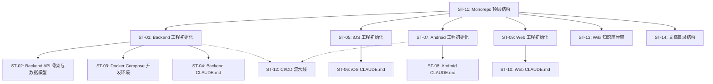

# 子任务拆分：项目初始化与架构设计

> 关联 PRD：[prd.md](prd.md)
> 创建日期：2026-07-24
> 状态：草稿

---

## 工时总览

| 平台 | 子任务数 | 总工时（人日） | 备注 |
|------|---------|--------------|------|
| Backend | 4 | 6.5 | 工程初始化 + API 骨架 + Docker + CLAUDE.md |
| iOS | 2 | 2.0 | 工程初始化 + CLAUDE.md |
| Android | 2 | 2.0 | 工程初始化 + CLAUDE.md |
| Web | 2 | 2.0 | 工程初始化 + CLAUDE.md |
| 跨端 | 4 | 4.0 | 顶层结构 + CI/CD + Wiki + 文档 |
| **合计** | **14** | **16.5** | |

---

## 迭代规划

| 迭代 | 目标 | 包含子任务 | 交付物 |
|------|------|-----------|--------|
| Sprint 1 | 项目骨架可跑通（核心链路） | ST-01, ST-05, ST-07, ST-09, ST-11 | 四端工程可运行，顶层结构就位 |
| Sprint 2 | 基础设施与规范完善 | ST-02, ST-03, ST-04, ST-06, ST-08, ST-10, ST-12, ST-13, ST-14 | API 骨架 + 数据模型 + Docker + CI + Wiki + 各端规范 |

> Sprint 1 约 1 周，各端并行开发无阻塞。Sprint 2 约 1 周，各端并行推进。

---

## 子任务详情

### ST-01：Backend 工程初始化

| 属性 | 值 |
|------|-----|
| **对应 PRD** | US-02 |
| **平台** | Backend |
| **优先级** | P0 |
| **预估工时** | 2 人日 |
| **前置依赖** | ST-11（顶层结构中 backend/ 目录已创建） |
| **迭代** | Sprint 1 |

#### 工作内容

1. 使用 `npx create-next-app@latest backend --typescript` 初始化 Next.js 16 工程（App Router）
2. 配置 `backend/package.json`：锁定 Next.js 16、React 19、TypeScript 5.x、Zod ≥ 4
3. 创建目录结构：
   ```
   backend/
   ├── src/
   │   ├── app/
   │   │   ├── layout.tsx          # 根布局（管理后台入口）
   │   │   ├── page.tsx            # 首页（展示服务名称、版本、环境）
   │   │   └── api/
   │   │       └── health/
   │   │           └── route.ts    # GET /api/health
   │   └── lib/
   │       ├── config.ts           # 环境变量注入（APP_NAME, APP_VERSION）
   │       └── schemas.ts          # Zod schema（先写 HealthResponseSchema）
   ├── .env.example                # 环境变量模板
   ├── tsconfig.json
   ├── package.json
   └── README.md
   ```
4. 实现 `GET /api/health` 返回 `{"status":"ok","version":"0.1.0"}`
5. 后端管理首页展示服务名、版本、环境、API 链接
6. 编写 `backend/README.md`：说明如何启动、环境变量配置

#### 完成标准

- [ ] `npm install && npm run dev` 可启动服务
- [ ] `curl http://localhost:3000/api/health` 返回 `{"status":"ok","version":"0.1.0"}`
- [ ] 浏览器访问 `http://localhost:3000` 显示后端管理页
- [ ] `.env.example` 包含所有必需环境变量
- [ ] `backend/README.md` 包含启动步骤

#### 涉及 API

| 方法 | 路径 | 说明 |
|------|------|------|
| GET | `/api/health` | 健康检查，返回 status + version |

---

### ST-02：Backend API 骨架与数据模型

| 属性 | 值 |
|------|-----|
| **对应 PRD** | US-02 |
| **平台** | Backend |
| **优先级** | P0 |
| **预估工时** | 2 人日 |
| **前置依赖** | ST-01 |
| **迭代** | Sprint 2 |

#### 工作内容

1. 在 `backend/src/lib/schemas.ts` 中定义基础数据模型（Zod）：
   - `DramaSchema`：id, title, description, coverUrl, category, episodeCount, tags, rating
   - `EpisodeSchema`：id, dramaId, title, episodeNumber, videoUrl, duration, thumbnailUrl
   - `UserSchema`：id, nickname, avatarUrl, createdAt
2. 创建 API 路由骨架（返回 mock 数据或 501 Not Implemented）：
   ```
   /api/dramas          → GET（列表）、POST（创建）
   /api/dramas/[id]     → GET（详情）
   /api/episodes/[id]   → GET（剧集详情）
   /api/player/
     /start  → POST（开始播放）
     /stop   → POST（停止播放）
   ```
3. 定义 API 错误响应规范：
   - 统一格式：`{"error":{"code":"NOT_FOUND","message":"..."}}`
   - 常用错误码：`NOT_FOUND`、`VALIDATION_ERROR`、`INTERNAL_ERROR`
4. 添加 `backend/.eslintrc.json` 和 `backend/.prettierrc`
5. 补充 `backend/README.md`：API 目录结构说明、错误格式说明

#### 完成标准

- [ ] Zod Schema 定义覆盖 Drama、Episode、User 三个实体，`npm run typecheck` 通过
- [ ] 所有 API 骨架路由可访问（返回 mock 数据或 501）
- [ ] ESLint + Prettier 配置可用（`npm run lint` 通过）
- [ ] `backend/README.md` 包含 API 设计规范说明

#### 涉及 API

| 方法 | 路径 | 说明 |
|------|------|------|
| GET | `/api/dramas` | 短剧列表（骨架） |
| POST | `/api/dramas` | 创建短剧（骨架） |
| GET | `/api/dramas/[id]` | 短剧详情（骨架） |
| GET | `/api/episodes/[id]` | 剧集详情（骨架） |
| POST | `/api/player/start` | 开始播放（骨架） |
| POST | `/api/player/stop` | 停止播放（骨架） |

---

### ST-03：Docker Compose 本地开发环境

| 属性 | 值 |
|------|-----|
| **对应 PRD** | US-02 |
| **平台** | Backend |
| **优先级** | P0 |
| **预估工时** | 1.5 人日 |
| **前置依赖** | ST-01 |
| **迭代** | Sprint 2 |

#### 工作内容

1. 编写 `backend/docker-compose.yml`：
   - Redis 7：端口 6379，用于缓存和会话管理
   - PostgreSQL 15（Supabase 兼容）：端口 54322，数据库服务
   - Supabase Studio（可选）：端口 54323，管理界面
2. 编写 `backend/.env.example`：补充 Redis URL、Database URL 配置项
3. 在 `backend/src/lib/config.ts` 中读取数据库和 Redis 连接配置
4. 编写健康检查函数（数据库连接检测、Redis 连接检测）
5. 在 `/api/health` 中返回数据库和 Redis 连接状态
6. 补充 `backend/README.md`：Docker 启动步骤

#### 完成标准

- [ ] `docker compose up -d` 启动 Redis + PostgreSQL 无报错
- [ ] `docker compose ps` 显示所有服务 healthy
- [ ] `/api/health` 返回中包含数据库和 Redis 连接状态
- [ ] `docker compose down` 可正常清理

---

### ST-04：Backend CLAUDE.md 编写

| 属性 | 值 |
|------|-----|
| **对应 PRD** | US-02 |
| **平台** | Backend |
| **优先级** | P0 |
| **预估工时** | 1 人日 |
| **前置依赖** | ST-02（API 骨架中已定义 API 规范，CLAUDE.md 在此基础上补充） |
| **迭代** | Sprint 2 |

#### 工作内容

1. 编写 `backend/CLAUDE.md`，内容覆盖：
   - 技术栈说明（Next.js 16 App Router、Zod、TypeScript）
   - 目录结构说明
   - API 设计规范（RESTful 风格、URL 命名、错误格式、版本策略）
   - 数据库操作规范（如使用什么 ORM/查询方式）
   - 环境变量管理规范
   - 禁止事项（硬编码常量、绕过 Zod 校验等）
   - 开发工作流（npm scripts、lint、typecheck、build）
2. 如果已有模板/约定，参考根目录 CLAUDE.md 的风格保持一致

#### 完成标准

- [ ] `backend/CLAUDE.md` 覆盖所有工作内容中列出的主题
- [ ] 规范内容与根目录 CLAUDE.md 保持一致（子目录规则优先于根目录）
- [ ] 引用 PRODUCT.md 而非硬编码产品信息

---

### ST-05：iOS 工程初始化

| 属性 | 值 |
|------|-----|
| **对应 PRD** | US-03 |
| **平台** | iOS |
| **优先级** | P0 |
| **预估工时** | 1.5 人日 |
| **前置依赖** | ST-11（顶层结构中 ios/ 目录已创建） |
| **迭代** | Sprint 1 |

#### 工作内容

1. 编写 `ios/project.yml`（XcodeGen 配置）：
   - target：ShortDrama，bundleId：com.djs66256.short_drama
   - deploymentTarget：iOS 18.0
   - Swift 6.0
   - 支持竖屏（portrait）
   - Debug 自动签名
2. 创建 SwiftUI 应用结构：
   ```
   ios/ShortDrama/
   ├── Sources/
   │   ├── ShortDramaApp.swift   # @main App 入口
   │   ├── ContentView.swift     # 首页（展示应用名+版本号）
   │   └── Config.swift          # 配置管理（读取 Info.plist 版本）
   ├── Resources/
   │   └── Info.plist            # URL Scheme、屏幕方向等
   └── project.yml
   ```
3. 在 `Info.plist` 中声明 `djsdrama://` URL Scheme
4. 编写 `ios/README.md`：XcodeGen 安装、生成项目、运行步骤

#### 完成标准

- [ ] `xcodegen generate` 成功生成 `.xcodeproj`
- [ ] 在 Xcode 中 Run，模拟器显示应用名 "ShortDrama" 和版本号 "0.1.0"
- [ ] `djsdrama://` URL Scheme 在 Info.plist 中声明
- [ ] `ios/README.md` 有完整的启动步骤

---

### ST-06：iOS CLAUDE.md 编写

| 属性 | 值 |
|------|-----|
| **对应 PRD** | US-03 |
| **平台** | iOS |
| **优先级** | P0 |
| **预估工时** | 0.5 人日 |
| **前置依赖** | ST-05 |
| **迭代** | Sprint 2 |

#### 工作内容

1. 编写 `ios/CLAUDE.md`，内容覆盖：
   - 技术栈说明（Swift 6、SwiftUI、XcodeGen）
   - 工程结构说明（Sources/、Resources/、project.yml 职责）
   - 代码风格规范（命名、文件组织、注释风格）
   - XcodeGen 使用规范（如何添加文件、修改配置）
   - URL Scheme 和 Deeplink 接入规范
   - 环境变量/配置管理规范
   - 禁止事项

#### 完成标准

- [ ] `ios/CLAUDE.md` 覆盖所有工作内容中列出的主题
- [ ] 与根目录 CLAUDE.md 的约束保持一致

---

### ST-07：Android 工程初始化

| 属性 | 值 |
|------|-----|
| **对应 PRD** | US-04 |
| **平台** | Android |
| **优先级** | P0 |
| **预估工时** | 1.5 人日 |
| **前置依赖** | ST-11（顶层结构中 android/ 目录已创建） |
| **迭代** | Sprint 1 |

#### 工作内容

1. 创建 Android 工程（Kotlin DSL + Jetpack Compose）：
   ```
   android/
   ├── app/
   │   ├── build.gradle.kts        # AGP, compileSdk 36, minSdk 26
   │   └── src/main/
   │       ├── AndroidManifest.xml # LAUNCHER Activity
   │       └── java/com/djs66256/short_drama/
   │           ├── MainActivity.kt # setContent + HomeScreen
   │           └── config/Config.kt# 应用标识 + 版本号
   ├── build.gradle.kts             # 根构建脚本
   ├── gradle/
   │   └── libs.versions.toml      # Version Catalog (Compose, Material3)
   ├── gradle.properties
   ├── settings.gradle.kts
   └── README.md
   ```
2. `MainActivity.kt`：使用 `setContent` 渲染 Material3 主题 + `HomeScreen()` Composable
3. `HomeScreen`：居中展示 "ShortDrama" 标题 + 版本号 "0.1.0"
4. `AndroidManifest.xml`：声明 LAUNCHER Activity、应用名、支持竖屏
5. 编写 `android/README.md`：Android Studio 导入、构建、运行步骤

#### 完成标准

- [ ] Android Studio 打开项目，Gradle Sync 成功
- [ ] `./gradlew assembleDebug` 构建成功
- [ ] 模拟器上显示 HomeScreen（应用名 + 版本号）
- [ ] `android/README.md` 有完整的启动步骤

---

### ST-08：Android CLAUDE.md 编写

| 属性 | 值 |
|------|-----|
| **对应 PRD** | US-04 |
| **平台** | Android |
| **优先级** | P0 |
| **预估工时** | 0.5 人日 |
| **前置依赖** | ST-07 |
| **迭代** | Sprint 2 |

#### 工作内容

1. 编写 `android/CLAUDE.md`，内容覆盖：
   - 技术栈说明（Kotlin 2.0、Jetpack Compose、Material3）
   - 工程结构说明（app/、Gradle 配置、Version Catalog）
   - 代码风格规范（命名、Composable 拆分原则）
   - 构建与签名规范（debug/release）
   - 环境变量/配置管理规范
   - 禁止事项

#### 完成标准

- [ ] `android/CLAUDE.md` 覆盖所有工作内容中列出的主题
- [ ] 与根目录 CLAUDE.md 的约束保持一致

---

### ST-09：Web 工程初始化

| 属性 | 值 |
|------|-----|
| **对应 PRD** | US-05 |
| **平台** | Web |
| **优先级** | P0 |
| **预估工时** | 1.5 人日 |
| **前置依赖** | ST-11（顶层结构中 web/ 目录已创建） |
| **迭代** | Sprint 1 |

#### 工作内容

1. 使用 `npx create-next-app@latest web --typescript` 初始化 Next.js 16（App Router）
2. 创建目录结构：
   ```
   web/
   ├── src/
   │   ├── app/
   │   │   ├── layout.tsx           # 根布局（全局样式 + metadata）
   │   │   ├── page.tsx             # 首页（应用名 + 版本号）
   │   │   ├── play/
   │   │   │   └── [id]/
   │   │   │       └── page.tsx     # 播放页占位
   │   │   └── detail/
   │   │       └── [id]/
   │   │           └── page.tsx     # 详情页占位
   │   └── lib/
   │       ├── config.ts            # NEXT_PUBLIC_* 环境变量
   │       └── schemas.ts           # Zod 数据模型
   ├── .env.example
   ├── tsconfig.json
   ├── package.json
   └── README.md
   ```
3. 各占位页面：展示页面标题 + 路由参数 id
4. 全局样式（`globals.css`）：CSS 变量、明暗主题、基础排版
5. 编写 `web/README.md`：启动步骤

#### 完成标准

- [ ] `npm install && npm run dev` 启动开发服务器
- [ ] `/` 首页显示应用名 + 版本号
- [ ] `/play/123` 显示 "播放页 - 123"
- [ ] `/detail/456` 显示 "详情页 - 456"
- [ ] `.env.example` 包含 `NEXT_PUBLIC_APP_NAME`、`NEXT_PUBLIC_APP_VERSION`
- [ ] `web/README.md` 有完整的启动步骤

---

### ST-10：Web CLAUDE.md 编写

| 属性 | 值 |
|------|-----|
| **对应 PRD** | US-05 |
| **平台** | Web |
| **优先级** | P0 |
| **预估工时** | 0.5 人日 |
| **前置依赖** | ST-09 |
| **迭代** | Sprint 2 |

#### 工作内容

1. 编写 `web/CLAUDE.md`，内容覆盖：
   - 技术栈说明（Next.js 16、React 19、TypeScript）
   - 目录结构说明
   - 路由规范（App Router、文件系统路由）
   - 组件开发规范（命名、拆分、状态管理策略）
   - API 调用规范（fetch/fetch wrapper、错误处理）
   - 环境变量管理规范
   - 禁止事项

#### 完成标准

- [ ] `web/CLAUDE.md` 覆盖所有工作内容中列出的主题
- [ ] 与根目录 CLAUDE.md 的约束保持一致

---

### ST-11：Monorepo 顶层结构

| 属性 | 值 |
|------|-----|
| **对应 PRD** | US-01 |
| **平台** | 全部（跨端） |
| **优先级** | P0 |
| **预估工时** | 1.5 人日 |
| **前置依赖** | 无 |
| **迭代** | Sprint 1 |

#### 工作内容

1. 创建顶层目录结构：`android/`、`ios/`、`web/`、`backend/`、`wiki/`、`docs/`
2. 编写根目录 `CLAUDE.md`：
   - 项目定位（fork 现有应用并推进落地的 harness 工程）
   - 目录职责说明
   - 协作约定（子目录规则优先于根目录）
   - 开发约束（RESTful API、禁止硬编码常量等）
   - 文档约定
   - Git 规范
   - Skill 开发规范
   - 产品信息引用约定
3. 编写 `PRODUCT.md`：
   - 产品名称：ShortDrama（短剧）
   - 产品简介：短剧内容平台
   - 竞品列表（红果）
   - 技术标识（appId、schema）
4. 编写根目录 `.gitignore`：
   - `node_modules/`、`.next/`、`build/`、`*.jks`、`.env`、`.DS_Store` 等
5. 编写根目录 `README.md`：项目简介、快速开始、目录导航

#### 完成标准

- [ ] 根目录包含 `CLAUDE.md`、`PRODUCT.md`、`.gitignore`、`README.md`
- [ ] 各端子目录已创建（可为空或含 .gitkeep）
- [ ] `wiki/` 和 `docs/` 目录已创建
- [ ] `.gitignore` 覆盖各端常见忽略项
- [ ] `README.md` 包含项目简介和目录导航

---

### ST-12：CI/CD 流水线

| 属性 | 值 |
|------|-----|
| **对应 PRD** | US-06 |
| **平台** | 全部（跨端） |
| **优先级** | P0 |
| **预估工时** | 1.0 人日 |
| **前置依赖** | ST-01, ST-07, ST-09（至少一个端有工程） |
| **迭代** | Sprint 2 |

#### 工作内容

1. 创建 `.github/workflows/ci.yml`：
   - 按变更路径触发对应 job（`paths` filter）：
     - `web/**` 或 `backend/**` → Web/Backend job
     - `android/**` → Android job
     - `ios/**` → iOS job
     - `docs/**`、`wiki/**`、`*.md` → 跳过
   - Web/Backend job：`npm ci` → `npm run lint` → `npm run typecheck` → `npm run build`
   - Android job：`setup-java` → `./gradlew assembleDebug`
   - iOS job：`xcodegen generate`（语法校验，完整构建需 macOS 环境，标记为后续配置）
2. 创建 `.github/workflows/pr-labeler.yml`（可选）：按变更路径自动打 label
3. 编写 `.github/README.md`（如需要）：CI 流程说明

#### 完成标准

- [ ] PR 提交后 GitHub Actions 自动触发
- [ ] Web/Backend job 通过（lint + typecheck + build）
- [ ] Android job 通过（assembleDebug）
- [ ] 不涉及代码的 PR（docs/wiki/md only）跳过 CI
- [ ] PR 页面显示 ✅/❌ check 结果

---

### ST-13：Wiki 知识库骨架

| 属性 | 值 |
|------|-----|
| **对应 PRD** | US-07 |
| **平台** | 全部（跨端） |
| **优先级** | P1 |
| **预估工时** | 0.5 人日 |
| **前置依赖** | ST-11 |
| **迭代** | Sprint 2 |

#### 工作内容

1. 创建 wiki 目录结构：
   ```
   wiki/
   ├── index.md              # 功能索引
   ├── architecture/
   │   ├── index.md          # 架构文档索引
   │   └── overview.md       # 系统总览（初始骨架）
   ├── features/
   │   ├── index.md          # 功能域索引
   │   ├── app-shell/
   │   │   └── index.md      # 应用壳
   │   ├── video-player/
   │   │   └── index.md      # 播放器
   │   ├── data-models/
   │   │   └── index.md      # 数据模型
   │   └── deeplink/
   │       └── index.md      # 深链
   ├── api/
   │   └── index.md          # API 文档索引
   └── decisions/
       └── index.md          # 技术决策索引
   ```
2. 编写 `wiki/index.md`：各子目录用途说明 + 快速导航
3. 在 `wiki/CLAUDE.md` 中说明 wiki 的维护约定（由 AI 自动维护，记录关键决策）

#### 完成标准

- [ ] wiki 目录结构完整（所有 index.md 就位）
- [ ] `wiki/index.md` 可导航到各子目录
- [ ] `wiki/architecture/overview.md` 包含初始骨架内容

---

### ST-14：文档目录结构初始化

| 属性 | 值 |
|------|-----|
| **对应 PRD** | US-08 |
| **平台** | 全部（跨端） |
| **优先级** | P1 |
| **预估工时** | 0.5 人日 |
| **前置依赖** | ST-11 |
| **迭代** | Sprint 2 |

#### 工作内容

1. 创建 docs 目录结构：
   ```
   docs/
   ├── README.md              # docs 目录说明
   ├── product_research/      # 竞品调研
   │   └── README.md
   ├── product_manager/       # PRD、路线图、进展
   │   └── README.md
   └── specs/                 # 功能规格说明书
       └── README.md
   ```
2. 编写各部分 README.md，说明该目录的用途、文档格式、更新约定
3. 在产品调研、产品管理、技术规格之间建立清晰的职责边界

#### 完成标准

- [ ] docs 目录结构完整，各 README.md 说明清晰
- [ ] 职责边界：product_research（竞品分析）vs product_manager（产品决策）vs specs（实现规格）定义明确

---

## 子任务依赖图



> 实线箭头 = 阻塞依赖；虚线箭头 = 建议依赖（CI 需要至少一个端有工程来验证）

---

## 工时估算说明

| 假设 | 说明 |
|------|------|
| 有熟悉的脚手架工具 | Backend/Web 使用 create-next-app，Android 使用标准模板，iOS 使用 XcodeGen |
| 不创建新的公共库 | 跨端不共享代码，各自独立维护 |
| 无 UI 设计稿依赖 | 占位页面只需展示应用名 + 版本号 |
| Docker 镜像可拉取 | redis:7-alpine 和 postgres:15-alpine 无需自定义 |
| CI 使用 GitHub Actions | 免费额度内，无需自建 runner |

## 风险与缓解

| 风险 | 影响 | 概率 | 缓解措施 |
|------|------|------|---------|
| Android Gradle 依赖解析失败 | 工程无法构建 | 中 | README 中提供国内镜像配置方案（阿里云 maven） |
| iOS XcodeGen 版本不兼容 | project.yml 生成失败 | 低 | 锁定 XcodeGen 版本，README 中注明版本要求 |
| Next.js 版本 API 变更 | 模板代码需调整 | 低 | 锁定 Next.js 16.x，使用 App Router 稳定 API |
| Docker 拉取镜像慢/失败 | 本地开发环境搭建受阻 | 中 | README 中提供镜像加速配置方案 |

---

## 变更历史

| 日期 | 变更内容 | 变更原因 |
|------|---------|---------|
| 2026-07-24 | 初始版本 | 项目初始化与架构设计子任务拆分 |
