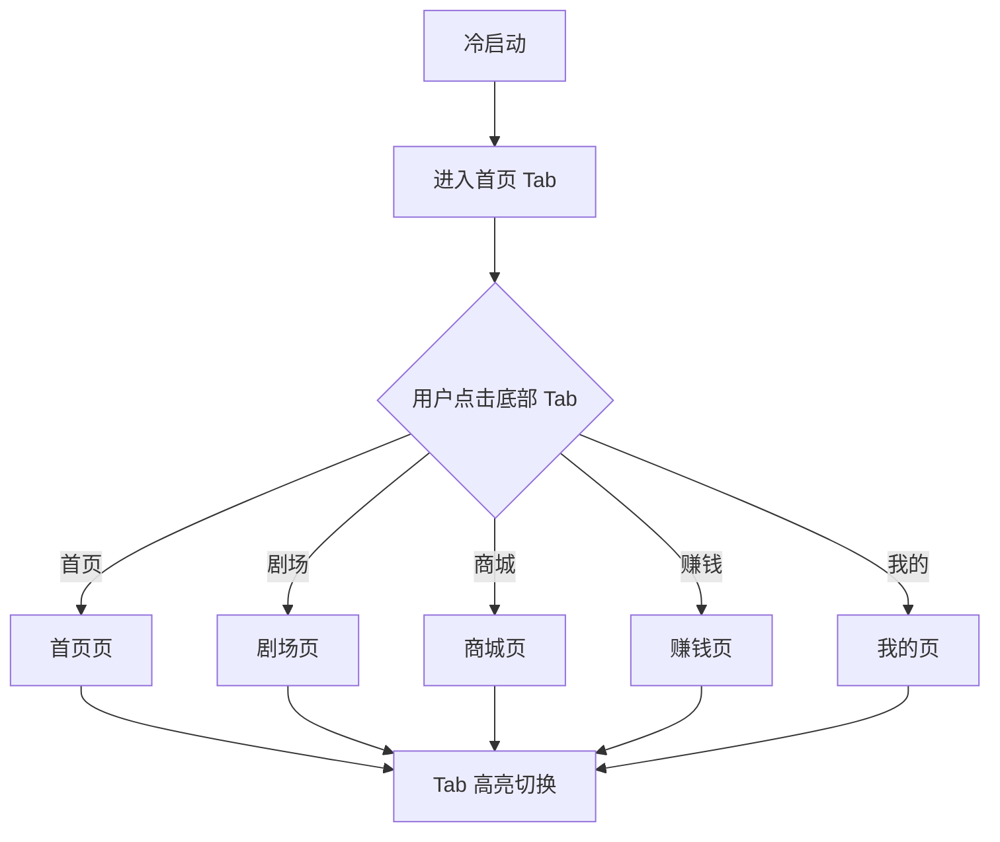
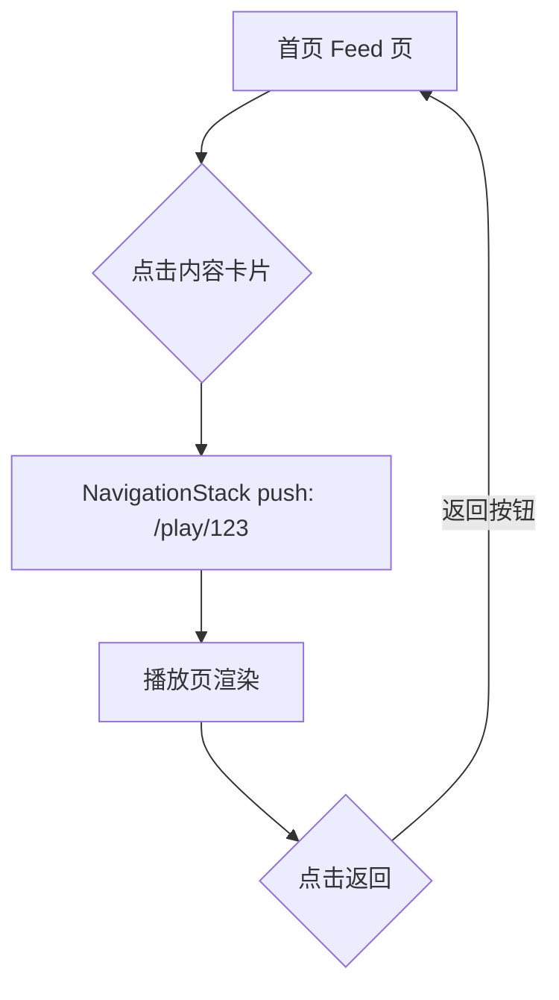
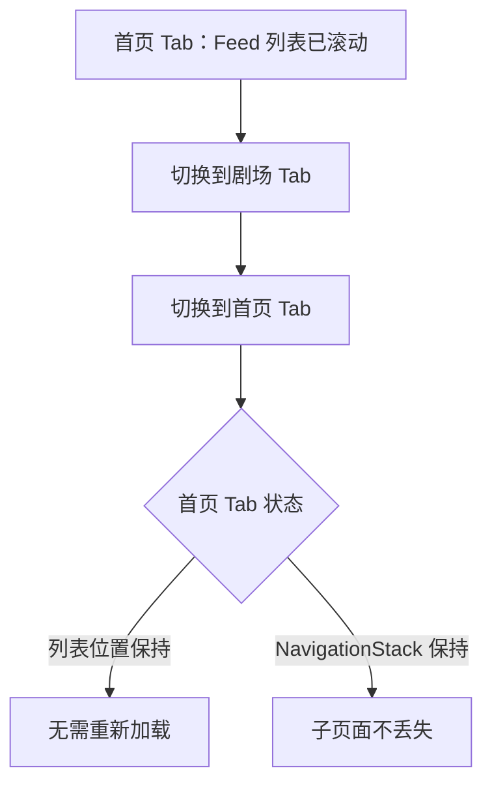
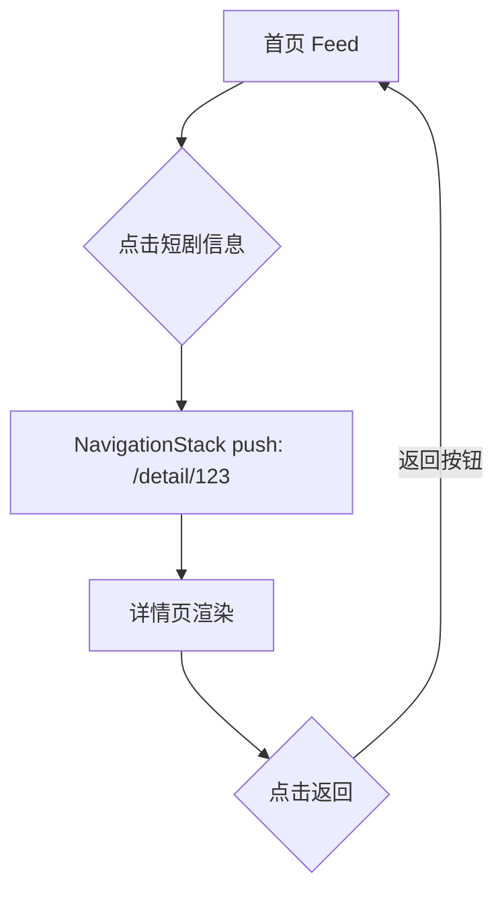

# PRD：底部导航与应用路由

> 创建日期：2026-07-25
> 状态：草稿
> 作者：AI Agent + daniel

---

## 1. 需求背景

### 1.1 问题描述

- **现状**：各端应用壳仅展示占位页面（`HomeScreen`/`ContentView`），无多页面导航能力。用户无法在不同功能频道间切换，所有后续功能 PRD 缺少承载骨架。
- **痛点**：底部 5 Tab 导航和页面路由是所有频道（首页 Feed、剧场、商城、赚钱中心、我的）及子页面（播放页、详情页、搜索页等）的前置框架。没有它，后续所有的功能开发都会被阻塞。
- **竞品参考**：红果 App 底部导航包含 5 个 Tab：首页 / 剧场 / 商城 / 赚钱 / 我的，每个 Tab 对应独立频道页面，各频道内可通过路由跳转到子页面（播放页、搜索页、详情页等）。

### 1.2 目标用户

| 用户角色 | 特征描述 | 核心需求 |
|---------|---------|---------|
| 所有用户 | 短剧内容消费者 | 在不同频道间快速切换，进入子页面后能返回上级 |

### 1.3 预期目标

- **业务目标**：建立统一的底部导航和页面路由框架，为后续所有功能 PRD 提供可嵌入的页面骨架。用户在 5 个 Tab 间切换流畅，子页面进出路由清晰。

### 1.4 范围定义

| 范围内 | 范围外（明确不做） | 原因 |
|--------|------------------|------|
| 5 Tab 底部导航（首页/剧场/商城/赚钱/我的） | 各 Tab 页面内的具体功能实现 | 由后续 PRD 分别处理 |
| 各 Tab 的占位页面 | Tab 图标和标签的美术设计定稿 | 可先用简单 SF Symbol / Material Icon 占位 |
| 播放页路由注册（`/play/:id`） | Deep Link 机制实现 | 已在前序阶段完成 |
| Deep Link 在新路由框架下的集成验证 | — | 见 ST-02/ST-05 完成标准 |
| 详情页路由注册（`/detail/:id`） | 路由过渡动画 | 规格阶段细化 |
| Web 端路由骨架对齐 | Web 端导航 UI（TabBar 在移动端才有） | Web 端走独立路由设计 |

---

## 2. 涉及平台

| 平台 | 是否涉及 | 变更概要 |
|------|---------|---------|
| Backend | ❌ 不涉及 | 纯客户端路由，无后端变更 |
| Web | ✅ 涉及 | 路由骨架对齐（Next.js App Router） |
| iOS | ✅ 涉及 | SwiftUI TabView + NavigationStack 路由框架 |
| Android | ✅ 涉及 | Compose NavigationBar + NavHost 路由框架 |

---

## 3. 用户故事

| 编号 | 角色 | 需求 | 验收标准 | 涉及平台 | 优先级 |
|------|------|------|---------|---------|--------|
| US-01 | 所有用户 | 在 5 个主频道间切换 | 底部显示 5 个 Tab（首页/剧场/商城/赚钱/我的），点击切换并高亮当前 Tab | iOS/Android | P0 |
| US-02 | 所有用户 | 从首页进入播放页并能返回 | 从首页 Feed 点击内容 → 跳转播放页；播放页顶部有返回按钮，点击回到首页 | iOS/Android | P0 |
| US-03 | 所有用户 | Tab 切换保持各自状态 | 在首页滚动一段距离 → 切到剧场再切回首页 → 列表位置不丢失 | iOS/Android | P1 |
| US-05 | 所有用户 | 进入短剧详情页并能返回 | 从首页 Feed 点击短剧信息 → 跳转详情页 `/detail/:id`；详情页顶部有返回按钮，点击回到首页 | iOS/Android | P1 |
| US-04 | Web 用户 | Web 端路由骨架可用 | `/` 首页、`/play/[id]` 播放页、`/detail/[id]` 详情页路由可正常访问 | Web | P0 |

---

## 4. 核心流程

### 4.1 US-01：5 Tab 底部导航切换

#### 用户旅程

1. 应用冷启动，默认进入「首页」Tab
2. 底部导航栏固定显示 5 个 Tab：首页 / 剧场 / 商城 / 赚钱 / 我的
3. 当前选中的 Tab 高亮显示（图标+标签颜色变化）
4. 用户点击其他 Tab，切换到对应频道占位页面
5. 切换过程无白屏、无闪烁

#### UI/交互要点

| 页面 / 区域 | 交互描述 | 涉及端 | 竞品参考 |
|------------|---------|--------|---------|
| 底部导航栏 | 5 个 Tab 固定底部，当前 Tab 高亮（图标填充+主色文字），非当前 Tab 灰色线框图标 | iOS/Android | 红果底部导航 |
| Tab 页面容器 | 每个 Tab 对应独立页面，当前为占位内容（"首页"、"剧场"等文字），后续 PRD 替换 | iOS/Android | — |

#### 关键边界

| 场景 | 预期行为 |
|------|---------|
| 快速连续切换 Tab | 只响应最终停留的 Tab，不出现页面切换动画叠加 |

### 4.2 US-02：播放页路由

#### 用户旅程

1. 用户在首页 Feed 点击某条短剧内容 → 通过路由跳转到 `/play/:id` 播放页
2. 播放页顶部有「返回」按钮，点击回到首页 Tab
3. 播放页页面内容暂为占位（"播放页 - {id}"），后续 PRD-03 实现具体播放器

#### UI/交互要点

| 页面 / 区域 | 交互描述 | 涉及端 | 竞品参考 |
|------------|---------|--------|---------|
| 播放页顶部栏 | 左侧返回按钮，中间显示"集数/标题" | iOS/Android | 红果播放页顶部栏 |
| 返回行为 | iOS：NavigationStack pop；Android：NavController popBackStack | iOS/Android | — |

### 4.3 US-04：Web 端路由

#### 用户旅程

1. Web 端已有路由骨架（`/`、`/play/[id]`、`/detail/[id]`）
2. 本 PRD 确保 Web 路由与移动端对齐，新增的路由模式被各端共享认知

| 页面 / 区域 | 交互描述 | 涉及端 | 竞品参考 |
|------------|---------|--------|---------|
| `/` | Web 首页（后续 PRD 实现具体内容） | Web | — |
| `/play/[id]` | 播放页（占位） | Web | — |
| `/detail/[id]` | 剧集详情页（占位） | Web | — |
| `/search` | 搜索页（后续 PRD-04 实现） | Web | — |
| `/rankings` | 排行页（后续 PRD-05 实现） | Web | — |
| `/mall` | 商城页（后续 PRD-13 实现） | Web | — |

### 4.4 US-03：Tab 状态保持

#### 用户旅程

1. 用户在首页 Tab 滚动浏览 Feed 列表（滚动了一段距离）
2. 用户切换到「剧场」Tab 查看内容
3. 用户再切回「首页」Tab → 列表滚动位置保持在离开时的位置，不会重新加载或回到顶部
4. 同样，用户在某个 Tab 内通过 NavigationStack 进入了子页面（如播放页），切换到其他 Tab 再切回来，子页面仍然保留在 NavigationStack 中

#### 关键边界

| 场景 | 预期行为 |
|------|---------|
| 切换 Tab 时是否保留 NavigationStack 内的子页面 | 保留，每个 Tab 有独立的 NavigationStack |
| 应用退到后台再回到前台 | Tab 状态保持（系统行为） |
| 内存不足被系统回收 | 重新初始化 Tab（属于系统正常行为） |

### 4.5 US-05：详情页路由

#### 用户旅程

1. 用户在首页 Feed 点击短剧信息区域（标题/封面），通过路由跳转到 `/detail/:id` 详情页
2. 详情页顶部有返回按钮，点击返回首页
3. 详情页当前为占位内容（后续 PRD 实现具体内容）

| 页面 / 区域 | 交互描述 | 涉及端 | 竞品参考 |
|------------|---------|--------|---------|
| 详情页顶部栏 | 左侧返回按钮，中间显示「短剧详情」 | iOS/Android | 红果详情页 |
| 入口 | 首页 Feed 卡片点击短剧标题/封面区域进入详情页 | iOS/Android | — |
| 详情页与播放页的关系 | 详情页内有「观看」按钮可跳转播放页（后续 PRD 实现） | iOS/Android | — |

---

## 5. 依赖

| 依赖项 | 类型 | 说明 | 状态 |
|--------|------|------|------|
| App Shell | 内部能力 | 各端已有项目骨架和入口页面 | ✅ 已就绪 |
| Deeplink 路由库 | 内部能力 | iOS 已有 NavigationRouter + AppRoute；Android 已有 Intent 解析骨架 | ✅ 已就绪 |
| PRODUCT.md | 内部能力 | Tab 名称和数量参考竞品 | ✅ 已就绪 |

---

## 6. 现有功能影响

| 现有功能 | 影响类型 | 说明 |
|---------|---------|------|
| App Shell | 修改行为 | 将占位单页 `HomeScreen`/`ContentView` 替换为包含底部导航的 Tab 框架 |
| Deeplink | 新增关联 | 路由注册后 Deeplink 的 `play/{id}` 和 `drama/{id}` 可直接跳转对应页面 |

---

## 7. 待澄清问题

| 编号 | 问题 | 阻塞 |
|------|------|------|
| Q-01 | Web 端是否也需要底部 TabBar？还是保持传统的顶部导航？ | 否（可在 spec 阶段确定） |
| Q-02 | Tab "我的"在未登录时是否显示？还是显示为"登录"引导？ | 否（PRD-08 用户登录时解决） |

---

## 8. 参考资料

### 竞品调研

| 文档 | 关键发现 |
|------|---------|
| `docs/product_research/mobile/homepage-feed/homepage-feed.md` | 红果底部 5 Tab：首页/剧场/商城/赚钱/我的 |
| `docs/product_research/mobile/theater/theater.md` | 剧场 Tab 为独立频道 |
| `docs/product_research/mobile/mall/mall.md` | 商城 Tab 为独立频道 |
| `docs/product_research/mobile/earn-center/earn-center.md` | 赚钱 Tab 为独立频道 |

### Wiki 文档

| 文档 | 关键信息 |
|------|---------|
| `wiki/features/app-shell/index.md` | 各端当前骨架为单页占位 |
| `wiki/features/deeplink/index.md` | iOS 已有 NavigationRouter，Android 有 Intent 解析骨架 |
| `wiki/architecture/overview.md` | 技术栈：iOS SwiftUI / Android Compose / Web Next.js |

---

## 9. 变更历史

| 日期 | 变更内容 | 变更原因 |
|------|---------|---------|
| 2026-07-25 | 初始版本 | Sprint 1 P0 前置依赖 |
