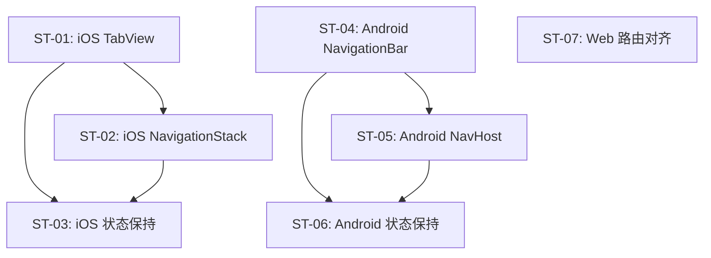

# 子任务拆分：底部导航与应用路由

> 关联 PRD：[prd.md](prd.md)
> 创建日期：2026-07-25
> 状态：草稿

---

## 工时总览

| 平台 | 子任务数 | 总工时（人日） | 备注 |
|------|---------|--------------|------|
| iOS | 3 | 4 人日 | |
| Android | 3 | 4 人日 | |
| Web | 1 | 0.5 人日 | 仅路由对齐 |
| **合计** | **7** | **8.5 人日** | |

---

## 迭代规划

| 迭代 | 目标 | 包含子任务 | 交付物 |
|------|------|-----------|--------|
| Sprint 1 | 底部导航 + 路由框架（一次性完成） | ST-01 ~ ST-07 | 5 Tab 切换可用，播放页路由可用 |

---

## 子任务详情

### ST-01：iOS TabView 底部导航框架

| 属性 | 值 |
|------|-----|
| **对应 PRD** | US-01 |
| **平台** | iOS |
| **优先级** | P0 |
| **预估工时** | 1.5 人日 |
| **前置依赖** | 无 |
| **迭代** | Sprint 1 |

#### 工作内容

1. 创建 5 个 Tab 占位 View（HomePage / TheaterPage / MallPage / EarnPage / ProfilePage）
2. 使用 SwiftUI `TabView` + `tabItem` 实现底部 5 Tab 导航
3. 配置 Tab 图标（使用 SF Symbols 占位：house / film / bag / dollar / person）
4. 设置选中高亮颜色（`.tint` 修饰符）
5. 将 TabView 替换现有的 `ContentView` 作为根视图

#### 完成标准

- [ ] 启动应用显示底部 5 个 Tab
- [ ] 点击不同 Tab 切换页面，高亮正确
- [ ] 每个 Tab 页面显示占位标题

#### 涉及 UI/页面

| 页面/组件 | 说明 | 涉及端 |
|----------|------|--------|
| RootTabView | 根视图，替换 ContentView | iOS |
| HomePage / TheaterPage / MallPage / EarnPage / ProfilePage | 5 个占位 Tab 页 | iOS |

---

### ST-02：iOS NavigationStack 路由框架

| 属性 | 值 |
|------|-----|
| **对应 PRD** | US-02 |
| **平台** | iOS |
| **优先级** | P0 |
| **预估工时** | 1.5 人日 |
| **前置依赖** | ST-01 |
| **迭代** | Sprint 1 |

#### 工作内容

1. 将现有的 `NavigationRouter` + `AppRoute` 整合进 TabView 框架
2. 确保每个 Tab 内嵌独立的 `NavigationStack(path:)`
3. 注册播放页路由：`AppRoute.player(videoId:)` → `PlayerPage`
4. 注册详情页路由：`AppRoute.dramaDetail(dramaId:)` → `DramaDetailPage`
5. 播放页和详情页显示占位内容（"播放页 - {id}" / "详情页 - {id}"）

#### 完成标准

- [ ] 从任意页面可以 `router.navigate(to: .player(videoId: "123"))` 跳转到播放页
- [ ] 播放页顶部有返回按钮，点击可返回上级页面
- [ ] 返回后 Tab 状态不丢失
- [ ] Deeplink `djsdrama://play/123` 能正确跳转（复用已有 Deeplink 逻辑）

#### 涉及 UI/页面

| 页面/组件 | 说明 | 涉及端 |
|----------|------|--------|
| PlayerPage | 播放页占位 | iOS |
| DramaDetailPage | 详情页占位 | iOS |

---

### ST-03：iOS Tab 状态保持

| 属性 | 值 |
|------|-----|
| **对应 PRD** | US-03 |
| **平台** | iOS |
| **优先级** | P1 |
| **预估工时** | 1 人日 |
| **前置依赖** | ST-01, ST-02 |
| **迭代** | Sprint 1 |

#### 工作内容

1. 确保 TabView 每个 Tab 的视图实例在切换时不销毁
2. 使用 `@StateObject` 或 `.id()` 策略保持 NavigationStack 状态
3. 验证：在首页模拟滚动位置 → 切到剧场 → 切回首页 → 位置保持

#### 完成标准

- [ ] Tab 切换后各 Tab 内 NavigationStack 状态保持
- [ ] 无内存泄漏（视图实例正确复用而非重复创建）

---

### ST-04：Android NavigationBar 底部导航框架

| 属性 | 值 |
|------|-----|
| **对应 PRD** | US-01 |
| **平台** | Android |
| **优先级** | P0 |
| **预估工时** | 1.5 人日 |
| **前置依赖** | 无 |
| **迭代** | Sprint 1 |

#### 工作内容

1. 创建 5 个 Tab 占位 Composable（HomeScreen / TheaterScreen / MallScreen / EarnScreen / ProfileScreen）
2. 使用 Material3 `NavigationBar` + `NavigationBarItem` 实现底部 5 Tab
3. 配置图标（Material Icons 占位：Home / TheaterComedy / ShoppingBag / Paid / Person）
4. 选中状态：`selectedContentColor` 主色 + `unselectedContentColor` 灰色
5. 将 NavigationBar + 内容区替换 `MainActivity` 中的 `HomeScreen()`

#### 完成标准

- [ ] 启动应用显示底部 5 个 Tab
- [ ] 点击不同 Tab 切换内容，高亮正确
- [ ] 每个 Tab 显示占位标题

#### 涉及 UI/页面

| 页面/组件 | 说明 | 涉及端 |
|----------|------|--------|
| MainScreen | 根 Composable，包含 NavigationBar + 内容区 | Android |
| HomeScreen / TheaterScreen / MallScreen / EarnScreen / ProfileScreen | 5 个占位 Composable | Android |

---

### ST-05：Android NavHost 路由框架

| 属性 | 值 |
|------|-----|
| **对应 PRD** | US-02 |
| **平台** | Android |
| **优先级** | P0 |
| **预估工时** | 1.5 人日 |
| **前置依赖** | ST-04 |
| **迭代** | Sprint 1 |

#### 工作内容

1. 配置 Compose Navigation：`NavHost` + `NavController`
2. 每个 Tab 使用独立的 NavHost（或嵌套导航图）
3. 注册路由：
   - `"home"` → HomeScreen
   - `"player/{videoId}"` → PlayerScreen（占位：显示 videoId）
   - `"detail/{dramaId}"` → DramaDetailScreen（占位：显示 dramaId）
4. 整合已有 Intent 解析逻辑：`djsdrama://play/{videoId}` → `navController.navigate("player/$videoId")`

#### 完成标准

- [ ] 从首页可 `navController.navigate("player/123")` 跳转播放页
- [ ] 播放页顶部有返回箭头，点击可 `popBackStack`
- [ ] Deeplink `djsdrama://play/123` 能正确跳转

#### 涉及 UI/页面

| 页面/组件 | 说明 | 涉及端 |
|----------|------|--------|
| PlayerScreen | 播放页占位 Composable | Android |
| DramaDetailScreen | 详情页占位 Composable | Android |

---

### ST-06：Android Tab 状态保持

| 属性 | 值 |
|------|-----|
| **对应 PRD** | US-03 |
| **平台** | Android |
| **优先级** | P1 |
| **预估工时** | 1 人日 |
| **前置依赖** | ST-04, ST-05 |
| **迭代** | Sprint 1 |

#### 工作内容

1. 使用 `saveState` / `restoreState` 保留每个 Tab 内 NavHost 状态
2. 确保 Tab 切换时不销毁 Tab 内 Composable 的状态
3. 验证：在首页模拟滚动位置 → 切到剧场 → 切回首页 → 位置保持

#### 完成标准

- [ ] Tab 切换后各 Tab 内 NavController back stack 保持
- [ ] 无状态丢失（LazyColumn 滚动位置保持）

---

### ST-07：Web 路由对齐

| 属性 | 值 |
|------|-----|
| **对应 PRD** | US-04 |
| **平台** | Web |
| **优先级** | P0 |
| **预估工时** | 0.5 人日 |
| **前置依赖** | 无 |
| **迭代** | Sprint 1 |

#### 工作内容

1. 确认 Web 已有路由 `/`（首页）、`/play/[id]`（播放页）、`/detail/[id]`（详情页）正常工作
2. 新增 `/search`、`/rankings`、`/mall` 占位路由
3. 更新 `web/CLAUDE.md` 中的路由清单，确保移动端路由命名与 Web 对齐

#### 完成标准

- [ ] 所有注册路由可正常访问，不会 404
- [ ] 路由命名规范与移动端一致（play/:id, detail/:id）

---

## 子任务依赖图

---

## 工时估算说明

| 假设 | 说明 |
|------|------|
| iOS/Android 各端使用的导航框架（TabView/NavigationBar）为系统原生 API | 不需要引入第三方导航库 |
| 5 个 Tab 页面均为简单占位页面 | 后续 PRD 会替换具体实现 |
| 路由注册只涉及播放页/详情页两种类型 | 搜索/排行等路由在对应 PRD 中注册 |

---

## 变更历史

| 日期 | 变更内容 | 变更原因 |
|------|---------|---------|
| 2026-07-25 | 初始版本 | PRD-01 |
