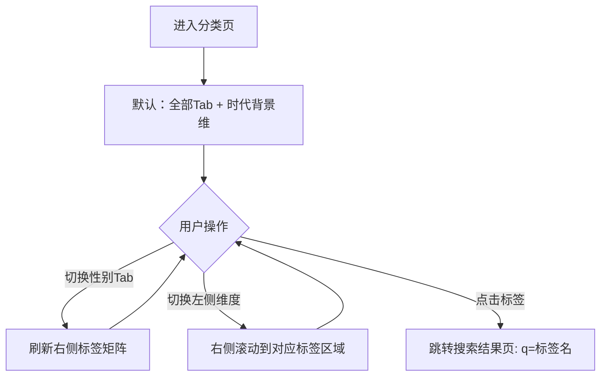

# PRD：分类浏览

> 创建日期：2026-07-25
> 状态：草稿
> 作者：AI Agent + daniel

---

## 1. 需求背景

### 1.1 问题描述

- **现状**：内容发现缺少按标签/维度筛选的浏览方式，用户只能在 Feed 中被动接受。
- **痛点**：短剧类型丰富（都市/古装/逆袭/甜宠/战神…），用户需要按兴趣维度（时代背景/主题情节/角色设定）主动筛选内容。
- **竞品参考**：红果分类页从搜索页「分类」入口进入。三层结构：顶部性别Tab（全部/男频/女频）；左侧维度导航（时代背景/主题情节/角色设定）；右侧标签矩阵（3列胶囊标签）。各性别Tab下标签不同（男频：战神/逆袭/系统/龙王；女频：女强/闪婚/甜宠/霸总）。

### 1.2 目标用户

| 用户角色 | 特征描述 | 核心需求 |
|---------|---------|---------|
| 偏好明确用户 | 知道自己喜欢什么类型 | 通过标签快速筛选特定类型短剧 |
| 探索型用户 | 想按兴趣维度浏览 | 浏览标签矩阵，发现感兴趣的新类型 |

### 1.3 预期目标

- **业务目标**：建立基于标签维度的分类浏览体系，用户可通过性别Tab + 三维度标签筛选内容。

### 1.4 范围定义

| 范围内 | 范围外（明确不做） | 原因 |
|--------|------------------|------|
| 性别Tab（全部/男频/女频） | 标签点击后的结果页 | 轻量版：点击标签直接搜索该标签词 |
| 三维度标签矩阵（时代背景/主题情节/角色设定） | 多标签组合筛选 | 首版单标签点击搜索 |
| 每种性别Tab下有对应标签集 | 「展开更多」标签 | 首版展示全部可用标签 |
| 标签数据由 Backend 提供 | 标签推荐/个性化排序 | 远期迭代 |

---

## 2. 涉及平台

| 平台 | 是否涉及 | 变更概要 |
|------|---------|---------|
| Backend | ✅ 涉及 | 标签分类 API |
| iOS | ✅ 涉及 | 分类页三层 UI |
| Android | ✅ 涉及 | 分类页三层 UI |

---

## 3. 用户故事

| 编号 | 角色 | 需求 | 验收标准 | 涉及平台 | 优先级 |
|------|------|------|---------|---------|--------|
| US-01 | 偏好明确用户 | 按性别维度筛选标签 | 点击「男频」→ 右侧标签切换为男频标签集；点击「女频」→ 切换为女频标签集 | iOS/Android | P0 |
| US-02 | 探索型用户 | 按维度浏览标签 | 左侧维度导航切换时右侧标签矩阵滚动到对应区域（时代背景/主题情节/角色设定） | iOS/Android | P0 |
| US-03 | 偏好明确用户 | 点击标签搜索内容 | 点击任意标签 → 跳转搜索结果页，搜索词为该标签名 | iOS/Android | P0 |
| US-04 | 内容运营 | 标签数据可配置 | Backend 提供标签列表 API，支持按性别维度返回不同标签集 | Backend | P1 |

---

## 4. 核心流程

### 4.1 US-01/02/03：三层标签浏览与搜索

#### 用户旅程

1. 从搜索页快捷入口「分类」进入分类页
2. 默认选中「全部」性别Tab，右侧展示全量标签矩阵
3. 用户点击「男频」→ 右侧标签切换为男频标签（战神/逆袭/系统/龙王…）
（「全部」Tab 展示男频+女频标签去重并集，即全量标签）
4. 用户点击左侧「主题情节」维度 → 右侧滚动定位到主题情节标签区域
5. 用户点击「逆袭」标签 → 跳转搜索结果页，搜索关键词「逆袭」

#### UI/交互要点

| 页面 / 区域 | 交互描述 | 涉及端 | 竞品参考 |
|------------|---------|--------|---------|
| 顶部Tab | ← 返回 + 全部/男频/女频 横向Tab切换 | iOS/Android | 红果分类页顶部 |
| 左侧维度导航 | 纵向列表：时代背景/主题情节/角色设定，选中高亮 | iOS/Android | 红果左侧维度导航 |
| 右侧标签矩阵 | 3列胶囊标签，可滚动，包含多个维度分组（每个分组有标题） | iOS/Android | 红果标签矩阵 |
| 标签点击行为 | 点击标签 → `navigate(search, q=标签名)` | iOS/Android | — |

#### 关键边界

| 场景 | 预期行为 |
|------|---------|
| 切换性别Tab无数据 | 展示空标签状态 |
| 所有性别Tab标签结构相同 | 标签名不同但维度结构一致 |

---

## 5. 依赖

| 依赖项 | 类型 | 说明 | 状态 |
|--------|------|------|------|
| 搜索页 | 内部能力 | 搜索页快捷入口「分类」跳转 | 🚧 待开发 |
| 搜索结果页 | 内部能力 | 标签点击跳转到搜索结果 | 🚧 待开发 |

---

## 6. 待澄清问题

| 编号 | 问题 | 阻塞 |
|------|------|------|
| Q-01 | 标签数据是后端管理配置还是硬编码？ | 否（首版用 Backend API 返回静态标签集，后续可配管理后台） |
| Q-02 | 是否支持多标签组合筛选？ | 否（首版单标签搜索，组合筛选远期） |

---

## 7. 参考资料

### 竞品调研

| 文档 | 关键发现 |
|------|---------|
| `docs/product_research/mobile/homepage-feed/search/classification/classification.md` | 分类页三层结构 |
| `docs/product_research/mobile/homepage-feed/search/classification/boy-tab/boy-tab.md` | 男频标签结构 |
| `docs/product_research/mobile/homepage-feed/search/classification/boy-tab/era-background/era-background.md` | 时代背景标签交互 |
| `docs/product_research/mobile/homepage-feed/search/classification/boy-tab/theme-plot/theme-plot.md` | 主题情节标签 |
| `docs/product_research/mobile/homepage-feed/search/classification/boy-tab/character-setting/character-setting.md` | 角色设定标签 |

---

## 8. 变更历史

| 日期 | 变更内容 | 变更原因 |
|------|---------|---------|
| 2026-07-25 | 初始版本 | Sprint 2 P1 |
