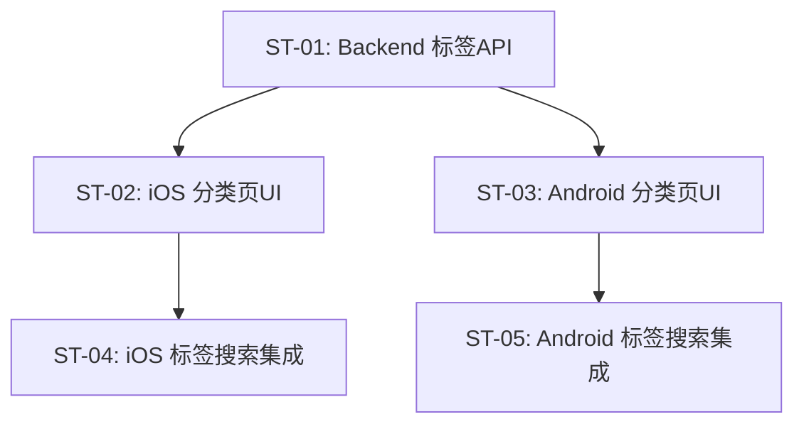

# 子任务拆分：分类浏览

> 关联 PRD：[prd.md](prd.md)
> 创建日期：2026-07-25
> 状态：草稿

---

## 工时总览

| 平台 | 子任务数 | 总工时（人日） |
|------|---------|--------------|
| Backend | 1 | 1.5 人日 |
| iOS | 2 | 3 人日 |
| Android | 2 | 3 人日 |
| **合计** | **5** | **7.5 人日** |

---

## 迭代规划

一次性完成（单 Sprint）。

---

## 子任务详情

### ST-01：Backend 标签分类 API

| 属性 | 值 |
|------|-----|
| **对应 PRD** | US-01, US-04 |
| **平台** | Backend |
| **优先级** | P0 |
| **预估工时** | 1.5 人日 |
| **前置依赖** | 无 |

#### 工作内容

1. `GET /api/dramas/tags`：按性别维度返回标签结构
2. Query: `gender`（all/male/female）
3. 返回分组标签：
```json
{
  "dimensions": [
    {"name": "时代背景", "tags": ["都市","职场","民国","校园","古装"]},
    {"name": "主题情节", "tags": ["逆袭","系统","战神","闪婚","甜宠",...]},
    {"name": "角色设定", "tags": ["大女主","萌宝","霸总","龙王",...]}
  ]
}
```
4. 种子数据预设三组标签（全部/男频/女频）

#### 涉及 API

| 方法 | 路径 | 说明 |
|------|------|------|
| GET | `/api/dramas/tags` | 获取标签分类数据 |

---

### ST-02：iOS 分类页三层 UI

| 属性 | 值 |
|------|-----|
| **对应 PRD** | US-01~03 |
| **平台** | iOS |
| **优先级** | P0 |
| **预估工时** | 2 人日 |
| **前置依赖** | ST-01, PRD-04 ST-03（iOS 搜索页+快捷入口） |

#### 工作内容

1. `ClassificationPage`：
   - 顶部性别Tab（`Picker`：全部/男频/女频）
   - 左侧维度导航（`List`：时代背景/主题情节/角色设定）
   - 右侧标签矩阵（`ScrollView` + `LazyVGrid` 3列胶囊标签）
2. 性别切换 → 请求对应标签 API → 刷新右侧
3. 左侧维度点击 → 右侧 `ScrollViewReader.scrollTo` 锚点
4. 标签点击 → `navigate(search, q=标签名)`

---

### ST-03：Android 分类页三层 UI

| 属性 | 值 |
|------|-----|
| **对应 PRD** | US-01~03 |
| **平台** | Android |
| **优先级** | P0 |
| **预估工时** | 2 人日 |
| **前置依赖** | ST-01, PRD-04 ST-04（Android 搜索页+快捷入口） |
| **迭代** | Sprint 1 |

#### 工作内容

1. `ClassificationScreen`：顶部性别Tab（`TabRow`：全部/男频/女频）+ 左侧维度导航 + 右侧标签矩阵（`LazyVerticalGrid` 3列胶囊标签）
2. 性别切换 → 请求对应标签 API → 刷新右侧
3. 左侧维度点击 → 右侧 `LazyListState.animateScrollToItem` 锚点
4. 标签点击 → `navController.navigate("search?q=标签名")`

### ST-04：iOS 标签搜索结果集成

| 属性 | 值 |
|------|-----|
| **平台** | iOS |
| **优先级** | P1 |
| **预估工时** | 1 人日 |
| **前置依赖** | ST-02, PRD-04 ST-03（搜索结果页 iOS） |

标签点击 → 构造搜索词 → 跳转 SearchResultPage。

---

### ST-05：Android 标签搜索结果集成

| 属性 | 值 |
|------|-----|
| **对应 PRD** | US-03 |
| **平台** | Android |
| **优先级** | P1 |
| **预估工时** | 1 人日 |
| **前置依赖** | ST-03, PRD-04 ST-04（搜索结果页 Android） |
| **迭代** | Sprint 1 |

#### 工作内容

标签点击 → 构造搜索词 → 跳转 SearchResultScreen。同 ST-04，Android 实现。

## 子任务依赖图



---

## 变更历史

| 日期 | 变更内容 | 变更原因 |
|------|---------|---------|
| 2026-07-25 | 初始版本 | PRD-06 |
