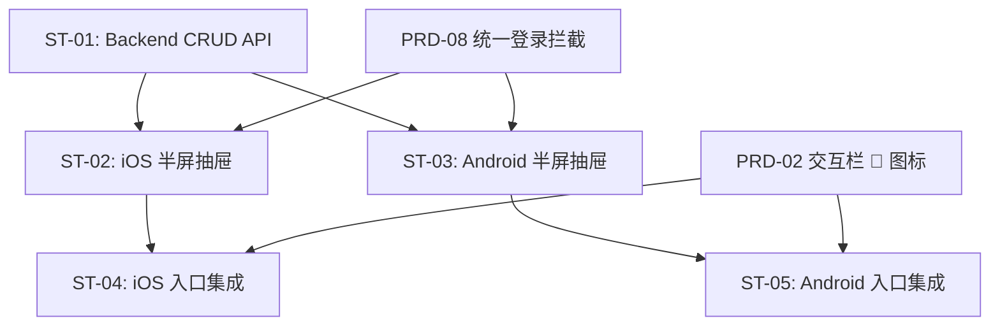

# PRD Review：评论系统

> 审查日期：2026-07-25
> PRD 版本：草稿（初始版本）
> 审查人：AI Agent

---

## 审查总览

| 维度 | 评级 | 说明 |
|------|------|------|
| 完整性 | 🟢 已补全 | 已补充 API 规格、数据模型、边界状态、现有功能影响 |
| 可落地性 | 🟢 已修正 | 数据模型已定义、API 路径已统一、子任务内容已补全 |
| 跨端一致性 | 🟢 已修正 | 子任务描述已对称、与 PRD-02 职责已划分 |
| 冲突检测 | 🟢 已修正 | 工时已校准、首页入口职责已明确 |

---

## 🔴 阻塞项（已全部修正 ✅）

### B-01：缺少 Comment 数据模型定义 ✅ 已修正

**问题**：PRD 和 subtasks 均未定义 Comment 数据结构。Backend 开发无法确定表字段、类型和约束。

**影响**：ST-01（Backend CRUD API）无法开始开发。

**修正方案**：在 PRD 中新增数据模型章节或 API 规格章节，定义 Comment Schema：

| 字段 | 类型 | 约束 | 说明 |
|------|------|------|------|
| id | string (UUID) | required | 评论唯一标识 |
| drama_id | string (UUID) | required | 所属短剧 UUID |
| user_id | string (UUID) | required | 评论者 UUID（关联 auth.users） |
| content | string | min(1), max(500) | 评论正文 |
| like_count | number | int, min(0), default 0 | 点赞数 |
| created_at | string (ISO 8601) | required | 创建时间 |
| updated_at | string (ISO 8601) | required | 更新时间 |

同时需定义 `CommentLike` 关系表（user_id + comment_id），用于记录用户点赞状态。

---

### B-02：API 路径不一致 ✅ 已修正

**问题**：PRD 4.1 流程图使用 `POST /api/comments`，而子任务 ST-01 使用 `POST /api/dramas/:id/comments`。

**影响**：Backend 和前端对接时产生歧义。

**修正方案**：统一使用 `POST /api/dramas/:id/comments`（评论作为短剧的子资源，符合 RESTful 惯例）。同步修正 PRD 流程图中所有 API 路径：

- 发表：`POST /api/dramas/:id/comments`
- 列表：`GET /api/dramas/:id/comments`
- 点赞：`POST /api/dramas/:id/comments/:commentId/like`（区别于 PRD-02 的短剧点赞 `POST /api/dramas/:id/like`）

注意：当前 subttask ST-01 用 `POST /api/comments/:id/like`，与 PRD-02 的 `POST /api/dramas/:id/like` 命名风格不一致，建议统一为嵌套资源路径。

---

### B-03：缺少 API 规格章节 ✅ 已修正

**问题**：PRD 未定义各 API 的请求参数、响应格式、分页策略、错误码。对比 PRD-02 的 subtasks，其 ST-01 详细列出了 API 的 query 参数、返回结构和完成标准。PRD-09 的 ST-01 只有一行 API 列表。

**影响**：iOS/Android 端无法并行开发（不知道响应结构），测试验收标准不明确。

**修正方案**：在 subtasks ST-01 中补充 API 规格，至少包含：

**GET /api/dramas/:id/comments**

| 参数 | 类型 | 必填 | 默认值 | 说明 |
|------|------|------|--------|------|
| page | number | 否 | 1 | 页码 |
| pageSize | number | 否 | 20 | 每页数量 |
| sort | string | 否 | "latest" | 排序：latest / hot |

Response：
```json
{
  "data": [...],
  "pagination": { "page": 1, "page_size": 20, "total": 0, "total_pages": 0 }
}
```

**POST /api/dramas/:id/comments**

Body：`{ "content": "string" }`，需登录。

**POST /api/dramas/:id/comments/:commentId/like**

无 Body，需登录。切换点赞状态，返回 `{ "liked": true/false, "like_count": number }`。

---

### B-04：首页评论入口与 PRD-02 交互栏职责重叠 ✅ 已修正

**问题**：PRD-02 的 ST-05/ST-06（iOS/Android 交互栏，Sprint 2）已在右侧交互栏中预留 💬 评论数展示。PRD-09 的 ST-04/ST-05（评论入口集成，1.5 人日/端，P1）再次创建"评论入口图标+数字"。这导致同一 UI 元素被两个 PRD 各自实现，可能产生冲突或重复代码。

**影响**：iOS/Android 端可能实现两套评论入口，UI 不一致。

**修正方案**：
1. 明确分工：PRD-02 负责交互栏中评论图标的**展示**（含评论数），PRD-09 仅负责点击评论图标后的**半屏抽屉交互**（即点击事件监听 + 抽屉弹出）。
2. PRD-09 的 ST-04/ST-05 应降为"集成点击事件"，工时从 1.5 人日缩减为 0.5 人日，或合并到 ST-02/ST-03 中。
3. 在 PRD 的依赖章节中注明：依赖 PRD-02 交互栏中的 💬 图标作为入口（不自行创建）。

---

### B-05：子任务 ST-03（Android 评论半屏抽屉）内容严重缺失 ✅ 已修正

**问题**：ST-03 仅写了"工时：2 人日 | P0"，没有任何工作内容描述。对比 ST-02（iOS）有详细的组件和实现说明。

**影响**：Android 端开发缺少方向指引，工时估算缺乏依据。

**修正方案**：参照 ST-02 补充工作内容：
1. 使用 `ModalBottomSheet` 实现半屏抽屉
2. 评论列表（`LazyColumn`）：头像（Coil `AsyncImage`）、昵称、内容（maxLines=3）、点赞数、相对时间
3. 底部输入栏（固定 `Row`）：头像、`TextField` placeholder "说点什么"、发送按钮（`IconButton`）
4. 登录拦截（未登录弹出登录引导）
5. 发表评论后插入列表顶部

---

## 🟡 建议项（已全部修正 ✅）

### S-01：缺少错误/边界状态描述 ✅ 已修正

**问题**：PRD 未定义以下异常场景的行为。

**修正方案**：新增边界状态表：

| 场景 | 预期行为 |
|------|---------|
| 评论列表为空（0 条评论） | 居中展示"暂无评论，快来抢沙发" + 插图 |
| 网络加载失败 | 展示错误提示 + 「点击重试」按钮 |
| 评论内容为空 | 发送按钮置灰不可点击 |
| 评论内容超长（>500 字） | 输入框限制 500 字，超出时截断或 Toast 提示 |
| 发表评论失败 | Toast 提示"发表失败，请重试"，评论内容保留不清空 |
| 匿名用户点赞评论 | 弹出登录引导，不执行点赞 |

---

### S-02：登录拦截实现归属不明确 ✅ 已修正

**问题**：PRD-09 US-04 描述了"未登录时点击发表 → 弹窗提示登录 → 跳转登录页"，但未说明是自行实现还是复用 PRD-08 的统一登录拦截中间件。PRD-08 的 subtasks ST-04/ST-05 已规划统一登录拦截机制（各 1 人日）。

**修正方案**：
1. 在依赖章节中增加对 PRD-08 统一登录拦截的依赖说明。
2. 明确：评论端复用 PRD-08 的统一拦截机制，不自行实现登录判断逻辑。如果 PRD-08 在 Sprint 4 同步开发，需在依赖中标注风险（并行开发可能需先自行实现简单拦截，后续替换）。
3. PRD-09 ST-04/ST-05 的登录拦截部分可进一步缩减工时。

---

### S-03：工时偏差 ✅ 已修正

**问题**：Backlog（B-014）预估 10 人日，subtasks 合计 9.5 人日，差异 0.5 人日。

**修正方案**：统一为 subtasks 的 9.5 人日，同步更新 backlog 的 B-014 预估。

---

### S-04：缺少子任务依赖关系图 ✅ 已修正

**问题**：PRD-02 的 subtasks 有完整的 mermaid 依赖图，PRD-09 缺失。

**修正方案**：补充依赖图：



---

### S-05：评论列表排序策略未定义 ✅ 已修正

**问题**：PRD 未说明评论默认以什么顺序展示。热门优先还是最新优先？这在 API 设计、用户体验和数据查询上有关键影响。

**修正方案**：
1. 首版建议：默认按时间倒序（最新评论在上），这是最低实现成本的方案。
2. 在 API 规格中预留 `sort` 参数（latest / hot），为后续"热门评论"排序留扩展空间。
3. 将此决策写入范围定义或待澄清章节。

---

### S-06：缺少"现有功能影响"章节 ✅ 已修正

**问题**：PRD-02、PRD-03 均有"现有功能影响"章节，说明此 PRD 对已有代码的修改。PRD-09 缺失此章节。

**修正方案**：新增章节：

| 现有功能 | 影响类型 | 说明 |
|---------|---------|------|
| 首页 Feed 交互栏（PRD-02） | 集成 | 在现有 💬 图标上绑定点击事件，拉起半屏抽屉 |
| 播放器交互栏（PRD-03） | 集成 | 播放页右侧交互栏添加评论入口（如 PRD-03 已实现） |
| 数据模型（Data Models） | 新增 | 新增 Comment、CommentLike Schema |
| Supabase Auth Middleware | 新增依赖 | 发表评论、点赞需登录鉴权 |

---

### S-07：输入栏功能描述不完整 ✅ 已修正

**问题**：范围定义中明确排除了"图片评论/表情包"，但竞品参考提到红果输入栏有"表情/图片入口"。当前 PRD 的输入栏仅描述了"头像 + placeholder + 发送按钮"，未明确说明表情/图片入口是预留占位还是完全不展示。

**修正方案**：在 UI/交互要点中明确：
- 输入栏仅包含：头像 + 文字输入框（placeholder "说点什么"）+ 发送按钮
- 表情/图片入口不展示（远期迭代）
- 或：展示但置灰（预留扩展）

---

## Q 待确认问题（不确定，需产品确认）

| 编号 | 问题 | 上下文 |
|------|------|--------|
| Q-01 | 评论和首页交互栏的评论数是否需要实时同步？（例如在评论区发表/点赞后，关闭抽屉返回首页，评论数是否即时更新？） | 涉及 PRD-02 交互栏与 PRD-09 评论抽屉的状态同步策略 |
| Q-02 | 匿名用户能否看到点赞按钮和点赞数？竞品（红果）在匿名围观态下展示完整评论信息含点赞数。当前 PRD-09 仅定义了发表需登录拦截，未说明浏览时的点赞展示。 | US-01 的 AC 中有"点赞数"展示，但 US-03 的点赞操作才检查登录，逻辑上是合理的，建议明确：浏览态展示点赞数 + 点赞按钮，点击时才拦截。 |
| Q-03 | 发表评论后是否需要审核机制？首版是否即时显示？ | 涉及产品安全和合规 |
| Q-04 | Playback 播放页是否需要独立的评论入口？还是仅在首页 Feed 有评论入口？当前 PRD 仅提到首页 Feed 和播放页的评论入口，但 PRD-03（播放器）的范围定义未明确包含评论入口。 | 涉及与 PRD-03 的协调。建议在 PRD-03 的播放器交互栏中也预留评论入口（与 PRD-02 保持一致），否则用户在观看时无法评论。 |
| Q-05 | 半屏抽屉高度 60-70% 屏高是固定值还是内容自适应？如果只有 1 条评论，抽屉是否仍然撑满 60%？ | 影响 iOS/Android 端实现方式 |

---

## 审查结论

✅ **通过（第 1 轮所有问题已修正）**

所有阻塞项（B-01 ~ B-05）和建议项（S-01 ~ S-07）均已在 PRD、subtasks、backlog 和 progress 文件中完成修正。

---

## 修订历史

| 日期 | 变更内容 |
|------|---------|
| 2026-07-25 | 第 1 轮修正完成：所有阻塞和建议问题已修正，审查结论更新为通过 |
| 2026-07-25 | 初始审查版本 |
