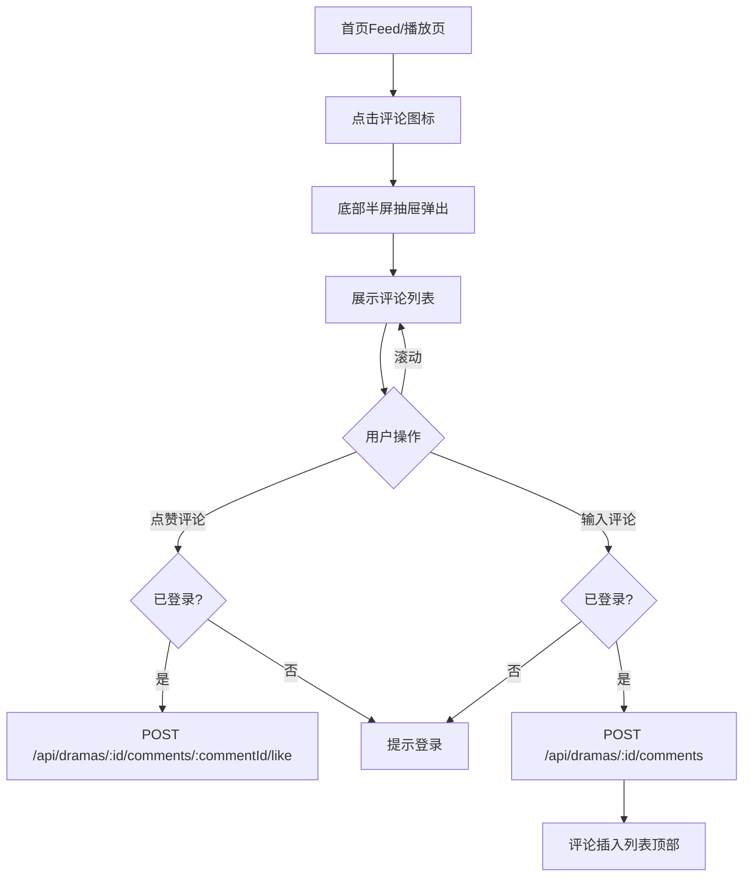

# PRD：评论系统

> 创建日期：2026-07-25
> 状态：草稿
> 作者：AI Agent + daniel

---

## 1. 需求背景

### 1.1 问题描述

- **现状**：用户在浏览 Feed 或观看视频时无法查看/发表评论。
- **痛点**：评论是内容平台的核心互动方式，能提升用户参与度和留存。红果的评论以半屏抽屉形式呈现，不打断用户的浏览/观看上下文。
- **竞品参考**：红果评论为底部半屏抽屉，顶部拖拽手柄 + 评论数标题；可滚动评论列表（评论者头像+昵称+内容+点赞数+时间）；底部固定输入栏（头像+提示文字"说点什么"+ 表情/图片入口）。

### 1.2 目标用户

| 用户角色 | 特征描述 | 核心需求 |
|---------|---------|---------|
| 围观用户 | 浏览评论 | 查看热门评论、点赞 |
| 互动用户 | 想发表评论 | 输入文字发表评论 |

### 1.3 预期目标

建立评论浏览和发表能力，以半屏抽屉承载，不打断用户当前浏览/观看。

### 1.4 范围定义

| 范围内 | 范围外 | 原因 |
|--------|--------|------|
| 评论列表（半屏抽屉） | 评论回复/盖楼 | 远期迭代 |
| 发表评论（文字） | 图片评论/表情包 | 远期迭代 |
| 评论点赞 | 评论举报/删除 | 远期迭代 |
| 登录拦截（匿名发表时跳转登录） | @用户功能 | 远期迭代 |

首版默认按时间倒序（最新在上），API 预留 `sort` 参数（latest / hot）用于后续扩展。

---

## 2. 涉及平台

| 平台 | 是否涉及 | 变更概要 |
|------|---------|---------|
| Backend | ✅ 涉及 | 评论 CRUD API |
| iOS | ✅ 涉及 | 评论半屏抽屉 UI |
| Android | ✅ 涉及 | 评论半屏抽屉 UI |

---

## 3. 用户故事

| 编号 | 角色 | 需求 | 验收标准 | 涉及平台 | 优先级 |
|------|------|------|---------|---------|--------|
| US-01 | 围观用户 | 查看短剧评论 | 点击评论图标 → 底部弹出半屏抽屉，展示评论列表（头像+昵称+内容+点赞数+时间） | iOS/Android | P0 |
| US-02 | 互动用户 | 发表评论 | 点击底部输入栏 → 键盘弹起 → 输入文字 → 点击发送 → 评论出现在列表顶部 | 全部 | P1 |
| US-03 | 围观用户 | 点赞评论 | 点击评论右侧 ❤️ 图标 → 点赞数 +1（已登录） | 全部 | P1 |
| US-04 | 匿名用户 | 发表评论被拦截 | 未登录时点击发表 → 弹窗提示登录 → 跳转登录页 | iOS/Android | P1 |

---

## 4. 核心流程

### 4.1 US-01/02：浏览与发表评论

#### UI/交互要点

| 区域 | 交互描述 | 竞品参考 |
|------|---------|---------|
| 半屏抽屉 | 底部弹出，高度约 60-70% 屏高，背景半透明拖拽手柄 | 红果评论抽屉 |
| 评论列表 | 可滚动，评论项：头像+昵称+内容(最多3行)+点赞数+相对时间 | 红果评论列表 |
| 底部输入栏 | 固定底部：头像 + 文字输入框（placeholder "说点什么"）+ 发送按钮，表情/图片入口不展示（远期迭代） | 红果输入栏 |

#### 边界状态

| 场景 | 预期行为 |
|------|---------|
| 评论列表为空（0 条） | 居中展示"暂无评论，快来抢沙发" + 插图 |
| 网络加载失败 | 展示错误提示 + 「点击重试」按钮 |
| 评论内容为空 | 发送按钮置灰不可点击 |
| 评论内容超长（>500 字） | 输入框限制 500 字，超出 Toast 提示 |
| 发表评论失败 | Toast "发表失败，请重试"，内容保留不清空 |
| 匿名用户点赞评论 | 弹出登录引导，不执行点赞 |

---

## 5. 数据模型

### 5.1 Comment Schema

| 字段 | 类型 | 约束 | 说明 |
|------|------|------|------|
| id | string (UUID) | required | 评论唯一标识 |
| drama_id | string (UUID) | required | 所属短剧 UUID |
| user_id | string (UUID) | required | 评论者 UUID（关联 auth.users） |
| content | string | min(1), max(500) | 评论正文 |
| like_count | number | int, min(0), default 0 | 点赞数 |
| created_at | string (ISO 8601) | required | 创建时间 |
| updated_at | string (ISO 8601) | required | 更新时间 |

### 5.2 CommentLike Schema

需定义 `CommentLike` 关系表（user_id + comment_id），用于记录用户点赞状态。

---

## 6. 依赖

| 依赖项 | 类型 | 说明 | 状态 |
|--------|------|------|------|
| 首页 Feed / 播放器（PRD-02/03） | 内部能力 | 依赖 PRD-02 交互栏中的 💬 图标作为评论入口，不自行创建；播放页右侧交互栏添加评论入口 | 🚧 PRD-02/03 |
| 用户登录（PRD-08） | 内部能力 | 发表评论、点赞需登录鉴权；复用 PRD-08 的统一登录拦截机制，不自行实现登录判断逻辑 | 📅 PRD-08 |

---

## 7. 参考资料

| 文档 | 关键发现 |
|------|---------|
| `docs/product_research/mobile/homepage-feed/comments/comments.md` | 红果评论抽屉 |

---

## 8. 现有功能影响

| 现有功能 | 影响类型 | 说明 |
|---------|---------|------|
| 首页 Feed 交互栏（PRD-02） | 集成 | 在现有 💬 图标上绑定点击事件，拉起半屏抽屉 |
| 播放器交互栏（PRD-03） | 集成 | 播放页右侧交互栏添加评论入口 |
| 数据模型 | 新增 | 新增 Comment、CommentLike Schema |
| Supabase Auth Middleware | 新增依赖 | 发表评论、点赞需登录鉴权 |

---

## 9. 变更历史

| 日期 | 变更内容 | 变更原因 |
|------|---------|---------|
| 2026-07-25 | 初始版本 | Sprint 4 P1 |
| 2026-07-25 | 修正审查问题：新增数据模型、边界状态、现有功能影响章节；修正 API 路径；补充依赖说明 | PRD Review 第 1 轮修正 |
