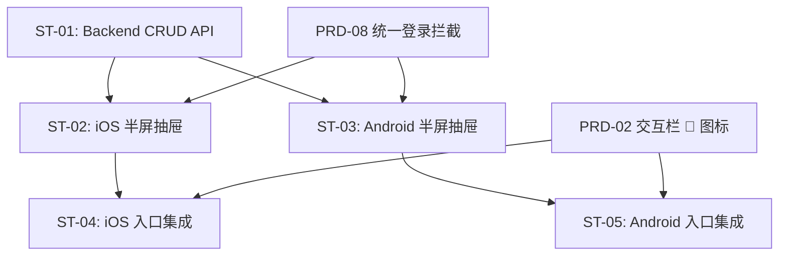

# 子任务拆分：评论系统

> 关联 PRD：[prd.md](prd.md)
> 创建日期：2026-07-25 | 状态：草稿

---

## 工时总览

| 平台 | 子任务数 | 总工时（人日） |
|------|---------|--------------|
| Backend | 1 | 2.5 人日 |
| iOS | 2 | 2.5 人日 |
| Android | 2 | 2.5 人日 |
| **合计** | **5** | **7.5 人日** |

---

## 子任务详情

### ST-01：Backend 评论 CRUD API

- 工时：2.5 人日 | P0
- 涉及 API：

**GET /api/dramas/:id/comments**

| 参数 | 类型 | 必填 | 默认值 | 说明 |
|------|------|------|--------|------|
| page | number | 否 | 1 | 页码 |
| pageSize | number | 否 | 20 | 每页数量 |
| sort | string | 否 | "latest" | 排序：latest / hot |

Response：
```json
{
  "data": [...],
  "pagination": { "page": 1, "page_size": 20, "total": 0, "total_pages": 0 }
}
```

**POST /api/dramas/:id/comments**

Body：`{ "content": "string" }`，需登录。

**POST /api/dramas/:id/comments/:commentId/like**

无 Body，需登录。切换点赞状态，返回 `{ "liked": true/false, "like_count": number }`。

### ST-02：iOS 评论半屏抽屉

- 工时：2 人日 | P0
- `.sheet` 半屏抽屉：评论列表 + 底部输入栏，登录拦截

### ST-03：Android 评论半屏抽屉

- 工时：2 人日 | P0
- 1. 使用 `ModalBottomSheet` 实现半屏抽屉
- 2. 评论列表（`LazyColumn`）：头像（Coil `AsyncImage`）、昵称、内容（maxLines=3）、点赞数、相对时间
- 3. 底部输入栏（固定 `Row`）：头像、`TextField` placeholder "说点什么"、发送按钮（`IconButton`）
- 4. 登录拦截（未登录弹出登录引导）
- 5. 发表评论后插入列表顶部

### ST-04：iOS 评论入口集成

- 工时：0.5 人日 | P1
- 在 PRD-02 已有的 💬 图标上绑定点击事件，拉起评论半屏抽屉

### ST-05：Android 评论入口集成

- 工时：0.5 人日 | P1
- 在 PRD-02 已有的 💬 图标上绑定点击事件，拉起评论半屏抽屉

---

## 依赖关系



---

## 变更历史

| 日期 | 变更内容 |
|------|---------|
| 2026-07-25 | PRD Review 第 1 轮修正：修正 API 路径、补充 API 规格与 ST-03 内容、调整 ST-04/05 工时、新增依赖关系图 |
| 2026-07-25 | 初始版本 |
