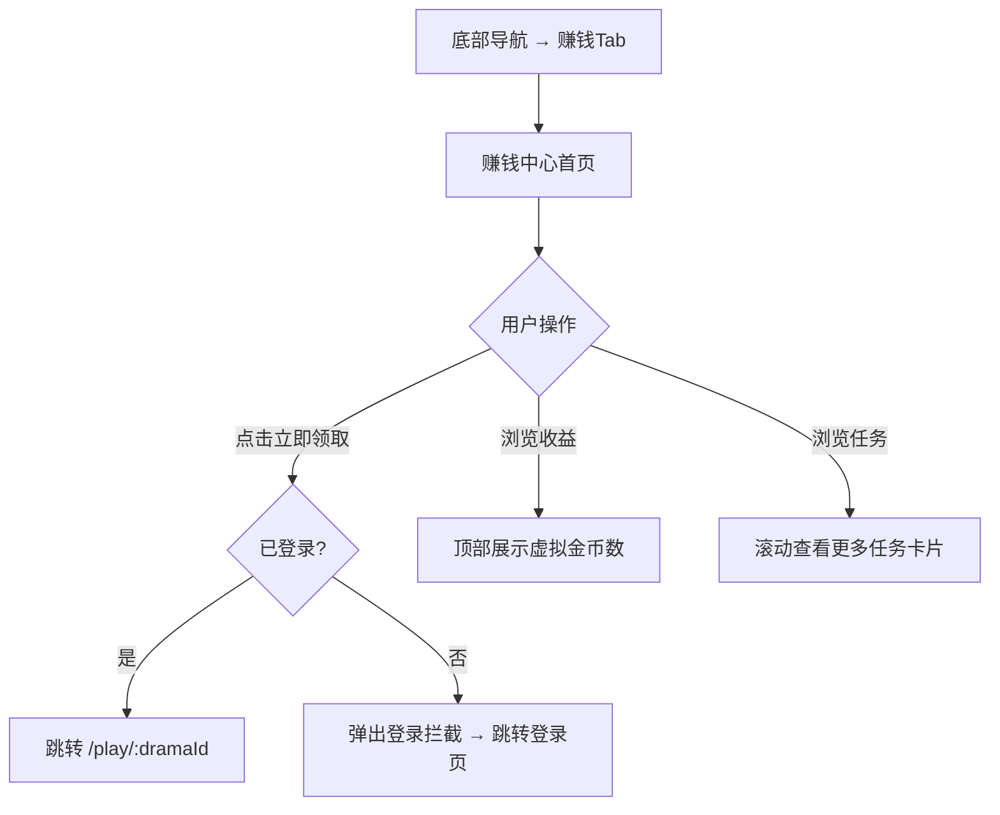

# PRD：赚钱中心

> 创建日期：2026-07-25
> 状态：草稿
> 作者：AI Agent + daniel

---

## 1. 需求背景

### 1.1 问题描述

- **现状**：无金币/奖励/提现体系。
- **痛点**：赚钱中心是红果留存和用户激励的核心频道，通过现金收益、任务体系、看剧福利驱动用户持续使用。
- **竞品参考**：红果赚钱页顶部收益头图（金额+一键登录）；新手任务区（「新人7天保底6元」卡片+「立即领取」按钮）；连续看剧福利（每日奖励网格卡片）；现金任务区（「看剧领现金」「现金打款0.5元/微信转账」）。

### 1.2 预期目标

建立赚钱中心频道，含收益展示、新手任务、连续看剧福利、现金任务。

### 1.3 范围定义

| 范围内 | 范围外 | 原因 |
|--------|--------|------|
| 赚钱中心首页 UI | 完整金币体系 | 首版用虚拟货币占位 |
| 收益展示（虚拟） | 真实提现（微信/支付宝） | 远期迭代 |
| 新手任务卡片展示 | 任务系统完整逻辑 | 首版展示为主 |
| 「立即领取」跳转播放页 | 广告任务 | 远期迭代 |

首版使用「金币」作为虚拟货币单位，纯 UI 展示占位数值（如「0 金币」），不与真实货币挂钩。远期接入完整金币体系。

签到奖励首版为纯 UI 格子高亮（PRD-10 定义），不涉及金币变动。远期签到奖励纳入赚钱中心金币体系。

---

## 2. 涉及平台

| 平台 | 是否涉及 | 变更概要 |
|------|---------|---------|
| Backend | ✅ 涉及 | 任务/奖励 API |
| iOS | ✅ 涉及 | 赚钱中心页面 UI |
| Android | ✅ 涉及 | 赚钱中心页面 UI |

---

## 3. 用户故事

| 编号 | 角色 | 需求 | 验收标准 | 优先级 |
|------|------|------|---------|--------|
| US-01 | 所有用户 | 看到收益展示 | 顶部收益头图展示虚拟金额 + 登录入口 | P0 |
| US-02 | 所有用户 | 领取新手奖励 | 点击「立即领取」→ 已登录跳转 `/play/:dramaId`（携带任务上下文），未登录跳转登录页；观看完成后返回赚钱中心 → 收益头图金额变化 | P0 |
| US-03 | 所有用户 | 看到连续看剧福利 | 每日奖励网格卡片展示 | P1 |
| US-04 | 所有用户 | 看到现金任务 | 任务卡片列表展示 | P1 |

---

## 4. 核心流程

### 4.1 UI/交互要点

| 区域 | 交互描述 |
|------|---------|
| 收益头图 | 顶部展示虚拟金币数额 + 「一键登录」按钮（匿名时显示） |
| 新手任务区 | 「新人7天保底6元」卡片 + 「立即领取」按钮 |
| 连续看剧福利 | 每日奖励网格卡片（7 格宫格展示每日奖励）。每日奖励卡片三种状态：可领取（高亮+按钮）、已领取（置灰+✓）、未到达（置灰+锁定图标）。首版均展示为占位状态（纯 UI），不实现真实领取逻辑。 |
| 现金任务区 | 任务卡片列表（任务标题+奖励金额+操作按钮） |

### 4.2 看剧奖励机制

「立即领取」点击后跳转播放页 → 用户观看完整短剧 → 播放结束回到赚钱中心 → 奖励金额累加到收益头图。

- **首版实现**：跳转播放页（携带任务上下文如 `?task_id=xxx`），观看完成后由播放器回调通知。ST-01 新增 `POST /api/earn/complete-task` 标记任务完成。
- **播放验证**：首版信任客户端上报，远期加固。

---

## 5. 依赖

| 依赖项 | 类型 | 说明 | 状态 |
|--------|------|------|------|
| 底部导航 | 内部能力 | 赚钱Tab | 🚧 PRD-01 |
| 播放器 | 内部能力 | 奖励承接播放 | 🚧 PRD-03 |
| 用户登录 | 内部能力 | 收益持久化 | 📅 PRD-08 |

---

## 6. 现有功能影响

| 现有功能 | 影响类型 | 说明 |
|---------|---------|------|
| 底部导航（PRD-01） | 依赖 | 赚钱 Tab 已注册，填充内容 |
| 播放器（PRD-03） | 集成 | 任务完成回调通知 |
| 用户登录（PRD-08） | 依赖 | 收益持久化、任务完成需登录 |

---

## 7. 参考资料

| 文档 | 关键发现 |
|------|---------|
| `docs/product_research/mobile/earn-center/earn-center.md` | 赚钱中心完整布局 |
| `docs/product_research/mobile/earn-center/claim-reward/claim-reward.md` | 领取跳转播放 |

---

## 8. 变更历史

| 日期 | 变更内容 | 变更原因 |
|------|---------|---------|
| 2026-07-25 | 审查修正：补充核心流程图、UI/交互要点、看剧奖励机制、虚拟货币定义、现有功能影响章节、US-02 验收标准重写 | PRD 审查反馈修正 |
| 2026-07-25 | 初始版本 | Sprint 5 P2 |
