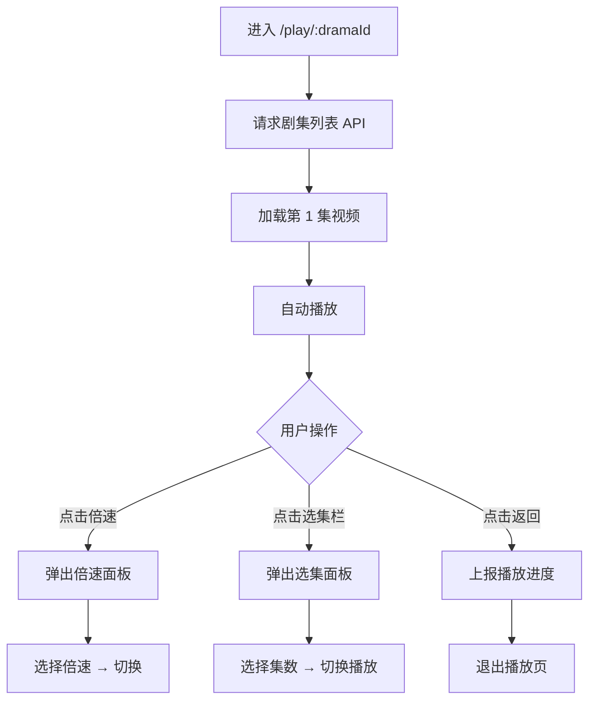
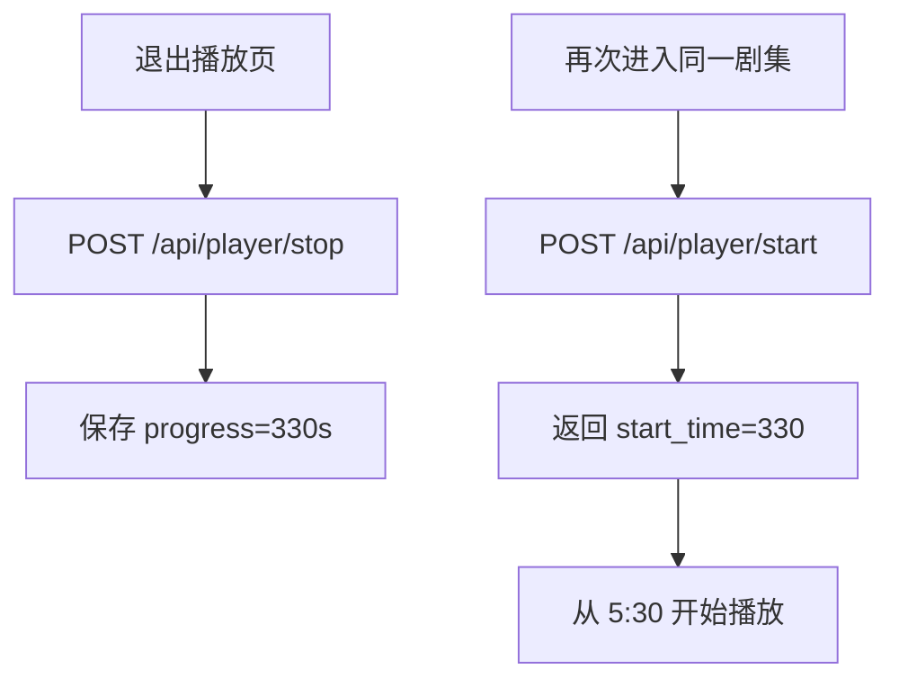

# PRD：完整观看播放器

> 创建日期：2026-07-25
> 状态：草稿
> 作者：AI Agent + daniel

---

## 1. 需求背景

### 1.1 问题描述

- **现状**：项目已有播放器基础 API（`POST /api/player/start`、`POST /api/player/stop`、倍速参数），但各端无播放器 UI 实现。用户从首页 Feed 点击「观看完整短剧」进入播放页后，只能看到占位页面。
- **痛点**：播放器是短剧产品的核心体验载体。没有可用的播放器 UI，用户无法观看短剧视频、切换集数、调整倍速，产品价值无法落地。
- **竞品参考**：红果播放页顶部展示返回按钮 + 当前集数 + 倍速按钮 + 更多操作；中央为竖屏视频播放器；右侧纵向排列互动操作栏（收藏、评论、点赞、分享）；底部固定选集栏（显示「选集 · 已完结 · 全 N 集」）。

### 1.2 目标用户

| 用户角色 | 特征描述 | 核心需求 |
|---------|---------|---------|
| 短剧观众 | 观看短剧视频内容 | 流畅播放、控制播放（暂停/进度/倍速）、切换集数 |
| 互动用户 | 观看中表达态度 | 在播放页内点赞、收藏，不中断观看 |

### 1.3 预期目标

- **业务目标**：提供完整的短剧播放体验，用户可从首页 Feed 进入播放页，观看视频、切换集数、调整倍速、进行互动操作。

### 1.4 范围定义

| 范围内 | 范围外（明确不做） | 原因 |
|--------|------------------|------|
| 竖屏视频播放器 UI（播放/暂停/进度） | 画质切换（高清/标清） | 依赖 CDN 多码率支持，远期迭代 |
| 倍速控制（已有后端 API 支持） | 手势控制（双击快进、滑动调音量） | spec 阶段评估复杂度 |
| 剧集选集面板（列表 + 当前集高亮） | 投屏功能 | 远期迭代 |
| 顶部操作栏（返回/集数/倍速/⋯ 更多占位） | ⋯ 菜单具体功能（举报、不感兴趣等） | 远期迭代 |
| 右侧互动栏（点赞/收藏/评论数/分享按钮入口） | 分享功能落地页 | PRD 独立处理 |
| 播放进度上报与断点续播 | 弹幕互动 | 远期评估 |
| Backend 剧集列表 API | 视频下载/缓存 | 远期迭代 |
| — | 字幕 | 远期评估 |

---

## 2. 涉及平台

| 平台 | 是否涉及 | 变更概要 |
|------|---------|---------|
| Backend | ✅ 涉及 | 新增剧集列表 API、扩充播放 API |
| Web | ❌ 不涉及 | Web 播放器后续 PRD 单独规划 |
| iOS | ✅ 涉及 | 视频播放器 UI + 选集面板 + 互动栏 |
| Android | ✅ 涉及 | 视频播放器 UI + 选集面板 + 互动栏 |

---

## 3. 用户故事

| 编号 | 角色 | 需求 | 验收标准 | 涉及平台 | 优先级 |
|------|------|------|---------|---------|--------|
| US-01 | 短剧观众 | 观看短剧视频 | 进入播放页后视频开始加载并播放；支持播放/暂停；显示播放进度 | iOS/Android | P0 |
| US-02 | 短剧观众 | 调整播放倍速 | 点击顶部「倍速」按钮弹出倍速面板：0.5x / 0.75x / 1.0x / 1.25x / 1.5x / 1.75x / 2.0x，选中高亮 | iOS/Android | P0 |
| US-03 | 短剧观众 | 切换剧集 | 点击底部选集栏弹出选集面板；面板展示全部集数和标题列表；当前播放集高亮；点击其他集切换播放 | iOS/Android | P0 |
| US-04 | 短剧观众 | 断点续播 | 退出播放页后再进入同一剧集，从上次观看位置继续播放 | Backend/iOS/Android | P1 |
| US-05 | 互动用户 | 在播放页内点赞/收藏 | 右侧互动栏展示点赞数/收藏数/评论数；点击切换点赞/收藏状态 | iOS/Android | P1 |
| US-06 | 短剧观众 | 查看剧集信息 | 底部信息区展示剧集标题、标签 | iOS/Android | P1 |
| US-07 | 短剧观众 | 在异常情况下获得明确反馈 | 视频加载失败时展示错误提示+重试按钮；剧集无资源时标记为"暂无资源"且不可点击 | iOS/Android | P2 |

---

## 4. 核心流程

### 4.1 US-01/02/03：播放控制 + 倍速 + 选集

#### 用户旅程

1. 用户从首页 Feed 点击「观看完整短剧」→ 进入 `/play/:dramaId` 播放页
2. 页面请求 Backend 获取剧集列表，加载第 1 集视频
3. 视频自动开始播放，顶部栏显示：← 返回 | 第 1 集  | 倍速 | ⋯
4. 用户点击「倍速」→ 弹出倍速面板，选择 1.5x → 视频切换倍速播放
5. 用户点击底部「选集 · 全 N 集」→ 弹出选集面板，点击第 5 集 → 切换到第 5 集播放
6. 用户点击顶部 ← 返回 → 退出播放页，上报播放进度

#### UI/交互要点

| 页面 / 区域 | 交互描述 | 涉及端 | 竞品参考 |
|------------|---------|--------|---------|
| 顶部栏 | 左侧返回按钮、中间「第 N 集」、右侧倍速按钮 + 更多（⋯） | iOS/Android | 红果播放页顶部 |
| 播放器区域 | 竖屏视频播放，点击切换暂停/播放，拖拽进度条调整进度 | iOS/Android | 红果播放器 |
| 倍速面板 | 底部 action sheet 弹出，7 档倍速（0.5x~2.0x），选中高亮，点击外部关闭 | iOS/Android | — |
| 选集面板 | 底部半屏弹出，列表展示集数 + 标题，当前播放集高亮，可滚动 | iOS/Android | 红果选集栏 |
| 选集栏（固定） | 底部常驻半透明条：左侧「选集 · 已完结」，右侧「全 N 集」，全部可点击 | iOS/Android | 红果底部选集栏 |

#### 关键边界

| 场景 | 预期行为 |
|------|---------|
| 视频加载失败 | 播放器显示错误提示 + 重试按钮 |
| 剧集无视频 URL | 该集标记为「暂无资源」，不可点击 |
| 切换剧集 | 停止当前播放 → 上报进度 → 加载新剧集 → 从第 0 秒播放 |

### 4.2 US-04：断点续播

#### 用户旅程

1. 用户观看第 3 集到 5 分 30 秒，退出播放页
2. 发送 `POST /api/player/stop` 上报进度
3. 用户再次进入同一剧集 → `POST /api/player/start` 携带上次进度 → 从 5 分 30 秒续播

---

## 5. 依赖

| 依赖项 | 类型 | 说明 | 状态 |
|--------|------|------|------|
| 底部导航 | 内部能力 | `/play/:dramaId` 路由已注册（PRD-01） | 🚧 待开发 |
| 首页 Feed UI | 内部能力 | 用户从 Feed CTA 进入播放页（PRD-02） | 🚧 待开发 |
| 播放器 API | 内部能力 | `/api/player/start`、`/api/player/stop` 已有 | ✅ 已就绪 |
| 数据模型 (Episode) | 内部能力 | Episode 已有 Schema（含 video_url、episode_number、duration） | ✅ 已就绪 |

---

## 6. 现有功能影响

| 现有功能 | 影响类型 | 说明 |
|---------|---------|------|
| 播放器 API | 扩展 | 新增剧集列表 API；扩充 start/stop 请求字段 |
| 播放页占位 | 替换 | 将 PRD-01 创建的 PlayerPage 占位替换为实际播放器 |

---

## 7. 待澄清问题

| 编号 | 问题 | 阻塞 |
|------|------|------|
| Q-01 | 首版使用模拟视频 URL 还是接入真实 CDN？ | 否（用占位视频 URL 即可，后续对接 CDN） |
| Q-02 | 选集面板是否同时展示已完结和连载中的剧集？ | 否（首版统一处理） |
| Q-03 | iOS/Android 播放器使用系统原生播放器还是第三方（如 ExoPlayer）？ | 否（spec 阶段确定技术选型） |

---

## 8. 参考资料

### 竞品调研

| 文档 | 关键发现 |
|------|---------|
| `docs/product_research/mobile/homepage-feed/full-watch/full-watch.md` | 红果播放页完整布局 |
| `docs/product_research/mobile/homepage-feed/full-watch/episode-selector/episode-selector.md` | 选集栏设计 |
| `docs/product_research/mobile/homepage-feed/full-watch/playback-options/playback-options.md` | 倍速和更多操作 |

### Wiki 文档

| 文档 | 关键信息 |
|------|---------|
| `wiki/features/video-player/index.md` | 播放器现有能力 |
| `wiki/api/player.md` | 播放 API 定义 |
| `wiki/features/data-models/index.md` | Episode Schema 定义 |

---

## 9. 变更历史

| 日期 | 变更内容 | 变更原因 |
|------|---------|---------|
| 2026-07-25 | 初始版本 | Sprint 1 P0 |
