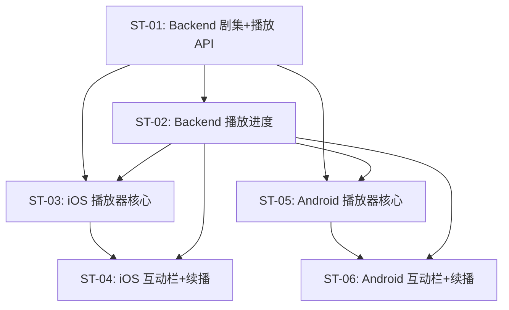

# 子任务拆分：完整观看播放器

> 关联 PRD：[prd.md](prd.md)
> 创建日期：2026-07-25
> 状态：草稿

---

## 工时总览

| 平台 | 子任务数 | 总工时（人日） | 备注 |
|------|---------|--------------|------|
| Backend | 2 | 3 人日 | |
| iOS | 2 | 5 人日 | |
| Android | 2 | 5 人日 | |
| **合计** | **6** | **13 人日** | |

---

## 迭代规划

| 迭代 | 目标 | 包含子任务 | 交付物 |
|------|------|-----------|--------|
| Sprint 1 | 核心播放 + 启播链路 | ST-01, ST-02, ST-03, ST-05 | 可播放视频、默认/恢复进页、切换集数、调整倍速 |
| Sprint 2 | 互动栏 + 续播增强 | ST-04, ST-06 | 互动栏、断点续播、信息展示 |

---

## 子任务详情

### ST-01：Backend 剧集列表 + 播放 API

| 属性 | 值 |
|------|-----|
| **对应 PRD** | US-01, US-03 |
| **平台** | Backend |
| **优先级** | P0 |
| **预估工时** | 2 人日 |
| **前置依赖** | 无 |
| **迭代** | Sprint 1 |

#### 工作内容

1. 实现 `GET /api/dramas/:id/episodes`：返回该短剧全部剧集列表（按 `episode_number` 排序）
2. 实现 `POST /api/player/start`：只承担“已知 `episode_id` 后开始播放”的职责，继续复用现有 `PlayerStartRequestSchema`
3. 保持 `POST /api/player/start` 请求体形态为 `drama_id + episode_id + progress`，不在该接口承担“决定恢复哪一集”的 bootstrap 逻辑
4. 种子数据：为已有 Drama 生成 3-5 集 Episode 数据

#### 完成标准

- [ ] `GET /api/dramas/:id/episodes` 正确返回剧集列表
- [ ] `POST /api/player/start` 可在已知 `episode_id` 的前提下正常开始播放
- [ ] Episode 列表按 `episode_number` 正序返回

#### 涉及 API

| 方法 | 路径 | 说明 |
|------|------|------|
| GET | `/api/dramas/:id/episodes` | 获取剧集列表 |
| POST | `/api/player/start` | 开始播放（已知 episode） |

---

### ST-02：Backend 播放进度管理

| 属性 | 值 |
|------|-----|
| **对应 PRD** | US-04 |
| **平台** | Backend |
| **优先级** | P0 |
| **预估工时** | 1 人日 |
| **前置依赖** | ST-01 |
| **迭代** | Sprint 1 |

#### 工作内容

1. 创建 `playback_history` 表：`playback_session_id + drama_id + episode_id + progress + updated_at`；首版未登录场景以下发/持久化的匿名 session 标识归属记录
2. 实现 `GET /api/player/progress?dramaId=xxx`：通过 `X-Playback-Session-Id` header 查询该匿名身份在当前 drama 下最近一次观看的 `episode_id + start_time`
3. `POST /api/player/stop` 自动写入 playback_history，并使用 `X-Playback-Session-Id` 命中同一匿名身份

#### 完成标准

- [ ] 播放历史正确存储和查询
- [ ] `GET /api/player/progress?dramaId=...` 返回正确的 `episode_id + start_time`
- [ ] `POST /api/player/stop` 正确写入当前匿名身份的观看进度

#### 涉及 API

| 方法 | 路径 | 说明 |
|------|------|------|
| GET | `/api/player/progress` | 查询续播位置 |
| POST | `/api/player/stop` | 上报并保存进度 |

---

### ST-03：iOS 播放器核心 UI

| 属性 | 值 |
|------|-----|
| **对应 PRD** | US-01, US-02, US-03 |
| **平台** | iOS |
| **优先级** | P0 |
| **预估工时** | 2.5 人日 |
| **前置依赖** | ST-01, ST-02, PRD-01 ST-02（路由框架） |
| **迭代** | Sprint 1 |

#### 工作内容

1. 实现 `PlayerPage`：接收 `videoId`（dramaId），进入页面时先调用 `GET /api/player/progress?dramaId=...`（携带 `X-Playback-Session-Id` header）检查是否存在恢复 `episode_id + start_time`
2. 再请求剧集列表 `GET /api/dramas/:id/episodes`；首版该接口不要求携带 `X-Playback-Session-Id` header
3. 集成视频播放器（AVPlayer / AVKit `VideoPlayer`）
4. 顶部栏：← 返回（pop）、集数文本、倍速按钮（弹出 action sheet）、⋯ 更多按钮
5. 倍速面板（`.confirmationDialog` 或自定义 bottom sheet）：0.5x~2.0x 七档
6. 底部固定选集栏：「选集 · 状态 · 全 N 集」，点击弹出选集面板
7. 选集面板（`.sheet`）：`List` 展示所有剧集，当前集高亮，点击切换
8. 在确定默认播放 `episode_id` 后调用 `POST /api/player/start`（请求体：`drama_id + episode_id + progress=0`，并携带 `X-Playback-Session-Id` header）；若命中恢复记录，则对恢复 `episode_id` 使用 `progress=start_time` 调用同一接口
9. 用户切换剧集时，先按需保存当前进度，再对新选中的 `episode_id` 复用同一 `POST /api/player/start` 规则开始播放（请求体 `progress=0`，并携带 `X-Playback-Session-Id` header）

#### 完成标准

- [ ] 视频能正常播放/暂停
- [ ] 点击倍速切换播放速度
- [ ] 选集面板弹出，点击切换剧集
- [ ] 默认进页与恢复进页都能命中正确 episode
- [ ] 返回按钮正常工作

#### 涉及 UI/页面

| 页面/组件 | 说明 | 涉及端 |
|----------|------|--------|
| PlayerPage | 播放页主视图 | iOS |
| SpeedPicker | 倍速选择面板 | iOS |
| EpisodePicker | 选集面板 | iOS |

---

### ST-04：iOS 播放器互动栏 + 续播

| 属性 | 值 |
|------|-----|
| **对应 PRD** | US-04, US-05, US-06 |
| **平台** | iOS |
| **优先级** | P1 |
| **预估工时** | 2.5 人日 |
| **前置依赖** | ST-03, ST-02 |
| **迭代** | Sprint 2 |

#### 工作内容

1. 右侧互动栏：`VStack` 纵向排列（❤️点赞+数 / ⭐收藏+数 / 💬评论数 / 📤分享）
2. 底部信息区：剧集标题 + 标签
3. 断点续播：进入播放页时调用 `GET /api/player/progress?dramaId=...`（携带 `X-Playback-Session-Id` header）检查 `episode_id + start_time`，在已知恢复 `episode_id` 后调用 `POST /api/player/start`（请求体：`drama_id + episode_id + progress=start_time`，并携带 `X-Playback-Session-Id` header）并从指定位置开始播放
4. 退出时上报播放进度（`onDisappear` → `POST /api/player/stop`，携带 `X-Playback-Session-Id` header）

#### 完成标准

- [ ] 互动栏正确渲染，点赞/收藏可点击切换
- [ ] 退出再进入同一短剧时从上次位置续播
- [ ] 底部信息区展示正确

---

### ST-05：Android 播放器核心 UI

| 属性 | 值 |
|------|-----|
| **对应 PRD** | US-01, US-02, US-03 |
| **平台** | Android |
| **优先级** | P0 |
| **预估工时** | 2.5 人日 |
| **前置依赖** | ST-01, ST-02, PRD-01 ST-05（路由框架） |
| **迭代** | Sprint 1 |

#### 工作内容

1. 实现 `PlayerScreen`：接收 `videoId`，进入页面时先调用 `GET /api/player/progress?dramaId=...`（携带 `X-Playback-Session-Id` header）检查是否存在恢复 `episode_id + start_time`
2. 再请求剧集列表 `GET /api/dramas/:id/episodes`；首版该接口不要求携带 `X-Playback-Session-Id` header
3. 集成 ExoPlayer 或 Media3 `PlayerView`
4. 顶部栏：返回（`popBackStack`）、集数、倍速按钮（`DropdownMenu`）、更多按钮
5. 倍速面板：`ModalBottomSheet` 七档选择
6. 底部固定选集栏：`Row` 展示「选集 · 状态 · 全 N 集」，点击弹出选集面板
7. 选集面板：`LazyColumn` 所有剧集，当前集高亮
8. 在确定默认播放 `episode_id` 后调用 `POST /api/player/start`（请求体：`drama_id + episode_id + progress=0`，并携带 `X-Playback-Session-Id` header）；若命中恢复记录，则对恢复 `episode_id` 使用 `progress=start_time` 调用同一接口
9. 用户切换剧集时，先按需保存当前进度，再对新选中的 `episode_id` 复用同一 `POST /api/player/start` 规则开始播放（请求体 `progress=0`，并携带 `X-Playback-Session-Id` header）

#### 完成标准

- [ ] 视频能正常播放/暂停
- [ ] 倍速切换正常
- [ ] 选集面板可切换剧集
- [ ] 默认进页与恢复进页都能命中正确 episode
- [ ] 返回按钮正常

#### 涉及 UI/页面

| 页面/组件 | 说明 | 涉及端 |
|----------|------|--------|
| PlayerScreen | 播放页主 Composable | Android |
| SpeedPickerSheet | 倍速选择面板 | Android |
| EpisodePickerSheet | 选集面板 | Android |

---

### ST-06：Android 播放器互动栏 + 续播

| 属性 | 值 |
|------|-----|
| **对应 PRD** | US-04, US-05, US-06 |
| **平台** | Android |
| **优先级** | P1 |
| **预估工时** | 2.5 人日 |
| **前置依赖** | ST-05, ST-02 |
| **迭代** | Sprint 2 |

#### 工作内容

1. 右侧互动栏：`Column` 纵向排列（❤️/⭐/💬/📤）
2. 底部信息区
3. 断点续播逻辑：进入播放页时调用 `GET /api/player/progress?dramaId=...`（携带 `X-Playback-Session-Id` header）恢复 `episode_id + start_time`，在已知恢复 `episode_id` 后调用 `POST /api/player/start`（请求体：`drama_id + episode_id + progress=start_time`，并携带 `X-Playback-Session-Id` header）
4. 退出上报进度：调用 `POST /api/player/stop` 并携带 `X-Playback-Session-Id` header

#### 完成标准

- [ ] 同 ST-04 iOS 验收标准

---

## 子任务依赖图

> 💡 跨 PRD 依赖：
> - ST-03 依赖 PRD-01: ST-02（iOS NavigationStack 路由框架）
> - ST-05 依赖 PRD-01: ST-05（Android NavHost 路由框架）

---

## 变更历史

| 日期 | 变更内容 | 变更原因 |
|------|---------|---------|
| 2026-07-25 | 初始版本 | PRD-03 |
