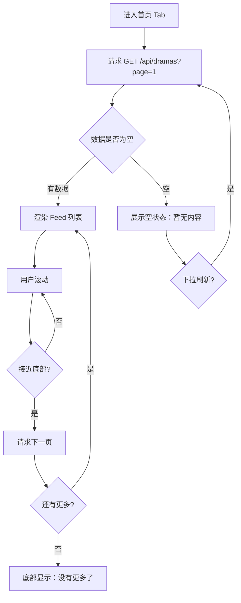
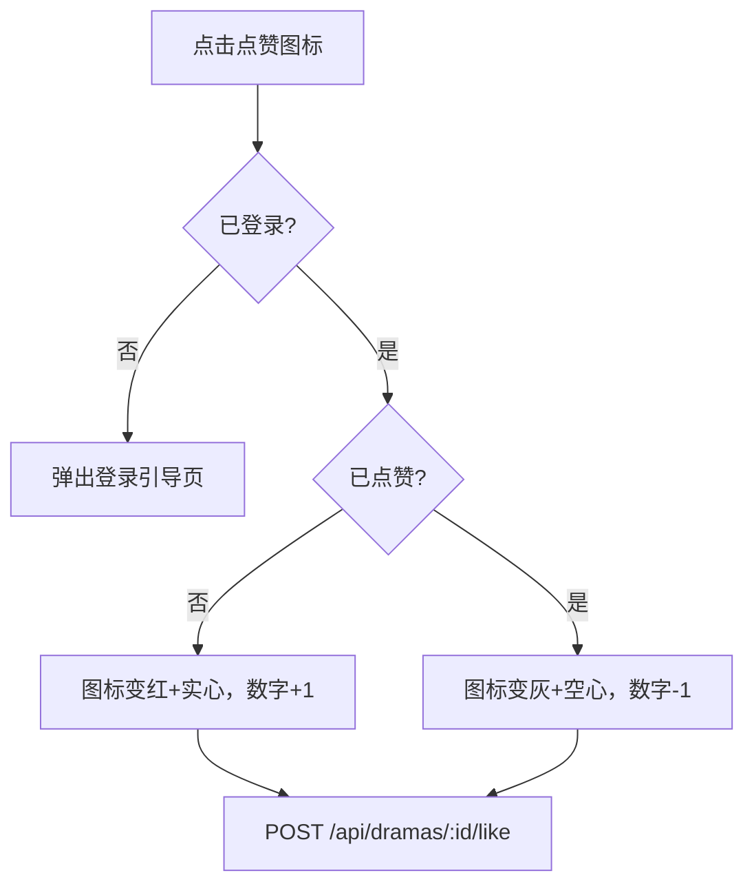

# PRD：首页 Feed 流

> 创建日期：2026-07-25
> 状态：草稿
> 作者：AI Agent + daniel

---

## 1. 需求背景

### 1.1 问题描述

- **现状**：应用启动后仅展示占位页面，用户无法浏览短剧内容。
- **痛点**：首页 Feed 是用户进入应用后的第一触点，必须承载内容发现和消费入口的双重职责。没有首页 Feed，播放器、评论、搜索等功能都缺少流量入口。
- **竞品参考**：红果首页采用沉浸式竖屏视频 Feed，中央区域展示视频封面（占屏幕 45-50% 高度），右侧纵向排列交互操作栏（收藏、评论、点赞、分享），底部展示标题、标签、热评摘要和「观看完整短剧」CTA 按钮。

### 1.2 目标用户

| 用户角色 | 特征描述 | 核心需求 |
|---------|---------|---------|
| 内容消费者 | 浏览短剧、寻找感兴趣的内容 | 快速浏览封面和简介，进入感兴趣的短剧观看 |
| 轻度互动用户 | 点赞、收藏但不一定评论 | 用最少操作表达态度 |

### 1.3 预期目标

- **业务目标**：建立可滚动的短剧内容 Feed 流，用户能浏览封面海报、标题、热度信息，并通过底部 CTA 进入完整播放页。右侧交互栏支持点赞、收藏操作。

### 1.4 范围定义

| 范围内 | 范围外（明确不做） | 原因 |
|--------|------------------|------|
| Backend 内容 API（Drama 列表接口，含分页） | 个性化推荐算法 | 先用简单排序（热度/时间），推荐算法远期迭代 |
| iOS/Android 竖屏 Feed 列表 UI（封面+信息+交互栏） | 评论半屏抽屉 | PRD-09 独立处理 |
| 右侧交互栏（点赞、收藏、分享按钮） | 分享功能落地页 | PRD 独立处理 |
| 底部「观看完整短剧」CTA 跳转播放页 | 首页内的视频自动播放 | 暂不实现（Feed 卡片为静态封面图） |
| 冷启动签到弹窗触发逻辑 | 签到功能实现 | PRD-10 独立处理 |

---

## 2. 涉及平台

| 平台 | 是否涉及 | 变更概要 |
|------|---------|---------|
| Backend | ✅ 涉及 | 新增 Drama 列表 API（分页、排序、筛选） |
| Web | ❌ 不涉及 | Web 端首页后续 PRD 单独规划 |
| iOS | ✅ 涉及 | 首页 Feed UI（竖屏卡片列表 + 交互栏） |
| Android | ✅ 涉及 | 首页 Feed UI（竖屏卡片列表 + 交互栏） |

---

## 3. 用户故事

| 编号 | 角色 | 需求 | 验收标准 | 涉及平台 | 优先级 |
|------|------|------|---------|---------|--------|
| US-01 | 内容消费者 | 浏览首页 Feed，看到短剧封面和基本信息 | 进入首页即加载 Feed 列表；每张卡片展示封面图、标题、分类标签、热度值 | iOS/Android | P0 |
| US-02 | 内容消费者 | 滚动加载更多内容 | 滚动到底部自动加载下一页；加载中有指示器；已全部加载时显示「没有更多了」 | iOS/Android/Backend | P0 |
| US-03 | 内容消费者 | 对短剧进行点赞/收藏 | 点击右侧❤️心形图标切换点赞状态；点击⭐收藏图标切换收藏状态；匿名态下点击点赞/收藏弹出登录引导页 | iOS/Android | P1 |
| US-04 | 内容消费者 | 从首页进入完整播放页 | 点击底部「观看完整短剧」按钮跳转到 `/play/:dramaId` 播放页 | iOS/Android | P0 |
| US-05 | 内容消费者 | 看到内容热度信息 | 每张卡片展示热度值（如 "123.4 万"）和评分 | iOS/Android/Backend | P1 |

---

## 4. 核心流程

### 4.1 US-01/02：首页 Feed 浏览与分页

#### 用户旅程

1. 用户打开应用，进入首页 Tab
2. 应用请求 `GET /api/dramas?page=1&pageSize=10` 获取第一页数据
3. 页面渲染竖向排列的内容卡片列表，每张卡片展示：封面图（占 45-50% 屏高）、标题、分类标签、热度
4. 用户向下滚动，接近底部时自动触发下一页加载
5. 全部加载完毕时，列表底部显示「— 没有更多了 —」



#### UI/交互要点

| 页面 / 区域 | 交互描述 | 涉及端 | 竞品参考 |
|------------|---------|--------|---------|
| 内容卡片 | 竖向排列，每张卡片占屏幕 45-50% 高度；封面全宽展示；底部信息区：标题（18-20sp）、分类标签、热度值 | iOS/Android | 红果首页 Feed 卡片 |
| 右侧交互栏 | 纵向排列的圆形图标按钮区域：❤️点赞（含数字）、⭐收藏（含数字）、💬评论数、📤分享、👉更多 | iOS/Android | 红果右侧交互栏 |
| 底部 CTA 区域 | 半透明深色条，文案「观看完整短剧」→ 点击跳转播放页 | iOS/Android | 红果底部 CTA |
| 加载指示器 | 底部加载中：居中 spinner；空状态：居中图标 + 「暂无内容」文案 | iOS/Android | — |
| 下拉刷新 | 列表顶部下拉触发重新加载第 1 页 | iOS/Android | — |

#### 关键边界

| 场景 | 预期行为 |
|------|---------|
| 网络异常 | 展示错误提示 + 「点击重试」按钮 |
| 数据为空 | 展示空状态插图和文案 |
| 最后一页 | 底部展示「— 没有更多了 —」，不再触发加载 |

### 4.2 US-03：点赞/收藏交互

#### 用户旅程

1. 用户在首页 Feed 浏览，看到喜欢的短剧
2. 点击 ❤️ 图标，图标变为实心红色，点赞数 +1（乐观更新）
3. 再次点击，取消点赞，图标变为空心灰色，点赞数 -1
4. 收藏操作同理（⭐图标变换）
5. 匿名态下：点击点赞/收藏图标弹出登录引导页，不执行本地状态变更



### 4.3 US-04：从首页进入完整播放页

#### 用户旅程

1. 用户在首页 Feed 浏览内容卡片
2. 点击底部「观看完整短剧」CTA 按钮
3. 应用通过路由跳转到 `/play/:dramaId` 播放页
4. 播放页加载该短剧内容

```mermaid
flowchart TD
    A[首页 Feed 卡片] --> B[点击 观看完整短剧]
    B --> C{NavigationStack push}
    C -->|iOS| D[/play/:dramaId PlayerPage]
    C -->|Android| E[/play/:dramaId PlayerScreen]
    D --> F[播放页加载]
    E --> F
```

#### 关键边界

| 场景 | 预期行为 |
|------|---------|
| dramaId 无效（不存在） | 播放页展示「短剧不存在」提示，提供返回按钮 |
| 播放页尚未实现 | 展示占位页面（PRD-01 创建的 PlayerPage 占位），等待 PRD-03 替换 |

---

## 5. 依赖

| 依赖项 | 类型 | 说明 | 状态 |
|--------|------|------|------|
| 底部导航 | 内部能力 | 首页 Tab 容器已就位（PRD-01） | 🚧 待开发 |
| 数据模型 (Drama) | 内部能力 | 已有 Drama/Episode Schema，点赞/收藏需新增关系表 | 🚧 待扩展 |
| Backend API 框架 | 内部能力 | Next.js API Routes 框架已有 | ✅ 已就绪 |
| 播放器路由 | 内部能力 | `/play/:id` 路由（PRD-01 US-02） | 🚧 待开发 |

---

## 6. 现有功能影响

| 现有功能 | 影响类型 | 说明 |
|---------|---------|------|
| 首页占位页 | 替换 | 将 PRD-01 创建的 HomePage 占位替换为实际 Feed UI |
| Deeplink | 无影响 | — |

---

## 7. 待澄清问题

| 编号 | 问题 | 阻塞 |
|------|------|------|
| Q-01 | Feed 排序策略：按热度？按时间？混合？ | 否（首版用热度降序，后续可调整） |
| Q-02 | 每页加载条数：10 条还是 20 条？ | 否（首版用 10 条，后续可调） |

---

## 8. 参考资料

### 竞品调研

| 文档 | 关键发现 |
|------|---------|
| `docs/product_research/mobile/homepage-feed/homepage-feed.md` | 红果首页竖屏Feed、右侧交互栏、底部CTA |
| `docs/product_research/mobile/homepage-feed/full-watch/full-watch.md` | 首页 CTA 承接的播放页 |

### Wiki 文档

| 文档 | 关键信息 |
|------|---------|
| `wiki/features/data-models/index.md` | Drama Schema：id/title/description/cover_url/category/total_episodes/rating/play_count/status |
| `wiki/api/dramas.md` | 已有 Drama 相关 API 定义 |

---

## 9. 变更历史

| 日期 | 变更内容 | 变更原因 |
|------|---------|---------|
| 2026-07-25 | 初始版本 | Sprint 1 P0 |
