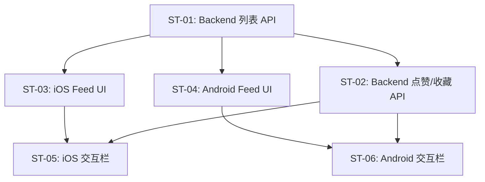

# 子任务拆分：首页 Feed 流

> 关联 PRD：[prd.md](prd.md)
> 创建日期：2026-07-25
> 状态：草稿

---

## 工时总览

| 平台 | 子任务数 | 总工时（人日） | 备注 |
|------|---------|--------------|------|
| Backend | 2 | 4 人日 | |
| iOS | 2 | 5 人日 | |
| Android | 2 | 5 人日 | |
| **合计** | **6** | **14 人日** | |

---

## 迭代规划

| 迭代 | 目标 | 包含子任务 | 交付物 |
|------|------|-----------|--------|
| Sprint 1 | Feed 核心浏览 + CTA 跳转 | ST-01, ST-02, ST-03, ST-04 | 用户可浏览列表，点击进入播放页 |
| Sprint 2 | 交互栏 + 完善体验 | ST-05, ST-06 | 点赞收藏、下拉刷新、错误处理 |

---

## 子任务详情

### ST-01：Backend Drama 列表 API

| 属性 | 值 |
|------|-----|
| **对应 PRD** | US-01, US-02 |
| **平台** | Backend |
| **优先级** | P0 |
| **预估工时** | 2 人日 |
| **前置依赖** | 无 |
| **迭代** | Sprint 1 |

#### 工作内容

1. 实现 `GET /api/dramas` API：
   - Query 参数：`page` (默认 1)、`pageSize` (默认 10，最大 100)
   - 返回 `{ data: Drama[], pagination: { page: number, page_size: number, total: number, total_pages: number } }`（对齐现有 API 约定）
   - 默认按 `play_count` 降序 + `created_at` 降序排序
2. 实现种子数据脚本（`backend/prisma/seed.ts`）：生成 20+ 条测试 Drama 数据
3. Zod 校验请求 query 和响应结构

#### 完成标准

- [ ] `GET /api/dramas?page=1&pageSize=10` 返回第 1 页数据
- [ ] 返回 JSON 结构符合 `DramaListResponseSchema`
- [ ] 种子数据可正常写入数据库
- [ ] 空数据库时返回 `{ data: [], total: 0 }`

#### 涉及 API

| 方法 | 路径 | 说明 |
|------|------|------|
| GET | `/api/dramas` | 分页获取 Drama 列表 |

---

### ST-02：Backend Drama 点赞/收藏 API

| 属性 | 值 |
|------|-----|
| **对应 PRD** | US-03 |
| **平台** | Backend |
| **优先级** | P1 |
| **预估工时** | 2 人日 |
| **前置依赖** | Drama Schema 扩展（新增 user_drama_likes / user_drama_favorites 关系表） |
| **迭代** | Sprint 2 |

#### 工作内容

1. 实现 `POST /api/dramas/:id/like`：切换点赞状态（点赞数据存入独立关系表 `user_drama_likes`）
2. 实现 `POST /api/dramas/:id/favorite`：切换收藏状态（收藏数据存入独立关系表 `user_drama_favorites`）
3. 新增 Schema：`UserDramaLike` / `UserDramaFavorite` 关系表，不修改 Drama 主表
4. 权限：需登录（使用 Supabase Auth middleware）

#### 完成标准

- [ ] 已登录用户可点赞/取消点赞，返回最新状态
- [ ] 未登录用户请求返回 401

#### 涉及 API

| 方法 | 路径 | 说明 |
|------|------|------|
| POST | `/api/dramas/:id/like` | 切换点赞 |
| POST | `/api/dramas/:id/favorite` | 切换收藏 |

---

### ST-03：iOS 首页 Feed UI

| 属性 | 值 |
|------|-----|
| **对应 PRD** | US-01, US-02, US-04, US-05 |
| **平台** | iOS |
| **优先级** | P0 |
| **预估工时** | 3 人日 |
| **前置依赖** | ST-01（Backend API） |
| **迭代** | Sprint 1 |

#### 工作内容

1. 实现 `HomePage`：竖向 `ScrollView` + `LazyVStack` 渲染内容卡片列表
2. 实现 `FeedCardView` 组件：
   - 封面图（`AsyncImage` 加载 `cover_url`，占 45-50% 屏高）
   - 底部信息区：标题（`.headline`）、分类标签（胶囊样式）、热度值
   - 底部 CTA 条：「观看完整短剧」，点击 `router.navigate(to: .player(videoId: drama.id))`
3. 实现分页加载：滚动到底部自动请求下一页（`.onAppear` 监听最后一条）
4. 实现下拉刷新（`.refreshable`）
5. 错误处理：网络异常展示重试按钮

#### 完成标准

- [ ] 进入首页加载 Feed 列表
- [ ] 滚动到底部自动加载下一页
- [ ] 下拉刷新重新加载第 1 页
- [ ] 点击 CTA 跳转播放页
- [ ] 空状态/错误状态正确展示

#### 涉及 UI/页面

| 页面/组件 | 说明 | 涉及端 |
|----------|------|--------|
| HomePage | 首页 Tab 页面，替换占位 | iOS |
| FeedCardView | 单张内容卡片组件 | iOS |
| EmptyStateView | 空状态组件 | iOS |

---

### ST-04：Android 首页 Feed UI

| 属性 | 值 |
|------|-----|
| **对应 PRD** | US-01, US-02, US-04, US-05 |
| **平台** | Android |
| **优先级** | P0 |
| **预估工时** | 3 人日 |
| **前置依赖** | ST-01（Backend API） |
| **迭代** | Sprint 1 |

#### 工作内容

1. 实现 `HomeScreen`：`LazyColumn` 渲染内容卡片列表
2. 实现 `FeedCard` Composable：
   - 封面图（Coil `AsyncImage` 加载 `cover_url`，占 45-50% 屏高）
   - 底部信息区：标题（`MaterialTheme.typography.titleMedium`）、分类标签、热度值
   - 底部 CTA：`TextButton`「观看完整短剧」，点击 `navController.navigate("player/${drama.id}")`
3. 分页：`LaunchedEffect` + `snapshotFlow` 监听滚动到底部
4. 下拉刷新：`pullRefresh` modifier
5. 错误处理：网络异常展示 `Retry` 按钮

#### 完成标准

- [ ] 进入首页加载 Feed 列表
- [ ] 滚动到底部自动加载下一页
- [ ] 下拉刷新重新加载第 1 页
- [ ] 点击 CTA 跳转播放页
- [ ] 空状态/错误状态正确展示

#### 涉及 UI/页面

| 页面/组件 | 说明 | 涉及端 |
|----------|------|--------|
| HomeScreen | 首页 Tab 页面，替换占位 | Android |
| FeedCard | 单张内容卡片 Composable | Android |

---

### ST-05：iOS 交互栏

| 属性 | 值 |
|------|-----|
| **对应 PRD** | US-03 |
| **平台** | iOS |
| **优先级** | P1 |
| **预估工时** | 2 人日 |
| **前置依赖** | ST-03 |
| **迭代** | Sprint 2 |

#### 工作内容

1. 在 `FeedCardView` 右侧添加纵向交互按钮栏（`VStack`）：
   - ❤️ 点赞按钮 + 数字（`@State` 本地状态，点击切换）
   - ⭐ 收藏按钮 + 数字（`@State` 本地状态，点击切换）
   - 💬 评论数（纯展示）
   - 📤 分享按钮（点击展示 Toast「功能开发中」）
2. 点赞/收藏动画（SF Symbol `bounce` 效果）
3. 匿名态下点击点赞/收藏弹出登录引导页；已登录状态下调用 Backend API 同步状态

#### 完成标准

- [ ] 右侧交互栏正确渲染
- [ ] 点赞/收藏点击切换状态，数字实时更新
- [ ] 动画效果符合预期

---

### ST-06：Android 交互栏

| 属性 | 值 |
|------|-----|
| **对应 PRD** | US-03 |
| **平台** | Android |
| **优先级** | P1 |
| **预估工时** | 2 人日 |
| **前置依赖** | ST-04 |
| **迭代** | Sprint 2 |

#### 工作内容

1. 在 `FeedCard` 右侧添加纵向交互按钮栏（`Column`）：
   - ❤️ 点赞 + 数字（`remember { mutableStateOf() }` 本地状态）
   - ⭐ 收藏 + 数字
   - 💬 评论数
   - 📤 分享（点击展示 Toast「功能开发中」）
2. 点赞/收藏动画
3. 匿名态下点击点赞/收藏弹出登录引导页；已登录态同步 Backend

#### 完成标准

- [ ] 右侧交互栏正确渲染
- [ ] 点赞/收藏点击切换状态
- [ ] 动画效果符合预期

---

## 子任务依赖图

---

## 工时估算说明

| 假设 | 说明 |
|------|------|
| Backend 使用已有 Prisma/Supabase 基础设施 | 不需要额外搭建数据库 |
| iOS/Android 使用系统原生网络层（URLSession / Ktor） | 不引入第三方网络库 |
| 封面图使用占位图或测试 CDN URL | 不需要真实 CDN 服务 |
| 交互栏暂时不需要 Backend 同步 | Sprint 1 本地状态即够用 |

---

## 变更历史

| 日期 | 变更内容 | 变更原因 |
|------|---------|---------|
| 2026-07-25 | 初始版本 | PRD-02 |
