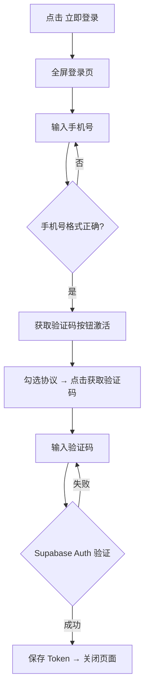

# PRD：用户登录与注册

> 创建日期：2026-07-25
> 状态：草稿
> 作者：AI Agent + daniel

---

## 1. 需求背景

### 1.1 问题描述

- **现状**：无用户体系，所有用户以匿名态使用。点赞/收藏/播放进度/预约等操作无法持久化，用户退出应用后数据丢失。评论/预约等功能依赖登录状态。
- **痛点**：用户体系是所有个人化功能（评论、预约、收藏、消息、播放历史）的基础依赖。没有登录能力，后续所有需要用户身份的功能都无法实现。
- **竞品参考**：红果登录页为全屏页面，主流程为手机号 + 验证码登录。页面包含：标题"登录/发现更多精彩短剧"、国家区号选择器（+86）、手机号输入框、「获取验证码」主按钮（灰→橙状态变化）、用户协议勾选框、底部第三方登录入口（抖音图标）。

### 1.2 目标用户

| 用户角色 | 特征描述 | 核心需求 |
|---------|---------|---------|
| 所有用户 | 需要身份持久化的用户 | 使用手机号快速注册/登录 |

### 1.3 预期目标

- **业务目标**：建立手机号+验证码登录体系，基于 Supabase Auth。支持登录态管理、自动登录、退出登录。

### 1.4 范围定义

| 范围内 | 范围外（明确不做） | 原因 |
|--------|------------------|------|
| 手机号 + 验证码登录 | 第三方登录（抖音/微信/Apple） | 首版先做基础手机号登录 |
| 登录页面 UI | 密码登录 | 首版仅验证码 |
| 登录态管理（Token 存储+自动刷新） | 第三方 OAuth 登录 | 远期迭代 |
| 退出登录 | 忘记密码/找回 | — |
| 登录拦截（匿名操作触发跳转登录） | — | — |

> **首次安装引导说明**：首次安装不强制登录，用户可匿名浏览；仅在触发 US-05 拦截场景或主动点击登录入口时才引导登录。

---

## 2. 涉及平台

| 平台 | 是否涉及 | 变更概要 |
|------|---------|---------|
| Backend | ✅ 涉及 | Supabase Auth 集成、Auth API |
| iOS | ✅ 涉及 | 登录页 UI、Token 管理 |
| Android | ✅ 涉及 | 登录页 UI、Token 管理 |

---

## 3. 用户故事

| 编号 | 角色 | 需求 | 验收标准 | 涉及平台 | 优先级 |
|------|------|------|---------|---------|--------|
| US-01 | 所有用户 | 使用手机号注册/登录 | 输入手机号 → 获取验证码 → 输入验证码 → 登录成功 → 返回来源页 | 全部 | P0 |
| US-02 | 所有用户 | 同意用户协议 | 登录前必须勾选协议复选框（用户协议+隐私政策），未勾选时登录按钮不可点击 | iOS/Android | P0 |
| US-03 | 已登录用户 | 保持登录状态 | 关闭应用再打开，自动恢复登录态（无需重新输入） | iOS/Android | P0 |
| US-04 | 已登录用户 | 退出登录 | 在菜单面板底部新增"设置"入口行，其中包含退出登录选项。设置入口行 UI 由本 PRD 的 iOS/Android 子任务实现。退出登录后清除 Token，回到匿名态。 | iOS/Android | P1 |
| US-05 | 匿名用户 | 操作拦截跳转登录 | 执行需要登录的操作时（如评论/预约），弹出登录拦截提示或跳转登录页 | iOS/Android | P1 |

> 注：US-05 中评论拦截（PRD-09 依赖）需在 P1 阶段优先实现。

---

## 4. 核心流程

### 4.1 US-01/02：手机号验证码登录

#### 设计决策

选择 Backend 代理 Supabase Auth 调用（而非客户端直连），理由：
- 统一限流：可在服务端统一控制验证码发送频率
- 隐藏 Supabase Key：避免将 Supabase 匿名密钥嵌入客户端
- 统一错误处理：客户端面对统一的 API 错误格式

> 注：这是 PM 阶段的设计决策，spec 阶段可重新评估是否改为客户端直连。

#### 用户旅程

1. 用户在菜单面板点击「立即登录」→ 进入全屏登录页
2. 页面展示：标题、国家区号（默认 +86）、手机号输入框、「获取验证码」按钮
3. 用户输入手机号 → 「获取验证码」按钮从灰色变为橙色可点击
4. 用户勾选协议复选框 → 点击「获取验证码」
5. 收到短信验证码，输入 6 位验证码
6. 验证成功 → 自动关闭登录页，返回来源页

#### UI/交互要点

- **手机号校验规则**：前端校验 11 位数字、以 1 开头；服务端使用 Supabase Auth 内置 format 校验；区号选择器默认 +86。
- **用户协议**：协议链接点击后在 App 内 WebView 打开；首版用静态文案页面；未勾选时按钮置灰不可点击。
- **登录入口**：菜单面板底部新增"设置"入口行，由本 PRD 的 iOS/Android 子任务实现。

### 4.2 异常场景

| 场景 | 预期行为 |
|------|---------|
| 验证码输入错误 | 提示"验证码错误，请重新输入"，允许重试 3 次 |
| 验证码过期 | 提示"验证码已过期，请重新获取" |
| 发送过于频繁 | 按钮倒计时 60s + 提示"请 N 秒后重试" |
| 网络异常 | Toast 提示"网络异常，请稍后重试" |

### 4.3 Token 管理策略

- 使用 Supabase Auth 的 `onAuthStateChange` 自动监听 session 变化
- session 过期时 Supabase SDK 自动尝试 refresh
- refresh 失败后清除本地状态回匿名态

---

## 5. 依赖

| 依赖项 | 类型 | 说明 | 状态 |
|--------|------|------|------|
| Supabase | 外部服务 | 用户认证服务 | 📅 需配置 Supabase 项目 |
| 菜单面板 | 内部能力 | 登录入口 | 🚧 PRD-07 |

---

## 6. 待澄清

| 编号 | 问题 | 阻塞 |
|------|------|------|
| Q-01 | Supabase 项目是否已创建？API Key 是否就绪？ | 否（开发前需确认） |
| Q-02 | 验证码服务：使用 Supabase 内置 SMS 还是第三方？ | 是（开发启动前需确认） |
| Q-R1 | 是否需要"手机号一键登录"（运营商 SDK 取号）？建议首版不做，远期评估。 | 否（远期评估） |
| Q-R2 | 登录后是否需要强制绑定/完善资料（昵称、头像）？建议增加 US-06：首次登录后弹窗引导设置昵称和头像（可跳过）。 | 否（远期评估） |

---

## 7. 参考资料

| 文档 | 关键发现 |
|------|---------|
| `docs/product_research/mobile/homepage-feed/menu-panel/login-cta/login-cta.md` | 红果登录页完整交互 |
| `wiki/decisions/2026-07-24-supabase-baas.md` | Supabase 选型决策 |

---

## 8. 变更历史

| 日期 | 变更内容 | 变更原因 |
|------|---------|---------|
| 2026-07-25 | 初始版本 | Sprint 4 P1 |
