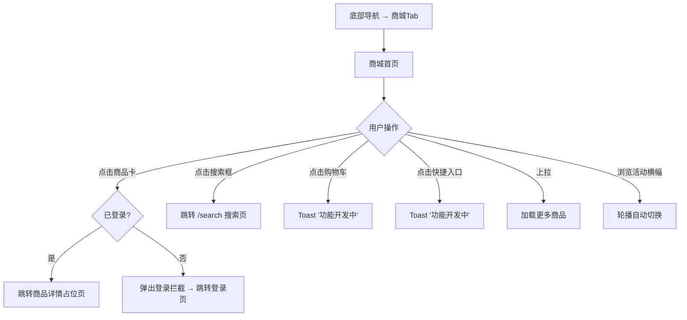

# PRD：商城

> 创建日期：2026-07-25
> 状态：草稿
> 作者：AI Agent + daniel

---

## 1. 需求背景

### 1.1 问题描述

- **现状**：底部「商城」Tab 为占位页面。
- **痛点**：商城是红果商业化的重要渠道，通过商品分发、权益入口、活动运营实现变现。
- **竞品参考**：红果商城Tab页顶部搜索框 + 搜索按钮 + 购物车入口；5 个快捷入口（我的订单/优惠券红包/我的钱包/短剧同款/国补专区）；活动横幅轮播；双列商品 Feed 商品卡。

### 1.2 目标用户

| 用户角色 | 特征描述 | 核心需求 |
|---------|---------|---------|
| 浏览型用户 | 逛商城发现商品 | 浏览商品 Feed，查看商品信息 |
| 购买意向用户 | 对特定品类感兴趣 | 通过搜索和快捷入口找到目标商品 |

### 1.3 预期目标

建立商城频道页面，含搜索、快捷入口、活动横幅、双列商品 Feed。

### 1.4 范围定义

| 范围内 | 范围外 | 原因 |
|--------|--------|------|
| 商城首页 UI（搜索+购物车入口+快捷入口+活动横幅+商品Feed） | 完整交易流程（下单/支付/物流） | 远期迭代 |
| 快捷入口占位（点击 Toast 提示"功能开发中"） | 商品详情页（仅提供占位页，展示"功能开发中"） | 远期迭代 |
| 已登录用户点击商品卡跳转商品详情占位页 | 直播带货 | 远期迭代 |
| 匿名点击商品卡触发登录拦截 | | |
| 搜索框点击跳转搜索页（PRD-04） | | |
| 活动横幅首版使用种子数据（硬编码图片 URL） | | |

> 注：商城不涉及 Web 端（Web 端仅展示占位页）。PRD-01 已注册 `/mall` 路由，本 PRD 不修改。

---

## 2. 涉及平台

| 平台 | 是否涉及 | 变更概要 |
|------|---------|---------|
| Backend | ✅ 涉及 | 商品列表 API |
| iOS | ✅ 涉及 | 商城页面 UI |
| Android | ✅ 涉及 | 商城页面 UI |
| Web | ❌ 不涉及 | 仅 PRD-01 已注册 `/mall` 占位路由，本 PRD 不修改 |

---

## 3. 用户故事

| 编号 | 角色 | 需求 | 验收标准 | 优先级 |
|------|------|------|---------|--------|
| US-01 | 所有用户 | 浏览商城Feed | 双列商品卡片列表展示商品图+标题+价格，滚动加载更多 | P0 |
| US-02 | 所有用户 | 看到快捷入口 | 5 个入口：我的订单/优惠券/钱包/同款/国补 | P1 |
| US-03 | 匿名用户 | 点击商品被登录拦截 | 点击商品卡 → 弹出登录拦截提示 → 跳转登录页 | P1 |
| US-04 | 已登录用户 | 查看商品详情 | 点击商品卡 → 跳转商品详情占位页（展示"功能开发中"） | P1 |

---

## 4. 核心流程

### 4.1 UI/交互要点

| 区域 | 交互描述 |
|------|---------|
| 顶部栏 | 搜索框（点击跳转搜索页）+ 购物车入口（点击 Toast "功能开发中"） |
| 快捷入口 | 5 个网格图标：我的订单/优惠券红包/我的钱包/短剧同款/国补专区（点击 Toast "功能开发中"） |
| 活动横幅 | 轮播图，自动切换 |
| 双列商品Feed | 双列瀑布流卡片（商品图+标题+价格） |

### 4.2 边界状态

| 场景 | 预期行为 |
|------|---------|
| 商品列表为空 | 空态插画 + "暂无商品" |
| 网络加载失败 | Toast + 重试按钮 |
| 匿名点击商品卡 | 弹出登录引导，跳转登录页 |

> 登录拦截复用 PRD-08 统一拦截机制，行为为跳转全屏登录页。

---

## 5. 依赖

| 依赖项 | 类型 | 说明 | 状态 |
|--------|------|------|------|
| 底部导航 | 内部能力 | 商城Tab | 🚧 PRD-01 |
| 搜索发现 | 内部能力 | 搜索框跳转搜索页 | 📅 PRD-04 |
| 用户登录 | 内部能力 | 商品详情需登录 | 📅 PRD-08 |

---

## 6. 现有功能影响

| 现有功能 | 影响类型 | 说明 |
|---------|---------|------|
| 底部导航（PRD-01） | 依赖 | 商城 Tab 已注册，本 PRD 填充内容 |
| 搜索页（PRD-04） | 集成 | 点击搜索框跳转搜索页 |
| 用户登录（PRD-08） | 依赖 | 商品详情需登录 |

---

## 7. 参考资料

| 文档 | 关键发现 |
|------|---------|
| `docs/product_research/mobile/mall/mall.md` | 商城完整布局 |
| `docs/product_research/mobile/mall/product-card/product-card.md` | 商品卡登录拦截 |

---

## 8. 变更历史

| 日期 | 变更内容 | 变更原因 |
|------|---------|---------|
| 2026-07-25 | 初始版本 | Sprint 5 P1 |
