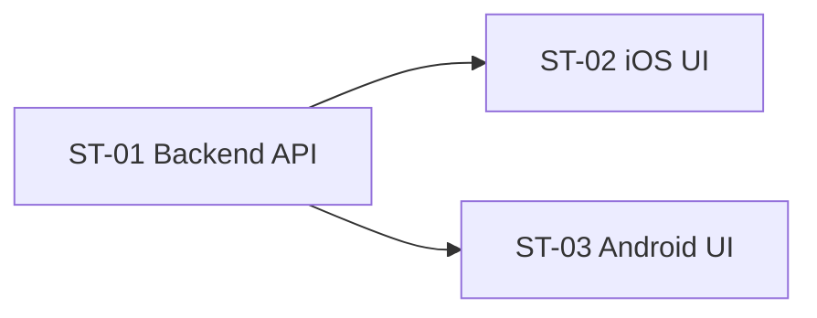

# 子任务拆分：商城

> 关联 PRD：[prd.md](prd.md)
> 创建日期：2026-07-25 | 状态：草稿

---

## 工时总览

| 平台 | 子任务数 | 总工时（人日） |
|------|---------|--------------|
| Backend | 1 | 2 人日 |
| iOS | 1 | 4 人日 |
| Android | 1 | 4 人日 |
| **合计** | **3** | **10 人日** |

---

## 子任务详情

### ST-01：Backend 商品列表 API

- 工时：2 人日 | P0
- `GET /api/mall/products?page=1&pageSize=20`：商品列表（标题/图片/价格/tags），种子数据预设 20+ 商品

**API 规格：**

`GET /api/mall/products?page=1&pageSize=20`

Response：
```json
{
  "data": [
    {
      "id": "uuid",
      "title": "商品标题",
      "image_url": "https://...",
      "price": 9.9,
      "tags": ["热卖"]
    }
  ],
  "pagination": { "page": 1, "page_size": 20, "total": 0, "total_pages": 0 }
}
```

> 注：首版商品列表按创建时间倒序，不支持客户端排序/筛选。
> 活动横幅首版使用种子数据（3-5 条硬编码图片 URL），后续由运营后台配置。

### ST-02：iOS 商城页 UI

- 工时：4 人日 | P0
- 搜索+购物车入口、5 个快捷入口（`LazyVGrid`）、活动横幅轮播（`TabView` + 自动切换）、双列商品 Feed（`LazyVGrid` 双列）、商品点击登录拦截

### ST-03：Android 商城页 UI

- 工时：4 人日 | P0
- 搜索+购物车入口、5 个快捷入口（`LazyVerticalGrid`）、活动横幅轮播（`HorizontalPager` + 自动切换）、双列商品 Feed（`LazyVerticalStaggeredGrid`）、商品点击登录拦截

---

## 子任务依赖

| 子任务 | 依赖 |
|--------|------|
| ST-01 | 无（独立开发） |
| ST-02 | ST-01（商品列表 API） |
| ST-03 | ST-01（商品列表 API） |



---

## 变更历史

| 日期 | 变更内容 |
|------|---------|
| 2026-07-25 | 初始版本 |
