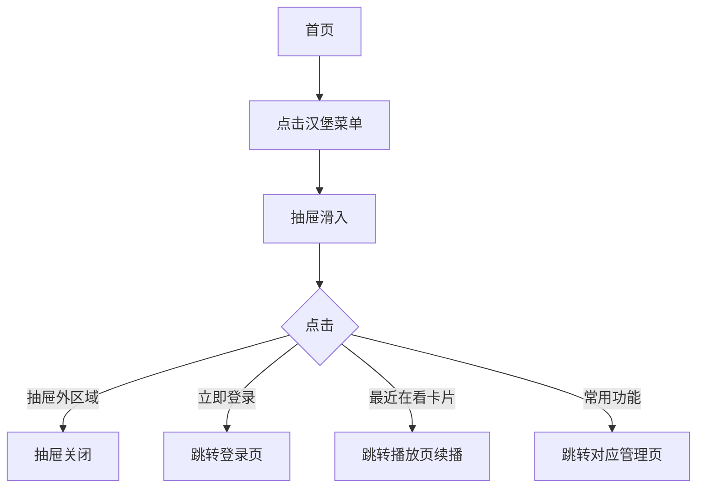

# PRD：菜单面板

> 创建日期：2026-07-25
> 状态：草稿
> 作者：AI Agent + daniel

---

## 1. 需求背景

### 1.1 问题描述

- **现状**：用户无个人中心入口，无法查看最近观看记录、管理预约/下载，也无法进入登录。所有个人相关功能缺少统一的承载容器。
- **痛点**：用户缺少统一的个人中心入口。想看续播进度时不知去哪找；想查看预约/下载状态时没有快捷途径；作为新用户想登录却没有明确的引导入口。所有个人相关操作分散在各处，缺少聚合容器。
- **竞品参考**：红果菜单面板从首页左上角汉堡菜单图标进入，为左侧滑出式抽屉（覆盖在首页之上），包含：登录引导区、消息模块预览、最近在看续播卡片（3 张）、游戏中心（4 个图标）、常用功能列表（我的预约、我的下载）。

### 1.2 目标用户

| 用户角色 | 特征描述 | 核心需求 |
|---------|---------|---------|
| 匿名用户 | 未登录浏览 | 查看部分功能、被引导登录 |
| 已登录用户 | 有个人数据 | 续播、管理预约/下载、查看消息 |

### 1.3 预期目标

- **业务目标**：建立左侧滑出式菜单抽屉，作为个人中心入口和工具聚合面板。

### 1.4 范围定义

| 范围内 | 范围外（明确不做） | 原因 |
|--------|------------------|------|
| 左侧滑出抽屉 UI + 动画 | 各模块的完整功能 | 各模块由对应 PRD 负责（登录 PRD-08、消息 PRD-10、资产管理 PRD-11） |
| 登录引导区（点击跳转登录页） | 游戏中心完整功能 | 仅保留入口图标，点击行为待定 |
| 最近在看续播卡片（展示+点击续播） | 我的下载完整功能 | 仅保留入口 |
| 消息模块预览 | — | — |
| 常用功能列表入口 | — | — |
| 游戏中心 4 个占位图标（点击 Toast 提示） | 游戏中心完整功能（小游戏 H5 容器等） | 远期迭代 |
| 首页汉堡菜单图标入口 | — | — |

---

## 2. 涉及平台

| 平台 | 是否涉及 | 变更概要 |
|------|---------|---------|
| Backend | ✅ 涉及 | 最近在看记录 API |
| iOS | ✅ 涉及 | 抽屉 UI + 各模块占位/预览 |
| Android | ✅ 涉及 | 抽屉 UI + 各模块占位/预览 |

---

## 3. 用户故事

| 编号 | 角色 | 需求 | 验收标准 | 涉及平台 | 优先级 |
|------|------|------|---------|---------|--------|
| US-01 | 所有用户 | 打开/关闭菜单抽屉 | 点击首页左上角汉堡菜单 → 抽屉从左侧滑入（覆盖首页70-80%宽度）；点击抽屉外区域或返回 → 抽屉滑出关闭 | iOS/Android | P0 |
| US-02 | 匿名用户 | 看到登录引导 | 抽屉顶部显示灰色头像占位 + "登录查看完整信息" + 橙色「立即登录」按钮 | iOS/Android | P0 |
| US-03 | 已登录用户 | 看到最近在看 | 显示最近观看的 3 部短剧续播卡片（封面+标题+进度"第 N/M 集"），点击跳转播放页续播 | iOS/Android | P0 |
| US-04 | 所有用户 | 看到常用功能入口 | 列表展示「我的预约」「我的下载」入口，点击跳转对应页面 | iOS/Android | P1 |
| US-06 | 所有用户 | 看到游戏中心入口 | 抽屉中展示 4 个游戏图标占位，点击弹出 Toast「即将上线」 | iOS/Android | P1 |
| US-05 | 已登录用户 | 看到消息预览 | 消息模块展示最新一条系统通知摘要 + 未读标记，点击进入完整消息页 | iOS/Android | P1 |

---

## 4. 核心流程

### 4.1 US-01/02：抽屉打开与登录引导

#### 用户旅程

1. 用户在首页点击左上角汉堡菜单图标
2. 抽屉从左侧滑入，覆盖首页约 75% 宽度
3. 抽屉内从上到下依次：登录引导区 → 消息预览 → 最近在看 → 游戏中心 → 常用功能
4. 点击抽屉外暗色区域 → 抽屉关闭
5. 匿名用户看到「立即登录」按钮 → 点击跳转登录页（PRD-08）

#### UI/交互要点

| 页面 / 区域 | 交互描述 | 涉及端 | 竞品参考 |
|------------|---------|--------|---------|
| 抽屉容器 | 左侧滑入，宽 75%，背景白色/浅灰，首页可见于右侧暗色区域 | iOS/Android | 红果菜单抽屉 |
| 登录引导区 | 灰色圆形头像占位 + "登录查看完整信息" + 橙色圆角「立即登录」按钮 | iOS/Android | 红果登录引导 |
| 最近在看区 | 标题"最近在看" + 3 张横向续播卡片（封面+标题+进度） | iOS/Android | 红果最近在看 |
| 常用功能区 | 标题"常用功能" + 列表项（图标+文字+箭头） | iOS/Android | 红果常用功能 |

---

## 5. 依赖

| 依赖项 | 类型 | 说明 | 状态 |
|--------|------|------|------|
| 首页 Feed UI | 内部能力 | 首页左上角汉堡菜单入口 | 🚧 PRD-02 |
| 播放进度持久化 | 内部能力 | POST /api/player/stop 落库后 GET /api/user/recently-viewed 才有数据来源 | 🚧 PRD-03 |
| 播放器 | 内部能力 | 最近在看卡片点击续播 | 🚧 PRD-03 |
| 用户登录 | 内部能力 | 登录引导跳转、消息需登录 | 📅 PRD-08 |
| 资产管理 | 内部能力 | 常用功能跳转目标 | 📅 PRD-11 |

---

## 6. 待澄清问题

| 编号 | 问题 | 阻塞 |
|------|------|------|
| Q-01 | 游戏中心 4 个图标是否保留？点击行为？ | 否（保留占位图标，点击行为暂为 Toast 提示"即将上线"） |

---

## 7. 参考资料

| 文档 | 关键发现 |
|------|---------|
| `docs/product_research/mobile/homepage-feed/menu-panel/menu-panel.md` | 菜单抽屉完整布局 |
| `docs/product_research/mobile/homepage-feed/menu-panel/recently-viewed/recently-viewed.md` | 最近在看区域 |
| `docs/product_research/mobile/homepage-feed/menu-panel/common-functions/common-functions.md` | 常用功能区 |

---

## 8. 变更历史

| 日期 | 变更内容 | 变更原因 |
|------|---------|---------|
| 2026-07-25 | 初始版本 | Sprint 3 P1 |
