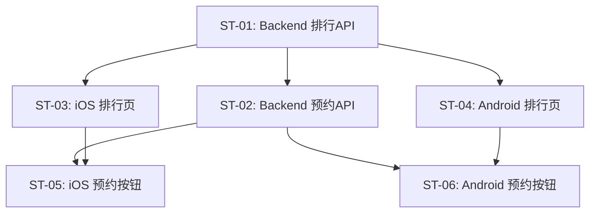

# PRD Review：排行体系

> 关联 PRD：[prd.md](prd.md)
> 审查日期：2026-07-25
> 审查轮次：第 1 轮
> 审查结论：✅ 通过（第 1 轮 8 个问题已全部修正）

---

## 审查摘要

| 维度 | 问题数 |
|------|--------|
| 完整性 | 4 |
| 可落地性 | 4 |
| 跨端一致性 | 0 |
| 冲突检测 | 0 |
| **合计** | **8** |

---

## 逐维度详细审查

### 1. 完整性

| 检查项 | 结果 | 说明 |
|--------|------|------|
| 需求背景是否清晰 | ✅ | 现状、痛点、竞品参考三层描述完整。布局形态（双层 Tab、排名序号、热度值）表述清楚。 |
| 用户故事是否完整 | ✅ | 覆盖探索型用户（US-01~03、US-05）和预约型用户（US-04），5 个故事均有验收标准和优先级。 |
| 范围定义是否明确 | ⚠️ | 范围表结构清晰，但有三处细节缺失：① 「分类」入口位置未描述（表说"保留入口"但 UI 表中未出现）；② 「漫剧」内容类型未提及（竞品有，PRD 未说明是否刻意排除）；③ 预约成功后的 UI 反馈状态未定义。 |
| 核心流程是否清晰 | ⚠️ | US-01/02/03 的 Tab 切换流程有完整 mermaid 图 + UI 要点表 + 关键边界表。但 US-04（预约）和 US-05（点击进入播放页）缺少独立的核心流程章节，仅在 mermaid 中以单节点出现。 |

### 2. 可落地性

| 检查项 | 结果 | 说明 |
|--------|------|------|
| 子任务拆分是否合理 | ⚠️ | ST-03 和 ST-04 为镜像子任务。ST-03 有完整属性表，但 ST-04 仅一行"同 ST-03"省略了所有属性（对应 PRD、优先级、前置依赖、迭代）。ST-06 同样只写"同 ST-05"未列出依赖字段。与搜索 PRD-04 的子任务写法不一致（后者镜像子任务都保留了完整属性表）。 |
| 工时估算是否超标 | ✅ | 最大单子任务 2 人日（ST-01/ST-03/ST-04），均未超过 5 人日上限。 |
| 依赖关系是否明确 | ⚠️ | 依赖关系整体清晰，但 sub tasks.md 缺少依赖图（mermaid）。Search PRD-04 有依赖图，本 PRD 没有。另外 ST-04 和 ST-06 的依赖字段被省略，仅靠"同 ST-0X"隐含依赖，不如显式列出可维护。 |
| 技术可行性检查 | ⚠️ | 基于 wiki：Drama schema 有 `play_count`、`rating` 字段可用于热榜/推荐榜排序，无明显阻碍。但存在两个具体问题：① `booking_count` 字段在现有 schema 中不存在（wiki features/data-models），ST-02 需要新增此字段 + 数据库 migration，但 PRD 依赖表将 Drama 数据标为"✅ 已就绪"；② ST-01 的 API 响应格式（`{ data, type, contentType, page }`—扁平）与现有 `/api/dramas` 的分页响应格式（`{ data, pagination: { page, page_size, total, total_pages } }`—嵌套分页对象）不一致，且缺少 `pageSize` 查询参数。 |

### 3. 跨端一致性

| 检查项 | 结果 | 说明 |
|--------|------|------|
| 涉及平台是否完整 | ✅ | 覆盖 Backend / iOS / Android，该功能不需要 Web 端。 |
| 各端交互是否对齐 | ✅ | iOS（ST-03/ST-05）和 Android（ST-04/ST-06）子任务结构对称，UI 组件映射清晰。 |

### 4. 冲突检测

| 检查项 | 结果 | 说明 |
|--------|------|------|
| 与现有功能的冲突 | ✅ | 无现有排行功能，排行页为新增独立页面。 |
| 与进行中功能的冲突 | ✅ | progress.md 中无 building 状态的条目。backlog B-010 与 subtasks 工时一致（10 人日）。依赖关系已标注：依赖搜索页入口（PRD-04）、登录（PRD-08）。 |

---

## 发现的问题及修正

### R-01：排行 API 响应格式与现有分页规范不一致

| 属性 | 值 |
|------|-----|
| **编号** | R-01 |
| **维度** | 可落地性 |
| **严重程度** | 🔴 阻塞 |
| **状态** | ✅ 已修正 |

**问题描述**

ST-01 描述的排行 API 响应格式为 `{ data: [...], type, contentType, page }`（扁平结构），但现有 Backend 已实现的 `/api/dramas` 使用嵌套分页对象格式 `{ data: [...], pagination: { page, page_size, total, total_pages } }`（见 `wiki/api/dramas.md`）。两种格式不一致会导致客户端需要维护两套分页解析逻辑。此外 ST-01 的 Query 参数只列了 `page`，缺少 `pageSize`。

**建议修正**

1. ST-01 响应格式改为 `{ data: Drama[], pagination: { page, page_size, total, total_pages } }`，与现有 API 规范对齐
2. ST-01 Query 参数补充 `pageSize`（默认 10，max 100），与其他分页端点保持一致
3. `type` 和 `contentType` 作为额外查询参数保留在请求中，不放入响应体（响应中的 type/contentType 信息可由客户端自行维护当前 Tab 状态）

---

### R-02：`booking_count` 字段需要 Schema 扩展，但 PRD 依赖表标记为"已就绪"

| 属性 | 值 |
|------|-----|
| **编号** | R-02 |
| **维度** | 可落地性 |
| **严重程度** | 🔴 阻塞 |
| **状态** | ✅ 已修正 |

**问题描述**

ST-02 的工作内容包含"更新 Drama 的 `booking_count`"，但当前 Drama schema（`wiki/features/data-models/index.md`）中没有 `booking_count` 字段。新增此字段需要数据库 migration，属于 ST-02 的前置工作。然而 PRD 第 5 节依赖表将"Drama 数据"标记为"✅ 已就绪"，与实际需要扩展 schema 的事实矛盾。

**建议修正**

候选方案：

- **方案 A（推荐）**：将 PRD 依赖表中"Drama 数据"的状态从"✅ 已就绪"改为"🚧 待扩展（需新增 `booking_count` 字段）"，并在 ST-02 的前置依赖中补充"Drama Schema 扩展（新增 booking_count 字段 + DB migration）"
- **方案 B**：`booking_count` 改为按需实时 COUNT `bookings` 表，不存储在 Drama 行上。但需评估性能影响

---

### R-03：「分类」二级 Tab 入口位置未在 UI 表中描述

| 属性 | 值 |
|------|-----|
| **编号** | R-03 |
| **维度** | 完整性 |
| **严重程度** | 🟡 建议 |
| **状态** | ✅ 已修正 |

**问题描述**

范围定义表明确写了"分类筛选面板（保留入口，PRD-06 复用标签）"为范围外。但 4.1 节 UI/交互要点表中二级 Tab 仅列出"推荐榜/热榜/预约榜"三个胶囊按钮，未提及"分类"入口的位置和呈现方式。竞品红果的"分类"位于二级 Tab 行中与其他排序维度并列，如果本产品也打算在二级 Tab 行中放置"分类"入口（即使点击后跳转到 PRD-06 的分类页而非排行内筛选），则 UI 表需要补充。

**建议修正**

在 4.1 节 UI/交互要点表的二级 Tab 行中补充说明，候选方案：

- **方案 A**：二级 Tab 行追加"分类"胶囊按钮，标注"点击跳转分类页（PRD-06）"
- **方案 B**：如果本 PRD 不打算放置"分类"入口（入口仅在搜索页），则在范围定义表中将"保留入口"改为"不在排行页展示入口，仅搜索页提供"

---

### R-04：US-04（预约）和 US-05（进入播放页）缺少独立的核心流程章节

| 属性 | 值 |
|------|-----|
| **编号** | R-04 |
| **维度** | 完整性 |
| **严重程度** | 🟡 建议 |
| **状态** | ✅ 已修正 |

**问题描述**

US-04（预约型用户预约未上线短剧）和 US-05（点击排行列表进入播放页）在 PRD 中仅在 mermaid 流程图和关键边界表中出现，缺少单独的 4.x 节详细描述用户旅程。US-04 作为 P1、US-05 作为 P0 的用户故事，应与其他故事保持相同的信息密度。特别是 US-04 涉及登录拦截、API 调用、按钮状态更新三个步骤，仅靠 mermaid 一个节点难以准确传达。

**建议修正**

1. 新增 4.2 节"US-04：预约未上线短剧"，包含：用户旅程（点击预约 → 检查登录 → 未登录跳转 / 已登录调用 API → 按钮状态更新）、mermaid 子流程图、关键边界（登录态、重复预约幂等处理）
2. 新增 4.3 节"US-05：从排行进入播放页"，包含：用户旅程（点击列表项 → 跳转 `/play/:dramaId`）、关键边界（Drama 无剧集时的兜底）

---

### R-05：ST-04 和 ST-06（Android 子任务）缺少完整的属性表

| 属性 | 值 |
|------|-----|
| **编号** | R-05 |
| **维度** | 可落地性 |
| **严重程度** | 🟡 建议 |
| **状态** | ✅ 已修正 |

**问题描述**

ST-04（Android 排行页）仅写"同 ST-03，Android 实现。**2 人日**。"，ST-06（Android 预约按钮）仅写"同 ST-05，Android 实现。**1.5 人日**。"，均无完整的属性表（对应 PRD、平台、优先级、前置依赖、迭代）。作为对比，搜索 PRD-04 的子任务中镜像任务（ST-04、ST-06）都保留了完整属性表。缺少显式的前置依赖字段会影响后续依赖追踪。

**建议修正**

ST-04 补充完整属性表：

| 属性 | 值 |
|------|-----|
| **对应 PRD** | US-01~05 |
| **平台** | Android |
| **优先级** | P0 |
| **预估工时** | 2 人日 |
| **前置依赖** | ST-01, PRD-04（搜索页入口） |
| **迭代** | Sprint 1 |

ST-06 补充完整属性表：

| 属性 | 值 |
|------|-----|
| **对应 PRD** | US-04 |
| **平台** | Android |
| **优先级** | P1 |
| **预估工时** | 1.5 人日 |
| **前置依赖** | ST-04, ST-02 |
| **迭代** | Sprint 1 |

---

### R-06：子任务文档缺少依赖关系图（mermaid）

| 属性 | 值 |
|------|-----|
| **编号** | R-06 |
| **维度** | 可落地性 |
| **严重程度** | 🟡 建议 |
| **状态** | ✅ 已修正 |

**问题描述**

搜索 PRD-04 的 subtasks.md 包含 mermaid 依赖图（`flowchart TD`），清晰展示 ST-01→ST-03/ST-04→ST-05/ST-06 的依赖链。本 PRD 的 subtasks.md 缺少此图。虽然依赖关系在子任务属性表中有文字描述，但图形化展示有助于快速理解整体依赖拓扑。

**建议修正**

在 subtasks.md 的"子任务详情"章节末尾、"变更历史"之前，新增子任务依赖图：

---

### R-07：「漫剧」内容类型未在范围定义中说明

| 属性 | 值 |
|------|-----|
| **编号** | R-07 |
| **维度** | 完整性 |
| **严重程度** | 🟡 建议 |
| **状态** | ✅ 已修正 |

**问题描述**

竞品红果排行页的一级 Tab 包含"全部/真人剧/漫剧/AI剧/演员"。PRD 的范围定义表已将"演员"明确排除（"演员排行榜独立页，先只做内容排行"），但"漫剧"未被提及。PRD 的一级 Tab 只列出"全部/真人/AI"三种，缺少对"漫剧"的说明——是刻意排除还是遗漏。

**建议修正**

在范围定义表的"范围外"中新增一行：

| 范围内 | 范围外（明确不做） | 原因 |
|--------|------------------|------|
| — | 漫剧内容类型 | 首版不包含漫剧内容 |

或者如果在范围内，将一级 Tab 从"全部/真人/AI"改为"全部/真人/AI/漫剧"，并在 ST-01 的 contentType 枚举中追加 `manga`。

---

### R-08：预约按钮点击成功后的 UI 反馈未定义

| 属性 | 值 |
|------|-----|
| **编号** | R-08 |
| **维度** | 完整性 |
| **严重程度** | 🟡 建议 |
| **状态** | ✅ 已修正 |

**问题描述**

US-04 的验收标准只说"已登录则预约成功并更新按钮状态"，但"更新按钮状态"的具体表现未定义——按钮文案变为"已预约"？按钮变灰不可再点？是否支持取消预约？是否有 Toast 提示？关键边界表中仅覆盖了未登录场景，缺少预约成功的 UI 反馈说明。

**建议修正**

在 US-04 的验收标准中补充：预约成功后按钮文案变为"已预约"并置灰不可再次点击，同时展示 Toast "预约成功"。同时更新 4.1 节 UI/交互要点表中预约榜列表项的交互描述，增加预约成功后的状态说明。

---

## 待澄清问题

| 编号 | 问题 | 说明 |
|------|------|------|
| Q-01 | 预约是否支持取消？ | ✅ 已澄清：首版支持取消预约（ST-02 实现为 toggle 切换）。 | US-04 描述为"预约未上线短剧"，ST-02 的 API 设计为 `POST /api/dramas/:id/book` 切换预约状态（暗示可取消），但 PRD 正文未提及取消预约场景。建议明确：首版是否支持取消预约，还是仅支持预约（不可撤销）。 |

---

## 变更历史

| 日期 | 变更内容 | 变更原因 |
|------|---------|---------|
| 2026-07-25 | 第 1 轮审查 | PRD-05 review |
