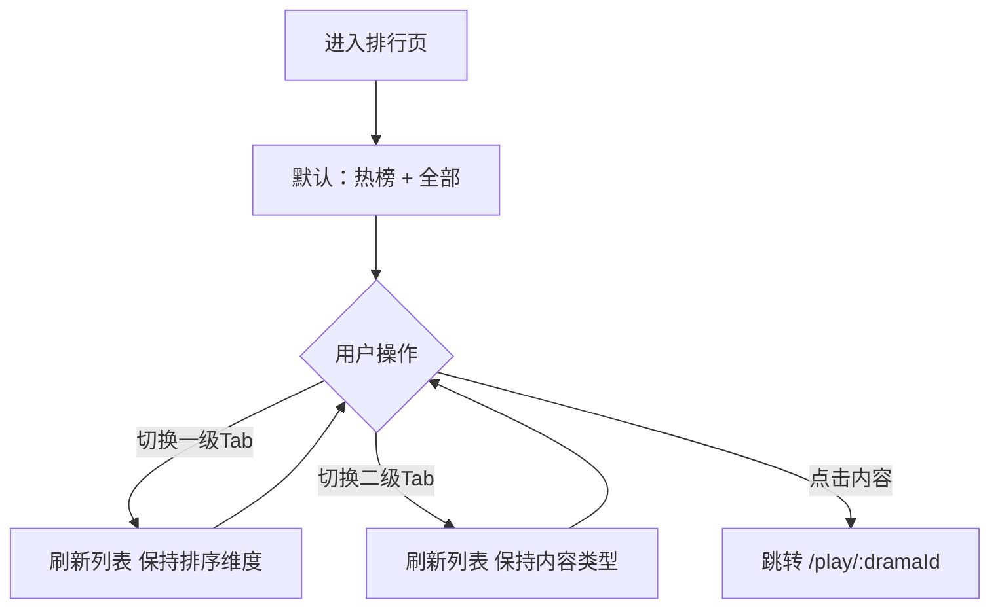
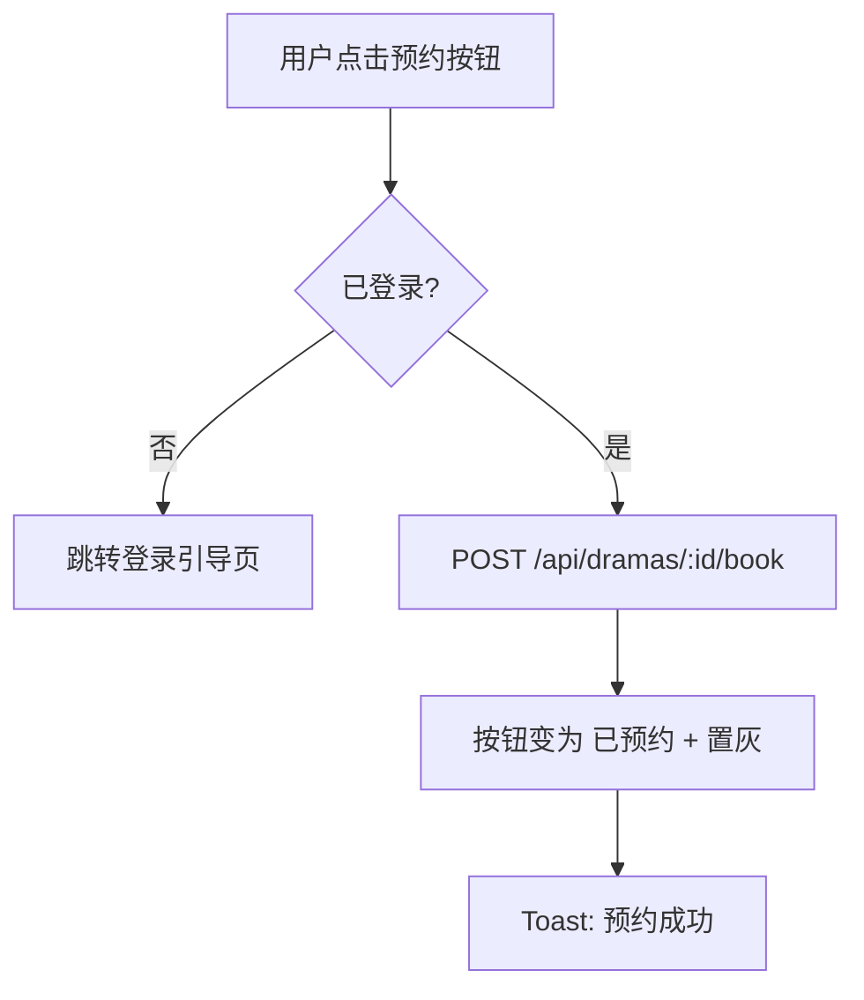

# PRD：排行体系

> 创建日期：2026-07-25
> 状态：草稿
> 作者：AI Agent + daniel

---

## 1. 需求背景

### 1.1 问题描述

- **现状**：内容发现仅有首页 Feed 一条路径，缺少排行榜维度的内容发现方式。
- **痛点**：排行榜是内容平台的标配发现工具，能通过热度/推荐/预约等多维度帮用户快速找到高价值内容，也是内容分发运营的核心工具。
- **竞品参考**：红果排行页从搜索页「排行」入口进入。双层 Tab 结构：一级 Tab（全部/真人/动漫/AI 剧/演员）切换内容类型；二级 Tab（推荐榜/热榜/臻果榜/预约榜/分类筛选）切换排序维度。列表项展示排名序号、封面、标题、标签、热度值。

### 1.2 目标用户

| 用户角色 | 特征描述 | 核心需求 |
|---------|---------|---------|
| 探索型用户 | 想发现热门/优质短剧 | 按热度/推荐查看排行，了解当前热门内容 |
| 预约型用户 | 关注即将上线的短剧 | 查看预约榜，预约未上线内容 |

### 1.3 预期目标

- **业务目标**：建立多维度排行榜体系，支持按内容类型和排序维度两层筛选，每个榜单都可独立浏览。

### 1.4 范围定义

| 范围内 | 范围外（明确不做） | 原因 |
|--------|------------------|------|
| 推荐榜（按推荐值排序） | 演员排行榜独立页 | 先只做内容排行 |
| 热榜（按热度值排序） | 个性化推荐算法 | 远期迭代 |
| 预约榜（按预约数排序 + 预约按钮） | 分类筛选面板（排行页不展示分类入口，仅搜索页提供入口跳转分类页） | 分类筛选面板复用 PRD-06 标签体系 |
| 一级Tab（按内容类型：全部/真人/AI） | 臻果榜（竞品特定榜单） | 不确定是否为通用能力 |
| — | 漫剧内容类型 | 首版不包含漫剧内容 |
| 二级Tab（排序维度切换） | — | — |

---

## 2. 涉及平台

| 平台 | 是否涉及 | 变更概要 |
|------|---------|---------|
| Backend | ✅ 涉及 | 排行 API（推荐/热榜/预约三种排序） |
| iOS | ✅ 涉及 | 排行页双层 Tab + 列表 UI |
| Android | ✅ 涉及 | 排行页双层 Tab + 列表 UI |

---

## 3. 用户故事

| 编号 | 角色 | 需求 | 验收标准 | 涉及平台 | 优先级 |
|------|------|------|---------|---------|--------|
| US-01 | 探索型用户 | 浏览热榜 | 进入排行页默认展示「热榜」Tab，列表按热度降序排列，每项展示排名/封面/标题/热度 | 全部 | P0 |
| US-02 | 探索型用户 | 切换内容类型 | 点击「真人」Tab → 列表过滤为真人短剧；点击「AI」Tab → 过滤为 AI 短剧 | iOS/Android | P1 |
| US-03 | 探索型用户 | 切换排序维度 | 点击「推荐榜」→ 按推荐值排序（有排序说明文案）；点击「预约榜」→ 按预约值排序 + 「预约」按钮 | iOS/Android | P1 |
| US-04 | 预约型用户 | 预约未上线短剧 | 在预约榜中点击「预约」按钮，已登录则预约成功后按钮文案变为"已预约"并置灰，同时展示 Toast "预约成功" | iOS/Android | P1 |
| US-05 | 探索型用户 | 从排行进入播放页 | 点击排行列表中的短剧 → 跳转 `/play/:dramaId` | iOS/Android | P0 |

---

## 4. 核心流程

### 4.1 US-01/02/03：双层 Tab 切换

#### 用户旅程

1. 从搜索页快捷入口「排行」进入排行页
2. 默认显示「热榜」二级 Tab + 「全部」一级 Tab
3. 用户点击一级 Tab「真人」→ 列表刷新为真人短剧热榜
4. 用户点击二级 Tab「推荐榜」→ 列表切换为推荐排序，展示推荐值
5. 用户点击二级 Tab「预约榜」→ 列表切换为预约排序，展示预约按钮

#### UI/交互要点

| 页面 / 区域 | 交互描述 | 涉及端 | 竞品参考 |
|------------|---------|--------|---------|
| 顶部栏 | ← 返回 + 标题（如「红果热榜」）+ 更新时间 | iOS/Android | 红果排行页顶部 |
| 一级 Tab（内容类型） | 横向滚动 `TabRow`：全部/真人/AI 剧 | iOS/Android | 红果一级Tab |
| 二级 Tab（排序维度） | 胶囊按钮行：推荐榜/热榜/预约榜 | iOS/Android | 红果二级Tab |
| 排行列表 | 纵向列表，每项：排名序号(1-3 彩色) + 封面图 + 标题 + 标签 + 热度/推荐值；预约榜额外展示「预约」按钮 | iOS/Android | 红果排行列表项 |

#### 关键边界

| 场景 | 预期行为 |
|------|---------|
| 某榜单无数据 | 展示空状态 |
| 预约榜点击「预约」未登录 | 跳转登录页（PRD-08） |
| 切换 Tab 后上拉加载更多 | 分页正确，不混入其他类型数据 |

### 4.2 US-04：预约未上线短剧

#### 用户旅程

1. 用户在预约榜中看到未上线的短剧，点击「预约」按钮
2. 系统检查登录状态 → 未登录跳转登录引导页（PRD-08）
3. 已登录 → 调用 `POST /api/dramas/:id/book` → 切换预约状态
4. 预约成功后按钮文案变为「已预约」并置灰不可再次点击，展示 Toast「预约成功」

#### 关键边界

| 场景 | 预期行为 |
|------|---------|
| 重复预约 | 幂等处理，不重复创建预约记录 |
| 登录后返回 | 预约状态重新从 API 获取 |

### 4.3 US-05：从排行进入播放页

#### 用户旅程

1. 用户在排行列表中浏览短剧
2. 点击任意排行项的封面/标题区域 → 跳转 `/play/:dramaId` 播放页
3. 播放页接管后续播放逻辑（PRD-03）

#### 关键边界

| 场景 | 预期行为 |
|------|---------|
| dramaId 无效 | 播放页展示「短剧不存在」提示，提供返回按钮 |
| 短剧无剧集数据 | 播放页展示空状态引导 |

---

## 5. 依赖

| 依赖项 | 类型 | 说明 | 状态 |
|--------|------|------|------|
| 搜索页 | 内部能力 | 搜索页快捷入口「排行」跳转入口 | 🚧 待开发 |
| 用户登录 | 内部能力 | 预约功能需要登录 | 📅 Sprint 4 |
| Drama 数据 | 内部能力 | 已有 Schema，需新增 booking_count 字段 | 🚧 待扩展 |

---

## 6. 现有功能影响

_无现有功能受影响。排行页为新增独立页面。_

---

## 7. 待澄清问题

| 编号 | 问题 | 阻塞 |
|------|------|------|
| Q-01 | 预约是否支持取消？首版支持取消预约（ST-02 已实现为 toggle 切换预约状态）。 |

---

## 8. 参考资料

### 竞品调研

| 文档 | 关键发现 |
|------|---------|
| `docs/product_research/mobile/homepage-feed/search/ranking/ranking.md` | 排行页双层Tab结构 |
| `docs/product_research/mobile/homepage-feed/search/ranking/recommend-list/recommend-list.md` | 推荐榜 |
| `docs/product_research/mobile/homepage-feed/search/ranking/booking-list/booking-list.md` | 预约榜 |
| `docs/product_research/mobile/homepage-feed/search/ranking/category-filter/category-filter.md` | 分类筛选面板 |

---

## 9. 变更历史

| 日期 | 变更内容 | 变更原因 |
|------|---------|---------|
| 2026-07-25 | 初始版本 | Sprint 2 P1 |
