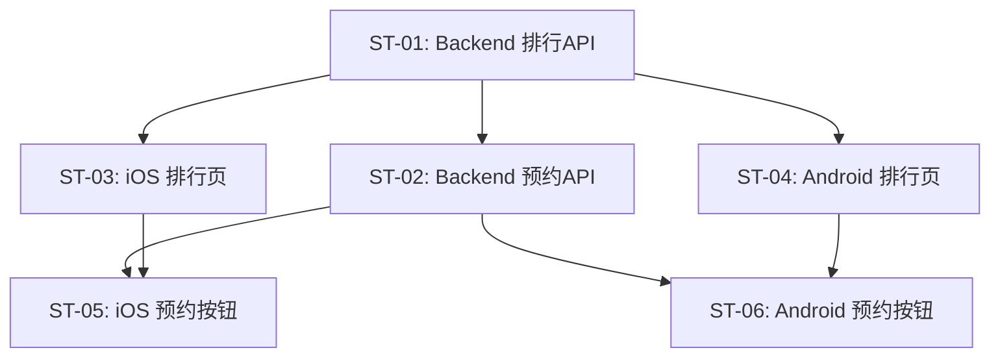

# 子任务拆分：排行体系

> 关联 PRD：[prd.md](prd.md)
> 创建日期：2026-07-25
> 状态：草稿

---

## 工时总览

| 平台 | 子任务数 | 总工时（人日） |
|------|---------|--------------|
| Backend | 2 | 3 人日 |
| iOS | 2 | 3.5 人日 |
| Android | 2 | 3.5 人日 |
| **合计** | **6** | **10 人日** |

---

## 迭代规划

一次性完成（单 Sprint）。

---

## 子任务详情

### ST-01：Backend 排行 API

| 属性 | 值 |
|------|-----|
| **对应 PRD** | US-01~03 |
| **平台** | Backend |
| **优先级** | P0 |
| **预估工时** | 2 人日 |
| **前置依赖** | 无 |
| **迭代** | Sprint 1 |

#### 工作内容

1. `GET /api/dramas/rankings`：Query 参数 `type`（hot/recommend/booking）、`contentType`（all/live_action/ai）、`page`（默认 1）、`pageSize`（默认 10，max 100）
2. 热榜：按 `play_count` 降序
3. 推荐榜：按 `play_count * 0.6 + rating * 0.4` 模拟降序
4. 预约榜：需要 `booking_count` 字段（新增 Schema）
5. 返回：`{ data: Drama[], pagination: { page, page_size, total, total_pages } }`（对齐现有 API 规范）

#### 涉及 API

| 方法 | 路径 | 说明 |
|------|------|------|
| GET | `/api/dramas/rankings` | 多维度排行列表 |

---

### ST-02：Backend 预约 API

| 属性 | 值 |
|------|-----|
| **对应 PRD** | US-04 |
| **平台** | Backend |
| **优先级** | P1 |
| **预估工时** | 1 人日 |
| **前置依赖** | Drama Schema 扩展（新增 booking_count 字段 + DB migration）, ST-01 |
| **迭代** | Sprint 1 |

#### 工作内容

1. `POST /api/dramas/:id/book`：切换预约状态
2. 创建 `bookings` 表（user_id + drama_id）
3. 更新 Drama 的 `booking_count`

---

### ST-03：iOS 排行页双层 Tab + 列表

| 属性 | 值 |
|------|-----|
| **对应 PRD** | US-01~05 |
| **平台** | iOS |
| **优先级** | P0 |
| **预估工时** | 2 人日 |
| **前置依赖** | ST-01, PRD-04（搜索页入口） |
| **迭代** | Sprint 1 |

#### 工作内容

1. `RankingPage`：顶部标题栏、一级 Tab（`Picker` 全部/真人/AI）、二级 Tab（胶囊按钮行）
2. 列表：`List` 渲染排行项（序号+封面+标题+热度值）
3. Tab 切换时请求对应排行 API
4. 点击列表项 → navigate 播放页

---

### ST-04：Android 排行页双层 Tab + 列表

| 属性 | 值 |
|------|-----|
| **对应 PRD** | US-01~05 |
| **平台** | Android |
| **优先级** | P0 |
| **预估工时** | 2 人日 |
| **前置依赖** | ST-01, PRD-04（搜索页入口） |
| **迭代** | Sprint 1 |

#### 工作内容

1. `RankingScreen`：顶部标题栏、一级 Tab（`TabRow` 全部/真人/AI）、二级 Tab（胶囊按钮行）
2. 列表：`LazyColumn` 渲染排行项（序号+封面+标题+热度值）
3. Tab 切换时请求对应排行 API
4. 点击列表项 → navigate 播放页

### ST-05：iOS 预约按钮 + 登录拦截

| 属性 | 值 |
|------|-----|
| **平台** | iOS |
| **优先级** | P1 |
| **预估工时** | 1.5 人日 |
| **前置依赖** | ST-03, ST-02 |

预约按钮逻辑：点击 → 登录检查 → 未登录跳登录页 / 已登录调 API。

---

### ST-06：Android 预约按钮 + 登录拦截

| 属性 | 值 |
|------|-----|
| **对应 PRD** | US-04 |
| **平台** | Android |
| **优先级** | P1 |
| **预估工时** | 1.5 人日 |
| **前置依赖** | ST-04, ST-02 |
| **迭代** | Sprint 1 |

#### 工作内容

预约按钮逻辑：点击 → 登录检查 → 未登录跳登录页 / 已登录调 API。同 ST-05，Android 实现。

## 子任务依赖图

> 💡 跨 PRD 依赖：
> - ST-03/ST-04 依赖 PRD-04（搜索页入口）
> - ST-05/ST-06 登录拦截依赖 PRD-08（用户登录）

## 变更历史

| 日期 | 变更内容 | 变更原因 |
|------|---------|---------|
| 2026-07-25 | 初始版本 | PRD-05 |
