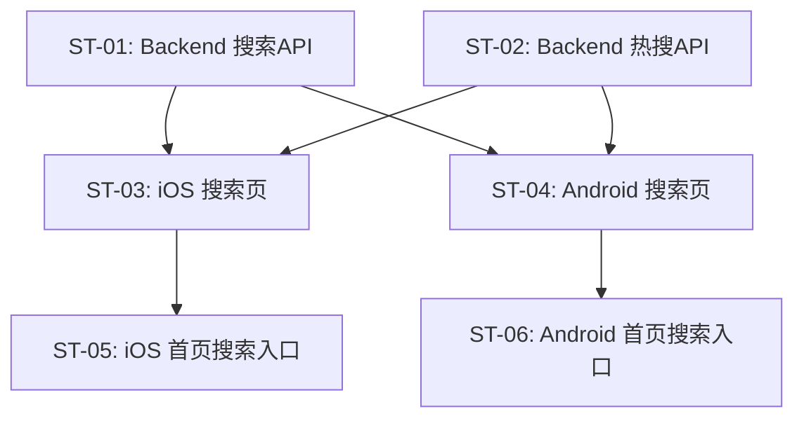

# 子任务拆分：搜索发现

> 关联 PRD：[prd.md](prd.md)
> 创建日期：2026-07-25
> 状态：草稿

---

## 工时总览

| 平台 | 子任务数 | 总工时（人日） |
|------|---------|--------------|
| Backend | 2 | 2.5 人日 |
| iOS | 2 | 4 人日 |
| Android | 2 | 4 人日 |
| **合计** | **6** | **10.5 人日** |

---

## 迭代规划

一次性完成（单 Sprint）。

---

## 子任务详情

### ST-01：Backend 搜索 API

| 属性 | 值 |
|------|-----|
| **对应 PRD** | US-01 |
| **平台** | Backend |
| **优先级** | P0 |
| **预估工时** | 1.5 人日 |
| **前置依赖** | 无 |
| **迭代** | Sprint 1 |

#### 工作内容

1. `GET /api/dramas/search?q=xxx&page=1&pageSize=10`：标题+分类（category）LIKE 搜索
2. 搜索结果包含：匹配的 Drama 列表 + 分页信息
3. Zod 校验

#### 涉及 API

| 方法 | 路径 | 说明 |
|------|------|------|
| GET | `/api/dramas/search` | 关键词搜索 Drama |

---

### ST-02：Backend 热搜 API

| 属性 | 值 |
|------|-----|
| **对应 PRD** | US-03 |
| **平台** | Backend |
| **优先级** | P1 |
| **预估工时** | 1 人日 |
| **前置依赖** | 无（首版使用硬编码种子数据） |
| **迭代** | Sprint 1 |

#### 工作内容

1. `GET /api/dramas/hot-search`：返回 Top 10 热搜词（搜索次数最多的关键词）
2. 首版热搜词使用种子数据硬编码预设（如：逆袭、甜宠、战神、穿越…），不依赖搜索 API 统计数据。后续版本接入搜索日志统计，实现动态热搜

#### 涉及 API

| 方法 | 路径 | 说明 |
|------|------|------|
| GET | `/api/dramas/hot-search` | 热搜榜单 |

---

### ST-03：iOS 搜索页 + 搜索结果页

| 属性 | 值 |
|------|-----|
| **对应 PRD** | US-01, US-02, US-03, US-04 |
| **平台** | iOS |
| **优先级** | P0 |
| **预估工时** | 2.5 人日 |
| **前置依赖** | ST-01, ST-02, PRD-01 ST-02（路由） |
| **迭代** | Sprint 1 |

#### 工作内容

1. `SearchPage`：搜索框、快捷入口行、搜索历史（UserDefaults）、热搜榜
2. `SearchResultPage`：顶部搜索框（可修改）+ 结果列表（复用首页 FeedCardView 组件）
3. 搜索逻辑：输入 → `GET /api/dramas/search` → 显示结果
4. 搜索历史：本地存储最近 10 条，支持清除
5. 热搜榜：`GET /api/dramas/hot-search`

---

### ST-04：Android 搜索页 + 搜索结果页

| 属性 | 值 |
|------|-----|
| **对应 PRD** | US-01~04 |
| **平台** | Android |
| **优先级** | P0 |
| **预估工时** | 2.5 人日 |
| **前置依赖** | ST-01, ST-02, PRD-01 ST-05（Android NavHost 路由框架） |
| **迭代** | Sprint 1 |

同 ST-03，Android 实现。

---

### ST-05：iOS 首页搜索入口集成

| 属性 | 值 |
|------|-----|
| **对应 PRD** | US-01（入口） |
| **平台** | iOS |
| **优先级** | P0 |
| **预估工时** | 1.5 人日 |
| **前置依赖** | ST-03, PRD-01 ST-01/ST-02（iOS TabView + NavigationStack 路由框架） |
| **迭代** | Sprint 1 |

首页右上角添加搜索图标 → 点击 navigate 到 SearchPage。

---

### ST-06：Android 首页搜索入口集成

| 属性 | 值 |
|------|-----|
| **对应 PRD** | US-01（入口） |
| **平台** | Android |
| **优先级** | P0 |
| **预估工时** | 1.5 人日 |
| **前置依赖** | ST-04, PRD-01 ST-04/ST-05（Android NavigationBar + NavHost 路由框架） |
| **迭代** | Sprint 1 |

同 ST-05，Android 实现。

---

## 子任务依赖图

---

## 变更历史

| 日期 | 变更内容 | 变更原因 |
|------|---------|---------|
| 2026-07-25 | 初始版本 | PRD-04 |
