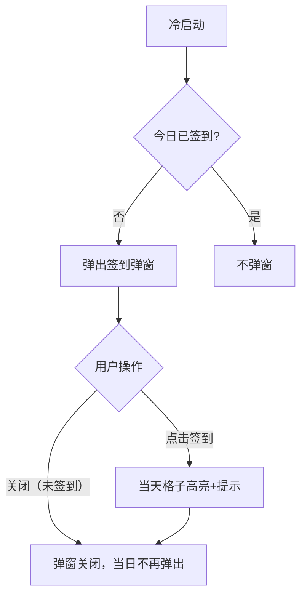

# PRD：签到与消息系统

> 创建日期：2026-07-25
> 状态：草稿
> 作者：AI Agent + daniel

---

## 1. 需求背景

### 1.1 问题描述

- **现状**：无签到激励，无消息通知能力。
- **痛点**：签到是提升日活和留存的有效手段；消息系统是用户与平台互动（系统通知、互动消息）的基础设施。
- **竞品参考**：红果冷启动偶发弹出 7 日签到弹窗（金币奖励网格）；消息页展示系统通知（全部用户可见）和互动消息（需登录）。

### 1.2 预期目标

建立 7 日签到弹窗激励和系统消息/互动消息通知能力。

### 1.3 范围定义

| 范围内 | 范围外 | 原因 |
|--------|--------|------|
| 7 日签到弹窗（触发逻辑+奖励展示页） | 实际金币体系 | 依赖 PRD-14 赚钱中心 |
| 系统消息推送（页面内通知） | 推送通知（APNs/FCM） | 远期迭代 |
| 互动消息（登录后可见） | IM 即时通讯 | 远期迭代 |

---

## 2. 涉及平台

| 平台 | 是否涉及 | 变更概要 |
|------|---------|---------|
| Backend | ✅ 涉及 | 签到 API、消息 API |
| iOS | ✅ 涉及 | 签到弹窗 UI、消息页 UI |
| Android | ✅ 涉及 | 签到弹窗 UI、消息页 UI |

---

## 3. 用户故事

| 编号 | 角色 | 需求 | 验收标准 | 优先级 |
|------|------|------|---------|--------|
| US-01 | 所有用户 | 冷启动看到签到弹窗 | 每日首次打开 App 弹出 7 日签到弹窗（7 格奖励网格 + 「立即签到」按钮） | P0 |
| US-02 | 所有用户 | 完成签到 | 点击「立即签到」→ 当天格子高亮 + 奖励提示 → 弹窗关闭 | P0 |
| US-03 | 已登录用户 | 签到状态持久化 | 关闭 App 重开，已签到天数保持 | P1 |
| US-04 | 所有用户 | 查看系统消息 | 菜单面板 → 消息入口 → 消息页展示系统通知列表 | P0 |
| US-05 | 已登录用户 | 查看互动消息 | 消息页下半部分展示互动消息（评论/点赞通知），匿名时提示登录 | P1 |

---

## 4. 核心流程

### 4.1 US-01/02：签到弹窗

**触发策略**：

- 每日首次冷启动时弹出签到弹窗
- 用户关闭弹窗（未签到）→ 当日不再弹出（客户端本地记录 `signin_dialog_dismissed_{date}` 标记）
- 用户签到成功 → 当日不再弹出
- 从后台切回前台不触发（仅冷启动触发）
- 说明：与竞品红果的"偶发弹出"不同，本设计采用"每日首次必弹"策略，理由：首版无金币体系，不需要控制弹出频率以管理成本

**UI/交互要点**：

签到弹窗布局：

| 区域 | 描述 |
|------|------|
| 标题 | "每日签到" |
| 7 格宫格 | 7 天奖励网格，当天高亮或待签到 |
| 签到按钮 | "立即签到"（未签到）/ "已签到"（置灰） |
| 关闭按钮 | 右上角 ✕ |

### 4.1.x 匿名签到降级方案

匿名用户签到流程：

1. 前端检查本地标记（`SharedPreferences`/`UserDefaults`）→ 判断当日是否已签到或已关闭弹窗
2. 调用 `POST /api/signin/checkin`（携带 `device_id` 参数）
3. 后端根据 `device_id` 记录签到日期
4. 调用 `GET /api/signin/status`（携带 `device_id` 参数）→ 返回该设备的 7 日签到状态
5. 展示签到结果（当天格子高亮）

数据存储：

- 客户端：`SharedPreferences`（Android）/ `UserDefaults`（iOS），存储当日签到/关闭标记
- 服务端：签到记录表增加 `device_id` 字段，区分匿名用户

签到奖励表现：

- 首版为纯 UI 高亮格子（无实际金币），远期接入 PRD-14 赚钱中心

> 说明：匿名用户换设备/清缓存后签到状态丢失，此行为在当前版本可接受。

### 4.2 消息页流程

**进入路径**：菜单面板（PRD-07）→ 点击消息预览 → push 进入全屏消息页

**返回行为**：点击返回 → 回到菜单抽屉（而非首页）

**页面结构**：

- 导航栏：标题"消息"
- 系统消息列表：系统通知列表，支持下拉刷新
- 互动消息区：
  - 已登录：展示互动消息列表
  - 匿名用户：显示"登录查看互动消息" + 登录按钮

> 说明：互动消息首版仅展示登录门槛提示，评论/点赞通知为远期迭代。

### 4.3 状态处理

| 场景 | 处理方式 |
|------|---------|
| 签到弹窗加载中 | 骨架屏 / 加载指示器 |
| 签到 API 请求失败 | 错误提示 + 重试；不影响首页正常使用 |
| 系统消息列表为空 | 空态插画 + "暂无消息" 文案 |
| 互动消息区（匿名用户） | "登录查看互动消息" + 登录按钮 |
| 网络异常 | 下拉刷新重试 |

---

## 5. 依赖

| 依赖项 | 类型 | 说明 | 状态 |
|--------|------|------|------|
| 用户登录 | 内部能力 | 签到持久化、互动消息 | 📅 PRD-08 |
| 菜单面板 | 内部能力 | 消息入口 | 🚧 PRD-07 |

---

## 6. 参考资料

| 文档 | 关键发现 |
|------|---------|
| `docs/product_research/mobile/homepage-feed/signin-popup/signin-popup.md` | 签到弹窗 |
| `docs/product_research/mobile/homepage-feed/menu-panel/my-messages/my-messages.md` | 消息系统 |

---

## 7. 变更历史

| 日期 | 变更内容 | 变更原因 |
|------|---------|---------|
| 2026-07-25 | 初始版本 | Sprint 4 P1 |
