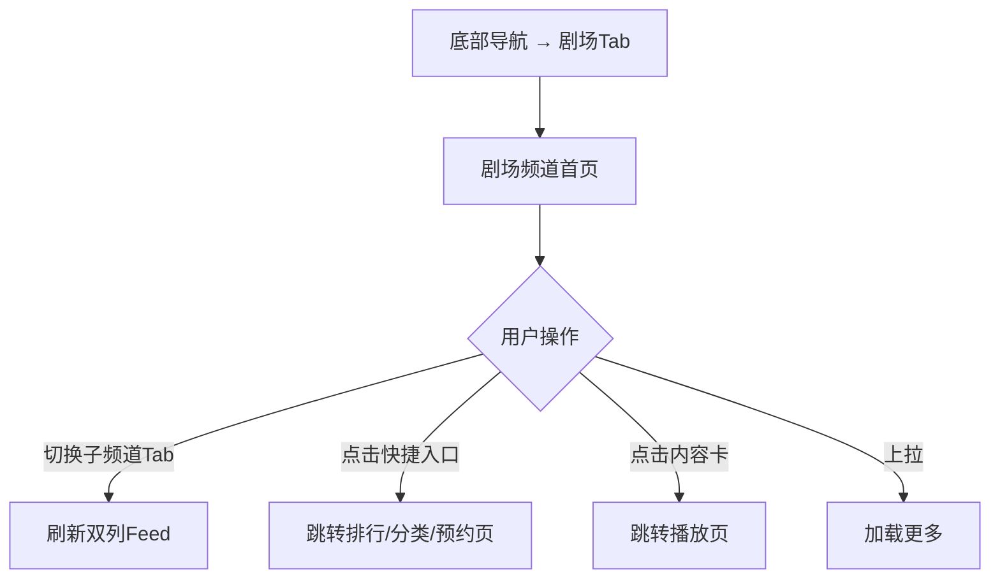

# PRD：剧场频道

> 创建日期：2026-07-25
> 状态：草稿
> 作者：AI Agent + daniel

---

## 1. 需求背景

### 1.1 问题描述

- **现状**：底部「剧场」Tab 为占位页面，无实际内容。
- **痛点**：剧场频道是红果的核心内容分发频道，默认「找剧」子频道包含频道分类子Tab（找剧/真人/动漫/电影/有声书/小说/漫画/大屏）、快捷入口（筛选/排行/新剧/预约）和双列内容卡片 Feed。这是除首页之外最重要的内容发现入口。
- **竞品参考**：红果剧场频道默认「找剧」Tab，顶部搜索框 + 识图入口，下方 8 个频道子Tab 横向可滚动（找剧/真人/动漫/电影/有声书/小说/漫画/大屏），4 个快捷入口（筛选/排行/新剧/预约），双列垂直内容卡片 Feed（封面+热度+标题+标签）。

### 1.2 目标用户

| 用户角色 | 特征描述 | 核心需求 |
|---------|---------|---------|
| 探索型用户 | 浏览多频道内容 | 按频道类型（真人/动漫/小说…）筛选内容 |
| 主动用户 | 使用工具快速找剧 | 通过筛选/排行/新剧/预约入口快速定位 |

### 1.3 预期目标

建立剧场频道页面，含频道分类子Tab、快捷入口、双列内容 Feed。

### 1.4 范围定义

| 范围内 | 范围外 | 原因 |
|--------|--------|------|
| 「找剧」频道子Tab 页面（含真实数据） | 其他子频道（真人/动漫/电影/有声书/小说/漫画）的独立内容 | 首版仅找剧 Tab 有真实数据，其他 Tab 远期迭代 |
| 8 个子频道 Tab 的 UI（全部展示，可点击切换） | — | 全部 Tab 展示，切换时调用相同 API，非找剧 Tab 返回占位数据（展示空态） |
| 快捷入口（筛选/排行/新剧/预约） | 筛选面板完整实现 | 复用 PRD-06 标签体系 |
| 「新剧」入口点击 Toast「功能开发中」 | 新剧列表完整功能 | 与 PRD-04 搜索页快捷入口行为保持一致 |
| 双列内容卡片 Feed | — | — |
| — | 「大屏」Tab 完整功能（电视投屏等） | 远期迭代 |

---

## 2. 涉及平台

| 平台 | 是否涉及 | 变更概要 |
|------|---------|---------|
| Backend | ✅ 涉及 | 频道内容 API |
| iOS | ✅ 涉及 | 剧场频道页面 UI |
| Android | ✅ 涉及 | 剧场频道页面 UI |

---

## 3. 用户故事

| 编号 | 角色 | 需求 | 验收标准 | 优先级 |
|------|------|------|---------|--------|
| US-01 | 探索型用户 | 浏览剧场找剧Feed | 双列卡片列表展示短剧封面+标题+热度+标签，滚动加载更多 | P0 |
| US-02 | 探索型用户 | 切换频道子Tab | 顶部横向滚动Tab，8 个子频道 Tab 全部显示并可点击切换，仅找剧 Tab 有数据，其它 Tab 展示空态 | P0 |
| US-03 | 探索型用户 | 使用快捷入口 | 4 个入口（排行→排行页、新剧→Toast"功能开发中"、预约→排行页预约榜 Tab、筛选→分类页） | P1 |
| US-04 | 探索型用户 | 从剧场进入播放 | 点击内容卡片直接跳转 `/play/:dramaId` | P0 |

---

## 4. 核心流程

#### UI/交互要点

| 区域 | 交互描述 | 竞品参考 |
|------|---------|---------|
| 顶部搜索栏 | 搜索框（点击 → 跳转 `/search` 搜索页）+ 识图入口（占位） | 红果剧场顶部 |
| 频道子Tab | 横向可滚动 8 个 Tab：找剧/真人/动漫/电影/有声书/小说/漫画/大屏 | 红果子Tab |
| 快捷入口 | 4 个方形图标网格：筛选/排行/新剧/预约 | 红果快捷入口 |
| 双列Feed | 2 列瀑布流卡片（封面+热度+标题+标签） | 红果双列卡片 |

---

## 5. 依赖

| 依赖项 | 类型 | 说明 | 状态 |
|--------|------|------|------|
| 底部导航 | 内部能力 | 剧场Tab | 🚧 PRD-01 |
| 播放器 | 内部能力 | 点击跳转播放 | 🚧 PRD-03 |
| 排行页/分类页 | 内部能力 | 快捷入口跳转 | 🚧 PRD-05/06 |

---

## 6. 参考资料

| 文档 | 关键发现 |
|------|---------|
| `docs/product_research/mobile/theater/theater.md` | 剧场频道完整布局 |

---

## 7. 变更历史

| 日期 | 变更内容 | 变更原因 |
|------|---------|---------|
| 2026-07-25 | 初始版本 | Sprint 5 P1 |
