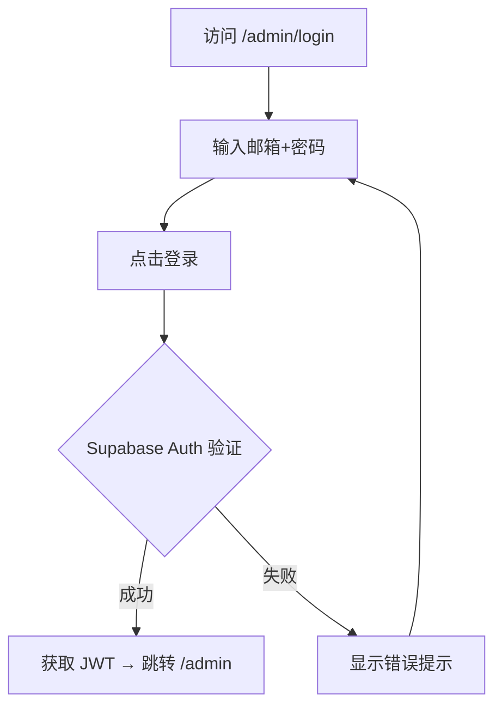

# PRD：管理平台（Admin Panel）

> 创建日期：2026-07-27
> 状态：草稿
> 作者：AI Agent + daniel

---

## 1. 需求背景

### 1.1 问题描述

- **现状**：项目所有资源数据（Drama、Episode、UserProfile）依赖 Backend mock repository，无任何可视化界面进行数据管理。新增/修改短剧、剧集、用户角色等操作只能通过直接修改 mock 代码或 API 脚本完成。
- **痛点**：没有管理平台意味着运营人员无法自主管理内容、管理员无法分配用户权限。随着数据量增长和协作需求增加，纯代码驱动的数据管理方式将成为瓶颈。
- **竞品参考**：管理后台为标准内部工具，不涉及竞品分析。

### 1.2 目标用户

| 用户角色 | 特征描述 | 核心需求 |
|---------|---------|---------|
| 超级管理员 | 拥有全部权限，管理所有资源和用户角色 | 管理短剧/剧集内容、管理用户、分配角色 |
| 内容编辑 | 负责内容上架和管理 | 管理短剧和剧集（CRUD），查看仪表盘 |
| 普通查看者 | 只读权限，查看数据但不可修改 | 浏览内容库，查看数据概览 |

### 1.3 预期目标

- **业务目标**：建立基于 Web 的内部管理平台，实现资源可视化管理和用户权限控制。管理员能够通过图形界面管理短剧、剧集内容，控制不同用户的操作权限。

### 1.4 范围定义

| 范围内 | 范围外（明确不做） | 原因 |
|--------|------------------|------|
| 管理员登录（Supabase Auth） | 移动端管理界面 | 管理平台仅 Web 端 |
| 仪表盘（资源概览统计） | 高级数据分析/图表 | 首版做简单统计卡片即可 |
| 短剧管理（CRUD） | 批量导入/导出 | 远期迭代 |
| 剧集管理（CRUD，按短剧组织） | 视频文件上传 | 已有 CDN URL 方案，首版手动填写 |
| 用户管理（列表查看、角色分配） | OAuth/SSO 登录 | 首版仅 Supabase 邮箱+密码 |
| 角色权限控制（admin/editor/viewer） | 细粒度字段级权限 | 首版做简化版 RBAC |
| — | 内容审核工作流 | 远期评估 |
| — | 操作审计日志 | 远期评估 |
| — | 移动端响应式适配 | 管理平台面向桌面端 |

---

## 2. 涉及平台

| 平台 | 是否涉及 | 变更概要 |
|------|---------|---------|
| Backend | ✅ 涉及 | 新增管理 API（drama/episode CRUD、用户列表、角色管理）；Supabase RLS 策略 |
| Web | ✅ 涉及 | 全新管理平台 SPA（登录、布局、各资源管理页） |
| iOS | ❌ 不涉及 | — |
| Android | ❌ 不涉及 | — |

---

## 3. 用户故事

| 编号 | 角色 | 需求 | 验收标准 | 涉及平台 | 优先级 |
|------|------|------|---------|---------|--------|
| US-01 | 所有管理员 | 登录管理平台 | 邮箱+密码登录（Supabase Auth）；登录失败显示错误提示；登录后进入仪表盘 | Backend/Web | P0 |
| US-02 | 所有管理员 | 查看仪表盘概览 | 首页展示总短剧数、总剧集数、用户数等统计卡片 | Backend/Web | P1 |
| US-03 | 超级管理员/编辑 | 管理短剧 | 短剧列表（表格展示）、新建短剧（表单）、编辑短剧、删除短剧（二次确认） | Backend/Web | P0 |
| US-04 | 超级管理员/编辑 | 管理剧集 | 在短剧下管理剧集列表（表格）、新建/编辑剧集（含视频URL）、删除剧集 | Backend/Web | P0 |
| US-05 | 超级管理员 | 管理用户与角色 | 查看用户列表、修改用户角色（admin/editor/viewer） | Backend/Web | P0 |
| US-06 | 所有管理员 | 角色权限生效 | editor 不可访问用户管理页；viewer 不可进行任何写操作 | Backend/Web | P0 |
| US-07 | 查看者 | 浏览内容库 | 查看短剧和剧集列表（只读），不可见编辑/删除按钮 | Web | P1 |

---

## 4. 核心流程

### 4.1 US-01：管理员登录

#### 用户旅程

1. 访问 `/admin/login` → 展示登录页（居中登录卡片，邮箱 + 密码 + 登录按钮）
2. 输入邮箱和密码 → 点击「登录」
3. Backend 调用 Supabase Auth `signInWithPassword` → 成功返回 JWT
4. 前端保存 session → 跳转到 `/admin` 仪表盘
5. 登录失败 → 表单内显示错误信息（「邮箱或密码错误」）



#### UI 要点

- 居中布局，白色卡片 + 灰色背景
- 表单字段：邮箱输入框、密码输入框、登录按钮
- 无注册入口。管理员账号由超级管理员在 Supabase Dashboard → Authentication 页手动创建（首版不提供平台内建号功能）。登录后可在平台内管理角色分配

### 4.2 US-02/03：仪表盘 + 短剧管理

#### 用户旅程

1. 登录后进入仪表盘 → 顶部 4 张统计卡片（总短剧/N、总剧集/N、用户数/N）
2. 左侧导航：仪表盘、短剧管理、用户管理（仅 admin 可见）
3. 点击「短剧管理」→ 进入短剧列表页
4. 列表页展示表格：封面缩略图、标题、分类、集数、评分、操作（编辑/删除）
5. 点击「新建短剧」→ 弹出/跳转表单页：标题、描述、封面URL、分类、标签、评分
6. 点击某行「编辑」→ 表单预填现有数据 → 修改 → 保存
7. 点击「删除」→ 弹出确认对话框 → 确认后删除

#### UI 布局（简单扁平风格）

```
┌──────────────────────────────────────────────────┐
│  Header Bar（Logo + 用户头像/退出）                  │
├──────────┬───────────────────────────────────────┤
│ 导航      │  内容区                                │
│          │                                       │
│ 仪表盘    │  ┌──────┐ ┌──────┐ ┌──────┐          │
│ 短剧管理  │  │短剧N │ │剧集N │ │用户N │          │
│ 用户管理  │  └──────┘ └──────┘ └──────┘          │
│ (admin)  │                                       │
│          │  [表格区域]                             │
│          │                                       │
└──────────┴───────────────────────────────────────┘
```

#### 设计风格

- 配色：主色蓝色（#2563EB），中性灰色系背景和边框
- 卡片：白色背景、浅灰边框（1px solid #e5e7eb）、小圆角（8px）
- 表格：简洁线条，hover 行高亮，操作按钮使用文字链接
- 按钮：填充主色（主要操作）、边框+文字（次要操作）、红色文字（删除）
- 无需动画/过渡特效，保持静态清晰

### 4.3 US-04：剧集管理

#### 用户旅程

1. 在短剧列表页，点击某短剧的「剧集」链接 → 进入该短剧的剧集管理页
2. 页面顶部显示短剧标题 + 返回按钮
3. 剧集列表表格：序号、标题、时长、视频URL、操作
4. 新建/编辑/删除与短剧管理类似

### 4.4 US-05/06：用户权限管理

#### 角色定义

| 角色 | 查看内容 | 管理内容 | 管理用户 |
|------|---------|---------|---------|
| admin | ✅ | ✅ | ✅ |
| editor | ✅ | ✅ | ❌ |
| viewer | ✅ | ❌ | ❌ |

#### 权限实施方式

- **Backend**：Supabase RLS 策略 + API 中间件校验 JWT 中的 `role` claim。`role` 存储于 `profiles` 表的 `role` 列（enum: `admin`/`editor`/`viewer`），通过 Supabase Auth Hook 在每次登录时同步到 JWT 的 `app_metadata.role`。
- **Web**：根据当前用户角色条件渲染导航项和操作按钮

### 4.5 US-07：查看者浏览内容库

#### 用户旅程

1. 以 viewer 角色登录 → 进入仪表盘
2. 左侧导航仅显示「仪表盘」「短剧管理」（无「用户管理」入口）
3. 点击「短剧管理」→ 进入短剧列表页
4. 列表表格正常展示：封面缩略图、标题、分类、集数、评分
5. 操作列仅显示「剧集」链接 → 可查看该短剧下剧集列表
6. 剧集列表页同样只读，无「新建」「编辑」「删除」按钮
7. 顶部无「新建短剧」按钮 → viewer 无法发起任何写操作

#### 关键边界

- viewer 直接访问 `/admin/users` URL → API 返回 403 → 页面显示「无权访问」提示
- viewer 的所有管理页面都是只读模式

### 4.6 关键边界

| 场景 | 预期行为 |
|------|---------|
| 未登录访问管理页 | 重定向到 `/admin/login` |
| editor 访问用户管理页 | 导航不显示该入口；直接访问 URL 时 API 返回 403 |
| viewer 点击编辑/删除 | 操作按钮不可见 |
| 删除短剧（含关联剧集） | 确认弹窗：「删除短剧将同时删除所有关联剧集，不可恢复」，确认后级联删除 |
| 网络异常 | 表格区域显示错误提示 + 重试按钮 |
| 空列表 | 表格区域显示「暂无数据」+ 新建按钮 |

---

## 5. 依赖

| 依赖项 | 类型 | 说明 | 状态 |
|--------|------|------|------|
| Supabase | 外部服务 | Auth + 数据库托管 | 📅 需确认 Supabase 项目配置 |
| `@supabase/supabase-js` / `@supabase/ssr` | 外部依赖 | Web 端 Supabase Auth 客户端 SDK | 📅 需征得用户同意后安装到 `web/` |
| 现有数据模型（Drama/Episode/UserProfile） | 内部能力 | 管理 API 基于现有 Schema | ✅ 已就绪 |
| `web/` 工程 | 内部能力 | 管理平台在现有 Next.js 项目中新增路由 | ✅ 已就绪 |
| Supabase Auth | 外部服务 | 管理员登录认证 | 📅 需配置 |

---

## 6. 现有功能影响

| 现有功能 | 影响类型 | 说明 |
|---------|---------|------|
| Backend mock repository | 替换 | admin API 接入 Supabase 后，mock 数据逐步迁移 |
| `web/src/app/` 路由 | 新增 | 新增 `/admin/*` 路由（独立于现有路由） |

### 6.1 DB Schema 字段名约定

Zod Schema（`backend/src/lib/schemas.ts`）中 `DramaSchema` 使用 `episode_count` 字段。Supabase 数据库表 `dramas` 创建时应使用同名 `episode_count` 列，保持与 Zod Schema 一致（不使用 `total_episodes` 等旧名称）。spec 阶段应校验 DB migration 中的列名与 Zod Schema 对齐。

---

## 7. 待澄清问题

| 编号 | 问题 | 阻塞 |
|------|------|------|
| Q-01 | Supabase 项目是否已创建？连接信息是否就绪？ | 是（开发启动前必须确认） |
| Q-02 | 管理员账号创建方式：Supabase Dashboard 手动创建，还是通过管理平台内的用户管理页创建？ | 否（首版建议 Dashboard 手动创建） |
| Q-03 | 管理平台是否需要独立部署，还是作为现有 Web 应用的子路由（`/admin`）？ | 否（建议子路由方式） |

---

## 8. 参考资料

### Wiki 文档

| 文档 | 关键信息 |
|------|---------|
| `wiki/features/data-models/index.md` | Drama、Episode、UserProfile Schema |
| `wiki/architecture/overview.md` | 技术栈总览（Next.js 16 + React 19 + TypeScript） |
| `wiki/decisions/2026-07-24-supabase-baas.md` | Supabase 选型决策 |

---

## 9. 变更历史

| 日期 | 变更内容 | 变更原因 |
|------|---------|---------|
| 2026-07-27 | 初始版本 | 用户提出管理平台需求 |
