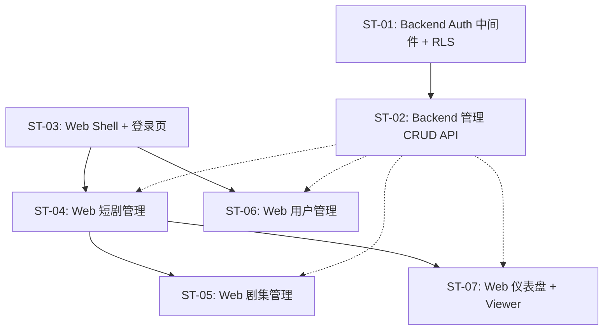

# 子任务拆分：管理平台（Admin Panel）

> 关联 PRD：[prd.md](prd.md)
> 创建日期：2026-07-27
> 状态：草稿

---

## 工时总览

| 平台 | 子任务数 | 总工时（人日） | 备注 |
|------|---------|--------------|------|
| Backend | 2 | 5 | Auth 中间件 + 管理 API |
| Web | 5 | 13.5 | 管理 Shell + 短剧 + 剧集 + 用户管理 + 仪表盘 |
| **合计** | **7** | **18.5** | |

---

## 迭代规划

| 迭代 | 目标 | 包含子任务 | 交付物 |
|------|------|-----------|--------|
| Iteration 1 | 管理平台 MVP | ST-01 ~ ST-06 | 登录、短剧管理、剧集管理、用户管理、RBAC |
| Iteration 2 | 辅助功能 | ST-07 | 仪表盘、查看者浏览体验 |

> Iteration 1 为核心交付。Iteration 2 为体验完善，可在 Iteration 1 完成后单独推进。

---

## 子任务详情

### ST-01：Backend Auth 中间件 + Supabase RLS 配置

| 属性 | 值 |
|------|-----|
| **对应 PRD** | US-01, US-06 |
| **平台** | Backend |
| **优先级** | P0 |
| **预估工时** | 2 人日 |
| **前置依赖** | 无 |
| **迭代** | Iteration 1 |

#### 工作内容

1. 实现 API 路由级别的 JWT 验证中间件：从 `Authorization: Bearer <token>` 提取 Supabase JWT，验证签名并解析 `sub`（用户 ID）和 `app_metadata.role`
2. 实现 `requireRole(...roles)` 高阶中间件工厂，支持按角色限制 API 访问
3. **profiles 表新增 `role` 列**：创建 migration 文件，在 `profiles` 表中新增 `role` 列（enum: `admin`/`editor`/`viewer`，默认 `viewer`）：
   - 在 `supabase/migrations/` 下新建 `<timestamp>_admin_rls.sql`
   - 先 DROP 旧的宽松 RLS policy（`authenticated 用户可读可写`），再 CREATE 新的细粒度 policy
4. 配置 Supabase RLS 策略：
   - `dramas` 表：`admin`/`editor` 可写，`viewer` 可读
   - `episodes` 表：同上
   - `profiles` 表：所有角色可读自己，仅 `admin` 可更新 `role` 列
5. **Supabase Auth Hook**：创建数据库函数在用户每次登录时，从 `profiles.role` 同步到 JWT `app_metadata.role`，确保前端和中间件可获取最新角色
6. 编写中间件和 RLS 策略的单元测试

#### 完成标准

- [ ] 未携带有效 JWT 的管理 API 请求返回 401
- [ ] viewer 角色调用写操作 API 返回 403
- [ ] editor 角色调用用户管理 API 返回 403
- [ ] admin 角色可调用所有管理 API
- [ ] RLS 策略在数据库层生效（即使绕过 API 层）

#### 涉及 API

| 方法 | 路径 | 说明 |
|------|------|------|
| — | `/api/admin/*` | 所有管理 API 统一走此中间件 |

---

### ST-02：Backend 管理 CRUD API

| 属性 | 值 |
|------|-----|
| **对应 PRD** | US-03, US-04, US-05, US-02 |
| **平台** | Backend |
| **优先级** | P0 |
| **预估工时** | 3 人日 |
| **前置依赖** | ST-01 |
| **迭代** | Iteration 1 |

#### 工作内容

1. **Drama 管理 API**：
   - `GET /api/admin/dramas` — 列表（分页、搜索）
   - `POST /api/admin/dramas` — 新建（校验 Zod Schema）
   - `PUT /api/admin/dramas/:id` — 更新
   - `DELETE /api/admin/dramas/:id` — 级联删除关联 Episodes
   - `episode_count` 字段：不由客户端直接写入，后端每次从 episodes 表实时 COUNT 计算（不缓存为列值）。短剧新建/编辑表单中不暴露此字段
2. **Episode 管理 API**：
   - `GET /api/admin/dramas/:dramaId/episodes` — 某短剧下剧集列表
   - `POST /api/admin/dramas/:dramaId/episodes` — 新建剧集（校验 `episode_number` 在同一 `drama_id` 下唯一，重复时返回 409）
   - `PUT /api/admin/episodes/:id` — 更新剧集（同上唯一性校验）
   - `DELETE /api/admin/episodes/:id` — 删除剧集
3. **User 管理 API**（admin only）：
   - `GET /api/admin/users` — 用户列表
   - `PUT /api/admin/users/:id/role` — 更新用户角色
4. **Dashboard 统计 API**：
   - `GET /api/admin/stats` — 返回 `{ dramas, episodes, users }` 计数
5. 编写 API 集成测试

#### 完成标准

- [ ] Drama CRUD 全部通过测试
- [ ] Episode CRUD 全部通过测试，删除 Drama 时级联删除 Episodes
- [ ] User 列表和角色更新通过测试
- [ ] Dashboard 统计接口返回正确计数
- [ ] 所有接口需要 admin 或 editor 权限（用户管理仅 admin）

#### 涉及 API

| 方法 | 路径 | 说明 |
|------|------|------|
| GET | `/api/admin/dramas` | 短剧列表 |
| POST | `/api/admin/dramas` | 新建短剧 |
| PUT | `/api/admin/dramas/:id` | 更新短剧 |
| DELETE | `/api/admin/dramas/:id` | 删除短剧 |
| GET | `/api/admin/dramas/:dramaId/episodes` | 剧集列表 |
| POST | `/api/admin/dramas/:dramaId/episodes` | 新建剧集 |
| PUT | `/api/admin/episodes/:id` | 更新剧集 |
| DELETE | `/api/admin/episodes/:id` | 删除剧集 |
| GET | `/api/admin/users` | 用户列表 |
| PUT | `/api/admin/users/:id/role` | 更新角色 |
| GET | `/api/admin/stats` | 统计概览 |

#### API 响应格式约定

Admin API 统一响应格式，保持与现有 `GET /api/dramas` 风格一致：

- 列表接口（`GET /api/admin/dramas`、`GET /api/admin/dramas/:dramaId/episodes`、`GET /api/admin/users`）→ `{ data: [...], pagination: { page, page_size, total, total_pages } }`
- 单条 CRUD（`POST/PUT/DELETE`）→ `{ data: { ... } }`（返回创建/更新后的资源）
- 统计接口（`GET /api/admin/stats`）→ `{ data: { dramas: N, episodes: N, users: N } }`
- 不在 admin API 中引入 `{ code, message }` 包装层

---

### ST-03：Web 管理平台 Shell + 登录页

| 属性 | 值 |
|------|-----|
| **对应 PRD** | US-01, US-06 |
| **平台** | Web |
| **优先级** | P0 |
| **预估工时** | 4 人日 |
| **前置依赖** | 无（可 Mock API 先行开发） |
| **迭代** | Iteration 1 |

#### 工作内容

1. **管理平台路由骨架**：在 `web/src/app/admin/` 下建立独立路由组
   - `/admin/login` — 登录页
   - `/admin/dashboard` — 仪表盘（占位页）
   - `/admin/dramas` — 短剧管理
   - `/admin/dramas/:id/episodes` — 剧集管理
   - `/admin/users` — 用户管理（admin only）
2. **Auth 状态管理**：创建 `AuthContext` + `useAuth` hook
   - 基于 Supabase `onAuthStateChange` 监听登录状态
   - 读取 `app_metadata.role` 到全局状态
   - 提供 `login(email, password)`、`logout()` 方法
3. **Auth Guard**：
   - 未登录访问 `/admin/*`（除 login）→ 重定向 `/admin/login`
   - 已登录访问 `/admin/login` → 重定向 `/admin/dashboard`
4. **管理平台布局**（Shell）：
   - 左侧固定宽度导航（240px）：Logo/标题、仪表盘、短剧管理、用户管理（仅 admin 可见）
   - 顶部 Header：右侧用户邮箱 + 退出按钮
   - 内容区：`<Outlet />`
   - 样式：CSS Modules，使用 `web/src/styles/tokens.css` 中的 CSS 自定义属性（颜色、间距、圆角、字体），白色背景、浅灰边框、无动画，保持与现有 Web 端样式体系统一
5. **登录页**：居中卡片，邮箱+密码表单，错误提示，登录按钮

#### 完成标准

- [ ] 未登录访问管理页 → 重定向登录页
- [ ] 登录后跳转仪表盘
- [ ] 退出后清除状态回到登录页
- [ ] viewer 角色不显示用户管理导航项
- [ ] 刷新页面后保持登录态
- [ ] 管理布局在桌面端正常展示

#### 涉及 UI/页面

| 页面/组件 | 说明 | 涉及端 |
|----------|------|--------|
| `/admin/login` | 登录页 | Web |
| `AdminShell` | 左侧导航 + 顶部 Header + 内容区 | Web |
| `AuthContext` + `AuthGuard` | 认证状态管理 + 路由守卫 | Web |

---

### ST-04：Web 短剧管理页

| 属性 | 值 |
|------|-----|
| **对应 PRD** | US-03 |
| **平台** | Web |
| **优先级** | P0 |
| **预估工时** | 3.5 人日 |
| **前置依赖** | ST-03（布局 + Auth） |
| **迭代** | Iteration 1 |

#### 工作内容

1. **短剧列表页**（`/admin/dramas`）：
   - 表格展示：封面缩略图、标题、分类、集数、评分、操作列
   - 分页器（上一页/下一页）
   - 顶部「新建短剧」按钮
   - 操作列：「编辑」「剧集」「删除」
   - 删除二次确认弹窗：「删除短剧将同时删除所有关联剧集，不可恢复」
   - 空态：「暂无短剧，点击新建短剧开始」
   - 加载态 + 错误态 + 重试
2. **短剧表单组件**（新建/编辑共用）：
   - 标题（必填）、描述、封面URL、分类、标签（逗号分隔）、评分（0-10）
   - 表单校验：标题必填、评分范围
   - 新建模式：`POST /api/admin/dramas`
   - 编辑模式：`PUT /api/admin/dramas/:id`（预填现有数据）
   - 提交成功后返回列表页
3. **样式**：表格简洁线条，hover 高亮，按钮使用主色填充或文字链接

#### 完成标准

- [ ] 短剧列表正确分页展示
- [ ] 新建短剧 → 表单校验 → 提交 → 列表刷新
- [ ] 编辑短剧 → 预填 → 修改 → 保存
- [ ] 删除 → 确认弹窗 → 级联删除
- [ ] 空态、加载态、错误态正确展示
- [ ] viewer 角色不可见新建/编辑/删除按钮

#### 涉及 API

| 方法 | 路径 | 说明 |
|------|------|------|
| GET | `/api/admin/dramas` | 列表 |
| POST | `/api/admin/dramas` | 新建 |
| PUT | `/api/admin/dramas/:id` | 更新 |
| DELETE | `/api/admin/dramas/:id` | 删除 |

---

### ST-05：Web 剧集管理页

| 属性 | 值 |
|------|-----|
| **对应 PRD** | US-04 |
| **平台** | Web |
| **优先级** | P0 |
| **预估工时** | 3 人日 |
| **前置依赖** | ST-03, ST-04 |
| **迭代** | Iteration 1 |

#### 工作内容

1. **剧集列表页**（`/admin/dramas/:dramaId/episodes`）：
   - 顶部显示短剧标题 +「← 返回短剧列表」链接
   - 表格展示：集数序号、标题、时长、视频URL
   - 操作列：「编辑」「删除」
   - 新建按钮 + 空态 + 加载态 + 错误态
2. **剧集表单组件**（新建/编辑共用）：
   - 标题（必填）、集数序号（必填，默认值 = 当前短剧下最大序号 + 1，允许手动修改）、时长（秒）、视频URL、缩略图URL、描述
   - 表单校验：标题必填、序号 > 0
   - 后端校验：同一 `drama_id` 下 `episode_number` 唯一，重复时返回 409 Conflict
   - 新建模式：`POST /api/admin/dramas/:dramaId/episodes`
   - 编辑模式：`PUT /api/admin/episodes/:id`
3. **删除**：确认弹窗后删除

#### 完成标准

- [ ] 进入某短剧 → 展示该短剧下剧集列表
- [ ] 新建/编辑/删除剧集功能正常
- [ ] 返回按钮可回到短剧列表
- [ ] viewer 角色不可见操作按钮
- [ ] 空态、加载态、错误态正确展示

#### 涉及 API

| 方法 | 路径 | 说明 |
|------|------|------|
| GET | `/api/admin/dramas/:dramaId/episodes` | 剧集列表 |
| POST | `/api/admin/dramas/:dramaId/episodes` | 新建剧集 |
| PUT | `/api/admin/episodes/:id` | 更新剧集 |
| DELETE | `/api/admin/episodes/:id` | 删除剧集 |

---

### ST-06：Web 用户管理页 + RBAC UI 完善

| 属性 | 值 |
|------|-----|
| **对应 PRD** | US-05, US-06 |
| **平台** | Web |
| **优先级** | P0 |
| **预估工时** | 2 人日 |
| **前置依赖** | ST-03（布局 + Auth） |
| **迭代** | Iteration 1 |

#### 工作内容

1. **用户管理页**（`/admin/users`，仅 admin 可访问）：
   - 表格展示：邮箱、显示名、角色（下拉切换）、创建时间
   - 角色列使用 `<select>` 下拉，切换时调用 `PUT /api/admin/users/:id/role`
   - 切换成功后 Toast 提示「角色已更新」
   - 空态：「暂无用户」
   - 加载态 + 错误态 + 重试
2. **RBAC UI 完善**：
   - editor 不可见「用户管理」导航项
   - editor 直接访问 `/admin/users` URL → API 返回 403 → 显示「无权访问」提示
   - viewer 访问短剧/剧集管理页 → 列表只读，无操作按钮

#### 完成标准

- [ ] 用户列表展示所有用户及其当前角色
- [ ] admin 可通过下拉菜单切换用户角色
- [ ] editor 看不到用户管理入口，直接访问显示无权限
- [ ] viewer 看到只读列表，无任何编辑/删除按钮

#### 涉及 API

| 方法 | 路径 | 说明 |
|------|------|------|
| GET | `/api/admin/users` | 用户列表 |
| PUT | `/api/admin/users/:id/role` | 更新角色 |

#### 涉及 UI/页面

| 页面/组件 | 说明 | 涉及端 |
|----------|------|--------|
| `UserManagementPage` | 用户列表 + 角色切换 | Web |

---

### ST-07：Web 仪表盘 + Viewer 浏览体验

| 属性 | 值 |
|------|-----|
| **对应 PRD** | US-02, US-07 |
| **平台** | Web |
| **优先级** | P1 |
| **预估工时** | 1.5 人日 |
| **前置依赖** | ST-03, ST-04 |
| **迭代** | Iteration 2 |

#### 工作内容

1. **仪表盘页**（`/admin/dashboard`）：
   - 页面标题「仪表盘」
   - 3 张统计卡片横向排列：总短剧数、总剧集数、总用户数
   - 卡片样式：白色背景、浅灰边框、大号数字、小号标签文字
   - 加载态：卡片内显示「加载中...」占位文字
   - 错误态：卡片区域显示错误提示 + 重试按钮（与短剧列表错误态风格一致）
2. **Viewer 浏览体验**：验证 viewer 角色在各页面的只读体验

#### 完成标准

- [ ] 仪表盘正确展示三项统计数据
- [ ] 统计数据加载失败时，卡片区域显示错误提示 + 重试按钮
- [ ] viewer 在短剧列表页不可见新建/编辑/删除按钮，可通过「剧集」链接查看剧集列表
- [ ] viewer 在剧集列表页同样只读

#### 涉及 API

| 方法 | 路径 | 说明 |
|------|------|------|
| GET | `/api/admin/stats` | 统计数据 |

#### 涉及 UI/页面

| 页面/组件 | 说明 | 涉及端 |
|----------|------|--------|
| `DashboardPage` | 统计卡片展示 | Web |
| `StatCard` | 可复用的统计卡片组件 | Web |

---

## 子任务依赖图

> 实线 = 必须在前置完成后开始；虚线 = 建议在后端 API 就绪后联调，但可 Mock 先行

---

## 工时估算说明

| 假设 | 说明 |
|------|------|
| Supabase 项目已配置 | 数据库连接、Auth 服务就绪，ST-01 直接接入 |
| 使用现有技术栈 | Next.js 16 + React 19 + TypeScript + Tailwind CSS + Supabase JS SDK |
| 简单扁平 UI | 无动画、无复杂交互、无图表库依赖，纯 HTML/CSS 表格和表单 |
| 可复用组件 | 表格和表单组件在 ST-04/05 间复用，减少重复工作 |
| 不处理视频上传 | 视频 URL 手动填写，不涉及文件上传和 CDN |

## 风险与缓解

| 风险 | 影响 | 概率 | 缓解措施 |
|------|------|------|---------|
| Supabase 项目未配置 | 阻塞全部 Backend 开发 | 中 | 开发前先确认 Supabase 连接信息 |
| RLS 策略调试复杂 | ST-01 工时延长 | 中 | 优先用中间件做 API 层权限，RLS 做数据库层兜底 |
| Web 管理端与现有 Web 路由冲突 | 构建/部署问题 | 低 | `/admin` 子路由独立于现有路由组 |

---

## 变更历史

| 日期 | 变更内容 | 变更原因 |
|------|---------|---------|
| 2026-07-27 | 初始版本 | — |
