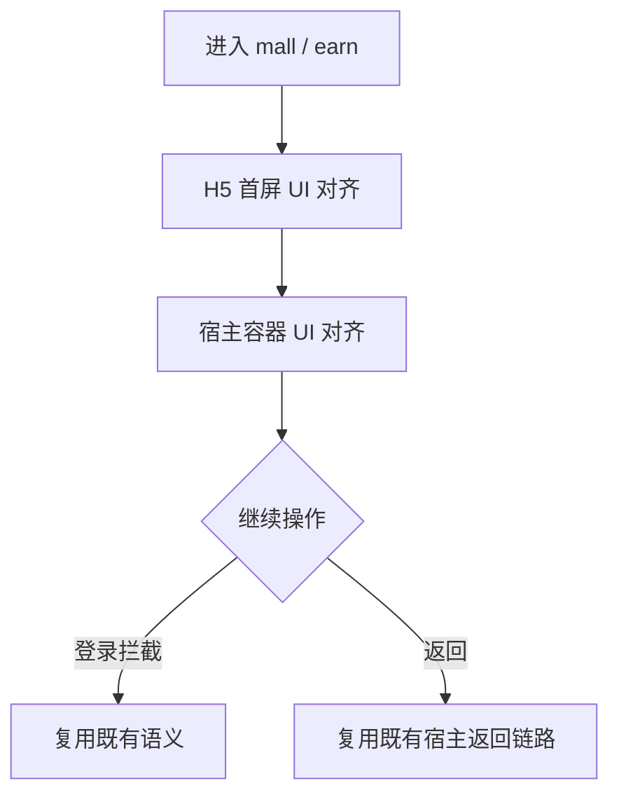

# PRD：商业化页面与宿主 UI 对齐

> 创建日期：2026-07-30
> 状态：草稿
> 作者：AI Agent + daniel

---

## 1. 需求背景

### 1.1 问题描述

- **现状**：商城与赚钱中心主能力已经存在，但 H5 首屏样式、Native 宿主标题区、登录拦截和承接边界与截图基线仍不一致。
- **痛点**：商城和赚钱中心是商业化页面，既承担内容转化，也承担激励闭环。如果 H5 页面与 Native 宿主风格割裂，会放大“嵌入页”感知并削弱整体完成度。
- **本次目标不是新增业务能力**：本次仅对齐 `/mall`、`/earn` 的 H5 页面首屏与 iOS/Android 宿主承接 UI，不新增支付、提现、订单、广告等业务能力。

### 1.2 目标用户

| 用户角色 | 特征描述 | 核心需求 |
|---------|---------|---------|
| 商业化浏览用户 | 浏览商城和赚钱中心 | 首屏结构清晰，入口和运营区样式统一 |
| 宿主承接用户 | 从底部 Tab 或任务入口进入 H5 页面 | 宿主标题区、返回、登录拦截和页面过渡自然一致 |

### 1.3 预期目标

- **业务目标**：将商城、赚钱中心及其 Native 宿主承接 UI 对齐到截图基线，同时保持既定的 H5 承载策略不变。

### 1.4 范围定义

| 范围内 | 范围外（明确不做） | 原因 |
|--------|------------------|------|
| `/mall`、`/earn` H5 首屏视觉结构对齐 | 将 H5 页面改为独立 Native 页面 | 承载策略已确定保持 H5 |
| iOS/Android 宿主标题区、返回区、加载态与空态样式收口 | 重写 Bridge / host message / restoreContext 机制 | 保留现有语义 |
| 商城、赚钱中心登录拦截与页面切换视觉统一 | 新增支付/提现/订单能力 | 仍属后续迭代 |

---

## 2. 涉及平台

| 平台 | 是否涉及 | 变更概要 |
|------|---------|---------|
| Backend | ⚪ 按需涉及 | 仅在商城/赚钱首页展示字段和占位文案被阻塞时补最小支撑 |
| Web | ✅ 涉及 | 对齐 `/mall`、`/earn` 的 H5 首屏 UI |
| iOS | ✅ 涉及 | 对齐 H5 宿主标题区、容器边距和过渡样式 |
| Android | ✅ 涉及 | 对齐 H5 宿主标题区、容器边距和过渡样式 |

---

## 3. 用户故事

| 编号 | 角色 | 需求 | 验收标准 | 涉及平台 | 优先级 |
|------|------|------|---------|---------|--------|
| US-01 | 商业化浏览用户 | 在商城、赚钱中心看到更接近截图的首屏结构 | `/mall`、`/earn` 的顶部区、运营区、列表区结构与截图基线一致 | Web | P0 |
| US-02 | 宿主承接用户 | 在 Native 宿主里看到统一的 H5 承接体验 | 标题区、返回、加载态、异常态和容器边界样式统一 | iOS/Android | P0 |
| US-03 | 所有用户 | UI 对齐不改变承载策略和桥接语义 | `mall / earn` 继续 H5 承载，Bridge / restoreContext / 登录拦截语义保持不变 | Web/iOS/Android | P0 |

---

## 4. 核心流程

1. 用户从底部 Tab 或任务入口进入商城或赚钱中心。
2. H5 页面展示对齐后的首屏结构，Native 宿主同时提供一致的承接容器。
3. 登录拦截、返回和桥接继续复用现有语义。

### 4.1 页面基线

| 页面 / 区域 | 对齐依据 |
|------------|---------|
| 商城首页 | `docs/product_research/mobile/mall/mall.md` |
| 赚钱中心首页 | `docs/product_research/mobile/earn-center/earn-center.md` |

---

## 5. 依赖

| 依赖项 | 类型 | 说明 | 状态 |
|--------|------|------|------|
| PRD-13 商城 | 内部能力 | 商城 H5 页面已存在 | ✅ 已就绪 |
| PRD-14 赚钱中心 | 内部能力 | 赚钱中心 H5 页面已存在 | ✅ 已就绪 |
| PRD-08 用户登录与注册 | 内部能力 | 登录拦截与恢复语义已存在 | ✅ 已就绪 |
| PRD-03 完整观看播放器 | 内部能力 | 赚钱中心看剧任务跳转链路已存在 | ✅ 已就绪 |
| 截图基线 | 内部资料 | 商业化页面视觉对齐基线 | ✅ 已就绪 |

---

## 6. 现有功能影响

| 现有功能 | 影响类型 | 说明 |
|---------|---------|------|
| PRD-13 商城 | UI 整改 | 保留 H5 承载与业务能力边界，只调整页面首屏样式 |
| PRD-14 赚钱中心 | UI 整改 | 保留 H5 承载与任务/播放链路，只调整页面首屏样式 |
| PRD-08 用户登录与注册 | 语义保持 | 登录拦截、恢复与返回行为不变 |
| Native 宿主容器 | UI 整改 | 仅调整标题区、加载态和容器边距，不改桥接语义 |

### 6.1 不应改变的事实

1. `mall / earn` 继续由 H5 承载，而非独立 Native 页面。
2. Bridge / host message / restoreContext 语义不因视觉整改改变。
3. 登录拦截和返回链路继续复用既有宿主实现。

---

## 7. 待澄清问题

| 编号 | 问题 | 阻塞 |
|------|------|------|
| Q-01 | 商城和赚钱中心首版验收是否只聚焦首屏与宿主承接，不覆盖深层二级页？ | 否（默认首屏与宿主承接优先） |

---

## 8. 参考资料

| 文档 | 作用 |
|------|------|
| `docs/product_research/mobile/mall/mall.md` | 商城对齐基线 |
| `docs/product_research/mobile/earn-center/earn-center.md` | 赚钱中心对齐基线 |
| `docs/product_manager/prd/2026-07-25-mall/prd.md` | 既有商城能力边界 |
| `docs/product_manager/prd/2026-07-25-earn-center/prd.md` | 既有赚钱中心能力边界 |
| `PRODUCT.md` | 产品信息统一引用来源 |

---

## 9. 变更历史

| 日期 | 变更内容 | 变更原因 |
|------|---------|---------|
| 2026-07-30 | 初始版本 | 将页面 UI 对齐整改拆分为独立的商业化页面与宿主 UI 对齐需求 |
