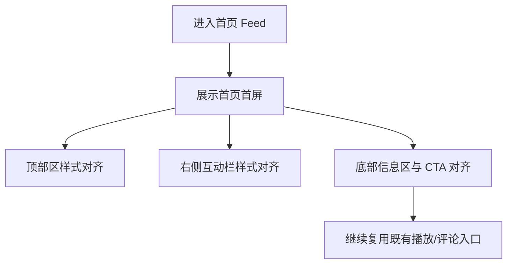

# PRD：首页 Feed UI 对齐

> 创建日期：2026-07-30
> 状态：草稿
> 作者：AI Agent + daniel

---

## 1. 需求背景

### 1.1 问题描述

- **现状**：首页 Feed 主链路已经存在，但视觉结构、按钮层级、信息排布与 `docs/product_research/mobile/homepage-feed/homepage-feed.md` 的截图基线仍有差距。
- **痛点**：首页是内容消费的第一触点，若首页首屏视觉与截图差异过大，会直接影响产品完成度感知，也会放大后续播放器、评论等页面的割裂感。
- **本次目标不是新增业务能力**：本次仅对齐首页首屏视觉结构、信息层级和重点 CTA，不重做 Feed 数据链路、推荐策略、分页机制与交互语义。

### 1.2 目标用户

| 用户角色 | 特征描述 | 核心需求 |
|---------|---------|---------|
| 内容消费用户 | 冷启动后直接浏览首页内容 | 首屏结构清晰，封面、标题、重点操作一眼可见 |
| 轻互动用户 | 在首页完成点赞/评论入口浏览 | 右侧操作区层级稳定，不因样式整改影响理解 |

### 1.3 预期目标

- **业务目标**：将首页 Feed 的顶部区、封面区、右侧操作区、底部信息区和主 CTA 对齐到截图基线，使首页首屏具备可交付的目标样式。

### 1.4 范围定义

| 范围内 | 范围外（明确不做） | 原因 |
|--------|------------------|------|
| 首页首屏顶部区样式对齐 | Feed 推荐策略调整 | 本次只做视觉整改 |
| 右侧互动栏布局与层级对齐 | 点赞/收藏/评论能力重做 | 现有交互语义已存在 |
| 底部标题、标签、热度、CTA 对齐 | 分页/刷新能力重写 | 不改变已有数据链路 |
| 首页空态/错误态/加载态样式收口 | 新增首页业务模块 | 避免范围膨胀 |

---

## 2. 涉及平台

| 平台 | 是否涉及 | 变更概要 |
|------|---------|---------|
| Backend | ⚪ 按需涉及 | 仅在截图文案、标签、热度展示被现有字段阻塞时补最小支撑 |
| Web | ❌ 不涉及 | Web 本期不承载首页 Feed |
| iOS | ✅ 涉及 | 首页 Feed 首屏 UI 对齐 |
| Android | ✅ 涉及 | 首页 Feed 首屏 UI 对齐 |

---

## 3. 用户故事

| 编号 | 角色 | 需求 | 验收标准 | 涉及平台 | 优先级 |
|------|------|------|---------|---------|--------|
| US-01 | 内容消费用户 | 在首页看到与截图一致的首屏视觉层级 | 顶部区、封面区、右侧互动栏、底部信息区、CTA 的模块顺序与视觉权重接近截图基线 | iOS/Android | P0 |
| US-02 | 轻互动用户 | 首页右侧操作区更接近截图样式 | 点赞/评论/收藏等按钮位置、间距、数字样式与截图一致，不改变现有点击语义 | iOS/Android | P0 |
| US-03 | 所有用户 | 异常状态仍有统一视觉 | 加载态、空态、错误态样式与首页新视觉风格一致 | iOS/Android | P1 |

---

## 4. 核心流程

### 4.1 首页首屏浏览

1. 用户进入首页 Feed。
2. 首屏展示对齐后的顶部区、内容卡片、右侧互动栏和底部信息区。
3. 用户继续浏览、点击 CTA 或互动按钮时，仍复用现有首页链路。

### 4.2 页面基线

| 页面 / 区域 | 对齐依据 |
|------------|---------|
| 首页整体首屏 | `docs/product_research/mobile/homepage-feed/homepage-feed.md` |
| 首页完整观看入口关系 | `docs/product_research/mobile/homepage-feed/full-watch/full-watch.md` |

---

## 5. 依赖

| 依赖项 | 类型 | 说明 | 状态 |
|--------|------|------|------|
| PRD-01 底部导航与应用路由 | 内部能力 | 首页承载容器已存在 | ✅ 已就绪 |
| PRD-02 首页 Feed 流 | 内部能力 | 首页数据、卡片、CTA 链路已存在 | ✅ 已就绪 |
| 截图基线 | 内部资料 | 首页视觉对齐唯一基线 | ✅ 已就绪 |

---

## 6. 现有功能影响

| 现有功能 | 影响类型 | 说明 |
|---------|---------|------|
| PRD-02 首页 Feed 流 | UI 整改 | 保留现有数据与交互语义，只调整视觉和结构 |
| PRD-03 完整观看播放器 | 入口联动 | 首页 CTA 仍复用既有播放入口 |
| PRD-09 评论系统 | 入口联动 | 首页评论入口继续复用现有容器 |

### 6.1 不应改变的事实

1. 首页仍由 Native 承载。
2. 首页 CTA 继续复用既有播放入口。
3. 评论入口和登录恢复语义不因视觉整改改变。

---

## 7. 待澄清问题

| 编号 | 问题 | 阻塞 |
|------|------|------|
| Q-01 | 首页验收以结构对齐为主，还是要求更高的视觉还原度？ | 否（默认结构、层级、重点样式优先） |

---

## 8. 参考资料

| 文档 | 作用 |
|------|------|
| `docs/product_research/mobile/homepage-feed/homepage-feed.md` | 首页首屏对齐基线 |
| `docs/product_manager/prd/2026-07-25-homepage-feed/prd.md` | 既有首页能力边界 |
| `wiki/features/homepage-feed/index.md` | 首页当前实现现状 |

---

## 9. 变更历史

| 日期 | 变更内容 | 变更原因 |
|------|---------|---------|
| 2026-07-30 | 初始版本 | 将页面 UI 对齐整改拆分为独立的首页 Feed UI 对齐需求 |
