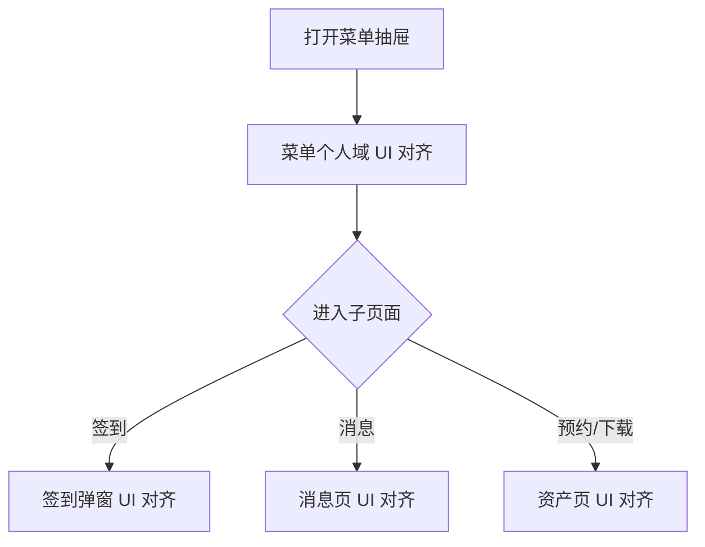

# PRD：菜单与个人相关页 UI 对齐

> 创建日期：2026-07-30
> 状态：草稿
> 作者：AI Agent + daniel

---

## 1. 需求背景

### 1.1 问题描述

- **现状**：菜单抽屉、登录引导、消息页、签到弹窗、我的预约/下载等个人相关页面能力已被规划或已部分落地，但页面结构、模块层级与截图基线仍不一致。
- **痛点**：这组页面承接登录、消息、签到和个人资产，是用户理解“我的”域能力边界的主要入口。若这些页面视觉风格割裂，会让个人域体验显得像多个零散功能拼接而成。
- **本次目标不是新增业务能力**：本次仅对齐菜单与个人相关页的 UI，不新增新的签到规则、消息类型、资产能力或游戏下载能力。

### 1.2 目标用户

| 用户角色 | 特征描述 | 核心需求 |
|---------|---------|---------|
| 匿名用户 | 通过菜单抽屉进入个人域 | 入口结构清晰，能理解登录、消息、常用功能的层次 |
| 已登录用户 | 会查看签到、消息、预约/下载 | 各页面视觉统一，返回路径和操作语义稳定 |

### 1.3 预期目标

- **业务目标**：将菜单抽屉、签到弹窗、消息页、我的预约/下载相关页面对齐到截图基线，使个人域具备统一的视觉承载方式。

### 1.4 范围定义

| 范围内 | 范围外（明确不做） | 原因 |
|--------|------------------|------|
| 菜单抽屉顶部登录区、消息预览、最近在看、常用功能区对齐 | 新增游戏中心能力 | 本次只保留既有入口和占位 |
| 签到弹窗网格样式、消息页结构、我的预约页视觉对齐 | 重写签到/消息/预约业务逻辑 | 保留既有能力边界 |
| 下载入口占位页和相关空态样式收口 | 新增下载能力 | 仍属后续迭代 |
| 个人域状态页视觉统一 | 修改登录拦截、返回链路、页面 route | 保留现有语义 |

---

## 2. 涉及平台

| 平台 | 是否涉及 | 变更概要 |
|------|---------|---------|
| Backend | ⚪ 按需涉及 | 仅在个人域展示字段或占位文案被阻塞时补最小支撑 |
| Web | ❌ 不涉及 | 个人域主承载仍为 Native |
| iOS | ✅ 涉及 | 菜单抽屉、签到弹窗、消息页、资产页 UI 对齐 |
| Android | ✅ 涉及 | 菜单抽屉、签到弹窗、消息页、资产页 UI 对齐 |

---

## 3. 用户故事

| 编号 | 角色 | 需求 | 验收标准 | 涉及平台 | 优先级 |
|------|------|------|---------|---------|--------|
| US-01 | 匿名用户 | 在菜单抽屉看到更接近截图的个人域入口结构 | 登录引导、消息预览、最近在看、常用功能区的顺序、间距和信息密度与截图一致 | iOS/Android | P0 |
| US-02 | 已登录用户 | 在签到、消息、我的预约/下载页看到统一风格 | 签到弹窗、消息页、我的预约/下载页与截图基线一致，视觉语言统一 | iOS/Android | P0 |
| US-03 | 所有用户 | UI 对齐不改变原有链路 | 登录拦截、返回行为、签到触发规则、消息路由和资产入口语义保持不变 | iOS/Android | P0 |

---

## 4. 核心流程

1. 用户从首页打开菜单抽屉。
2. 抽屉以对齐后的视觉结构承接登录、消息、最近在看和常用功能入口。
3. 用户进入签到弹窗、消息页、我的预约/下载页时，继续复用既有链路，但页面视觉与截图基线对齐。

### 4.1 页面基线

| 页面 / 区域 | 对齐依据 |
|------------|---------|
| 菜单抽屉 | `docs/product_research/mobile/homepage-feed/menu-panel/menu-panel.md` |
| 消息页 | `docs/product_research/mobile/homepage-feed/menu-panel/my-messages/my-messages.md` |
| 签到弹窗 | `docs/product_research/mobile/homepage-feed/signin-popup/signin-popup.md` |
| 我的预约 | `docs/product_research/mobile/homepage-feed/menu-panel/common-functions/my-bookings/my-bookings.md` |

---

## 5. 依赖

| 依赖项 | 类型 | 说明 | 状态 |
|--------|------|------|------|
| PRD-07 菜单面板 | 内部能力 | 个人域主入口已存在 | ✅ 已就绪 |
| PRD-08 用户登录与注册 | 内部能力 | 登录引导与拦截语义已存在 | ✅ 已就绪 |
| PRD-10 签到与消息系统 | 内部能力 | 签到与消息页能力需先落地 | 📅 需完成后进入本专项 |
| PRD-11 个人资产管理 | 内部能力 | 预约/下载相关页能力需先落地 | 📅 需完成后进入本专项 |
| 截图基线 | 内部资料 | 个人域视觉对齐基线 | ✅ 已就绪 |

---

## 6. 现有功能影响

| 现有功能 | 影响类型 | 说明 |
|---------|---------|------|
| PRD-07 菜单面板 | UI 整改 | 保留既有抽屉形态和入口语义，只调整视觉结构 |
| PRD-10 签到与消息系统 | UI 整改 | 保留触发策略、路由和列表逻辑，只调整视觉层级 |
| PRD-11 个人资产管理 | UI 整改 | 保留预约/下载入口能力边界，只调整页面样式 |

### 6.1 不应改变的事实

1. 菜单个人域仍由 Native 抽屉和 Native 子页承载。
2. 登录拦截和返回路径不因视觉整改改变。
3. 签到弹窗仍遵守既有触发规则，消息和资产页仍复用既有 route。

---

## 7. 待澄清问题

| 编号 | 问题 | 阻塞 |
|------|------|------|
| Q-01 | 游戏中心和下载入口若仍为占位，首版是否只要求容器与空态对齐？ | 否（默认允许占位，但样式需统一） |

---

## 8. 参考资料

| 文档 | 作用 |
|------|------|
| `docs/product_research/mobile/homepage-feed/menu-panel/menu-panel.md` | 菜单抽屉对齐基线 |
| `docs/product_research/mobile/homepage-feed/menu-panel/my-messages/my-messages.md` | 消息页对齐基线 |
| `docs/product_research/mobile/homepage-feed/signin-popup/signin-popup.md` | 签到弹窗对齐基线 |
| `docs/product_research/mobile/homepage-feed/menu-panel/common-functions/my-bookings/my-bookings.md` | 我的预约页对齐基线 |
| `docs/product_manager/prd/2026-07-25-menu-panel/prd.md` | 既有菜单能力边界 |
| `docs/product_manager/prd/2026-07-25-signin-messages/prd.md` | 既有签到/消息能力边界 |
| `docs/product_manager/prd/2026-07-25-user-assets/prd.md` | 既有资产页能力边界 |

---

## 9. 变更历史

| 日期 | 变更内容 | 变更原因 |
|------|---------|---------|
| 2026-07-30 | 初始版本 | 将页面 UI 对齐整改拆分为独立的菜单与个人相关页 UI 对齐需求 |
