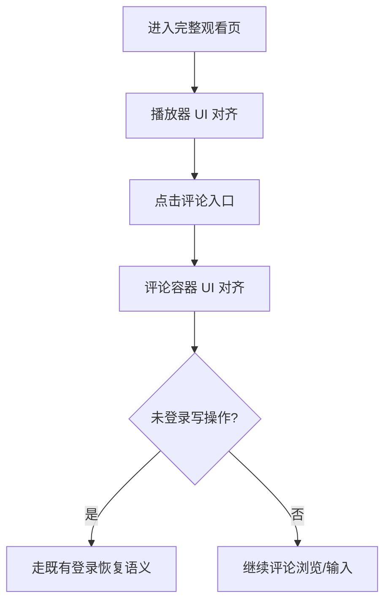

# PRD：播放器与评论 UI 对齐

> 创建日期：2026-07-30
> 状态：草稿
> 作者：AI Agent + daniel

---

## 1. 需求背景

### 1.1 问题描述

- **现状**：播放器与评论链路已经存在，但播放页顶部控制区、右侧操作区、底部信息区、评论抽屉层级与截图基线仍有差距。
- **痛点**：播放器和评论是核心消费链路中停留时间最长的页面，若视觉还原度不足，会直接削弱“完整观看体验已经交付”的感知。
- **本次目标不是新增业务能力**：本次仅对齐播放器与评论容器的 UI，不新增播放协议、投屏、会员、楼中楼、图片评论等业务能力。

### 1.2 目标用户

| 用户角色 | 特征描述 | 核心需求 |
|---------|---------|---------|
| 短剧观众 | 在播放页停留时间长 | 顶部控制、集数信息、选集入口和右侧操作区清晰稳定 |
| 围观互动用户 | 在播放页查看评论、准备输入 | 评论抽屉层级清晰，不打断当前观看上下文 |

### 1.3 预期目标

- **业务目标**：将播放器与评论容器的主要视觉区域对齐到截图基线，使完整观看主链路达到可交付的样式完成度。

### 1.4 范围定义

| 范围内 | 范围外（明确不做） | 原因 |
|--------|------------------|------|
| 播放器顶部栏样式对齐 | 新增投屏/画质/会员能力 | 本次只做视觉整改 |
| 右侧互动区、底部信息区、选集入口对齐 | 重做点赞/收藏/评论业务逻辑 | 保留现有语义 |
| 评论抽屉头部、列表区、输入区样式对齐 | 图片评论、回复楼层、举报等能力 | 仍属后续迭代 |
| 播放页异常态、评论空态视觉收口 | 评论登录恢复机制重写 | 继续复用现有语义 |

---

## 2. 涉及平台

| 平台 | 是否涉及 | 变更概要 |
|------|---------|---------|
| Backend | ⚪ 按需涉及 | 仅补充最小展示字段与种子文案 |
| Web | ❌ 不涉及 | Web 播放页仍非本次重点 |
| iOS | ✅ 涉及 | 播放器与评论 Sheet UI 对齐 |
| Android | ✅ 涉及 | 播放器与评论 Bottom Sheet UI 对齐 |

---

## 3. 用户故事

| 编号 | 角色 | 需求 | 验收标准 | 涉及平台 | 优先级 |
|------|------|------|---------|---------|--------|
| US-01 | 短剧观众 | 在播放器看到更接近截图的控制区和信息层级 | 顶部返回/集数/倍速/更多、右侧操作区、底部信息区和选集入口与截图基线一致 | iOS/Android | P0 |
| US-02 | 围观互动用户 | 在播放页打开更接近截图的评论容器 | 评论头部、列表、输入栏样式与截图一致，仍以内嵌容器承载 | iOS/Android | P0 |
| US-03 | 所有用户 | UI 对齐后不破坏既有观看和评论闭环 | 播放、评论入口、登录恢复、返回路径保持原语义 | iOS/Android | P0 |

---

## 4. 核心流程

### 4.1 播放页 UI 对齐

1. 用户从首页或其他入口进入完整观看页。
2. 播放页展示对齐后的顶部栏、右侧操作区、底部信息区与选集入口。
3. 用户继续复用既有倍速、选集、评论入口与返回链路。

### 4.2 评论容器 UI 对齐

1. 用户从播放器点击评论入口。
2. 在当前页面上下文中打开对齐后的评论容器。
3. 未登录写操作仍只恢复评论容器，不自动重放原写操作。

### 4.3 页面基线

| 页面 / 区域 | 对齐依据 |
|------------|---------|
| 完整观看页 | `docs/product_research/mobile/homepage-feed/full-watch/full-watch.md` |
| 顶部倍速/更多 | `docs/product_research/mobile/homepage-feed/full-watch/playback-options/playback-options.md` |
| 选集入口 | `docs/product_research/mobile/homepage-feed/full-watch/episode-selector/episode-selector.md` |
| 评论抽屉 | `docs/product_research/mobile/homepage-feed/comments/comments.md` |

---

## 5. 依赖

| 依赖项 | 类型 | 说明 | 状态 |
|--------|------|------|------|
| PRD-03 完整观看播放器 | 内部能力 | 播放页主链路已存在 | ✅ 已就绪 |
| PRD-08 用户登录与注册 | 内部能力 | 评论写操作登录恢复语义已存在 | ✅ 已就绪 |
| PRD-09 评论系统 | 内部能力 | 评论容器与接口已存在 | ✅ 已就绪 |
| 截图基线 | 内部资料 | 播放器与评论视觉对齐基线 | ✅ 已就绪 |

---

## 6. 现有功能影响

| 现有功能 | 影响类型 | 说明 |
|---------|---------|------|
| PRD-03 完整观看播放器 | UI 整改 | 调整视觉层级，不改变播放主链路 |
| PRD-09 评论系统 | UI 整改 | 评论继续以容器形式承载，不新增独立 route |
| PRD-14 赚钱中心 | 播放承接联动 | 赚钱任务继续复用现有 Native 播放器承接 |

### 6.1 不应改变的事实

1. 评论仍是页面内增强，而非独立 route。
2. 评论登录恢复仍是“恢复容器，不自动重放写操作”。
3. 赚钱任务仍复用既有 Native 播放承接语义。

---

## 7. 待澄清问题

| 编号 | 问题 | 阻塞 |
|------|------|------|
| Q-01 | 播放页验收是否要求覆盖加载态/错误态的截图一致性？ | 否（默认需要风格一致，但优先主链路首屏） |

---

## 8. 参考资料

| 文档 | 作用 |
|------|------|
| `docs/product_research/mobile/homepage-feed/full-watch/full-watch.md` | 播放器整体对齐基线 |
| `docs/product_research/mobile/homepage-feed/comments/comments.md` | 评论容器对齐基线 |
| `docs/product_manager/prd/2026-07-25-full-player/prd.md` | 既有播放器能力边界 |
| `docs/product_manager/prd/2026-07-25-comments/prd.md` | 既有评论能力边界 |
| `wiki/features/video-player/index.md` | 播放器当前实现现状 |
| `wiki/features/comments/index.md` | 评论当前实现现状 |

---

## 9. 变更历史

| 日期 | 变更内容 | 变更原因 |
|------|---------|---------|
| 2026-07-30 | 初始版本 | 将页面 UI 对齐整改拆分为独立的播放器与评论 UI 对齐需求 |
