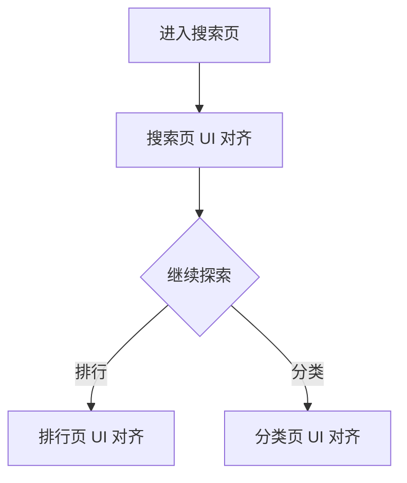

# PRD：搜索发现体系 UI 对齐

> 创建日期：2026-07-30
> 状态：草稿
> 作者：AI Agent + daniel

---

## 1. 需求背景

### 1.1 问题描述

- **现状**：搜索、排行、分类页面能力已经存在，但页面层级、筛选结构、标签布局和信息密度与截图基线仍不一致。
- **痛点**：搜索发现体系承担主动找剧职责，如果搜索页、排行页、分类页风格割裂，会削弱用户对“内容发现入口完整可用”的感知。
- **本次目标不是新增业务能力**：本次仅做搜索、排行、分类三类页面的视觉和结构对齐，不新增搜索域、榜单能力、分类维度或新数据源。

### 1.2 目标用户

| 用户角色 | 特征描述 | 核心需求 |
|---------|---------|---------|
| 主动搜索用户 | 明确知道想看什么 | 搜索页结构清晰，热点和快捷入口易理解 |
| 探索型用户 | 通过榜单和分类找内容 | 排行与分类的筛选关系清楚、切换成本低 |

### 1.3 预期目标

- **业务目标**：将搜索页、排行页、分类页统一对齐到截图基线，使内容发现体系具备统一的视觉语言和页面层次。

### 1.4 范围定义

| 范围内 | 范围外（明确不做） | 原因 |
|--------|------------------|------|
| 搜索页顶部搜索栏、快捷入口、历史/热搜区对齐 | 新增搜索联想、语音搜索 | 仍属后续迭代 |
| 排行页一级类型 Tab、二级榜单筛选、列表卡片对齐 | 新增榜单维度 | 本次只对齐现有结构 |
| 分类页顶部人群 Tab、左侧维度、右侧标签矩阵对齐 | 新增分类标签体系 | 保留现有分类能力 |
| 搜索/排行/分类状态页样式收口 | 搜索结果数据逻辑重写 | 不调整现有 contract |

---

## 2. 涉及平台

| 平台 | 是否涉及 | 变更概要 |
|------|---------|---------|
| Backend | ⚪ 按需涉及 | 仅在榜单文案、标签显示被阻塞时补最小展示支撑 |
| Web | ❌ 不涉及 | Web 相关承接页仍非本次重点 |
| iOS | ✅ 涉及 | 搜索、排行、分类 UI 对齐 |
| Android | ✅ 涉及 | 搜索、排行、分类 UI 对齐 |

---

## 3. 用户故事

| 编号 | 角色 | 需求 | 验收标准 | 涉及平台 | 优先级 |
|------|------|------|---------|---------|--------|
| US-01 | 主动搜索用户 | 在搜索页看到接近截图的找剧入口结构 | 搜索栏、快捷入口、历史、热搜、结果区结构与截图一致 | iOS/Android | P0 |
| US-02 | 探索型用户 | 在排行页理解双层筛选关系 | 一级类型 Tab、二级榜单筛选和列表卡片层级与截图一致 | iOS/Android | P0 |
| US-03 | 探索型用户 | 在分类页理解三层结构 | 顶部人群 Tab、左侧导航、右侧标签矩阵层级清晰 | iOS/Android | P0 |

---

## 4. 核心流程

1. 用户从首页或剧场进入搜索发现体系。
2. 搜索页展示对齐后的搜索栏、快捷入口、历史和热搜结构。
3. 用户可继续进入排行页或分类页，页面继续复用既有承接关系，但视觉结构与截图对齐。

### 4.1 页面基线

| 页面 | 对齐依据 |
|------|---------|
| 搜索页 | `docs/product_research/mobile/homepage-feed/search/search.md` |
| 排行页 | `docs/product_research/mobile/homepage-feed/search/ranking/ranking.md` |
| 分类页 | `docs/product_research/mobile/homepage-feed/search/classification/classification.md` |

---

## 5. 依赖

| 依赖项 | 类型 | 说明 | 状态 |
|--------|------|------|------|
| PRD-04 搜索发现 | 内部能力 | 搜索页与结果页已存在 | ✅ 已就绪 |
| PRD-05 排行体系 | 内部能力 | 排行页与榜单结构已存在 | ✅ 已就绪 |
| PRD-06 分类浏览 | 内部能力 | 分类页已存在 | ✅ 已就绪 |
| 截图基线 | 内部资料 | 搜索发现体系视觉对齐基线 | ✅ 已就绪 |

---

## 6. 现有功能影响

| 现有功能 | 影响类型 | 说明 |
|---------|---------|------|
| PRD-04 搜索发现 | UI 整改 | 保留既有搜索链路，调整视觉结构 |
| PRD-05 排行体系 | UI 整改 | 保留既有榜单逻辑，调整页头和筛选层级 |
| PRD-06 分类浏览 | UI 整改 | 保留既有分类逻辑，调整导航和标签矩阵 |

---

## 7. 待澄清问题

| 编号 | 问题 | 阻塞 |
|------|------|------|
| Q-01 | 搜索页中“猜你想搜”若当前未完全落地，是否允许首版仅保持结构占位？ | 否（默认允许结构占位） |

---

## 8. 参考资料

| 文档 | 作用 |
|------|------|
| `docs/product_research/mobile/homepage-feed/search/search.md` | 搜索页对齐基线 |
| `docs/product_research/mobile/homepage-feed/search/ranking/ranking.md` | 排行页对齐基线 |
| `docs/product_research/mobile/homepage-feed/search/classification/classification.md` | 分类页对齐基线 |
| `docs/product_manager/prd/2026-07-25-search/prd.md` | 既有搜索能力边界 |
| `docs/product_manager/prd/2026-07-25-ranking/prd.md` | 既有排行能力边界 |
| `docs/product_manager/prd/2026-07-25-classification/prd.md` | 既有分类能力边界 |
| `wiki/features/search-discovery/index.md` | 搜索发现当前实现现状 |

---

## 9. 变更历史

| 日期 | 变更内容 | 变更原因 |
|------|---------|---------|
| 2026-07-30 | 初始版本 | 将页面 UI 对齐整改拆分为独立的搜索发现体系 UI 对齐需求 |
