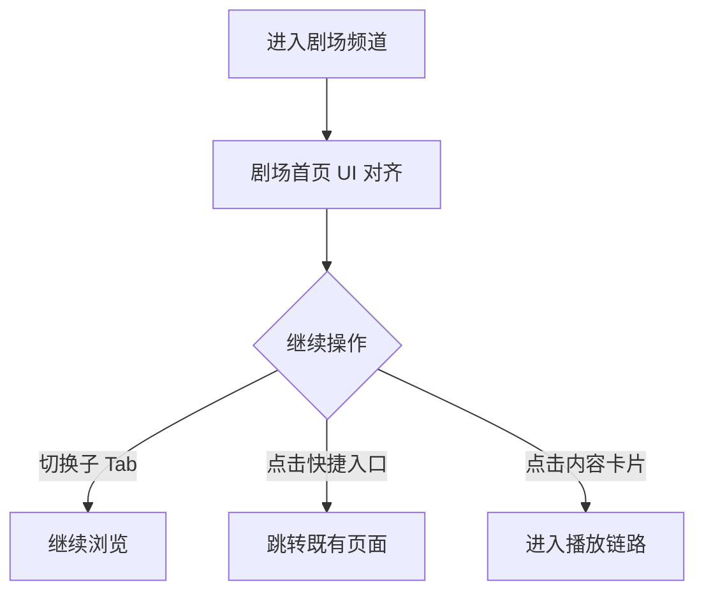

# PRD：剧场频道 UI 对齐

> 创建日期：2026-07-30
> 状态：草稿
> 作者：AI Agent + daniel

---

## 1. 需求背景

### 1.1 问题描述

- **现状**：剧场频道能力已经存在，但顶部搜索区、频道子 Tab、快捷入口、双列卡片 Feed 与截图基线仍有明显差异。
- **痛点**：剧场是首页之外最重要的找剧入口之一。若频道首页视觉结构不稳定，会直接影响用户对内容分发能力完整度的判断。
- **本次目标不是新增业务能力**：本次仅对齐剧场频道页面 UI，不新增新剧频道能力、筛选能力或新的内容数据结构。

### 1.2 目标用户

| 用户角色 | 特征描述 | 核心需求 |
|---------|---------|---------|
| 探索型用户 | 通过剧场找剧、切换频道 | 顶部入口、频道导航、双列列表结构清晰 |
| 快捷入口用户 | 通过排行/筛选/预约等入口继续找剧 | 入口样式统一、跳转关系稳定 |

### 1.3 预期目标

- **业务目标**：将剧场频道首页对齐到截图基线，使其在顶部结构、频道导航、快捷入口和双列内容卡片上达到可交付的样式完成度。

### 1.4 范围定义

| 范围内 | 范围外（明确不做） | 原因 |
|--------|------------------|------|
| 顶部搜索区、识图入口占位、频道子 Tab 对齐 | 新增识图、新剧真实能力 | 仍属后续迭代 |
| 快捷入口区与双列卡片 Feed 对齐 | 改写剧场内容分发逻辑 | 保留现有数据结构 |
| 剧场页加载态、空态、错误态样式收口 | 新增频道或新入口 | 本次只对齐现有页面 |

---

## 2. 涉及平台

| 平台 | 是否涉及 | 变更概要 |
|------|---------|---------|
| Backend | ⚪ 按需涉及 | 仅在标签、热度、占位文案被阻塞时补最小展示支撑 |
| Web | ❌ 不涉及 | 剧场频道仍由 Native 承载 |
| iOS | ✅ 涉及 | 剧场频道首页 UI 对齐 |
| Android | ✅ 涉及 | 剧场频道首页 UI 对齐 |

---

## 3. 用户故事

| 编号 | 角色 | 需求 | 验收标准 | 涉及平台 | 优先级 |
|------|------|------|---------|---------|--------|
| US-01 | 探索型用户 | 在剧场首页看到接近截图的频道结构 | 顶部搜索区、频道子 Tab、快捷入口和双列列表结构与截图一致 | iOS/Android | P0 |
| US-02 | 快捷入口用户 | 理解剧场页四个入口的层级关系 | 筛选/排行/新剧/预约入口样式和排布与截图一致，保留既有跳转语义 | iOS/Android | P0 |
| US-03 | 所有用户 | 剧场页状态样式统一 | 加载态、空态、错误态与剧场页新视觉风格一致 | iOS/Android | P1 |

---

## 4. 核心流程

1. 用户从底部 Tab 进入剧场频道。
2. 页面展示对齐后的顶部区、频道子 Tab、快捷入口和双列内容卡片。
3. 用户继续复用既有排行、分类、播放等跳转关系。

### 4.1 页面基线

| 页面 / 区域 | 对齐依据 |
|------------|---------|
| 剧场频道首页 | `docs/product_research/mobile/theater/theater.md` |

---

## 5. 依赖

| 依赖项 | 类型 | 说明 | 状态 |
|--------|------|------|------|
| PRD-12 剧场频道 | 内部能力 | 剧场频道主链路已存在 | ✅ 已就绪 |
| PRD-05 排行体系 | 内部能力 | 快捷入口跳转关系已存在 | ✅ 已就绪 |
| PRD-06 分类浏览 | 内部能力 | 快捷入口跳转关系已存在 | ✅ 已就绪 |
| 截图基线 | 内部资料 | 剧场频道视觉对齐基线 | ✅ 已就绪 |

---

## 6. 现有功能影响

| 现有功能 | 影响类型 | 说明 |
|---------|---------|------|
| PRD-12 剧场频道 | UI 整改 | 保留既有频道和双列 Feed 能力，只调整视觉结构 |
| PRD-05 排行体系 | 入口联动 | 排行入口继续复用既有跳转 |
| PRD-06 分类浏览 | 入口联动 | 筛选入口继续复用既有跳转 |
| PRD-03 完整观看播放器 | 入口联动 | 内容卡片继续复用既有播放入口 |

### 6.1 不应改变的事实

1. 剧场频道仍由 Native 承载。
2. 子 Tab、快捷入口和卡片点击继续复用既有路由语义。
3. 本次不新增新剧、识图或大屏能力。

---

## 7. 待澄清问题

| 编号 | 问题 | 阻塞 |
|------|------|------|
| Q-01 | 其余子频道若首版仍为占位，是否默认以统一空态样式验收？ | 否（默认允许占位，但需与截图层级一致） |

---

## 8. 参考资料

| 文档 | 作用 |
|------|------|
| `docs/product_research/mobile/theater/theater.md` | 剧场频道对齐基线 |
| `docs/product_manager/prd/2026-07-25-theater-channel/prd.md` | 既有剧场能力边界 |
| `wiki/features/theater-channel/index.md` | 剧场频道当前实现现状 |

---

## 9. 变更历史

| 日期 | 变更内容 | 变更原因 |
|------|---------|---------|
| 2026-07-30 | 初始版本 | 将页面 UI 对齐整改拆分为独立的剧场频道 UI 对齐需求 |
