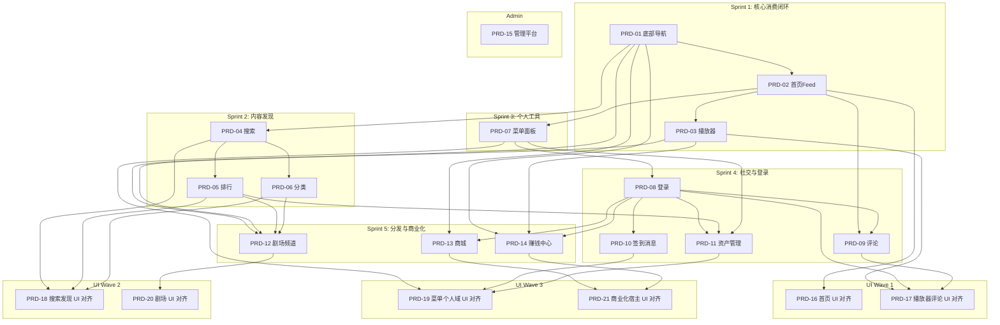

# Sprint 计划

> 最后更新：2026-07-30
> 基于竞品（红果）全量功能拆解与页面体验收口规划，共 21 份 PRD，含 5 个 Sprint、1 个 Admin 主题与 3 个 UI Wave，总工时 198.5 人日。

---

## 总览

| Sprint / Wave | 主题 | PRD 数 | 总工时 | Backend | iOS | Android | Web |
|---------------|------|--------|--------|---------|-----|---------|-----|
| Sprint 1 | 核心内容消费闭环 | 3 | 35.5 | 7 | 14 | 14 | 0.5 |
| Sprint 2 | 内容发现 | 3 | 28 | 7 | 10.5 | 10.5 | — |
| Sprint 3 | 个人工具 | 1 | 9.5 | 1.5 | 4 | 4 | — |
| Sprint 4 | 社交与登录 | 4 | 28 | 9 | 9.5 | 9.5 | — |
| Sprint 5 | 内容分发与商业化 | 3 | 34.5 | 6.5 | 14 | 14 | — |
| Admin | 管理平台 | 1 | 18.5 | 5 | — | — | 13.5 |
| UI Wave 1 | 核心消费链路收口 | 2 | 17 | 2 | 7.5 | 7.5 | — |
| UI Wave 2 | 发现与分发收口 | 2 | 15 | 2 | 6.5 | 6.5 | — |
| UI Wave 3 | 个人域与商业化收口 | 2 | 12.5 | 1 | 5 | 5 | 1.5 |
| **合计** | | **21** | **198.5** | **41** | **71** | **71** | **15.5** |

## Sprint / Wave 依赖关系

---

## Sprint 1：核心内容消费闭环（已完成）

> 目标：建立应用骨架和核心观看体验，用户能打开 App 浏览内容并完整观看短剧。

| 编号 | 功能 | 优先级 | 工时 | Backend | iOS | Android | Web | 审查 |
|------|------|--------|------|---------|-----|---------|-----|------|
| [PRD-01](prd/2026-07-25-bottom-nav/prd.md) | 底部导航与应用路由 | P0 | 8.5 | — | 4 | 4 | 0.5 | ✅ |
| [PRD-02](prd/2026-07-25-homepage-feed/prd.md) | 首页 Feed 流 | P0 | 14 | 5 | 4.5 | 4.5 | — | ✅ |
| [PRD-03](prd/2026-07-25-full-player/prd.md) | 完整观看播放器 | P0 | 13 | 2 | 5.5 | 5.5 | — | ✅ |

---

## Sprint 2：内容发现（已完成）

> 目标：建立搜索、排行、分类三条内容发现路径，让用户能主动找到想看的内容。

| 编号 | 功能 | 优先级 | 工时 | Backend | iOS | Android | 审查 |
|------|------|--------|------|---------|-----|---------|------|
| [PRD-04](prd/2026-07-25-search/prd.md) | 搜索发现 | P1 | 10.5 | 3.5 | 3.5 | 3.5 | ✅ |
| [PRD-05](prd/2026-07-25-ranking/prd.md) | 排行体系 | P1 | 10 | 2 | 4 | 4 | ✅ |
| [PRD-06](prd/2026-07-25-classification/prd.md) | 分类浏览 | P1 | 7.5 | 1.5 | 3 | 3 | ✅ |

---

## Sprint 3：个人工具（已完成）

> 目标：建立菜单面板作为个人中心入口，聚合最近在看、功能入口和个人状态。

| 编号 | 功能 | 优先级 | 工时 | Backend | iOS | Android | 审查 |
|------|------|--------|------|---------|-----|---------|------|
| [PRD-07](prd/2026-07-25-menu-panel/prd.md) | 菜单面板 | P1 | 9.5 | 1.5 | 4 | 4 | ✅ |

---

## Sprint 4：社交与登录（部分完成）

> 目标：建立用户体系和社交互动能力。登录是所有个人化功能的前置依赖。

| 编号 | 功能 | 优先级 | 工时 | Backend | iOS | Android | 审查 | 状态 |
|------|------|--------|------|---------|-----|---------|------|------|
| [PRD-08](prd/2026-07-25-login/prd.md) | 用户登录与注册 | P1 | 8.5 | 2.5 | 3 | 3 | ✅ | 🟢 |
| [PRD-09](prd/2026-07-25-comments/prd.md) | 评论系统 | P1 | 7.5 | 2.5 | 2.5 | 2.5 | ✅ | 🟢 |
| [PRD-10](prd/2026-07-25-signin-messages/prd.md) | 签到与消息系统 | P1 | 8 | 3 | 2.5 | 2.5 | ✅ | 🚧 |
| [PRD-11](prd/2026-07-25-user-assets/prd.md) | 个人资产管理 | P1 | 4 | 1 | 1.5 | 1.5 | ✅ | 🔵 |

---

## Sprint 5：内容分发与商业化（已完成）

> 目标：完成剧场、商城、赚钱中心三个频道 Tab 的内容填充，建立内容分发和商业化能力。

| 编号 | 功能 | 优先级 | 工时 | Backend | iOS | Android | 审查 | 状态 |
|------|------|--------|------|---------|-----|---------|------|------|
| [PRD-12](prd/2026-07-25-theater-channel/prd.md) | 剧场频道 | P1 | 12 | 2 | 5 | 5 | ✅ | 🟢 |
| [PRD-13](prd/2026-07-25-mall/prd.md) | 商城 | P1 | 10 | 2 | 4 | 4 | ✅ | 🟢 |
| [PRD-14](prd/2026-07-25-earn-center/prd.md) | 赚钱中心 | P2 | 12.5 | 2.5 | 5 | 5 | ✅ | 🟢 |

---

## Admin：管理平台（规划中）

> 目标：建立运营后台与基础管理能力，不作为用户侧 UI 对齐的前置阻塞。

| 编号 | 功能 | 优先级 | 工时 | Backend | Web | 状态 |
|------|------|--------|------|---------|-----|------|
| [PRD-15](prd/2026-07-27-admin-panel/prd.md) | 管理平台 | P1 | 18.5 | 5 | 13.5 | 🔵 |

---

## UI Wave 1：核心消费链路收口（规划中）

> 目标：先收口首页与播放器评论主链路，使最核心的内容消费体验与截图基线一致。

| 编号 | 功能 | 优先级 | 工时 | Backend | iOS | Android | 状态 |
|------|------|--------|------|---------|-----|---------|------|
| [PRD-16](prd/2026-07-30-homepage-ui-alignment/prd.md) | 首页 Feed UI 对齐 | P0 | 7 | 1 | 3 | 3 | 🔵 |
| [PRD-17](prd/2026-07-30-player-comments-ui-alignment/prd.md) | 播放器与评论 UI 对齐 | P0 | 10 | 1 | 4.5 | 4.5 | 🔵 |

### Wave 1 推进说明

- 优先对齐首页首屏、播放器顶部/底部信息区、评论容器等核心消费页面。
- 不改变首页 CTA、播放入口、评论登录恢复语义。

---

## UI Wave 2：发现与分发收口（规划中）

> 目标：在核心消费链路稳定后，统一搜索发现体系与剧场频道的页面视觉语言。

| 编号 | 功能 | 优先级 | 工时 | Backend | iOS | Android | 状态 |
|------|------|--------|------|---------|-----|---------|------|
| [PRD-18](prd/2026-07-30-search-discovery-ui-alignment/prd.md) | 搜索发现体系 UI 对齐 | P1 | 10 | 1 | 4.5 | 4.5 | 🔵 |
| [PRD-20](prd/2026-07-30-theater-ui-alignment/prd.md) | 剧场频道 UI 对齐 | P1 | 5 | 1 | 2 | 2 | 🔵 |

### Wave 2 推进说明

- 统一搜索、排行、分类、剧场页的导航结构、筛选层级和卡片样式。
- 保留排行/分类/剧场既有跳转和数据链路。

---

## UI Wave 3：个人域与商业化收口（规划中）

> 目标：在签到/资产相关能力稳定后，对个人域和商业化页面做最后一轮视觉收口。

| 编号 | 功能 | 优先级 | 工时 | Backend | iOS | Android | Web | 状态 |
|------|------|--------|------|---------|-----|---------|-----|------|
| [PRD-19](prd/2026-07-30-menu-profile-ui-alignment/prd.md) | 菜单与个人相关页 UI 对齐 | P1 | 7.5 | 0.5 | 3.5 | 3.5 | — | 🔵 |
| [PRD-21](prd/2026-07-30-commercial-ui-alignment/prd.md) | 商业化页面与宿主 UI 对齐 | P1 | 5 | 0.5 | 1.5 | 1.5 | 1.5 | 🔵 |

### Wave 3 推进说明

- PRD-19 需等待 PRD-10/11 先具备可对齐的页面能力。
- PRD-21 明确保留 `mall / earn` 的 H5 承载策略，只做首屏与宿主体验收口。

---

## 状态追踪

当前进度：**Sprint 1-3 与 Sprint 5 已完成，Sprint 4 中仅 PRD-10 / PRD-11 尚未全部收口；页面 UI 对齐专题已被拆分为 3 个 UI Wave、6 个独立 PRD，用于在现有业务能力完成后分批推进体验收口。**

| 功能 | 分类 | 工时 | 状态 |
|------|------|------|------|
| PRD-01 底部导航 | Sprint 1 | 8.5 | 🟢 |
| PRD-02 首页 Feed | Sprint 1 | 14 | 🟢 |
| PRD-03 播放器 | Sprint 1 | 13 | 🟢 |
| PRD-04 搜索 | Sprint 2 | 10.5 | 🟢 |
| PRD-05 排行 | Sprint 2 | 10 | 🟢 |
| PRD-06 分类 | Sprint 2 | 7.5 | 🟢 |
| PRD-07 菜单面板 | Sprint 3 | 9.5 | 🟢 |
| PRD-08 登录 | Sprint 4 | 8.5 | 🟢 |
| PRD-09 评论 | Sprint 4 | 7.5 | 🟢 |
| PRD-10 签到消息 | Sprint 4 | 8 | 🟢 |
| PRD-11 资产管理 | Sprint 4 | 4 | 🟢 |
| PRD-12 剧场频道 | Sprint 5 | 12 | 🟢 |
| PRD-13 商城 | Sprint 5 | 10 | 🟢 |
| PRD-14 赚钱中心 | Sprint 5 | 12.5 | 🟢 |
| PRD-15 管理平台 | Admin | 18.5 | 🔵 |
| PRD-16 首页 UI 对齐 | UI Wave 1 | 7 | 🔵 |
| PRD-17 播放器评论 UI 对齐 | UI Wave 1 | 10 | 🔵 |
| PRD-18 搜索发现 UI 对齐 | UI Wave 2 | 10 | 🔵 |
| PRD-19 菜单个人域 UI 对齐 | UI Wave 3 | 7.5 | 🔵 |
| PRD-20 剧场 UI 对齐 | UI Wave 2 | 5 | 🔵 |
| PRD-21 商业化宿主 UI 对齐 | UI Wave 3 | 5 | 🔵 |

> 状态图例：🔵 规划中 → 🚧 构建中 → 🟢 已完成

---

## 变更历史

| 日期 | 变更内容 |
|------|---------|
| 2026-07-30 | 新增 Admin 与 UI Wave 1-3 规划，并将页面 UI 对齐需求拆分为 PRD-16 ~ PRD-21 六个独立条目 |
| 2026-07-25 | 初始版本：14 份 PRD / 5 Sprint 完整计划，总工时 135.5 人日 |
