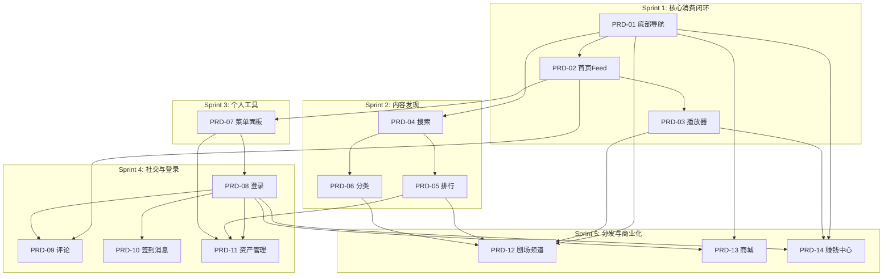

# Sprint 计划

> 最后更新：2026-07-29
> 基于竞品（红果）全量功能拆解，共 14 份 PRD，5 个 Sprint，总工时 135.5 人日。

---

## 总览

| Sprint | 主题 | PRD 数 | 总工时 | Backend | iOS | Android | Web |
|--------|------|--------|--------|---------|-----|---------|-----|
| Sprint 1 | 核心内容消费闭环 | 3 | 35.5 | 7 | 14 | 14 | 0.5 |
| Sprint 2 | 内容发现 | 3 | 28 | 7 | 10.5 | 10.5 | — |
| Sprint 3 | 个人工具 | 1 | 9.5 | 1.5 | 4 | 4 | — |
| Sprint 4 | 社交与登录 | 4 | 28 | 9 | 9.5 | 9.5 | — |
| Sprint 5 | 内容分发与商业化 | 3 | 34.5 | 6.5 | 14 | 14 | — |
| **合计** | | **14** | **135.5** | **31** | **52** | **52** | **0.5** |

## Sprint 依赖关系

---

## Sprint 1：核心内容消费闭环

> 目标：建立应用骨架和核心观看体验，用户能打开 App 浏览内容并完整观看短剧。

| 编号 | 功能 | 优先级 | 工时 | Backend | iOS | Android | Web | 审查 |
|------|------|--------|------|---------|-----|---------|-----|------|
| [PRD-01](prd/2026-07-25-bottom-nav/prd.md) | 底部导航与应用路由 | P0 | 8.5 | — | 4 | 4 | 0.5 | ✅ |
| [PRD-02](prd/2026-07-25-homepage-feed/prd.md) | 首页 Feed 流 | P0 | 14 | 5 | 4.5 | 4.5 | — | ✅ |
| [PRD-03](prd/2026-07-25-full-player/prd.md) | 完整观看播放器 | P0 | 13 | 2 | 5.5 | 5.5 | — | ✅ |

### PRD-01：底部导航与应用路由

| 子任务 | 端 | 工时 | 依赖 |
|--------|-----|------|------|
| ST-01 | Web | 0.5 | — |
| ST-02 | iOS | 2 | — |
| ST-03 | Backend | — | — |
| ST-04 | iOS (Deep Link) | 1 | ST-02 |
| ST-05 | Android | 2 | — |
| ST-06 | Android (Deep Link) | 1 | ST-05 |
| ST-07 | Web (路由验证) | — | ST-01 |

> PRD: [prd.md](prd/2026-07-25-bottom-nav/prd.md) | Subtasks: [subtasks.md](prd/2026-07-25-bottom-nav/subtasks.md) | Review: ✅ 通过（6 个问题已修正）

### PRD-02：首页 Feed 流

| 子任务 | 端 | 工时 | 依赖 |
|--------|-----|------|------|
| ST-01 | Backend | 2.5 | — |
| ST-02 | Backend (交互 API) | 2.5 | ST-01 |
| ST-03 | iOS | 3 | PRD-01 ST-02 |
| ST-04 | Android | 3 | PRD-01 ST-05 |
| ST-05 | iOS (交互栏) | 1.5 | ST-03 |
| ST-06 | Android (交互栏) | 1.5 | ST-04 |

> PRD: [prd.md](prd/2026-07-25-homepage-feed/prd.md) | Subtasks: [subtasks.md](prd/2026-07-25-homepage-feed/subtasks.md) | Review: ✅ 通过（8 个问题已修正）

### PRD-03：完整观看播放器

| 子任务 | 端 | 工时 | 依赖 |
|--------|-----|------|------|
| ST-01 | Backend | 2 | — |
| ST-02 | iOS | 3 | PRD-01 ST-02 |
| ST-03 | Android | 3 | PRD-01 ST-05 |
| ST-04 | iOS (交互栏) | 2.5 | ST-02 |
| ST-05 | Android (交互栏) | 2.5 | ST-03 |

> PRD: [prd.md](prd/2026-07-25-full-player/prd.md) | Subtasks: [subtasks.md](prd/2026-07-25-full-player/subtasks.md) | Review: ✅ 通过（5 个问题已修正）

---

## Sprint 2：内容发现

> 目标：建立搜索、排行、分类三条内容发现路径，让用户能主动找到想看的内容。

| 编号 | 功能 | 优先级 | 工时 | Backend | iOS | Android | 审查 |
|------|------|--------|------|---------|-----|---------|------|
| [PRD-04](prd/2026-07-25-search/prd.md) | 搜索发现 | P1 | 10.5 | 3.5 | 3.5 | 3.5 | ✅ |
| [PRD-05](prd/2026-07-25-ranking/prd.md) | 排行体系 | P1 | 10 | 2 | 4 | 4 | ✅ |
| [PRD-06](prd/2026-07-25-classification/prd.md) | 分类浏览 | P1 | 7.5 | 1.5 | 3 | 3 | ✅ |

### PRD-04：搜索发现

| 子任务 | 端 | 工时 | 依赖 |
|--------|-----|------|------|
| ST-01 | Backend | 1.5 | — |
| ST-02 | Backend (热搜) | 1 | — |
| ST-03 | iOS | 2 | PRD-01 ST-02 |
| ST-04 | Android | 2 | PRD-01 ST-05 |
| ST-05 | iOS (入口集成) | 1.5 | PRD-01 ST-02 |
| ST-06 | Android (入口集成) | 1.5 | PRD-01 ST-05 |

> PRD: [prd.md](prd/2026-07-25-search/prd.md) | Subtasks: [subtasks.md](prd/2026-07-25-search/subtasks.md) | Review: ✅ 通过（8 个问题已修正）

### PRD-05：排行体系

| 子任务 | 端 | 工时 | 依赖 |
|--------|-----|------|------|
| ST-01 | Backend | 2 | PRD-04 ST-01 |
| ST-02 | iOS | 2 | PRD-01 ST-02 |
| ST-03 | Android | 2 | PRD-01 ST-05 |
| ST-04 | iOS (交互) | 2 | ST-02 |
| ST-05 | Android (交互) | 2 | ST-03 |

> PRD: [prd.md](prd/2026-07-25-ranking/prd.md) | Subtasks: [subtasks.md](prd/2026-07-25-ranking/subtasks.md) | Review: ✅ 通过（8 个问题已修正）

### PRD-06：分类浏览

| 子任务 | 端 | 工时 | 依赖 |
|--------|-----|------|------|
| ST-01 | Backend | 1.5 | — |
| ST-02 | iOS | 1.5 | PRD-01 ST-02 |
| ST-03 | Android | 1.5 | PRD-01 ST-05 |
| ST-04 | iOS (入口集成) | 1.5 | PRD-04 ST-05 |
| ST-05 | Android (入口集成) | 1.5 | PRD-04 ST-06 |

> PRD: [prd.md](prd/2026-07-25-classification/prd.md) | Subtasks: [subtasks.md](prd/2026-07-25-classification/subtasks.md) | Review: ✅ 通过（5 个问题已修正）

---

## Sprint 3：个人工具

> 目标：建立菜单面板作为个人中心入口，聚合最近在看、功能入口和个人状态。

| 编号 | 功能 | 优先级 | 工时 | Backend | iOS | Android | 审查 |
|------|------|--------|------|---------|-----|---------|------|
| [PRD-07](prd/2026-07-25-menu-panel/prd.md) | 菜单面板 | P1 | 9.5 | 1.5 | 4 | 4 | ✅ |

### PRD-07：菜单面板

| 子任务 | 端 | 工时 | 依赖 |
|--------|-----|------|------|
| ST-01 | Backend | 1.5 | PRD-02 ST-01, PRD-03 ST-01 |
| ST-02 | iOS | 2.5 | — |
| ST-03 | Android | 2.5 | — |
| ST-04 | iOS (入口集成) | 1.5 | ST-02 |
| ST-05 | Android (入口集成) | 1.5 | ST-03 |

> PRD: [prd.md](prd/2026-07-25-menu-panel/prd.md) | Subtasks: [subtasks.md](prd/2026-07-25-menu-panel/subtasks.md) | Review: ✅ 通过（7 个问题已修正）

---

## Sprint 4：社交与登录

> 目标：建立用户体系和社交互动能力。登录是所有个人化功能的前置依赖。

| 编号 | 功能 | 优先级 | 工时 | Backend | iOS | Android | 审查 |
|------|------|--------|------|---------|-----|---------|------|
| [PRD-08](prd/2026-07-25-login/prd.md) | 用户登录与注册 | P1 | 8.5 | 2.5 | 3 | 3 | ✅ |
| [PRD-09](prd/2026-07-25-comments/prd.md) | 评论系统 | P1 | 7.5 | 2.5 | 2.5 | 2.5 | ✅ |
| [PRD-10](prd/2026-07-25-signin-messages/prd.md) | 签到与消息系统 | P1 | 8 | 3 | 2.5 | 2.5 | ✅ |
| [PRD-11](prd/2026-07-25-user-assets/prd.md) | 个人资产管理 | P1 | 4 | 1 | 1.5 | 1.5 | ✅ |

### PRD-08：用户登录与注册

| 子任务 | 端 | 工时 | 依赖 |
|--------|-----|------|------|
| ST-01 | Backend | 2.5 | — |
| ST-02 | iOS | 2 | PRD-07 ST-02 |
| ST-03 | Android | 2 | PRD-07 ST-03 |
| ST-04 | iOS (登录拦截) | 1 | ST-02 |
| ST-05 | Android (登录拦截) | 1 | ST-03 |

> PRD: [prd.md](prd/2026-07-25-login/prd.md) | Subtasks: [subtasks.md](prd/2026-07-25-login/subtasks.md) | Review: ✅ 通过（14 个问题已修正）

### PRD-09：评论系统

| 子任务 | 端 | 工时 | 依赖 |
|--------|-----|------|------|
| ST-01 | Backend | 2.5 | — |
| ST-02 | iOS | 1.5 | PRD-02 ST-03 |
| ST-03 | Android | 1.5 | PRD-02 ST-04 |
| ST-04 | iOS (入口集成) | 0.5 | ST-02, PRD-02 ST-05 |
| ST-05 | Android (入口集成) | 0.5 | ST-03, PRD-02 ST-06 |

> PRD: [prd.md](prd/2026-07-25-comments/prd.md) | Subtasks: [subtasks.md](prd/2026-07-25-comments/subtasks.md) | Review: ✅ 通过（12 个问题已修正）

### PRD-10：签到与消息系统

| 子任务 | 端 | 工时 | 依赖 |
|--------|-----|------|------|
| ST-01 | Backend (签到) | 1.5 | — |
| ST-02 | Backend (消息) | 1.5 | — |
| ST-03 | iOS | 1.5 | PRD-07 ST-02 |
| ST-04 | Android | 1.5 | PRD-07 ST-03 |
| ST-05 | iOS (入口集成) | 1 | ST-03 |
| ST-06 | Android (入口集成) | 1 | ST-04 |

> PRD: [prd.md](prd/2026-07-25-signin-messages/prd.md) | Subtasks: [subtasks.md](prd/2026-07-25-signin-messages/subtasks.md) | Review: ✅ 通过（10 个问题已修正）

### PRD-11：个人资产管理

| 子任务 | 端 | 工时 | 依赖 |
|--------|-----|------|------|
| ST-01 | Backend | 1 | PRD-05 ST-01 |
| ST-02 | iOS | 1.5 | PRD-07 ST-02 |
| ST-03 | Android | 1.5 | PRD-07 ST-03 |

> PRD: [prd.md](prd/2026-07-25-user-assets/prd.md) | Subtasks: [subtasks.md](prd/2026-07-25-user-assets/subtasks.md) | Review: ✅ 通过（11 个问题已修正）

---

## Sprint 5：内容分发与商业化

> 目标：完成剧场、商城、赚钱中心三个频道 Tab 的内容填充，建立内容分发和商业化能力。

| 编号 | 功能 | 优先级 | 工时 | Backend | iOS | Android | 审查 |
|------|------|--------|------|---------|-----|---------|------|
| [PRD-12](prd/2026-07-25-theater-channel/prd.md) | 剧场频道 | P1 | 12 | 2 | 5 | 5 | ✅ |
| [PRD-13](prd/2026-07-25-mall/prd.md) | 商城 | P1 | 10 | 2 | 4 | 4 | ✅ |
| [PRD-14](prd/2026-07-25-earn-center/prd.md) | 赚钱中心 | P2 | 12.5 | 2.5 | 5 | 5 | ✅ |

### PRD-12：剧场频道

| 子任务 | 端 | 工时 | 依赖 |
|--------|-----|------|------|
| ST-01 | Backend | 2 | — |
| ST-02 | iOS | 3.5 | PRD-01 ST-02 |
| ST-03 | Android | 3.5 | PRD-01 ST-05 |
| ST-04 | iOS (入口跳转) | 1.5 | ST-02, PRD-05, PRD-06 |
| ST-05 | Android (入口跳转) | 1.5 | ST-03, PRD-05, PRD-06 |

> PRD: [prd.md](prd/2026-07-25-theater-channel/prd.md) | Subtasks: [subtasks.md](prd/2026-07-25-theater-channel/subtasks.md) | Review: ✅ 通过（11 个问题已修正）

### PRD-13：商城

| 子任务 | 端 | 工时 | 依赖 |
|--------|-----|------|------|
| ST-01 | Backend | 2 | — |
| ST-02 | iOS | 4 | PRD-01 ST-02 |
| ST-03 | Android | 4 | PRD-01 ST-05 |

> PRD: [prd.md](prd/2026-07-25-mall/prd.md) | Subtasks: [subtasks.md](prd/2026-07-25-mall/subtasks.md) | Review: ✅ 通过（16 个问题已修正）

### PRD-14：赚钱中心

| 子任务 | 端 | 工时 | 依赖 |
|--------|-----|------|------|
| ST-01 | Backend | 2.5 | — |
| ST-02 | iOS | 3 | PRD-01 ST-02 |
| ST-03 | Android | 3 | PRD-01 ST-05 |
| ST-04 | iOS (播放跳转) | 2 | ST-02, PRD-03 ST-02 |
| ST-05 | Android (播放跳转) | 2 | ST-03, PRD-03 ST-03 |

> PRD: [prd.md](prd/2026-07-25-earn-center/prd.md) | Subtasks: [subtasks.md](prd/2026-07-25-earn-center/subtasks.md) | Review: ✅ 通过（14 个问题已修正）

---

## 状态追踪

当前进度：**PRD-01 ～ PRD-09、PRD-12 ～ PRD-14 已完成并合入主干，PRD-10 正处于 🚧 构建中，PRD-11 仍处于 🔵 规划中。**

| 功能 | Sprint | 工时 | 审查 | 状态 |
|------|--------|------|------|------|
| PRD-01 底部导航 | 1 | 8.5 | ✅ | 🟢 |
| PRD-02 首页 Feed | 1 | 14 | ✅ | 🟢 |
| PRD-03 播放器 | 1 | 13 | ✅ | 🟢 |
| PRD-04 搜索 | 2 | 10.5 | ✅ | 🟢 |
| PRD-05 排行 | 2 | 10 | ✅ | 🟢 |
| PRD-06 分类 | 2 | 7.5 | ✅ | 🟢 |
| PRD-07 菜单面板 | 3 | 9.5 | ✅ | 🟢 |
| PRD-08 登录 | 4 | 8.5 | ✅ | 🟢 |
| PRD-09 评论 | 4 | 7.5 | ✅ | 🟢 |
| PRD-10 签到消息 | 4 | 8 | ✅ | 🚧 |
| PRD-11 资产管理 | 4 | 4 | ✅ | 🔵 |
| PRD-12 剧场频道 | 5 | 12 | ✅ | 🟢 |
| PRD-13 商城 | 5 | 10 | ✅ | 🟢 |
| PRD-14 赚钱中心 | 5 | 12.5 | ✅ | 🟢 |

> 状态图例：🔵 规划中 → 🚧 构建中 → 🟢 已完成

---

## 变更历史

| 日期 | 变更内容 |
|------|---------|
| 2026-07-25 | 初始版本：14 份 PRD / 5 Sprint 完整计划，总工时 135.5 人日 |
